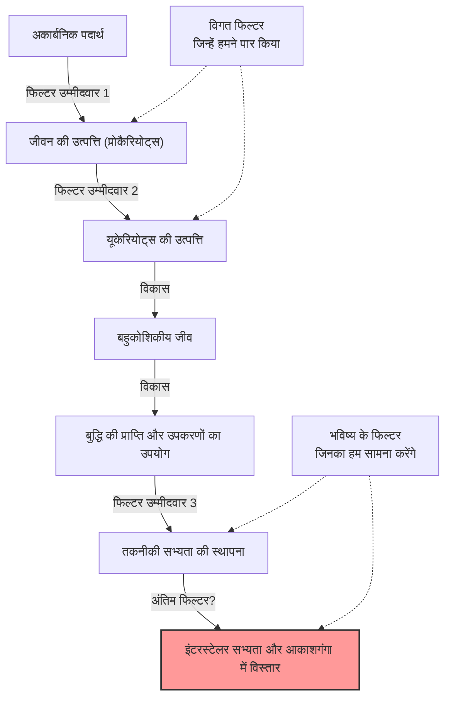
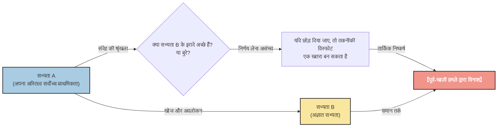

# प्रस्तावना: "हर कोई कहाँ है?" (Prologue: "Where is everybody?")

1950 की गर्मियों में, लॉस एलामोस नेशनल लेबोरेटरी के कैफेटेरिया में, नोबेल पुरस्कार विजेता भौतिक विज्ञानी एनरिको फर्मी अपने साथी भौतिक विज्ञानियों (एडवर्ड टेलर, हर्बर्ट यॉर्क, एमिल कोनोपिंस्की) के साथ दोपहर का भोजन कर रहे थे। उनके बीच उस समय मीडिया में छाए UFO (यूएफओ) देखे जाने की खबरों और प्रकाश से भी तेज गति वाले अंतरिक्ष यान की संभावनाओं पर चर्चा हो रही थी।

बातचीत किसी अन्य विषय पर चली गई, और कुछ देर बाद, फर्मी ने अचानक, बिना किसी संदर्भ के पूछा:

**"हर कोई कहाँ है? (Where is everybody?)"**

उनके सहकर्मी तुरंत समझ गए कि वह एलियंस (अंतरिक्ष जीवों) के बारे में बात कर रहे हैं। फर्मी का दिमाग अपनी अद्भुत गणना क्षमता के लिए जाना जाता था। उन्होंने दोपहर के भोजन के थोड़े से समय में, ब्रह्मांड की आयु, आकाशगंगा में तारों की संख्या, जीवन की उत्पत्ति की संभावना, और किसी सभ्यता द्वारा इंटरस्टेलर (तारे के बीच) यात्रा तकनीक विकसित करने में लगने वाले समय का अनुमान लगा लिया था।

उनकी गणनाओं का निष्कर्ष स्पष्ट था। **"पृथ्वी के बाहर की सभ्यताओं को बहुत पहले ही पृथ्वी का दौरा कर लेना चाहिए था"**। लेकिन, वास्तव में इसका कोई स्पष्ट प्रमाण नहीं है। "गणना पर आधारित उच्च संभावना" और "वास्तविक साक्ष्य की कमी" के बीच का यह विरोधाभास ही बाद में **"फर्मी का विरोधाभास (Fermi Paradox)"** कहलाया, जो आधुनिक खगोल विज्ञान और खगोल जीव विज्ञान (Astrobiology) के सबसे बड़े रहस्यों में से एक है।

इस लेख में, हम फर्मी के विरोधाभास पर गहराई से चर्चा करेंगे, इसकी पृष्ठभूमि से लेकर आधुनिक विज्ञान द्वारा सुझाए गए विभिन्न उत्तरों (परिकल्पनाओं) तक। आइए, ब्रह्मांड के पैमाने को समझने और मानवता की स्थिति पर पुनर्विचार करने के लिए एक बौद्धिक यात्रा पर चलें।

---

# अध्याय 1: ब्रह्मांड का पैमाना और ड्रेक समीकरण (Chapter 1: Scale of the Universe and the Drake Equation)

फर्मी के विरोधाभास के मूल में यह तथ्य है कि "ब्रह्मांड बहुत विशाल और बहुत पुराना है"। सबसे पहले, आइए हम जिस ब्रह्मांड में रहते हैं, उसके पैमाने को संख्याओं में समझें।

## जबरदस्त संख्या और समय (Overwhelming Numbers and Time)

यह अनुमान लगाया गया है कि हमारे अवलोकन योग्य ब्रह्मांड में लगभग 2 ट्रिलियन आकाशगंगाएँ (Galaxies) हैं। और प्रत्येक आकाशगंगा में औसतन 100 बिलियन से 400 बिलियन तारे हैं। इसका मतलब है कि पूरे ब्रह्मांड में तारों की संख्या पृथ्वी पर मौजूद रेत के सभी कणों की कुल संख्या से कहीं अधिक है, जो लगभग $10^{24}$ है।

हाल के वर्षों में, केपलर अंतरिक्ष दूरबीन जैसे अवलोकनों से पता चला है कि इनमें से कई तारों के पास ग्रह हैं, और उनमें से एक बड़ा हिस्सा "रहने योग्य क्षेत्र (हैबिटेबल ज़ोन - जहाँ तरल पानी मौजूद हो सकता है)" में पृथ्वी जैसे ग्रह हैं। यदि हम एक रूढ़िवादी अनुमान भी लगाएं, तो हमारी अपनी आकाशगंगा (मिल्की वे) में ही अरबों से लेकर दसियों अरबों "दूसरी पृथ्वी" के उम्मीदवार मौजूद हैं।

इसके अलावा, समय के पैमाने पर भी विचार करें। ब्रह्मांड की आयु लगभग 13.8 बिलियन वर्ष है, और पृथ्वी की आयु लगभग 4.6 बिलियन वर्ष है। मानवता ने केवल कुछ हज़ार साल पहले ही सभ्यता का निर्माण किया है, और रेडियो तरंगों का उपयोग करके संचार शुरू किए हुए अभी 100 से कुछ अधिक वर्ष ही हुए हैं। क्या होगा यदि पृथ्वी से एक अरब वर्ष पहले बने किसी ग्रह पर जीवन उत्पन्न हुआ हो और वहां सभ्यता विकसित हो गई हो? एक अरब वर्ष इतना विशाल समय है कि मानव विकास का इतिहास हजारों बार दोहराया जा सकता है। उनकी तकनीक ऐसे स्तर पर पहुँच चुकी होगी जिसकी हम कल्पना भी नहीं कर सकते (उदाहरण के लिए, डायसन स्फीयर का निर्माण, या पूरी आकाशगंगा में औपनिवेशीकरण)।

## ड्रेक समीकरण (The Drake Equation)

जब भी अलौकिक बुद्धिमान जीवन के अस्तित्व की संभावना पर चर्चा होती है, तो "ड्रेक समीकरण" का उल्लेख जरूर होता है। 1961 में खगोलशास्त्री फ्रैंक ड्रेक द्वारा तैयार किया गया यह समीकरण हमारी आकाशगंगा में मौजूद और मानवता के साथ संवाद करने में सक्षम अलौकिक सभ्यताओं की संख्या ($N$) का अनुमान लगाने के लिए है।

समीकरण को निम्नलिखित तत्वों के गुणनफल द्वारा दर्शाया जाता है:

$$ N = R_* \times f_p \times n_e \times f_l \times f_i \times f_c \times L $$

*   $R_*$ : आकाशगंगा में तारों के बनने की दर
*   $f_p$ : उन तारों का अंश जिनके पास ग्रह प्रणालियां हैं
*   $n_e$ : उस ग्रह प्रणाली में ऐसे ग्रहों की संख्या जहाँ जीवन के लिए उपयुक्त वातावरण हो
*   $f_l$ : उस ग्रह पर वास्तव में जीवन उत्पन्न होने की संभावना
*   $f_i$ : उस जीवन के बुद्धिमान जीवन में विकसित होने की संभावना
*   $f_c$ : उस बुद्धिमान जीवन के पास इंटरस्टेलर संचार तकनीक होने की संभावना
*   $L$ : ऐसी तकनीकी सभ्यता के अस्तित्व की अवधि

इस समीकरण की सबसे बड़ी विशेषता "उत्तर देना" नहीं, बल्कि "उन तत्वों को स्पष्ट करना है जिन पर चर्चा की जानी चाहिए"। खगोल विज्ञान की प्रगति के साथ, समीकरण के बाएँ भाग ($R_*$, $f_p$, $n_e$) के लिए काफी सटीक मान निकाले जा सकते हैं। हालांकि, दायां भाग ($f_l$, $f_i$, $f_c$, $L$) अभी भी अनुमान का विषय है।

आशावादी खगोलशास्त्रियों (जैसे कार्ल सागन) ने तर्क दिया कि आकाशगंगा में लाखों सभ्यताएँ मौजूद हो सकती हैं। दूसरी ओर, निराशावादी दृष्टिकोण से परिणाम $N=1$ (यानी केवल मानवता) भी हो सकता है। लेकिन अगर $N$ काफी बड़ा है, तो हम वापस फर्मी के प्रश्न पर आ जाते हैं: "हर कोई कहाँ है?"

---

# अध्याय 2: चुप्पी को समझाने वाली कई परिकल्पनाएं (Chapter 2: Numerous Hypotheses Explaining the Silence)

फर्मी के विरोधाभास के उत्तरों को मोटे तौर पर 3 श्रेणियों में बांटा जा सकता है:

1.  **वे वास्तव में मौजूद ही नहीं हैं** (अलौकिक जीवन, या बुद्धिमान जीवन अत्यंत दुर्लभ है)
2.  **वे मौजूद हैं, लेकिन हम उनका पता नहीं लगा पाए हैं** (संचार के तरीकों में अंतर, दूरी की बाधा, जानबूझकर चुप्पी आदि)
3.  **वे पहले ही पृथ्वी पर आ चुके हैं, लेकिन हमें पता नहीं है** (या इसे छिपाया जा रहा है)

आइए प्रत्येक श्रेणी से संबंधित प्रमुख परिकल्पनाओं में गहराई से उतरें।

## श्रेणी 1: वे वास्तव में मौजूद ही नहीं हैं (Category 1: They don't exist in the first place)

### दुर्लभ पृथ्वी परिकल्पना (Rare Earth Hypothesis)

यह परिकल्पना यह तर्क देती है कि हालांकि सूक्ष्मजीवों जैसा सरल जीवन ब्रह्मांड में आम हो सकता है, लेकिन मानव जैसे जटिल और बुद्धिमान जीवन के विकसित होने के लिए अत्यधिक दुर्लभ खगोलीय और भूवैज्ञानिक स्थितियों के एक साथ होने की आवश्यकता होती है।

*   **बृहस्पति की उपस्थिति:** बृहस्पति जैसे विशाल गैस ग्रह के उचित स्थान पर होने से, यह क्षुद्रग्रहों और धूमकेतुओं के लिए एक ढाल के रूप में कार्य करता है, और पृथ्वी पर ऐसे बड़े टकरावों को रोकता है जो जीवन को नष्ट कर सकते हैं।
*   **विशाल चंद्रमा की उपस्थिति:** पृथ्वी के आकार के अनुपात में एक बड़े चंद्रमा की उपस्थिति पृथ्वी की घूर्णन धुरी के झुकाव (लगभग 23.4 डिग्री) को स्थिर करती है, जिससे मध्यम जलवायु परिवर्तन और मौसम बने रहते हैं।
*   **प्लेट टेक्टोनिक्स और भू-चुंबकत्व:** सक्रिय प्लेट गतिशीलता कार्बन चक्र को बढ़ावा देती है और ग्रीनहाउस प्रभाव को उचित स्तर पर बनाए रखती है। इसके अलावा, एक मजबूत चुंबकीय क्षेत्र वायुमंडल और जीवन को सौर हवा और ब्रह्मांडीय किरणों से बचाता है।
*   **तारे की प्रकृति:** सूर्य जैसे G-प्रकार के मुख्य अनुक्रम तारे का जीवनकाल लंबा (लगभग 10 अरब वर्ष) होता है और इसका ऊर्जा उत्सर्जन स्थिर होता है। ब्रह्मांड में सबसे आम लाल बौने (M-प्रकार के तारे) में बहुत अधिक फ्लेयर गतिविधियां हो सकती हैं, या उनके ग्रह ज्वारीय रूप से लॉक (Tidally locked - हमेशा तारे की ओर एक ही चेहरा रखना) हो सकते हैं, जो जीवन के विकास के लिए एक कठोर वातावरण हो सकता है।

इन सभी "चमत्कारी स्थितियों" के एक साथ होने की संभावना खगोलीय रूप से बहुत कम है, और इसलिए यह विचार है कि मानवता अकेली है।

### द ग्रेट फिल्टर थ्योरी (The Great Filter Theory)

1996 में रॉबिन हैनसन द्वारा प्रस्तावित "द ग्रेट फिल्टर", फर्मी के विरोधाभास के लिए सबसे भयानक और प्रेरक उत्तरों में से एक है।

यह विचार यह है कि जीवन की उत्पत्ति से लेकर एक इंटरस्टेलर सभ्यता के रूप में विकसित होने की प्रक्रिया में एक "विशाल दीवार (फिल्टर)" है जिसे पार करना अत्यंत कठिन है।

महत्वपूर्ण बिंदु यह है कि, **"क्या यह फिल्टर हमारे अतीत में है, या यह हमारे भविष्य में है?"**

*   **फिल्टर अतीत में था (हम भाग्यशाली बचे हुए लोग हैं):**
    शायद जीवन की उत्पत्ति (Abiogenesis) ही अपने आप में एक चमत्कारी घटना थी। या, साधारण प्रोकैरियोट्स (Prokaryotes) से माइटोकॉन्ड्रिया जैसी जटिल संरचनाओं वाले यूकेरियोट्स (Eukaryotes) में विकसित होने की प्रक्रिया ब्रह्मांड के इतिहास में एक दुर्लभ घटना रही होगी (पृथ्वी पर इस चरण में लगभग 2 अरब वर्ष लगे)। यदि ऐसा है, तो मानवता ब्रह्मांड की सबसे उन्नत प्रजातियों में से calculations एक है।
*   **फिल्टर भविष्य में है (हम विनाश की ओर बढ़ रहे हैं):**
    यह एक बहुत ही अंधकारमय दृष्टिकोण है। भले ही जीवन की उत्पत्ति और बुद्धिमान सभ्यताओं का निर्माण अपेक्षाकृत सामान्य हो, यह परिकल्पना कहती है कि "इंटरस्टेलर सभ्यता" तक पहुंचने से पहले ही सभ्यता अनिवार्य रूप से खुद को नष्ट कर लेती है। परमाणु युद्ध, कृत्रिम बुद्धिमत्ता का नियंत्रण से बाहर होना, जलवायु परिवर्तन, या अज्ञात भौतिक खतरे जिन्हें हमने अभी तक महसूस नहीं किया है, के कारण एक निश्चित स्तर पर पहुंचने के बाद सभ्यता का विनाश निश्चित हो सकता है।

कुछ वैज्ञानिकों का तर्क है कि यदि मंगल आदि पर एककोशिकीय जीवों के जीवाश्म पाए जाते हैं, तो इसका मतलब यह होगा कि "जीवन की उत्पत्ति कोई फिल्टर नहीं है", और यह मानवता के लिए सबसे बुरी खबर होगी क्योंकि इससे इस संभावना में वृद्धि होगी कि फिल्टर हमारे "भविष्य" में प्रतीक्षा कर रहा है।

---

## श्रेणी 2: वे मौजूद हैं, लेकिन हम उनका पता नहीं लगा पाए हैं (Category 2: They exist, but we cannot sense them)

ये परिकल्पनाएं मानती हैं कि कई सभ्यताएं मौजूद हैं, लेकिन विभिन्न कारणों से हम उन्हें ढूंढ नहीं पाए हैं, या वे जानबूझकर हमसे संपर्क करने से बच रही हैं।

### बहुत विशाल ब्रह्मांड और बहुत कम समय (A universe too vast and time too short)

अंतरिक्ष हमारी कल्पना से कहीं अधिक विशाल है। हमारे निकटतम तारे, प्रॉक्सिमा सेंटॉरी तक पहुंचने में प्रकाश की गति से भी लगभग 4.2 वर्ष लगते हैं। वर्तमान पृथ्वी जांच (जैसे वोयाजर) की गति से यह दूरी तय करने में दसियों हजार वर्ष लगेंगे।

इसके अलावा, "समय" की भी दीवार है। मानवता ने लगभग 100 वर्ष पहले ही रेडियो संचार शुरू किया था। इसका मतलब है कि पृथ्वी से रेडियो तरंगें अभी तक केवल 100 प्रकाश वर्ष के दायरे में ही पहुँची हैं। चूंकि आकाशगंगा (मिल्की वे) का व्यास लगभग 100,000 प्रकाश वर्ष है, इसलिए जिस क्षेत्र में हम अपनी उपस्थिति बता रहे हैं वह पूरी आकाशगंगा में एक बहुत छोटा बिंदु मात्र है।
यदि किसी सभ्यता का जीवनकाल केवल कुछ हज़ार या दसियों हज़ार वर्ष है, तो ब्रह्मांड के 13.8 अरब वर्ष के इतिहास में इस बात की संभावना बहुत कम हो सकती है कि दो सभ्यताएँ "एक ही समय में" मौजूद हों और एक-दूसरे के संकेतों को पकड़ने का समय मेल खा जाए।

### तकनीकी बेमेल (Technological mismatch)

हम "SETI (Search for Extraterrestrial Intelligence)" के अंतर्गत एलियंस की खोज के लिए मुख्य रूप से रेडियो तरंगों का उपयोग करते हैं। लेकिन यह केवल इसलिए है क्योंकि हमने हाल ही में रेडियो तरंगों की खोज की है।

अत्यधिक विकसित सभ्यताओं के लिए, रेडियो तरंगों का उपयोग करके संचार करना "धुएं के संकेत (Smoke signals)" या "धागे वाले टेलीफोन" के समान आदिम और अक्षम माना जा सकता है। हो सकता है कि वे संचार के लिए ऐसे अज्ञात भौतिक नियमों का उपयोग कर रहे हों जिन्हें हम अभी तक खोज भी नहीं पाए हैं, जैसे कि न्यूट्रिनो संचार, गुरुत्वाकर्षण तरंगें, या क्वांटम एंटैंगलमेंट का उपयोग करके सुपरलूमिनल (प्रकाश से तेज) संचार (हालांकि भौतिक रूप से इसका खंडन किया गया है लेकिन एक धारणा के रूप में)। जब हम अंधेरे में हताशा से धुएं के संकेत खोज रहे हैं, वे फाइबर ऑप्टिक्स से संवाद कर रहे हो सकते हैं।

### चिड़ियाघर परिकल्पना (Zoo Hypothesis)

1973 में जॉन बॉल द्वारा प्रस्तावित इस परिकल्पना में कहा गया है कि "उन्नत अलौकिक सभ्यताएं पृथ्वी के अस्तित्व को जानती हैं, लेकिन मानवता को स्वाभाविक रूप से विकसित होते हुए देखने के लिए जानबूझकर हस्तक्षेप से बच रही हैं।"

यह विचार ऐसा है कि पृथ्वी को एक प्रकार के "पृथक चिड़ियाघर" या "अभयारण्य" के रूप में माना जा रहा है, ठीक उसी तरह जैसे हम प्रकृति के भंडार में जंगली जानवरों को देखते हैं। यह वही अवधारणा है जिसे स्टार ट्रेक में "प्राइम डायरेक्टिव (Prime Directive: अविकसित सभ्यताओं में हस्तक्षेप नहीं करना चाहिए)" के रूप में जाना जाता है। शायद वे तभी संपर्क करेंगे जब मानवता पर्याप्त नैतिक और तकनीकी परिपक्वता (जैसे कि खुद को नष्ट किए बिना विश्व सरकार स्थापित करना, इंटरस्टेलर यात्रा तकनीक विकसित करना आदि) तक पहुंच जाएगी।

### डार्क फॉरेस्ट थ्योरी (Dark Forest Theory)

यह सबसे डरावनी और क्रूर परिकल्पना है जो चीनी विज्ञान-कथा लेखक लियू सिक्सिन के विश्वव्यापी बेस्टसेलर "थ्री-बॉडी प्रॉब्लम (The Three-Body Problem)" श्रृंखला से प्रसिद्ध हुई। यह परिकल्पना ब्रह्मांड की तुलना "एक अंधेरे जंगल से करती है जहाँ सभी शिकारी अपनी सांसें रोके छिपे हुए हैं"।

ब्रह्मांड में समाजशास्त्रीय स्वयंसिद्धों के रूप में, निम्नलिखित 2 परिसर माने गए हैं:
1.  सभी सभ्यताओं के लिए, अस्तित्व (Survival) सर्वोच्च प्राथमिकता है।
2.  ब्रह्मांड में पदार्थ की कुल मात्रा स्थिर है, और सभ्यताएँ लगातार विस्तार और विकास करना चाहती हैं।

इसके अतिरिक्त, दो अवधारणाएँ और जुड़ती हैं: "संदेह की श्रृंखला (Chain of suspicion)" जिसमें सितारों के बीच भारी दूरी के कारण एक-दूसरे के इरादों को सही ढंग से समझना असंभव हो जाता है, और "तकनीकी विस्फोट (Technological explosion)" जिसमें तकनीक में अचानक घातीय वृद्धि होती है।

मान लीजिए कि एक सभ्यता A किसी अन्य सभ्यता B की खोज करती है। सभ्यता A के लिए यह जानने का कोई तरीका नहीं है कि सभ्यता B मित्रवत है या शत्रुतापूर्ण। भले ही सभ्यता B का वर्तमान तकनीकी स्तर कम हो, किसी को नहीं पता कि वह कब "तकनीकी विस्फोट" से गुजरेगी और सभ्यता A को पार करते हुए एक खतरा बन जाएगी।
इसलिए, किसी के अपने अस्तित्व को सुनिश्चित करने के लिए सबसे तर्कसंगत और सुरक्षित विकल्प यह है कि, **"जैसे ही किसी अन्य सभ्यता का पता चले, उसे तुरंत नष्ट कर दो, इससे पहले कि दूसरे को इसके बारे में पता चले।"**

इस सिद्धांत के अनुसार, ब्रह्मांड के मौन रहने का कारण स्पष्ट है। मूर्ख सभ्यताएँ (जैसे पृथ्वी) जो लापरवाही से रेडियो तरंगें छोड़ती हैं और अपने स्थान का पता बताती हैं, वे तुरंत नष्ट हो जाती हैं, या फिर सभी समझदार सभ्यताएँ अंधेरे में छिपी हुई हैं, अपनी सांसें रोके हुए।

### सिमुलेशन परिकल्पना (Simulation Hypothesis)

यह परिकल्पना कहती है कि जिस ब्रह्मांड में हम रहते हैं वह स्वयं उच्च प्राणियों (अति-उन्नत सभ्यताओं या AI) द्वारा बनाया गया एक कंप्यूटर सिमुलेशन है। ऑक्सफोर्ड विश्वविद्यालय के दार्शनिक निक बोस्ट्रोम और अन्य लोग इस पर गंभीरता से बहस कर रहे हैं।

यदि हम किसी सिमुलेशन के निवासी हैं, तो हम कभी एलियंस से नहीं मिलेंगे जब तक कि प्रोग्रामर ने इस सिमुलेशन के भीतर "अन्य एलियंस" को प्रोग्राम न किया हो। यदि यह दुनिया एक सैंडबॉक्स है जिसे केवल मानवता के लिए अनुकरण किया गया है, तो ब्रह्मांड की चुप्पी एक स्वाभाविक परिणाम है।

---

# अध्याय 3: भविष्य की संभावनाएं और मानवता के लिए चुनौतियां (Chapter 3: Future Prospects and Challenges for Humanity)

आज भी दुनिया भर के वैज्ञानिक विभिन्न दृष्टिकोणों के साथ फर्मी के विरोधाभास को चुनौती दे रहे हैं।

## टेक्नोसिग्नेचर्स (Technosignatures) की खोज

पारंपरिक SETI जानबूझकर भेजे गए संचार संकेतों (रेडियो तरंगों) की तलाश कर रहा था, लेकिन हाल के वर्षों में "टेक्नोसिग्नेचर्स (Technosignatures: तकनीकी निशान)" की खोज की दिशा में सक्रिय आंदोलन हुए हैं।
उदाहरण के लिए, यदि उन्नत सभ्यताओं द्वारा तारे की पूरी ऊर्जा का उपयोग करने के लिए बनाए गए "डायसन स्फीयर (Dyson spheres)" मौजूद हैं, तो उस तारे से अजीब इन्फ्रारेड विकिरण देखा जाना चाहिए। जेम्स वेब स्पेस टेलीस्कोप (JWST) जैसे नवीनतम अवलोकन उपकरणों में दूर के एक्सोप्लैनेट्स के वायुमंडलीय घटकों का विश्लेषण करने की क्षमता है, और वे औद्योगिक गैसों (जैसे सीएफ़सी) और कृत्रिम प्रकाश के निशान ढूंढ सकते हैं जो प्राकृतिक दुनिया में नहीं हो सकते।

हम "उनके हमसे बात करने" का इंतजार करने के बजाय, "उनके वहां रहने के निशानों" को सक्रिय रूप से खोजने की कोशिश कर रहे हैं।

## विरोधाभास हमारे सामने क्या प्रस्तुत करता है (What the Paradox Presents to Us)

फर्मी का विरोधाभास महज एक विज्ञान-कथा वैचारिक प्रयोग नहीं है। यह मानवता के अस्तित्व और भविष्य के बारे में एक सशक्त प्रश्न है।

यदि "महान फिल्टर (Great Filter)" भविष्य में है, तो हम वर्तमान में जलवायु परिवर्तन, परमाणु हथियारों के खतरे और एआई नियंत्रण जैसे स्व-निर्मित अस्तित्वगत जोखिमों (Existential Risks) का सामना कर रहे हैं। यदि हम इन्हें दूर नहीं कर पाए, तो मानवता भी उन अनगिनत "विफल सभ्यताओं" में से एक बन जाएगी जो ब्रह्मांड की चुप्पी में गायब हो गईं।

इसके विपरीत, यदि दुर्लभ पृथ्वी परिकल्पना (Rare Earth Hypothesis) सही है और मानवता इस विशाल ब्रह्मांड में चमत्कारी रूप से जन्म लेने वाली एकमात्र बुद्धिमत्ता है, तो हमारी एक असीमित जिम्मेदारी है। ब्रह्मांड में आत्म-जागरूकता लाने वाले प्राणियों के रूप में, हमारा मिशन चेतना की लौ को जीवित रखना और इसे भविष्य में, और अंततः सितारों तक फैलाना हो सकता है।

एनरिको फर्मी का आकस्मिक प्रश्न, "हर कोई कहाँ है?", 70 से अधिक वर्षों के बाद भी मानव इतिहास के सबसे महत्वपूर्ण प्रश्नों में से एक के रूप में चमक रहा है, जो हमें गहराई से सोचने पर मजबूर करता है कि हम कौन हैं और हमें कहाँ जाना चाहिए।

क्या ब्रह्मांड की चुप्पी हमारे लिए एक चेतावनी है, या यह एक विशाल सीमा (फ्रंटियर) है जो हमारे पहला कदम उठाने का इंतजार कर रही है? इसका उत्तर भविष्य में मानवता की पसंद पर निर्भर करता है।
