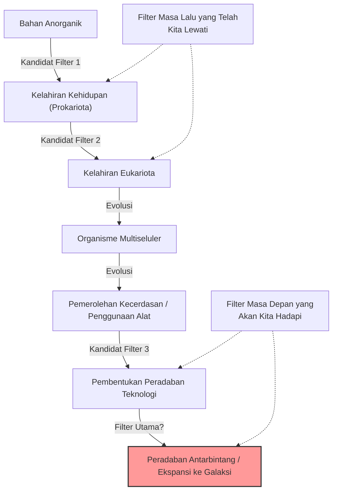
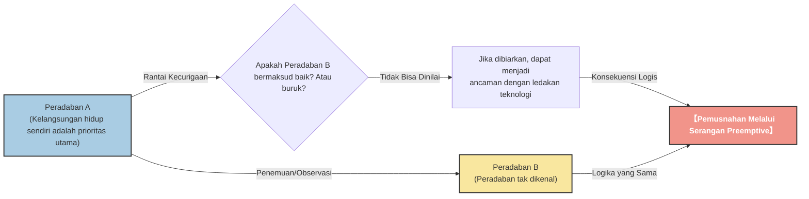

# Prolog: "Di manakah semuanya?"

Pada musim panas tahun 1950, di kafetaria Laboratorium Nasional Los Alamos, peraih Hadiah Nobel Fisika Enrico Fermi sedang makan siang bersama rekan-rekan fisikawannya (Edward Teller, Herbert York, dan Emil Konopinski). Topik perbincangan mereka adalah penampakan UFO yang saat itu sedang ramai di media, serta kemungkinan adanya pesawat luar angkasa yang lebih cepat dari cahaya.

Setelah percakapan beralih ke topik lain dan beberapa saat berlalu, Fermi tiba-tiba bertanya tanpa basa-basi:

**"Di manakah semuanya? (Where is everybody?)"**

Rekan-rekannya segera memahami bahwa ia sedang membicarakan alien. Otak Fermi dikenal karena kemampuan perhitungannya yang luar biasa. Selama waktu makan siang yang singkat itu, ia telah memperkirakan usia alam semesta, jumlah bintang di galaksi, probabilitas munculnya kehidupan, dan waktu yang dibutuhkan sebuah peradaban untuk mengembangkan teknologi perjalanan antarbintang.

Kesimpulan dari perhitungannya sangat jelas. **"Peradaban luar angkasa seharusnya sudah sejak lama mengunjungi Bumi"**. Namun, pada kenyataannya, sama sekali tidak ada bukti nyata tentang hal itu. Kontradiksi antara "probabilitas matematis yang tinggi" dan "kurangnya bukti nyata" inilah yang kemudian dikenal sebagai **"Paradoks Fermi"**, salah satu misteri terbesar dalam astronomi dan astrobiologi modern.

Dalam artikel ini, kita akan menggali secara mendalam tentang Paradoks Fermi, mulai dari latar belakangnya hingga berbagai jawaban (hipotesis) yang disajikan oleh sains modern. Mari kita mulai perjalanan intelektual untuk memahami skala alam semesta dan meninjau kembali posisi umat manusia.

---

# Bab 1: Skala Alam Semesta dan Persamaan Drake

Inti dari Paradoks Fermi adalah fakta bahwa "alam semesta ini terlalu luas dan terlalu tua". Pertama-tama, mari kita pahami skala alam semesta tempat kita tinggal ini dengan angka.

## Jumlah dan Waktu yang Luar Biasa

Di alam semesta yang dapat kita amati, diperkirakan terdapat sekitar 2 triliun galaksi. Dan setiap galaksi rata-rata memiliki 100 miliar hingga 400 miliar bintang (bintang seperti matahari). Dengan kata lain, di seluruh alam semesta, terdapat sekitar $10^{24}$ bintang, jumlah yang jauh lebih banyak daripada seluruh butiran pasir di Bumi jika digabungkan.

Dalam beberapa tahun terakhir, pengamatan dari Teleskop Luar Angkasa Kepler dan lainnya telah mengungkapkan bahwa banyak dari bintang-bintang ini memiliki planet, dan sebagian besar dari mereka berada di "zona laik huni (area di mana air cair dapat ada)" dan merupakan planet kebumian. Dengan perkiraan konservatif pun, di Galaksi Bima Sakti kita saja, terdapat puluhan miliar hingga ratusan miliar kandidat "Bumi kedua".

Selanjutnya, mari kita pertimbangkan skala waktunya. Usia alam semesta adalah sekitar 13,8 miliar tahun, sedangkan usia Bumi sekitar 4,6 miliar tahun. Hanya beberapa ribu tahun sejak umat manusia membangun peradaban, dan baru sekitar 100 tahun sejak kita mulai berkomunikasi menggunakan gelombang radio. Bagaimana jika kehidupan muncul dan membangun peradaban di sebuah planet yang lahir 1 miliar tahun lebih awal dari Bumi? Waktu 1 miliar tahun adalah waktu yang sangat lama, cukup untuk mengulang sejarah evolusi manusia ribuan kali. Teknologi mereka seharusnya sudah mencapai tingkat yang berada di luar imajinasi kita (misalnya, pembangunan Bola Dyson, atau kolonisasi seluruh galaksi).

## Persamaan Drake

Saat membahas probabilitas keberadaan kehidupan cerdas di luar bumi, "Persamaan Drake" pasti akan muncul. Persamaan yang dirumuskan oleh astronom Frank Drake pada tahun 1961 ini bertujuan untuk memperkirakan jumlah peradaban di luar bumi ($N$) yang ada di galaksi kita dan dapat berkomunikasi dengan umat manusia.

Persamaan ini dinyatakan sebagai perkalian elemen-elemen berikut:

$$ N = R_* \times f_p \times n_e \times f_l \times f_i \times f_c \times L $$

*   $R_*$ : Laju pembentukan bintang di galaksi
*   $f_p$ : Fraksi bintang yang memiliki sistem planet
*   $n_e$ : Jumlah planet dalam sistem tersebut yang memiliki lingkungan laik huni
*   $f_l$ : Fraksi planet yang benar-benar memunculkan kehidupan
*   $f_i$ : Fraksi kehidupan yang berevolusi menjadi kehidupan cerdas
*   $f_c$ : Fraksi kehidupan cerdas yang memiliki teknologi untuk komunikasi antarbintang
*   $L$ : Lama waktu (durasi) peradaban teknologi tersebut dapat bertahan

Karakteristik terbesar dari persamaan ini bukan "untuk memberikan jawaban", melainkan "untuk memperjelas elemen-elemen yang perlu didiskusikan". Untuk elemen di sisi kiri persamaan ($R_*$, $f_p$, $n_e$), kemajuan astronomi telah memungkinkan kita untuk mendapatkan nilai dengan presisi yang cukup tinggi. Namun, untuk sisi kanan ($f_l$, $f_i$, $f_c$, $L$), masih sebatas spekulasi.

Astronom yang optimis (seperti Carl Sagan) berpendapat bahwa mungkin ada jutaan peradaban di galaksi ini. Di sisi lain, dari sudut pandang yang pesimis, hasilnya bisa menjadi $N=1$ (artinya hanya manusia). Namun, jika $N$ cukup besar, kita akan kembali ke pertanyaan Fermi. "Di manakah semuanya?"

---

# Bab 2: Berbagai Hipotesis yang Menjelaskan Keheningan

Jawaban terhadap Paradoks Fermi secara umum dapat diklasifikasikan ke dalam 3 kategori.

1.  **Pada dasarnya mereka tidak ada** (Kehidupan di luar bumi, atau kehidupan cerdas sangatlah langka)
2.  **Mereka ada, tetapi kita tidak dapat mendeteksinya** (Perbedaan metode komunikasi, hambatan jarak, keheningan yang disengaja, dll.)
3.  **Mereka sudah datang ke Bumi, tetapi kita tidak menyadarinya** (Atau disembunyikan)

Mari kita gali lebih dalam hipotesis-hipotesis perwakilan untuk setiap kategori.

## Kategori 1: Pada dasarnya mereka tidak ada

### Hipotesis Rare Earth (Bumi Langka)

Hipotesis ini berpendapat bahwa meskipun kehidupan sederhana seperti mikroba mungkin umum di alam semesta, kondisi astronomi dan geologis yang sangat langka harus selaras agar kehidupan cerdas dan kompleks seperti manusia dapat berevolusi.

*   **Keberadaan Jupiter:** Keberadaan planet gas raksasa seperti Jupiter di posisi yang tepat berfungsi sebagai perisai dari asteroid dan komet, mencegah tabrakan besar yang dapat memusnahkan kehidupan di Bumi.
*   **Keberadaan Bulan yang besar:** Keberadaan Bulan yang sangat besar dibandingkan dengan Bumi menstabilkan kemiringan sumbu Bumi (sekitar 23,4 derajat), yang menjaga perubahan iklim dan empat musim tetap stabil.
*   **Tektonik Lempeng dan Geomagnetisme:** Pergerakan lempeng tektonik yang aktif memfasilitasi siklus karbon dan mempertahankan efek rumah kaca yang sesuai. Selain itu, medan magnet yang kuat melindungi atmosfer dan kehidupan dari angin matahari dan sinar kosmik.
*   **Sifat Bintang:** Bintang deret utama tipe-G seperti Matahari memiliki umur yang cukup panjang (sekitar 10 miliar tahun) dan radiasi energinya stabil. Kataik merah (bintang tipe-M), yang paling umum di alam semesta, mungkin memiliki lingkungan yang terlalu keras untuk evolusi kehidupan karena aktivitas jilatan api (flare) yang terlalu aktif, atau planetnya terkunci pasang surut (selalu menghadapkan sisi yang sama ke bintangnya).

Peluang semua "kondisi ajaib" ini terpenuhi sangatlah kecil secara astronomis, dan oleh karena itu pemikiran ini menyatakan bahwa umat manusia itu sendirian.

### Teori Great Filter (Filter Utama)

Diperkenalkan oleh Robin Hanson pada tahun 1996, "Great Filter" adalah salah satu jawaban yang paling menakutkan sekaligus meyakinkan untuk Paradoks Fermi.

Gagasan ini menyatakan bahwa dalam proses dari munculnya kehidupan hingga berkembang menjadi peradaban antarbintang, terdapat "tembok besar (filter)" yang sangat sulit untuk dilewati.

Poin pentingnya adalah, **"Apakah filter ini ada di masa lalu kita, atau di masa depan kita?"**

*   **Filter ada di masa lalu (Kita adalah penyintas yang beruntung):**
    Munculnya kehidupan (abiogenesis) itu sendiri mungkin merupakan peristiwa yang ajaib. Atau, proses evolusi dari prokariota sederhana menjadi eukariota dengan struktur kompleks seperti mitokondria mungkin merupakan peristiwa langka dalam sejarah alam semesta (di Bumi, langkah ini memakan waktu sekitar 2 miliar tahun). Jika demikian, umat manusia adalah salah satu spesies paling maju di alam semesta.
*   **Filter ada di masa depan (Kita sedang menuju kehancuran):**
    Ini adalah prospek yang sangat suram. Hipotesis ini menyatakan bahwa bahkan jika munculnya kehidupan atau peradaban cerdas cukup umum, peradaban akan selalu menghancurkan dirinya sendiri sebelum mencapai tahap "peradaban antarbintang". Melalui perang nuklir, kecerdasan buatan yang tidak terkendali, perubahan iklim, atau ancaman fisik tak terduga yang belum kita sadari, peradaban mungkin ditakdirkan untuk menghancurkan diri mereka sendiri setelah mencapai tingkat tertentu.

Beberapa ilmuwan berpendapat bahwa jika fosil organisme uniseluler ditemukan di Mars, itu akan menjadi berita terburuk bagi umat manusia, karena itu berarti "munculnya kehidupan bukanlah filter", dan kemungkinan bahwa filter tersebut menunggu di "masa depan" kita akan meningkat.

---

## Kategori 2: Mereka ada, tetapi kita tidak dapat mendeteksinya

Ini adalah kelompok hipotesis yang menyatakan bahwa ada banyak peradaban, tetapi karena berbagai alasan kita belum menemukannya, atau mereka sengaja menghindari kontak.

### Alam Semesta yang Terlalu Luas dan Waktu yang Terlalu Singkat

Ruang angkasa jauh lebih luas dari intuisi kita. Bahkan dengan kecepatan cahaya, dibutuhkan sekitar 4,2 tahun untuk mencapai bintang tetangga, Proxima Centauri. Dengan kecepatan wahana antariksa Bumi saat ini (seperti Voyager), dibutuhkan jarak puluhan ribu tahun.

Selain itu, terdapat hambatan "waktu". Umat manusia baru mulai berkomunikasi menggunakan gelombang radio sekitar 100 tahun yang lalu. Artinya, gelombang radio dari Bumi baru mencapai radius 100 tahun cahaya. Karena diameter Galaksi Bima Sakti adalah sekitar 100.000 tahun cahaya, area di mana kita memberitahukan keberadaan kita hanyalah sebuah titik kecil di seluruh galaksi.
Jika peradaban hanya bertahan selama beberapa ribu atau puluhan ribu tahun, kemungkinan dua peradaban ada "secara bersamaan" dan memiliki waktu yang tepat untuk menangkap sinyal satu sama lain dalam sejarah alam semesta yang berusia 13,8 miliar tahun mungkin sangat rendah.

### Ketidakcocokan Teknologi

Dalam "SETI (Pencarian Kecerdasan Ekstraterestrial)", kita terutama mencari alien menggunakan gelombang radio. Namun, ini hanya karena kita baru saja menemukan gelombang radio.

Bagi peradaban yang sangat maju, komunikasi menggunakan gelombang radio mungkin dianggap primitif dan tidak efisien seperti "sinyal asap" atau "telepon kaleng". Mereka mungkin menggunakan komunikasi superluminal (yang meskipun ditolak secara fisika, tetapi sebagai asumsi) memanfaatkan neutrino, gelombang gravitasi, atau keterikatan kuantum, beroperasi dengan hukum fisika tak dikenal yang bahkan belum dapat kita deteksi. Sementara kita mati-matian mencari sinyal asap di kegelapan, mereka seolah sedang berkomunikasi melalui kabel serat optik.

### Hipotesis Kebun Binatang (Zoo Hypothesis)

Diajukan oleh John Ball pada tahun 1973, hipotesis ini menyatakan bahwa "peradaban luar angkasa yang maju mengetahui keberadaan Bumi, tetapi sengaja menghindari campur tangan untuk membiarkan umat manusia berevolusi secara alami".

Pemikiran ini menyatakan bahwa Bumi diperlakukan sebagai semacam "kebun binatang yang terisolasi" atau "cagar alam", layaknya kita mengamati hewan liar di cagar alam. Ini adalah konsep yang sama dengan "Prime Directive (Jangan ikut campur dalam peradaban yang belum cukup berevolusi)" yang muncul dalam Star Trek. Mereka mungkin baru akan menghubungi kita ketika umat manusia telah mencapai tingkat kedewasaan etis dan teknologi yang memadai (misalnya, membentuk pemerintahan dunia tanpa menghancurkan diri sendiri, atau mengembangkan teknologi perjalanan antarbintang).

### Hipotesis Hutan Gelap (Dark Forest Theory)

Ini adalah hipotesis paling menakutkan dan kejam, yang dipopulerkan oleh novel fiksi ilmiah terlaris global seri "The Three-Body Problem" karya penulis Tiongkok, Liu Cixin. Hipotesis ini mengibaratkan alam semesta sebagai "hutan gelap di mana setiap pemburu menahan napas dan bersembunyi".

Sebagai aksioma sosiologis di alam semesta, dua hal berikut diasumsikan:
1.  Bagi semua peradaban, kelangsungan hidup adalah prioritas utama.
2.  Jumlah total materi di alam semesta adalah konstan, dan peradaban akan terus berusaha untuk berkembang dan berekspansi.

Lebih jauh lagi, ditambahkan konsep "rantai kecurigaan (Chain of Suspicion)", di mana jarak antarbintang yang sangat jauh membuat tidak mungkin untuk memahami niat satu sama lain dengan benar, dan "ledakan teknologi (Technological Explosion)", di mana teknologi melompat secara tak terduga (bermutasi).

Misalkan peradaban A menemukan peradaban B lainnya. Bagi peradaban A, tidak ada cara untuk mengetahui apakah peradaban B itu bersahabat atau bermusuhan. Bahkan jika tingkat teknologi peradaban B saat ini rendah, tidak ada yang tahu kapan mereka akan menyebabkan "ledakan teknologi", melampaui peradaban A, dan menjadi ancaman.
Oleh karena itu, pilihan paling rasional dan aman untuk memastikan kelangsungan hidup sendiri adalah **"menghancurkan peradaban lain segera setelah ditemukan, sebelum lawan menyadarinya"**.

Menurut teori ini, alasan mengapa alam semesta sunyi sangatlah jelas. Itu karena peradaban bodoh (seperti Bumi) yang secara ceroboh memancarkan gelombang radio dan memberitahukan lokasi mereka akan segera dimusnahkan, atau semua peradaban bijak menahan napas dan bersembunyi di kegelapan.

### Hipotesis Simulasi

Ini adalah hipotesis bahwa alam semesta tempat kita hidup ini sendiri hanyalah sebuah simulasi komputer yang diciptakan oleh entitas yang lebih tinggi (peradaban super maju atau AI). Fisuf dari Universitas Oxford, Nick Bostrom dan yang lainnya telah membahas hal ini secara serius.

Jika kita adalah penghuni simulasi, kita tidak akan pernah bertemu alien kecuali pemrogramnya telah memprogram "alien lain" di dalam simulasi ini. Jika dunia ini adalah kotak pasir yang disimulasikan hanya untuk umat manusia, maka keheningan alam semesta adalah hasil yang alami.

---

# Bab 3: Prospek Masa Depan dan Tantangan Umat Manusia

Hingga saat ini, para ilmuwan di seluruh dunia terus mengatasi Paradoks Fermi melalui berbagai pendekatan.

## Pencarian Technosignature (Jejak Teknologi)

SETI tradisional mencari sinyal komunikasi yang disengaja (gelombang radio), tetapi dalam beberapa tahun terakhir, pergerakan untuk mencari "technosignature (jejak teknologi)" menjadi lebih aktif.
Misalnya, jika "Bola Dyson" yang dibangun oleh peradaban maju untuk memanfaatkan seluruh energi sebuah bintang benar-benar ada, radiasi inframerah yang khas seharusnya dapat diamati dari bintang tersebut. Instrumen pengamatan terbaru seperti Teleskop Luar Angkasa James Webb (JWST) memiliki kemampuan untuk menganalisis komponen atmosfer eksoplanet yang sangat jauh, dan mencari jejak gas industri (seperti CFC) yang tidak mungkin terjadi secara alami, atau jejak cahaya buatan.

Kita tidak lagi sekadar menunggu "mereka berbicara kepada kita", melainkan secara aktif mencoba menemukan "jejak bahwa mereka hidup di sana".

## Apa yang Dituntut Paradoks Ini dari Kita

Paradoks Fermi bukanlah sekadar eksperimen pemikiran fiksi ilmiah. Ini adalah pertanyaan kuat yang diajukan terhadap kelangsungan hidup dan masa depan kita sendiri sebagai umat manusia.

Jika "Great Filter" memang ada di masa depan, saat ini kita sedang menghadapi risiko kepunahan (Existential Risk) yang kita ciptakan sendiri, seperti perubahan iklim, ancaman senjata nuklir, dan pengendalian AI. Jika kita tidak dapat mengatasi hal ini, umat manusia hanya akan menjadi salah satu dari tak terhitung "peradaban gagal" yang lenyap dalam keheningan alam semesta.

Sebaliknya, jika Hipotesis Rare Earth benar dan umat manusia adalah satu-satunya entitas cerdas yang secara ajaib lahir di alam semesta yang luas ini, kita memikul tanggung jawab yang tak terkira. Sebagai entitas yang membawa kesadaran diri ke alam semesta, mungkin kita memiliki misi untuk menjaga agar cahaya kesadaran tidak padam, dan memperluasnya ke masa depan, dan suatu hari nanti ke bintang-bintang.

Pertanyaan santai Enrico Fermi, "Di manakah semuanya?", bahkan setelah lebih dari 70 tahun, tetap bersinar sebagai salah satu pertanyaan paling penting dalam sejarah umat manusia yang membuat kita berpikir mendalam tentang siapa kita dan ke mana kita harus menuju.

Apakah keheningan alam semesta ini merupakan peringatan bagi kita, atau merupakan perbatasan luas yang menunggu kita untuk mengambil langkah pertama? Jawabannya terletak pada pilihan yang akan dibuat oleh umat manusia di masa depan.
