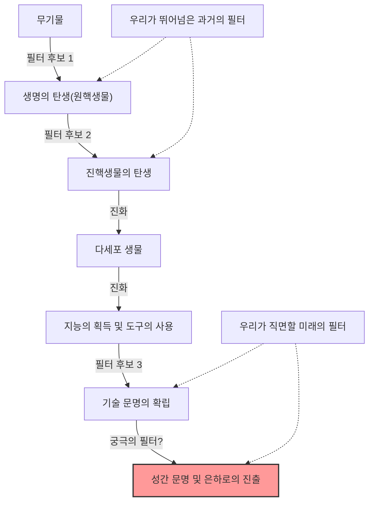
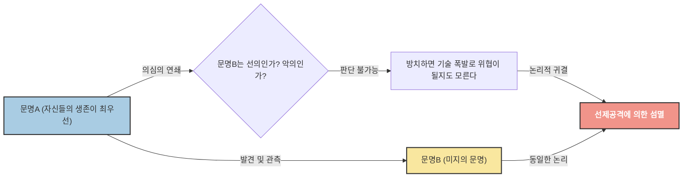

# 서장: "모두들, 어디에 있는 걸까?"

1950년 여름, 로스앨러모스 국립 연구소의 구내식당에서, 노벨 물리학상 수상자인 엔리코 페르미는 동료 물리학자들(에드워드 텔러, 허버트 요크, 에밀 코노핀스키)과 점심을 먹고 있었습니다. 그들의 화제는 당시 언론을 떠들썩하게 했던 UFO 목격담과 빛보다 빠른 우주선의 가능성에 대한 것이었습니다.

대화가 다른 화제로 넘어가고 얼마 지나지 않아, 페르미는 갑자기 뜬금없이 이렇게 물었습니다.

**"모두들 어디에 있는 걸까? (Where is everybody?)"**

동료들은 그가 외계인에 대해 이야기하고 있다는 것을 즉시 이해했습니다. 페르미의 두뇌는 경이로운 계산 능력으로 알려져 있었습니다. 그는 점심 식사라는 짧은 시간 동안, 우주의 나이, 은하계의 별의 수, 생명이 탄생할 확률, 그리고 문명이 항성 간 항행 기술을 개발하기까지의 시간을 어림잡아 계산했던 것입니다.

그의 계산이 보여준 결론은 명쾌했습니다. **"외계 문명은, 진작에 지구를 방문했어야 마땅하다"**. 하지만 현실에는 그 명확한 증거가 전혀 없습니다. 이 "계산상의 높은 확률"과 "현실의 증거 부족"이라는 모순이야말로, 훗날 **"페르미 역설"**이라고 불리게 되는, 현대 천문학·우주생물학에서 가장 큰 수수께끼 중 하나입니다.

본 기사에서는 이 페르미 역설에 대해 그 배경부터 현대 과학이 제시하는 다양한 해답(가설)까지 철저하게 깊이 파헤쳐 보겠습니다. 우주의 규모를 이해하고, 인류의 현주소를 재조명하는 지적인 여행을 떠나 봅시다.

---

# 제1장: 우주의 규모와 드레이크 방정식

페르미 역설의 근간에는 "우주는 너무나도 광대하고, 지나치게 오래되었다"라는 사실이 있습니다. 우선, 우리가 살고 있는 이 우주의 규모를 숫자로 파악해 보겠습니다.

## 압도적인 수와 시간

우리가 관측 가능한 우주에는 약 2조 개의 은하가 존재한다고 추정됩니다. 그리고 각각의 은하에는 평균적으로 1000억 개에서 4000억 개의 별(항성)이 포함되어 있습니다. 즉, 우주 전체에는 지구상의 모든 모래알을 합친 것보다 훨씬 많은 약 $10^{24}$ 개의 별이 존재하게 됩니다.

최근 케플러 우주 망원경 등의 관측으로 이러한 별들의 대부분이 행성을 거느리고 있으며, 그중 상당한 비율이 "골디락스 존(액체 상태의 물이 존재할 수 있는 영역)"에 있는 지구형 행성이라는 사실이 밝혀지고 있습니다. 보수적으로 추정해도, 우리 은하계에만 수십억에서 수백억 개의 "제2의 지구" 후보가 존재하는 것입니다.

게다가 시간의 규모를 생각해 봅시다. 우주의 나이는 약 138억 년, 지구의 나이는 약 46억 년입니다. 인류가 문명을 이룩한 지는 불과 수천 년, 전파를 이용한 통신을 시작한 지는 아직 100년 남짓밖에 되지 않았습니다. 만약 지구보다 10억 년 먼저 탄생한 행성에 생명이 싹트고 문명을 이룩했다면 어떨까요? 10억 년이라는 시간은 인류 진화의 역사를 수천 번이나 반복할 수 있을 만큼 압도적인 시간입니다. 그들의 기술은 우리의 상상을 초월하는 수준에 도달해 있을 것입니다(예를 들어, 다이슨 구의 건설이나 은하계 전체로의 식민지화 등).

## 드레이크 방정식

외계 지적 생명체의 존재 확률을 논할 때, 반드시 등장하는 것이 "드레이크 방정식"입니다. 1961년, 천문학자 프랭크 드레이크가 고안한 이 방정식은 우리 은하계에 존재하며 인류와 통신 가능한 외계 문명의 수($N$)를 추정하기 위한 것입니다.

방정식은 다음 요소들의 곱셈으로 표현됩니다.

$$ N = R_* \times f_p \times n_e \times f_l \times f_i \times f_c \times L $$

*   $R_*$ : 은하계에서 항성이 탄생하는 비율
*   $f_p$ : 그 항성이 행성계를 가질 확률
*   $n_e$ : 그 행성계에서 생명이 생존 가능한 환경을 가진 행성의 수
*   $f_l$ : 그 행성에서 실제로 생명이 탄생할 확률
*   $f_i$ : 그 생명이 지적 생명체로 진화할 확률
*   $f_c$ : 그 지적 생명체가 성간 통신을 할 수 있는 기술을 가질 확률
*   $L$ : 그러한 기술 문명이 존속하는 기간

이 방정식의 가장 큰 특징은 "답을 내는 것"이 아니라 "논의해야 할 요소들을 명확히 했다는 것"에 있습니다. 왼쪽의 방정식($R_*$, $f_p$, $n_e$)에 대해서는 천문학의 발달로 인해 꽤 정밀도가 높은 값을 얻을 수 있게 되었습니다. 하지만 오른쪽($f_l$, $f_i$, $f_c$, $L$)에 대해서는 여전히 추측의 영역을 벗어나지 못하고 있습니다.

낙관적인 천문학자(예를 들어 칼 세이건)는 은하계 내에 수백만 개의 문명이 존재한다고 주장했습니다. 반면, 비관적인 시각으로 보면 $N=1$(즉 인류뿐)이라는 결과가 나올 수도 있습니다. 하지만 만약 $N$이 꽤 크다면, 다시 페르미의 질문으로 돌아가게 됩니다. "모두들 어디에 있는가?"

---

# 제2장: 침묵을 설명하는 수많은 가설

페르미 역설에 대한 해답은 크게 3가지 카테고리로 분류할 수 있습니다.

1.  **애초에 그들은 존재하지 않는다** (외계 생명체, 혹은 지적 생명체는 극히 드물다)
2.  **그들은 존재하지만, 우리가 감지하지 못하고 있다** (통신 방법의 차이, 거리의 장벽, 의도적인 침묵 등)
3.  **그들은 이미 지구에 와 있지만, 우리가 깨닫지 못하고 있다** (혹은 은폐되어 있다)

각 카테고리에 대해 대표적인 가설들을 깊이 파헤쳐 보겠습니다.

## 카테고리 1: 애초에 그들은 존재하지 않는다

### 희귀한 지구(Rare Earth) 가설

이 가설은 미생물과 같은 단순한 생명은 우주에 흔할지 모르지만, 인류와 같은 복잡한 지적 생명체가 진화하기 위해서는 극히 드문 천문학적·지질학적 조건들이 겹쳐야 한다고 주장합니다.

*   **목성의 존재:** 목성과 같은 거대 가스 행성이 적절한 위치에 있음으로써 지구에 쏟아지는 소행성이나 혜성의 방패막이 되어주어, 생명이 멸종할 만한 대충돌을 막아주고 있다.
*   **거대한 달의 존재:** 지구에 비해 어울리지 않게 큰 달이 존재함으로써 지구의 자전축 기울기(약 23.4도)가 안정되고, 온화한 기후 변화와 사계절이 유지되고 있다.
*   **판구조론과 지구 자기장:** 활발한 판의 움직임이 탄소 순환을 촉진하여 온실 효과를 적절하게 유지한다. 또한, 강력한 자기장이 태양풍이나 우주선으로부터 대기와 생명을 보호하고 있다.
*   **항성의 성질:** 태양과 같은 G형 주계열성은 수명이 적당히 길고(약 100억 년), 에너지 방사도 안정적이다. 우주에서 가장 많은 적색 왜성(M형 별)은 플레어 활동이 너무 활발하거나 행성이 조석 고정(항상 같은 면을 항성으로 향함)되어 있기 때문에 생명의 진화에는 가혹한 환경일지도 모른다.

이러한 "기적적인 조건"이 모두 갖추어질 확률은 천문학적으로 낮으며, 고로 인류는 고독하다는 생각입니다.

### 대여과기 이론(The Great Filter)

1996년 로빈 핸슨(Robin Hanson)이 제창한 "대여과기"는 페르미 역설에 대한 가장 무섭고도 설득력 있는 해답 중 하나입니다.

생명이 탄생하고 성간 문명으로 발전하기까지의 과정에는 극복하기 극히 어려운 "거대한 장벽(필터)"이 존재한다는 생각입니다.

중요한 것은 **"이 필터는 우리의 과거에 있는가, 아니면 미래에 있는가?"**라는 점입니다.

*   **필터는 과거에 있었다(우리는 운 좋은 생존자이다):**
    생명의 탄생(자연 발생) 자체가 기적적인 사건이었을지도 모릅니다. 혹은 단순한 원핵생물에서 미토콘드리아 같은 복잡한 구조를 가진 진핵생물로 진화하는 과정이 우주의 역사에서도 드문 일이었을지도 모릅니다(지구에서는 이 단계에 약 20억 년이 걸렸습니다). 만약 그렇다면 인류는 우주에서 가장 진보한 종족 중 하나라는 뜻이 됩니다.
*   **필터는 미래에 있다(우리는 파멸을 향해 가고 있다):**
    이것은 매우 암울한 전망입니다. 생명의 탄생이나 지적 문명의 성립까지는 비교적 흔한 일이라고 해도, 그 너머의 "성간 문명"에 도달하기 전에 문명은 반드시 자기 파괴를 하고 만다는 가설입니다. 핵전쟁, 인공지능의 폭주, 기후 변화, 혹은 우리가 아직 깨닫지 못한 미지의 물리적 위협으로 인해 문명은 일정 수준에 도달하면 자멸할 운명일지도 모릅니다.

화성 등에서 단세포 생물의 화석이 발견된다면, 그것은 "생명의 탄생은 필터가 아니다"라는 것을 의미하며, 필터가 우리의 "미래"에 도사리고 있을 가능성이 높아지기 때문에 인류에게 최악의 뉴스가 될 것이라고 주장하는 과학자들도 있습니다.

---

## 카테고리 2: 그들은 존재하지만, 감지하지 못하고 있다

문명은 다수 존재하지만, 여러 가지 이유로 우리가 그것을 발견하지 못하고 있거나 그들이 의도적으로 접촉을 피하고 있다는 가설군입니다.

### 너무나 넓은 우주와 너무나 짧은 시간

우주 공간은 우리의 직관을 훨씬 뛰어넘어 광대합니다. 이웃 항성인 프록시마 센타우리까지 빛의 속도로도 약 4.2년이 걸립니다. 현재 지구의 탐사선(보이저 등)의 속도로는 수만 년이 걸리는 거리입니다.

또한 "시간"의 장벽도 존재합니다. 인류가 전파 통신을 시작한 지 약 100년. 즉, 지구에서 보낸 전파는 아직 반경 100광년의 범위에밖에 도달하지 못했습니다. 우리 은하의 지름은 약 10만 광년이므로, 우리가 존재를 알리고 있는 영역은 은하 전체의 아주 작은 점에 불과합니다.
문명의 존속 기간이 가령 수천 년, 수만 년 정도라고 한다면 우주의 138억 년이라는 역사 속에서 두 문명이 "동시에" 존재하고 서로의 신호를 포착할 수 있는 타이밍이 겹칠 확률은 매우 낮을지도 모릅니다.

### 기술적인 불일치

우리는 "SETI(외계 지적 생명체 탐사)"에서 주로 전파를 사용하여 외계인을 찾고 있습니다. 하지만 이것은 우리가 최근에 와서야 전파를 발견했기 때문일 뿐입니다.

고도로 발달한 문명에게 전파를 이용한 통신은 "봉화"나 "실전화"처럼 원시적이고 비효율적인 것으로 간주되고 있을지도 모릅니다. 그들은 중성미자 통신, 중력파, 혹은 양자 얽힘을 이용한 초광속 통신(물리적으로는 부정되지만 가정으로서) 등 우리가 아직 감지조차 할 수 없는 미지의 물리 법칙을 이용한 통신을 하고 있을 가능성이 있습니다. 우리가 어둠 속에서 필사적으로 봉화를 찾고 있는 동안, 그들은 광섬유로 통신하고 있는 것과 같은 상태입니다.

### 동물원 가설(Zoo Hypothesis)

1973년 존 볼(John Ball)이 제창한 이 가설은 "고도화된 외계 문명은 지구의 존재를 알고 있지만, 인류가 자연스럽게 진화하는 것을 지켜보기 위해 의도적으로 간섭을 피하고 있다"는 것입니다.

마치 우리가 자연 보호 구역의 야생 동물을 관찰하듯이, 지구는 일종의 "격리된 동물원" 또는 "보호 구역"으로 취급받고 있다는 생각입니다. 스타트렉에 등장하는 "최우선 지침(Prime Directive: 진화가 뒤처진 문명에는 간섭해서는 안 된다)"과 같은 개념입니다. 인류가 충분한 윤리적·기술적 성숙도(예를 들어, 스스로를 멸망시키지 않고 세계 정부를 수립하거나, 항성 간 항행 기술을 개발하는 등)에 도달했을 때 비로소 그들이 접촉해 올지도 모릅니다.

### 암흑의 숲 가설(Dark Forest Theory)

중국의 SF 작가 류츠신의 세계적인 베스트셀러 『삼체』 시리즈로 유명해진, 가장 무섭고 냉혹한 가설입니다. 이 가설은 우주를 "모든 사냥꾼이 숨 죽이고 숨어 있는 암흑의 숲"에 비유합니다.

우주에 있어서 사회학적인 공리로 다음 두 가지를 전제로 합니다.
1.  모든 문명에 있어 생존이 최우선 과제이다.
2.  우주의 물질 총량은 일정하며, 문명은 끊임없이 팽창·발전하려고 한다.

여기에 항성 간의 엄청난 거리로 인해 서로의 의도를 올바르게 이해하는 것이 불가능해지는 "의심의 연쇄(의심 사슬)"와, 기술이 돌연변이적으로 도약하는 "기술 폭발"이라는 개념이 더해집니다.

어떤 문명 A가 다른 문명 B를 발견했다고 합시다. 문명 A로서는 문명 B가 우호적인지 적대적인지 알 길이 없습니다. 비록 지금은 문명 B의 기술 수준이 낮더라도, 언제 "기술 폭발"을 일으켜 문명 A를 능가하여 위협이 될지 모릅니다.
따라서 자신의 생존을 확실히 하기 위한 가장 합리적이고 안전한 선택은 **"다른 문명을 발견하는 즉시, 상대방이 눈치채기 전에 파괴하는 것"**이 됩니다.

이 이론에 따르면 우주가 침묵하고 있는 이유는 명확합니다. 부주의하게 전파를 발산하여 자신의 위치를 알리는 어리석은 문명(지구와 같은)은 금방 지워지거나, 혹은 모든 현명한 문명은 어둠 속에서 숨을 죽이고 숨어 있거나 둘 중 하나이기 때문입니다.

### 시뮬레이션 가설

우리가 살고 있는 이 우주 자체가 상위의 존재(초고도 문명이나 AI)에 의해 만들어진 컴퓨터 시뮬레이션에 불과하다는 가설입니다. 옥스퍼드 대학의 철학자 닉 보스트롬(Nick Bostrom) 등이 진지하게 논의하고 있습니다.

만약 우리가 시뮬레이션의 주민이라면, 프로그래머가 "다른 외계인"을 이 시뮬레이션 안에 프로그래밍해 놓지 않는 한, 우리는 외계인을 만날 수 없습니다. 이 세계가 인류만을 위해 시뮬레이션된 모형 정원이라면 우주의 침묵은 당연한 결과가 됩니다.

---

# 제3장: 향후의 전망과 인류의 과제

페르미 역설에 대해, 현재도 전 세계의 과학자들이 다양한 접근법으로 도전하고 있습니다.

## 테크노시그니처 탐색

기존의 SETI는 의도적인 통신 신호(전파)를 찾고 있었지만, 최근에는 "테크노시그니처(기술의 흔적)"를 찾는 움직임이 활발해지고 있습니다.
예를 들어, 고도 문명이 항성의 에너지를 통째로 이용하기 위해 건설하는 "다이슨 구"가 존재한다면 그 항성으로부터 특이한 적외선 방사가 관측되어야 합니다. 제임스 웹 우주 망원경(JWST) 등의 최신 관측 기기는 아득히 먼 외계 행성의 대기 성분을 분석하여, 자연계에서는 발생할 수 없는 산업 가스(프레온 가스 등)나 인공적인 빛의 흔적을 찾아낼 수 있는 능력을 가지고 있습니다.

우리는 "그들이 우리에게 말을 걸어오는 것"을 기다리는 것이 아니라 "그들이 그곳에서 생활하고 있는 흔적"을 능동적으로 찾아내려고 하는 것입니다.

## 역설이 우리에게 들이대는 것

페르미 역설은 단순한 SF적인 사고실험이 아닙니다. 그것은 우리 인류 자신의 존속과 미래에 대한 강렬한 질문입니다.

만약 "대여과기"가 미래에 있는 것이라면, 우리는 현재 기후 변화, 핵무기의 위협, AI의 통제 등 스스로 만들어낸 존망의 위기(Existential Risk)에 직면해 있습니다. 이것들을 극복하지 못한다면 인류 역시 우주의 침묵 속으로 사라져 간 무수한 "실패한 문명" 중 하나에 불과했던 것이 됩니다.

반대로 만약 희귀한 지구 가설이 맞고, 인류가 이 광대한 우주에서 기적적으로 탄생한 유일한 지능이라면, 우리에게는 헤아릴 수 없는 책임이 있습니다. 우주에 자아 인식이라는 것을 가져온 존재로서, 의식이라는 등불을 끄지 않고 미래로, 그리고 언젠가 별들로 넓혀가야 할 사명이 있는 것일지도 모릅니다.

엔리코 페르미의 "모두들 어디에 있는 걸까?"라는 무심코 던진 한마디는 70년 이상이 지난 지금도 우리가 누구이며, 어디로 향해야 하는지를 깊이 생각하게 하는 인류 역사상 가장 중요한 질문 중 하나로 계속 빛나고 있습니다.

우주의 침묵은 우리에 대한 경고일까요, 아니면 우리가 첫걸음을 내딛기를 기다리고 있는 광대한 프런티어일까요? 그 해답을 낼 수 있는 것은 앞으로의 인류의 선택에 달려 있습니다.
