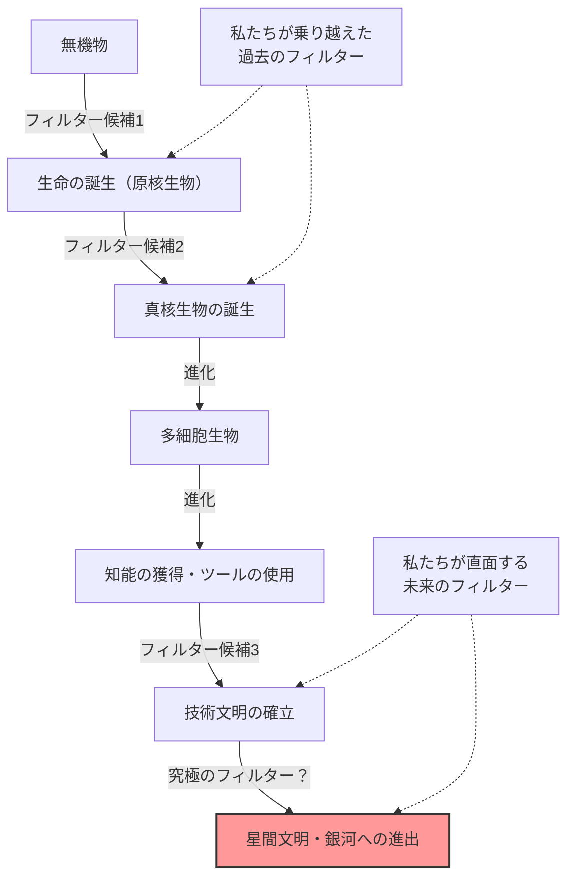
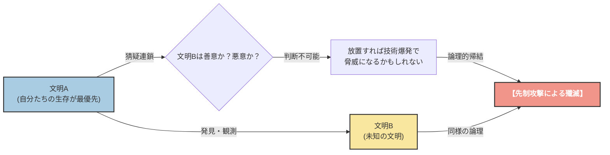

# 序章：「みんな、どこにいるのだろう？」

1950年の夏、ロスアラモス国立研究所のカフェテリアで、ノーベル物理学賞受賞者であるエンリコ・フェルミは、同僚の物理学者たち（エドワード・テラー、ハーバート・ヨーク、エミール・コノピンスキー）と昼食をとっていました。彼らの話題は、当時メディアを賑わせていたUFOの目撃情報や、光より速い宇宙船の可能性についてでした。

会話が別の話題に移り、しばらく経った後、フェルミは突然、脈絡もなくこう尋ねました。

**「みんなどこにいるのだろう？（Where is everybody?）」**

同僚たちは、彼が宇宙人のことを話しているのだとすぐに理解しました。フェルミの頭脳は、驚異的な計算能力で知られていました。彼は昼食の短い時間の間に、宇宙の年齢、銀河系の星の数、生命が誕生する確率、そして文明が恒星間航行技術を開発するまでの時間を概算していたのです。

彼の計算が示した結論は明快でした。**「地球外文明は、とうの昔に地球を訪れていて然るべきである」**。しかし、現実にはその明確な証拠は一切ありません。この「計算上の高い確率」と「現実の証拠の欠如」という矛盾こそが、後に**「フェルミのパラドックス」**と呼ばれるようになる、現代天文学・宇宙生物学における最大の謎の一つです。

本記事では、このフェルミのパラドックスについて、その背景から現代科学が提示する様々な解答（仮説）まで、徹底的に深掘りしていきます。宇宙のスケールを理解し、人類の立ち位置を見つめ直す、知的な旅へ出かけましょう。

---

# 第1章：宇宙のスケールとドレイクの方程式

フェルミのパラドックスの根幹には、「宇宙はあまりにも広大であり、古すぎる」という事実があります。まずは、私たちが住むこの宇宙のスケールを数字で把握してみましょう。

## 圧倒的な数と時間

私たちが観測可能な宇宙には、約2兆個の銀河が存在すると推定されています。そして、それぞれの銀河には平均して1000億個から4000億個の星（恒星）が含まれています。つまり、宇宙全体には地球上のすべての砂粒を合わせた数よりもはるかに多い、約 $10^{24}$ 個の星が存在することになります。

近年、ケプラー宇宙望遠鏡などの観測により、これらの星の多くが惑星を伴っており、そのうちのかなりの割合が「ハビタブルゾーン（液体の水が存在できる領域）」にある地球型惑星であることがわかってきました。保守的に見積もっても、私たちの天の川銀河だけでも、数十億から数百億個の「第二の地球」候補が存在するのです。

さらに時間のスケールを考えてみましょう。宇宙の年齢は約138億年、地球の年齢は約46億年です。人類が文明を築いてからわずか数千年、電波を使った通信を始めてからまだ100年余りしか経っていません。もし、地球より10億年早く誕生した惑星に生命が芽生え、文明を築いていたとしたらどうでしょう？ 10億年という時間は、人類の進化の歴史を何千回も繰り返せるほどの圧倒的な時間です。彼らの技術は、私たちの想像を絶するレベルに達しているはずです（例えば、ダイソン球の建設や、銀河系全体への植民など）。

## ドレイクの方程式

地球外知的生命体の存在確率を論じる際、必ず登場するのが「ドレイクの方程式」です。1961年、天文学者のフランク・ドレイクが考案したこの方程式は、私たちの銀河系に存在し、人類と通信可能な地球外文明の数（$N$）を推定するためのものです。

方程式は以下の要素の掛け算で表されます。

$$ N = R_* \times f_p \times n_e \times f_l \times f_i \times f_c \times L $$

*   $R_*$ : 銀河系で恒星が誕生する割合
*   $f_p$ : その恒星が惑星系を持つ割合
*   $n_e$ : その惑星系の中で生命が生存可能な環境を持つ惑星の数
*   $f_l$ : その惑星に実際に生命が誕生する割合
*   $f_i$ : その生命が知的生命体へと進化する割合
*   $f_c$ : その知的生命体が星間通信を行う技術を持つ割合
*   $L$ : そのような技術文明が存続する期間

この方程式の最大の特徴は、「答えを出すこと」ではなく、「議論すべき要素を明確にしたこと」にあります。左側の方程式（$R_*$, $f_p$, $n_e$）については、天文学の進歩によってかなり精度の高い値が出せるようになってきました。しかし、右側（$f_l$, $f_i$, $f_c$, $L$）については、依然として推測の域を出ません。

楽観的な天文学者（例えばカール・セーガン）は、銀河系内には数百万の文明が存在すると主張しました。一方、悲観的な見方をすれば、$N=1$（つまり人類だけ）という結果にもなり得ます。しかし、もし $N$ がかなり大きいのであれば、再びフェルミの問いに戻ることになります。「みんなどこにいるのか？」

---

# 第2章：沈黙を説明する数々の仮説

フェルミのパラドックスに対する解答は、大きく3つのカテゴリーに分類することができます。

1.  **そもそも彼らは存在しない**（地球外生命体、あるいは知的生命体は極めて稀である）
2.  **彼らは存在するが、私たちには感知できていない**（通信方法の違い、距離の壁、意図的な沈黙など）
3.  **彼らはすでに地球に来ているが、私たちは気づいていない**（あるいは隠蔽されている）

それぞれのカテゴリーについて、代表的な仮説を深く掘り下げてみましょう。

## カテゴリー1：そもそも彼らは存在しない

### レア・アース（稀な地球）仮説

この仮説は、微生物のような単純な生命は宇宙にありふれているかもしれないが、人類のような複雑な知的生命体が進化するためには、極めて稀な天文学的・地質学的条件が重なる必要があると主張します。

*   **木星の存在:** 木星のような巨大ガス惑星が適切な位置にあることで、地球に降り注ぐ小惑星や彗星の盾となり、生命が絶滅するような大衝突を防いでいる。
*   **巨大な月の存在:** 地球に比べて不釣り合いに大きな月が存在することで、地球の自転軸の傾き（約23.4度）が安定し、穏やかな気候変動と四季が維持されている。
*   **プレートテクトニクスと地磁気:** 活発なプレート運動が炭素循環を促し、温室効果を適切に保つ。また、強力な磁場が太陽風や宇宙線から大気と生命を守っている。
*   **恒星の性質:** 太陽のようなG型主系列星は、寿命が適度に長く（約100億年）、エネルギー放射も安定している。宇宙で最も多い赤色矮星（M型星）は、フレア活動が活発すぎたり、惑星が潮汐ロック（常に同じ面を恒星に向ける）されたりするため、生命の進化には厳しい環境かもしれない。

これらの「奇跡的な条件」がすべて揃う確率は天文学的に低く、ゆえに人類は孤独であるという考え方です。

### グレート・フィルター理論（The Great Filter）

1996年、ロビン・ハンソンによって提唱された「グレート・フィルター」は、フェルミのパラドックスに対する最も恐ろしく、かつ説得力のある解答の一つです。

生命が誕生し、星間文明へと発展するまでの過程には、乗り越えるのが極めて困難な「大きな壁（フィルター）」が存在するという考え方です。

重要なのは、**「このフィルターは私たちの過去にあるのか、それとも未来にあるのか？」**という点です。

*   **フィルターは過去にあった（我々は幸運な生き残りである）:**
    生命の誕生（アビオジェネシス）そのものが奇跡的な出来事だったのかもしれません。あるいは、単純な原核生物から、ミトコンドリアのような複雑な構造を持つ真核生物へ進化する過程が、宇宙の歴史においても稀有なことだったのかもしれません（地球ではこのステップに約20億年かかっています）。もしそうなら、人類は宇宙で最も進んだ種族の一つということになります。
*   **フィルターは未来にある（我々は破滅に向かっている）:**
    これは非常に暗い見通しです。生命の誕生や知的文明の成立までは比較的よくあることだとしても、その先の「星間文明」に至る前に、文明は必ず自己破壊してしまうという仮説です。核戦争、人工知能の暴走、気候変動、あるいは私たちがまだ気づいていない未知の物理的脅威によって、文明は一定のレベルに達すると自滅する運命にあるのかもしれません。

火星などで単細胞生物の化石が見つかったとしたら、それは「生命の誕生はフィルターではない」ことを意味し、フィルターが我々の「未来」に待ち構えている可能性が高まるため、人類にとって最悪のニュースになる、と主張する科学者もいます。

---

## カテゴリー2：彼らは存在するが、感知できていない

文明は多数存在するが、様々な理由で私たちがそれを見つけられていない、あるいは彼らが意図的に接触を避けているという仮説群です。

### 広すぎる宇宙と短すぎる時間

宇宙空間は私たちの直感をはるかに超えて広大です。隣の恒星であるプロキシマ・ケンタウリまで光の速さでも約4.2年かかります。現在の地球の探査機（ボイジャーなど）の速度では、数万年かかる距離です。

また、「時間」の壁も存在します。人類が電波通信を始めてから約100年。つまり、地球からの電波はまだ半径100光年の範囲にしか届いていません。天の川銀河の直径は約10万光年ですから、私たちが存在を知らせている領域は銀河全体のほんの小さな点に過ぎません。
文明の存続期間が仮に数千年、数万年程度だとすると、宇宙の138億年という歴史の中で、二つの文明が「同時に」存在し、お互いの信号をキャッチできるタイミングが重なる確率は非常に低いのかもしれません。

### 技術的なミスマッチ

私たちは「SETI（地球外知的生命体探査）」において、主に電波を使って宇宙人を捜しています。しかし、これは私たちが最近になって電波を発見したからに過ぎません。

高度に発達した文明にとって、電波を使った通信は「狼煙（のろし）」や「糸電話」のように原始的で効率の悪いものとみなされているかもしれません。彼らはニュートリノ通信、重力波、あるいは量子もつれを利用した超光速通信（物理的には否定されていますが仮定として）など、私たちにはまだ検知すらできない未知の物理法則を利用した通信を行っている可能性があります。私たちが暗闇の中で懸命に狼煙を探している間、彼らは光ファイバーで通信しているような状態です。

### 動物園仮説（Zoo Hypothesis）

1973年にジョン・ボールが提唱したこの仮説は、「高度な地球外文明は地球の存在を知っているが、人類が自然に進化するのを見守るために、意図的に干渉を避けている」というものです。

まるで私たちが自然保護区の野生動物を観察するように、地球は一種の「隔離された動物園」または「保護区」として扱われているという考え方です。スタートレックに登場する「最優先指令（Prime Directive：進化の遅れた文明には干渉してはならない）」と同じ概念です。人類が十分な倫理的・技術的成熟度（例えば、自らを滅ぼさずに世界政府を樹立する、恒星間航行技術を開発するなど）に達したときに初めて、彼らは接触してくるのかもしれません。

### 暗黒森林仮説（Dark Forest Theory）

中国のSF作家、劉慈欣の世界的ベストセラー『三体』シリーズで有名になった、最も恐ろしく冷酷な仮説です。この仮説は、宇宙を「すべてのハンターが息を殺して隠れている暗黒の森」に例えます。

宇宙における社会学的な公理として、以下の2つを前提とします。
1.  すべての文明にとって、生存が最優先事項である。
2.  宇宙の物質の総量は一定であり、文明は絶えず拡大・発展しようとする。

さらに、星間の途方もない距離によって、お互いの意図を正しく理解し合うことが不可能になる「疑心暗鬼の連鎖（猜疑連鎖）」と、技術が突然変異的に飛躍する「技術爆発」という概念が加わります。

ある文明Aが、別の文明Bを発見したとします。文明Aにとって、文明Bが友好的か敵対的かを知る術はありません。たとえ今は文明Bの技術レベルが低くても、いつ「技術爆発」を起こして文明Aを凌駕し、脅威になるかわかりません。
したがって、自らの生存を確実にするための最も合理的で安全な選択は、**「他の文明を発見次第、即座に、相手に悟られる前に破壊すること」**になります。

この理論に従えば、宇宙が沈黙している理由は明確です。不用意に電波を発し、自分の位置を知らせるような愚かな文明（地球のような）はすぐに消し去られるか、あるいはすべての賢明な文明は、暗闇の中で息を潜めて隠れているかのどちらかだからです。

### シミュレーション仮説

私たちが生きているこの宇宙そのものが、上位の存在（超高度な文明やAI）によって作られたコンピューター・シミュレーションに過ぎないという仮説です。オックスフォード大学の哲学者ニック・ボストロムらが真剣に議論しています。

もし私たちがシミュレーションの住人であるならば、プログラマーが「他の宇宙人」をこのシミュレーション内にプログラミングしていない限り、私たちは宇宙人に会うことはありません。この世界が人類だけのためにシミュレートされた箱庭であるならば、宇宙の沈黙は当然の結果となります。

---

# 第3章：今後の展望と人類の課題

フェルミのパラドックスに対して、現在も世界中の科学者が様々なアプローチで挑んでいます。

## テクノシグネチャーの探索

従来のSETIは意図的な通信信号（電波）を探していましたが、近年では「テクノシグネチャー（技術の痕跡）」を探す動きが活発になっています。
例えば、高度な文明が恒星のエネルギーを丸ごと利用するために建設する「ダイソン球」が存在すれば、その恒星から特異な赤外線放射が観測されるはずです。ジェイムズ・ウェッブ宇宙望遠鏡（JWST）などの最新の観測機器は、はるか遠くの系外惑星の大気成分を分析し、自然界では発生し得ない工業ガス（フロンガスなど）や、人工的な光の痕跡を探し出す能力を持っています。

私たちは「彼らが私たちに話しかけてくる」のを待つのではなく、「彼らがそこで生活している痕跡」を能動的に見つけ出そうとしているのです。

## パラドックスが私たちに突きつけるもの

フェルミのパラドックスは、単なるSF的な思考実験ではありません。それは、私たち人類自身の存続と未来に対する強烈な問いかけです。

もし「グレート・フィルター」が未来にあるのだとすれば、私たちは現在、気候変動、核兵器の脅威、AIの制御といった、自らが生み出した存亡の危機（Existential Risk）に直面しています。これらを乗り越えられなければ、人類もまた、宇宙の沈黙の中に消えていった無数の「失敗した文明」の一つに過ぎなかったことになります。

逆に、もしレア・アース仮説が正しく、人類がこの広大な宇宙で奇跡的に誕生した唯一の知能であるならば、私たちには計り知れない責任があります。宇宙に自己認識をもたらす存在として、意識という灯火を絶やさず、未来へと、そしていつか星々へと広げていく使命があるのかもしれません。

エンリコ・フェルミの「みんなどこにいるのだろう？」という何気ない一言は、70年以上経った今でも、私たちが何者であり、どこへ向かうべきなのかを深く考えさせる、人類史上で最も重要な問いの一つとして輝き続けています。

宇宙の沈黙は、私たちへの警告なのか、それとも私たちが第一歩を踏み出すのを待っている広大なフロンティアなのか。その答えを出せるのは、これからの人類の選択にかかっているのです。
