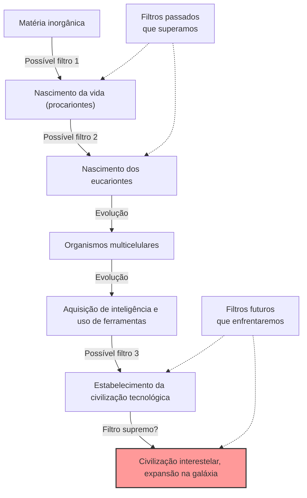
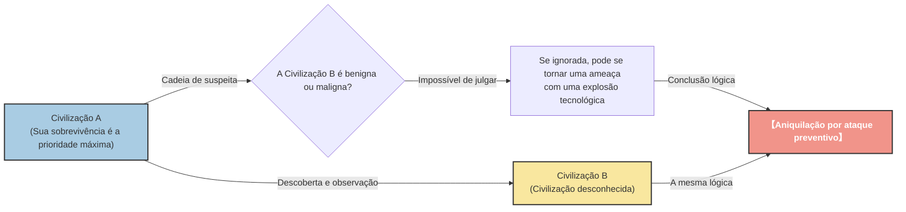

# Prólogo: "Onde estão todos?"

No verão de 1950, na lanchonete do Laboratório Nacional de Los Alamos, o ganhador do Prêmio Nobel de Física Enrico Fermi almoçava com seus colegas físicos (Edward Teller, Herbert York e Emil Konopinski). O assunto deles era sobre os avistamentos de OVNIs que dominavam a mídia da época e a possibilidade de naves espaciais mais rápidas que a luz.

Depois que a conversa mudou para outro assunto e algum tempo se passou, Fermi perguntou de repente, do nada:

**"Onde estão todos? (Where is everybody?)"**

Seus colegas entenderam imediatamente que ele estava falando de alienígenas. A mente de Fermi era conhecida por sua espantosa capacidade de cálculo. Durante o curto período do almoço, ele havia estimado aproximadamente a idade do universo, o número de estrelas na galáxia, a probabilidade do surgimento da vida e o tempo que levaria para uma civilização desenvolver a tecnologia de voo interestelar.

A conclusão que seus cálculos mostraram foi clara. **"As civilizações extraterrestres já deveriam ter visitado a Terra há muito tempo"**. No entanto, na realidade, não há evidências claras disso. Essa contradição entre "alta probabilidade nos cálculos" e "falta de evidências na realidade" é exatamente o que mais tarde seria chamado de **"Paradoxo de Fermi"**, um dos maiores mistérios da astronomia moderna e da astrobiologia.

Neste artigo, aprofundaremos minuciosamente o Paradoxo de Fermi, desde o seu contexto até as várias respostas (hipóteses) propostas pela ciência moderna. Vamos embarcar em uma jornada intelectual para entender a escala do universo e reconsiderar o lugar da humanidade nele.

---

# Capítulo 1: A escala do universo e a Equação de Drake

No cerne do Paradoxo de Fermi está o fato de que "o universo é muito vasto e muito antigo". Em primeiro lugar, vamos tentar entender a escala do universo em que vivemos por meio de números.

## Números e tempo esmagadores

Estima-se que existam cerca de 2 trilhões de galáxias no universo observável. E cada galáxia contém, em média, de 100 bilhões a 400 bilhões de estrelas. Em outras palavras, em todo o universo há cerca de $10^{24}$ estrelas, muito mais do que todos os grãos de areia da Terra somados.

Nos últimos anos, observações feitas pelo telescópio espacial Kepler e outros revelaram que muitas dessas estrelas têm planetas e que uma proporção significativa deles são planetas do tipo terrestre na "zona habitável" (onde a água líquida pode existir). Numa estimativa conservadora, existem bilhões a dezenas de bilhões de candidatos a "Segunda Terra" apenas na nossa galáxia, a Via Láctea.

Considere também a escala de tempo. A idade do universo é de cerca de 13,8 bilhões de anos, e a idade da Terra é de cerca de 4,6 bilhões de anos. Já se passaram apenas alguns milhares de anos desde que a humanidade construiu uma civilização, e apenas um pouco mais de 100 anos desde que começamos a usar a comunicação por rádio. E se a vida tivesse surgido e construído uma civilização em um planeta nascido 1 bilhão de anos antes da Terra? 1 bilhão de anos é um tempo avassalador que permitiria repetir a história evolutiva da humanidade milhares de vezes. A tecnologia deles deve ter alcançado níveis além da nossa imaginação (por exemplo, a construção de esferas de Dyson e a colonização de toda a galáxia).

## A Equação de Drake

Ao discutir a probabilidade da existência de vida inteligente extraterrestre, a "Equação de Drake" sempre aparece. Essa equação, idealizada pelo astrônomo Frank Drake em 1961, visa estimar o número ($N$) de civilizações extraterrestres em nossa galáxia que poderiam se comunicar com a humanidade.

A equação é expressa pela multiplicação dos seguintes fatores:

$$ N = R_* \times f_p \times n_e \times f_l \times f_i \times f_c \times L $$

*   $R_*$ : A taxa de formação estelar na galáxia
*   $f_p$ : A fração dessas estrelas que possuem sistemas planetários
*   $n_e$ : O número de planetas dentro de tais sistemas com um ambiente onde a vida poderia sobreviver
*   $f_l$ : A fração desses planetas onde a vida realmente surge
*   $f_i$ : A fração dessa vida que evolui para a vida inteligente
*   $f_c$ : A fração dessa vida inteligente que desenvolve tecnologia capaz de realizar comunicações interestelares
*   $L$ : O período de tempo que tal civilização tecnológica sobrevive

A principal característica desta equação não é "fornecer uma resposta", mas "esclarecer os elementos a serem discutidos". Com relação aos fatores do lado esquerdo ($R_*$, $f_p$, $n_e$), os avanços na astronomia nos permitiram obter valores com um grau bastante alto de precisão. No entanto, para o lado direito ($f_l$, $f_i$, $f_c$, $L$), as respostas ainda permanecem no domínio da especulação.

Astrônomos otimistas (por exemplo, Carl Sagan) argumentavam que poderia haver milhões de civilizações na galáxia. Por outro lado, a partir de uma visão pessimista, o resultado pode ser $N=1$ (ou seja, apenas a humanidade). No entanto, se $N$ for consideravelmente grande, retornamos novamente à pergunta de Fermi: "Onde estão todos?"

---

# Capítulo 2: Inúmeras hipóteses que explicam o silêncio

As respostas ao Paradoxo de Fermi podem ser classificadas amplamente em três categorias:

1.  **Em primeiro lugar, eles não existem** (a vida extraterrestre, ou a vida inteligente, é extremamente rara)
2.  **Eles existem, mas não conseguimos percebê-los** (diferenças nos métodos de comunicação, a barreira da distância, silêncio intencional, etc.)
3.  **Eles já estão na Terra, mas não percebemos** (ou isso está sendo ocultado)

Vamos aprofundar nas hipóteses representativas de cada categoria.

## Categoria 1: Em primeiro lugar, eles não existem

### Hipótese da Terra Rara (Rare Earth)

Esta hipótese argumenta que a vida simples, como microorganismos, pode ser comum no universo, mas que a evolução de vida inteligente e complexa, como a humanidade, requer uma combinação de condições astronômicas e geológicas extremamente raras.

*   **A existência de Júpiter:** O posicionamento adequado de um gigante gasoso como Júpiter atua como um escudo contra asteróides e cometas que chovem sobre a Terra, evitando colisões massivas que extinguiriam a vida.
*   **A existência de uma lua gigantesca:** A presença de uma lua desproporcionalmente grande em comparação à Terra estabiliza a inclinação do eixo de rotação da Terra (cerca de 23,4 graus) e mantém as mudanças climáticas amenas e as quatro estações.
*   **Tectônica de placas e campo magnético:** O movimento ativo das placas tectônicas impulsiona o ciclo do carbono e mantém adequadamente o efeito estufa. Além disso, um poderoso campo magnético protege a atmosfera e a vida dos ventos solares e dos raios cósmicos.
*   **A natureza da estrela:** Estrelas da sequência principal do tipo G, como o Sol, têm vidas moderadamente longas (cerca de 10 bilhões de anos) e emitem energia de forma constante. As anãs vermelhas (estrelas do tipo M), as mais comuns no universo, podem representar um ambiente hostil para a evolução da vida devido a atividades de erupção (flares) muito ativas e porque seus planetas podem estar bloqueados por maré (mostrando sempre a mesma face para a estrela).

A ideia é que a probabilidade de todas essas "condições milagrosas" serem atendidas é astronomicamente baixa e, portanto, a humanidade está sozinha.

### Teoria do Grande Filtro (The Great Filter)

Proposto por Robin Hanson em 1996, o "Grande Filtro" é uma das respostas mais assustadoras e convincentes ao Paradoxo de Fermi.

É a ideia de que no processo desde o nascimento da vida até o desenvolvimento de uma civilização interestelar, existe um "grande muro (filtro)" que é extremamente difícil de superar.

O importante é o ponto: **"Esse filtro está no nosso passado ou está no nosso futuro?"**

*   **O filtro estava no passado (somos sobreviventes sortudos):**
    O próprio nascimento da vida (abiogênese) pode ter sido um evento milagroso. Ou o processo evolutivo desde os simples procariontes até os eucariontes com estruturas complexas, como as mitocôndrias, pode ter sido uma ocorrência rara na história do universo (na Terra, esse passo levou cerca de 2 bilhões de anos). Se for assim, a humanidade seria uma das espécies mais avançadas do universo.
*   **O filtro está no futuro (estamos caminhando para a ruína):**
    Essa é uma perspectiva muito sombria. É a hipótese de que, mesmo que o nascimento da vida e o estabelecimento de civilizações inteligentes sejam relativamente comuns, antes de chegar à "civilização interestelar" além disso, a civilização invariavelmente destruirá a si mesma. Seja por guerra nuclear, uma inteligência artificial descontrolada, mudanças climáticas ou ameaças físicas desconhecidas das quais ainda não temos conhecimento, as civilizações podem estar destinadas à autodestruição ao atingirem certo nível.

Alguns cientistas argumentam que se fósseis de organismos unicelulares fossem encontrados em Marte ou em outro lugar, seria a pior notícia para a humanidade, pois significaria que "o surgimento da vida não é o filtro", aumentando a probabilidade de o filtro estar aguardando em nosso "futuro".

---

## Categoria 2: Eles existem, mas não conseguimos percebê-los

Este é um conjunto de hipóteses sugerindo que muitas civilizações existem, mas por várias razões não as encontramos, ou que elas estão evitando o contato intencionalmente.

### O universo é muito vasto e o tempo muito curto

O espaço é muito mais vasto do que a nossa intuição pode compreender. Levaria cerca de 4,2 anos, mesmo na velocidade da luz, para alcançar a estrela vizinha Proxima Centauri. Na velocidade das sondas espaciais atuais da Terra (como a Voyager), levaria dezenas de milhares de anos.

Também existe a barreira do "tempo". Já se passaram cerca de 100 anos desde que a humanidade começou a usar comunicação de rádio. Isso significa que as ondas de rádio da Terra só atingiram um raio de 100 anos-luz. Como o diâmetro da Via Láctea é de cerca de 100.000 anos-luz, a área onde nossa presença é anunciada é apenas um pequeno ponto em toda a galáxia.
Se assumirmos que a vida útil de uma civilização é de alguns milhares a dezenas de milhares de anos, a probabilidade de que duas civilizações existam "simultaneamente" na história de 13,8 bilhões de anos do universo, e que seus tempos se alinhem para capturar o sinal uma da outra, pode ser extremamente baixa.

### Descompasso tecnológico

Nós, na "SETI (Busca por Inteligência Extraterrestre)", estamos procurando por alienígenas principalmente usando ondas de rádio. No entanto, isso se deve apenas ao fato de que descobrimos as ondas de rádio recentemente.

Para civilizações altamente desenvolvidas, a comunicação por rádio pode ser vista como algo tão primitivo e ineficiente quanto "sinais de fumaça" ou "telefones de lata". Existe a possibilidade de eles estarem usando leis físicas desconhecidas que nem sequer podemos detectar ainda, como a comunicação por neutrinos, ondas gravitacionais, ou comunicação mais rápida que a luz usando o emaranhamento quântico (hipoteticamente, embora negado fisicamente). Enquanto estamos no escuro tentando desesperadamente procurar por sinais de fumaça, é como se eles estivessem comunicando-se usando fibra ótica.

### Hipótese do Zoológico (Zoo Hypothesis)

Proposta por John Ball em 1973, esta hipótese sugere que "as civilizações extraterrestres avançadas têm conhecimento da existência da Terra, mas intencionalmente evitam interferir nela a fim de observar o desenvolvimento natural da humanidade".

A ideia é que a Terra esteja sendo tratada como um tipo de "zoológico isolado" ou "reserva natural", da mesma forma como observamos os animais selvagens nas reservas. É o mesmo conceito da "Primeira Diretriz" (Prime Directive: não se deve interferir em civilizações menos evoluídas) que aparece em Star Trek. Talvez eles só venham a entrar em contato quando a humanidade atingir um nível suficiente de maturidade ética e tecnológica (por exemplo, ao estabelecer um governo mundial sem se autodestruir, ou ao desenvolver a tecnologia de voo interestelar).

### Hipótese da Floresta Negra (Dark Forest Theory)

Esta é a hipótese mais aterrorizante e implacável, famosa pela série best-seller mundial "O Problema dos Três Corpos", do autor chinês de ficção científica Liu Cixin. A hipótese compara o universo a "uma floresta escura, onde cada caçador se esconde, prendendo a respiração".

Como axiomas sociológicos do universo, ela assume os dois seguintes pontos:
1.  Para todas as civilizações, a sobrevivência é a prioridade máxima.
2.  A quantidade total de matéria no universo é constante, e as civilizações tentam constantemente se expandir e se desenvolver.

Adicionalmente, introduz-se a "cadeia de suspeita", onde as tremendas distâncias interestelares tornam impossível compreender com precisão as intenções uns dos outros, e o conceito de "explosão tecnológica", em que a tecnologia dá saltos repentinos devido a mutações.

Suponha que uma civilização A descubra outra civilização B. Para a civilização A, não há como saber se a civilização B é amigável ou hostil. Mesmo que o nível tecnológico da civilização B seja baixo agora, não há como dizer quando ela experimentará uma "explosão tecnológica" para superar e ameaçar a civilização A.
Portanto, a escolha mais racional e segura para garantir a própria sobrevivência é **"destruí-la imediatamente, antes que o outro perceba, assim que descobrir outra civilização"**.

De acordo com essa teoria, a razão para o silêncio do universo é clara. Civilizações tolas (como a Terra) que descuidadamente emitem ondas de rádio e transmitem sua localização serão apagadas num instante, ou todas as civilizações sábias estão escondidas nas sombras prendendo a respiração.

### Hipótese da Simulação

Esta é uma hipótese de que o próprio universo em que vivemos nada mais é do que uma simulação de computador criada por seres superiores (uma civilização super avançada ou IA). É debatido com seriedade por pessoas como Nick Bostrom, filósofo da Universidade de Oxford.

Se fôssemos moradores em uma simulação, nunca encontraríamos alienígenas, a menos que os programadores tivessem programado "outros alienígenas" nesta simulação. Se este mundo é um jardim em miniatura simulado apenas para a humanidade, o silêncio do universo é a consequência natural.

---

# Capítulo 3: Perspectivas futuras e os desafios da humanidade

Mesmo agora, cientistas em todo o mundo continuam a enfrentar o Paradoxo de Fermi através de várias abordagens.

## Busca por Tecnoassinaturas

O SETI tradicional costumava procurar sinais intencionais de comunicação (ondas de rádio), mas nos últimos anos tem havido um movimento ativo para buscar "tecnoassinaturas (vestígios de tecnologia)".
Por exemplo, se existisse uma "Esfera de Dyson", construída por uma civilização avançada para utilizar toda a energia de uma estrela, uma emissão de infravermelho peculiar deveria ser observada a partir dessa estrela. Os mais recentes instrumentos de observação, como o Telescópio Espacial James Webb (JWST), são capazes de analisar a composição atmosférica de exoplanetas muito distantes para encontrar gases industriais que não podem ocorrer na natureza (como os clorofluorcarbonos) ou vestígios de luzes artificiais.

Em vez de esperar que "eles falem conosco", estamos tentando encontrar ativamente os "sinais de que eles vivem lá".

## O que o paradoxo nos apresenta

O Paradoxo de Fermi não é apenas um experimento mental de ficção científica. É um intenso questionamento sobre a sobrevivência e o futuro da própria humanidade.

Se o "Grande Filtro" estiver no futuro, nós estamos enfrentando atualmente riscos existenciais (Existential Risks) criados por nós mesmos, tais como as mudanças climáticas, a ameaça de armas nucleares e o controle de IA. Se não pudermos superá-los, a humanidade acabará se tornando mais uma dentre incontáveis "civilizações fracassadas" que desapareceram no silêncio do universo.

Por outro lado, se a Hipótese da Terra Rara estiver correta, e a humanidade for a única inteligência a nascer miraculosamente neste vasto universo, temos uma responsabilidade incomensurável. Como a entidade que traz a autoconsciência ao universo, talvez tenhamos a missão de manter viva a chama da consciência, espalhando-a para o futuro e, eventualmente, para as estrelas.

Mais de 70 anos depois, a frase casual de Enrico Fermi "Onde estão todos?" continua a brilhar como uma das perguntas mais importantes da história humana, fazendo-nos refletir profundamente sobre quem somos e para onde deveríamos ir.

O silêncio do universo é um aviso para nós ou é a vasta fronteira esperando para darmos o primeiro passo? Dar a resposta a isso depende das escolhas que a humanidade fará a partir de agora.
