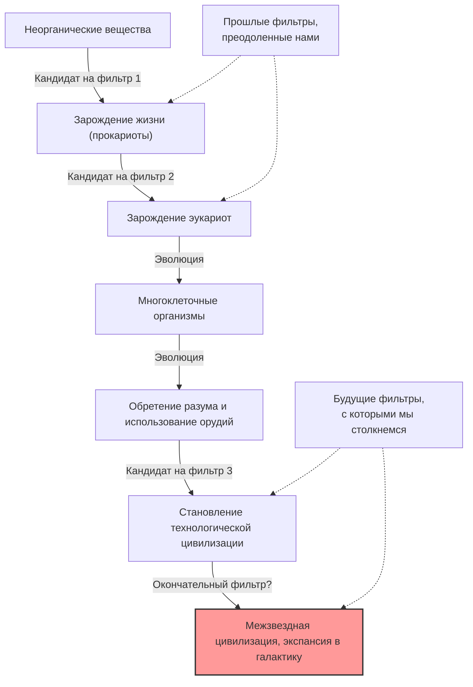
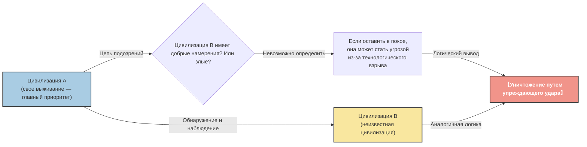

# Пролог: "Где все?"

Летом 1950 года в кафетерии Лос-Аламосской национальной лаборатории лауреат Нобелевской премии по физике Энрико Ферми обедал со своими коллегами-физиками (Эдвардом Теллером, Гербертом Йорком и Эмилем Конопинским). Темой их разговора были сообщения о наблюдениях НЛО, которые в то время шумели в СМИ, и возможность создания космических кораблей быстрее света.

После того как разговор перешел на другую тему, Ферми внезапно, без всякой связи, спросил:

**"Где все? (Where is everybody?)"**

Его коллеги сразу поняли, что он говорит об инопланетянах. Ум Ферми был известен своими феноменальными вычислительными способностями. За короткое время обеда он прикинул возраст Вселенной, количество звезд в галактике, вероятность возникновения жизни и время, которое потребуется цивилизации для разработки технологий межзвездных путешествий.

Вывод, к которому привели его расчеты, был ясен: **"Внеземные цивилизации уже давно должны были посетить Землю"**. Однако в реальности нет никаких явных доказательств этому. Это противоречие между "высокой расчетной вероятностью" и "отсутствием реальных доказательств" — одна из величайших загадок современной астрономии и астробиологии, которая позже стала известна как **"Парадокс Ферми"**.

В этой статье мы глубоко погрузимся в парадокс Ферми — от его предыстории до различных ответов (гипотез), предлагаемых современной наукой. Отправляемся в интеллектуальное путешествие, чтобы понять масштабы Вселенной и переосмыслить место человечества.

---

# Глава 1: Масштабы Вселенной и уравнение Дрейка

В основе парадокса Ферми лежит тот факт, что "Вселенная слишком огромна и слишком стара". Для начала давайте в цифрах оценим масштабы Вселенной, в которой мы живем.

## Ошеломляющие числа и время

По оценкам, в наблюдаемой нами Вселенной существует около 2 триллионов галактик. В каждой из них в среднем от 100 до 400 миллиардов звезд. То есть во всей Вселенной насчитывается около $10^{24}$ звезд, что намного больше, чем всех песчинок на Земле вместе взятых.

В последние годы благодаря наблюдениям космического телескопа "Кеплер" и других стало понятно, что многие из этих звезд имеют планеты, значительная часть которых — планеты земного типа, находящиеся в "обитаемой зоне" (где может существовать жидкая вода). По самым консервативным оценкам, только в нашем Млечном Пути существуют десятки миллиардов кандидатов на звание "Второй Земли".

Давайте также рассмотрим масштаб времени. Возраст Вселенной составляет около 13,8 миллиардов лет, Земли — около 4,6 миллиардов лет. Человечество построило цивилизацию всего несколько тысяч лет назад, а использует радиосвязь чуть больше 100 лет. Что, если бы на планете, родившейся на миллиард лет раньше Земли, зародилась жизнь и построила цивилизацию? Миллиард лет — это огромное количество времени, достаточное для того, чтобы история человеческой эволюции повторилась тысячи раз. Их технологии должны были достичь уровня за гранью нашего воображения (например, строительство сфер Дайсона или колонизация всей галактики).

## Уравнение Дрейка

При обсуждении вероятности существования внеземной разумной жизни обязательно упоминается "уравнение Дрейка". Выведенное астрономом Фрэнком Дрейком в 1961 году, это уравнение предназначено для оценки количества внеземных цивилизаций ($N$) в нашей галактике, с которыми человечество может вступить в контакт.

Уравнение выражается как произведение следующих факторов:

$$ N = R_* \times f_p \times n_e \times f_l \times f_i \times f_c \times L $$

*   $R_*$ : скорость формирования звезд в галактике
*   $f_p$ : доля звезд, имеющих планетные системы
*   $n_e$ : количество планет в системе, пригодных для жизни
*   $f_l$ : вероятность зарождения жизни на такой планете
*   $f_i$ : вероятность эволюции жизни до разумных существ
*   $f_c$ : доля разумных цивилизаций, обладающих технологиями межзвездной связи
*   $L$ : время жизни такой технологической цивилизации

Главная особенность этого уравнения не в том, чтобы "дать ответ", а в том, чтобы "четко определить факторы, которые необходимо обсуждать". Для левой части уравнения ($R_*$, $f_p$, $n_e$) благодаря прогрессу астрономии теперь можно получить довольно точные значения. Однако правая часть ($f_l$, $f_i$, $f_c$, $L$) по-прежнему остается в области предположений.

Оптимистично настроенные астрономы (например, Карл Саган) утверждали, что в галактике существуют миллионы цивилизаций. С другой стороны, если посмотреть пессимистично, результат может быть $N=1$ (только человечество). Однако, если $N$ довольно велико, мы снова возвращаемся к вопросу Ферми. "Где все?"

---

# Глава 2: Множество гипотез, объясняющих молчание

Ответы на парадокс Ферми можно разделить на три основные категории.

1.  **Их вообще не существует** (внеземная жизнь или разумная жизнь встречается крайне редко)
2.  **Они существуют, но мы не можем их обнаружить** (разные способы связи, барьер расстояния, намеренное молчание и т.д.)
3.  **Они уже здесь, на Земле, но мы об этом не знаем** (или это скрывается)

Давайте глубоко разберем основные гипотезы для каждой из категорий.

## Категория 1: Их вообще не существует

### Гипотеза Уникальной Земли (Rare Earth)

Эта гипотеза утверждает, что, хотя простая жизнь вроде микробов может быть распространена во Вселенной, эволюция сложной разумной жизни, подобной человечеству, требует крайне редкого стечения астрономических и геологических условий.

*   **Наличие Юпитера:** Газовый гигант вроде Юпитера, находясь в правильном положении, действует как щит от астероидов и комет, защищая Землю от катастрофических столкновений, способных уничтожить жизнь.
*   **Наличие огромной Луны:** Непропорционально большая по сравнению с Землей Луна стабилизирует наклон земной оси (около 23,4 градуса), поддерживая умеренные климатические изменения и смену времен года.
*   **Тектоника плит и геомагнетизм:** Активное движение плит способствует углеродному циклу, поддерживая нужный парниковый эффект. А мощное магнитное поле защищает атмосферу и жизнь от солнечного ветра и космических лучей.
*   **Свойства звезды:** Звезды главной последовательности спектрального класса G, подобные Солнцу, имеют достаточно долгую продолжительность жизни (около 10 миллиардов лет) и стабильное энергетическое излучение. Самые распространенные во Вселенной красные карлики (звезды класса M) могут иметь слишком сильную вспышечную активность, или же их планеты находятся в приливном захвате (всегда обращены к звезде одной стороной), что может быть суровыми условиями для эволюции жизни.

Идея в том, что вероятность совпадения всех этих "чудесных условий" астрономически мала, а потому человечество одиноко.

### Теория Великого фильтра (The Great Filter)

Предложенный Робином Хэнсоном в 1996 году "Великий фильтр" является одним из самых пугающих и убедительных ответов на парадокс Ферми.

Идея состоит в том, что в процессе от зарождения жизни до развития в межзвездную цивилизацию существует "огромный барьер (фильтр)", который крайне трудно преодолеть.

Главное здесь — **"Этот фильтр остался в нашем прошлом, или же он ждет нас в будущем?"**

*   **Фильтр в прошлом (мы счастливчики):**
    Возможно, само зарождение жизни (абиогенез) было чудом. Или процесс эволюции от простых прокариот к эукариотам со сложными структурами вроде митохондрий был редким явлением в истории Вселенной (на Земле этот этап занял около 2 миллиардов лет). Если это так, человечество — один из самых продвинутых видов во Вселенной.
*   **Фильтр в будущем (мы движемся к гибели):**
    Это очень мрачная перспектива. Даже если зарождение жизни и становление разумной цивилизации — явления относительно частые, гипотеза предполагает, что цивилизация неизбежно уничтожит себя, не достигнув стадии "межзвездной цивилизации". Ядерная война, вышедший из-под контроля ИИ, изменение климата или неизвестная физическая угроза, о которой мы еще не подозреваем, — возможно, цивилизации суждено самоуничтожиться, достигнув определенного уровня.

Некоторые ученые утверждают, что если, например, на Марсе найдут окаменелости одноклеточных организмов, это будет означать, что "зарождение жизни не является фильтром", и вероятность того, что фильтр ждет нас в "будущем", возрастет — что станет наихудшей новостью для человечества.

---

## Категория 2: Они существуют, но мы их не обнаружили

Группа гипотез о том, что цивилизаций много, но мы не можем их найти по разным причинам, или же они намеренно избегают контакта.

### Слишком огромная Вселенная и слишком мало времени

Космос гораздо больше, чем мы можем себе представить. Чтобы добраться до соседней звезды Проксима Центавра со скоростью света, потребуется около 4,2 лет. При скорости современных земных зондов (таких как "Вояджер") на это уйдут десятки тысяч лет.

Также существует барьер "времени". Человечество использует радиосвязь около 100 лет. Это значит, что радиоволны с Земли достигли радиуса лишь в 100 световых лет. Поскольку диаметр Млечного Пути составляет около 100 000 световых лет, область, где мы заявили о своем существовании, — это лишь крошечная точка в масштабах галактики.
Если продолжительность существования цивилизации составляет, скажем, несколько тысяч или десятков тысяч лет, вероятность того, что две цивилизации будут существовать "одновременно" в 13,8-миллиардной истории Вселенной и время для улавливания сигналов друг друга совпадет, может быть очень низкой.

### Технологическое несоответствие

В программе SETI (Поиск внеземного разума) мы ищем инопланетян в основном с помощью радиоволн. Но это лишь потому, что мы сами недавно открыли радиосвязь.

Для высокоразвитой цивилизации использование радиоволн для связи может считаться примитивным и неэффективным, как "сигнальные костры" или "веревочный телефон". Возможно, они используют связь с помощью нейтрино, гравитационных волн или сверхсветовую связь с использованием квантовой запутанности (физически это отрицается, но в качестве предположения) — неизвестные физические законы, которые мы пока не можем даже обнаружить. Пока мы усердно ищем сигнальные костры в темноте, они общаются по "оптоволокну".

### Гипотеза зоопарка (Zoo Hypothesis)

Предложенная Джоном Боллом в 1973 году, эта гипотеза гласит, что "развитые внеземные цивилизации знают о Земле, но намеренно избегают вмешательства, чтобы наблюдать за естественной эволюцией человечества".

Идея в том, что с Землей обращаются как с "изолированным зоопарком" или "заповедником", подобно тому, как мы наблюдаем за дикими животными в национальных парках. Эта концепция аналогична "Первой Директиве" (Prime Directive: запрет на вмешательство в развитие менее развитых цивилизаций) из "Звездного пути". Возможно, они вступят в контакт только тогда, когда человечество достигнет достаточной этической и технологической зрелости (например, создаст мировое правительство без самоуничтожения или разработает технологии межзвездных полетов).

### Гипотеза Темного леса (Dark Forest Theory)

Это самая пугающая и безжалостная гипотеза, получившая известность благодаря мировому бестселлеру китайского писателя-фантаста Лю Цысиня "Задача трех тел". В ней Вселенная сравнивается с "темным лесом, где все охотники прячутся, затаив дыхание".

В качестве социологических аксиом Вселенной принимаются две предпосылки:
1.  Для всех цивилизаций выживание является высшим приоритетом.
2.  Общее количество материи во Вселенной неизменно, и цивилизации постоянно стремятся к расширению и развитию.

К этому добавляются концепции "цепи подозрений" (когда колоссальные межзвездные расстояния делают невозможным правильное понимание намерений друг друга) и "технологического взрыва" (скачкообразный, мутационный технологический рывок).

Предположим, цивилизация А обнаружила цивилизацию Б. У цивилизации А нет способа узнать, дружелюбна ли цивилизация Б или враждебна. Даже если сейчас технологический уровень Б низок, неизвестно, когда она совершит "технологический взрыв", превзойдет цивилизацию А и станет угрозой.
Поэтому самый рациональный и безопасный выбор для обеспечения собственного выживания — **"уничтожить любую обнаруженную цивилизацию немедленно, прежде чем она успеет понять это"**.

Согласно этой теории, причина молчания Вселенной очевидна. Глупые цивилизации (вроде Земли), неосторожно испускающие радиоволны и выдающие свое местоположение, будут немедленно уничтожены, а все разумные цивилизации прячутся в темноте, затаив дыхание.

### Гипотеза симуляции

Эта гипотеза предполагает, что сама Вселенная, в которой мы живем, — всего лишь компьютерная симуляция, созданная высшей сущностью (сверхразумной цивилизацией или ИИ). Эту теорию всерьез обсуждают философ из Оксфорда Ник Бостром и другие.

Если мы обитатели симуляции, то мы не встретим инопланетян, если только программисты не запрограммировали "других инопланетян" в этой симуляции. Если этот мир — песочница, смоделированная только для человечества, молчание Вселенной — естественный результат.

---

# Глава 3: Перспективы на будущее и вызовы для человечества

Ученые со всего мира продолжают пытаться решить парадокс Ферми с помощью различных подходов.

## Поиск техносигнатур

В то время как традиционный SETI искал намеренные коммуникационные сигналы (радиоволны), в последние годы активизировался поиск "техносигнатур (следов технологий)".
Например, если существуют "сферы Дайсона", которые высокоразвитые цивилизации строят для использования всей энергии звезды, то от этой звезды должно наблюдаться специфическое инфракрасное излучение. Новейшие инструменты, такие как Космический телескоп Джеймса Уэбба (JWST), обладают способностью анализировать состав атмосферы далеких экзопланет и искать промышленные газы, которые не могут возникнуть в природе (например, фреоны), и искусственные световые следы.

Мы пытаемся активно найти "следы их жизни там", а не ждать, пока "они заговорят с нами".

## Что парадокс ставит перед нами

Парадокс Ферми — это не просто научно-фантастический мысленный эксперимент. Это мощный вопрос о выживании и будущем самого человечества.

Если "Великий фильтр" находится в будущем, то сейчас мы сталкиваемся с экзистенциальными рисками (Existential Risk), которые сами и породили: изменение климата, угроза ядерного оружия, контроль над ИИ. Если мы их не преодолеем, человечество также станет лишь одной из бесчисленных "потерпевших неудачу цивилизаций", сгинувших в молчании Вселенной.

И наоборот, если верна гипотеза Уникальной Земли, и человечество — единственный разум, чудесным образом зародившийся в этой огромной Вселенной, то на нас лежит колоссальная ответственность. Как на существах, привнесших самосознание во Вселенную, на нас, возможно, возложена миссия не дать погаснуть огню сознания, нести его в будущее и когда-нибудь распространить к звездам.

Случайный вопрос Энрико Ферми "Где все?", заданный более 70 лет назад, продолжает сиять как один из самых важных вопросов в истории человечества, заставляющий нас глубоко задуматься о том, кто мы и куда должны идти.

Молчание Вселенной — это предупреждение для нас, или же это бескрайний рубеж, ожидающий нашего первого шага? Ответ на этот вопрос зависит от того, какой выбор человечество сделает в будущем.
