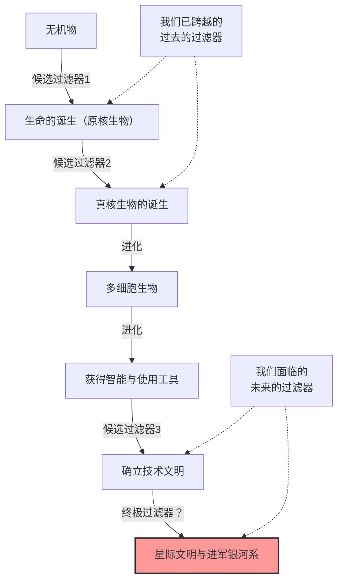
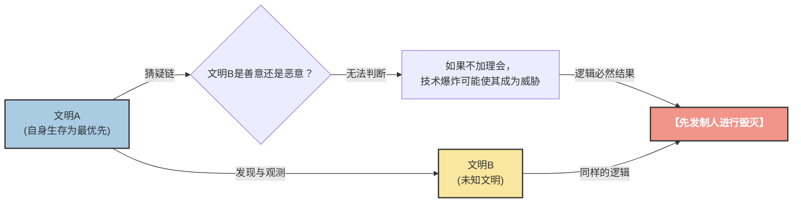

# 序章：“大家都在哪里？”

1950年的夏天，在洛斯阿拉莫斯国家实验室的餐厅里，诺贝尔物理学奖得主恩里科·费米（Enrico Fermi）正与他的物理学家同事们（爱德华·泰勒、赫伯特·约克、埃米尔·科诺平斯基）共进午餐。他们的话题是当时媒体热烈报道的UFO目击事件，以及超光速宇宙飞船的可能性。

当谈话转移到其他话题，过了一会儿，费米突然没头没脑地问了一句：

**“大家都在哪里呢？（Where is everybody?）”**

同事们立刻明白了他是在谈论外星人。费米的大脑以惊人的计算能力而闻名。他在短暂的午餐时间里，粗略估算了宇宙的年龄、银河系中恒星的数量、生命诞生的概率，以及一个文明发展出星际航行技术所需的时间。

他的计算得出的结论非常明确：**“地外文明早就应该造访过地球了”**。然而，现实中却没有发现任何确凿的证据。这种“计算上的高概率”与“现实中缺乏证据”之间的矛盾，正是后来被称为**“费米悖论”**的现代天文学与天体生物学中最大的谜团之一。

在本文中，我们将彻底深入地探讨这个费米悖论，从其背景到现代科学提出的各种解答（假说）。让我们踏上一场理解宇宙尺度、重新审视人类地位的知识之旅。

---

# 第1章：宇宙的尺度与德雷克方程

费米悖论的核心在于这样一个事实：“宇宙太浩瀚，也太古老了”。首先，让我们用数字来把握我们所居住的这个宇宙的尺度。

## 压倒性的数量与时间

据估计，在我们可观测的宇宙中存在着大约2万亿个星系。而每个星系平均包含1000亿到4000亿颗恒星。也就是说，整个宇宙中存在着大约 $10^{24}$ 颗恒星，这个数字远远超过了地球上所有沙粒的总和。

近年来，通过开普勒太空望远镜等设备的观测，我们发现这些恒星中有许多都带有行星，其中相当一部分是位于“宜居带（液态水可以存在的区域）”的类地行星。即使最保守地估计，仅在我们的银河系中，就存在着几十亿到几百亿个“第二地球”候选者。

再来看看时间尺度。宇宙的年龄约为138亿年，而地球的年龄约为46亿年。人类建立文明不过几千年的时间，使用无线电进行通信也才一百多年。如果在一个比地球早诞生10亿年的行星上孕育出了生命，并建立了文明，情况会怎样呢？10亿年这段压倒性的时间，足以让人类的进化历史重复几千次。他们的技术水平应该已经达到了我们无法想象的高度（例如，建造戴森球，或是向整个银河系殖民）。

## 德雷克方程

在讨论地外智慧生命存在的概率时，“德雷克方程”总是不可避免地被提及。1961年，天文学家弗兰克·德雷克提出了这个方程，用于估算我们银河系中存在的、且能与人类通信的地外文明数量（$N$）。

该方程由以下要素相乘表示：

$$ N = R_* \times f_p \times n_e \times f_l \times f_i \times f_c \times L $$

*   $R_*$ : 银河系中恒星形成的速率
*   $f_p$ : 该恒星拥有行星系的比例
*   $n_e$ : 该行星系中拥有适合生命生存环境的行星数量
*   $f_l$ : 该行星上实际诞生生命的比例
*   $f_i$ : 该生命进化为智慧生命的比例
*   $f_c$ : 该智慧生命拥有星际通信技术的比例
*   $L$ : 此类技术文明存续的时间

这个方程的最大特点不在于“给出一个答案”，而在于“明确了需要讨论的要素”。对于方程左侧的要素（$R_*$, $f_p$, $n_e$），随着天文学的进步，我们已经能够得出相当精确的数值。然而，对于右侧（$f_l$, $f_i$, $f_c$, $L$），至今仍停留在推测的阶段。

乐观的天文学家（例如卡尔·萨根）主张银河系内存在数以百万计的文明。另一方面，如果从悲观的角度来看，结果也可能是 $N=1$（即只有人类）。然而，如果 $N$ 的数值相当大，那么我们就会再次回到费米的问题：“大家都在哪里呢？”

---

# 第2章：解释沉默的众多假说

对费米悖论的解答，大致可以分为三个类别：

1.  **他们根本就不存在**（地外生命，或者智慧生命极其罕见）
2.  **他们存在，但我们无法感知到**（通信方式的差异、距离的障碍、刻意保持沉默等）
3.  **他们已经来到地球，只是我们没有察觉**（或者被隐瞒了）

让我们深入探讨一下每个类别中的代表性假说。

## 类别1：他们根本就不存在

### 稀有地球假说（Rare Earth Hypothesis）

这个假说认为，像微生物这样简单的生命在宇宙中可能很普遍，但要进化出像人类这样复杂的智慧生命，则必须满足极其罕见的天文学和地质学条件。

*   **木星的存在:** 像木星这样巨大的气态行星位于合适的位置，成为阻挡小行星和彗星撞击地球的盾牌，防止了导致生命灭绝的大撞击。
*   **巨大月球的存在:** 与地球相比异常巨大的月球的存在，稳定了地球的自转轴倾角（约23.4度），维持了温和的气候变化和四季更迭。
*   **板块构造与地磁:** 活跃的板块运动促进了碳循环，维持了适当的温室效应。此外，强大的磁场保护着大气层和生命免受太阳风和宇宙射线的侵袭。
*   **恒星的性质:** 像太阳这样的G型主序星，寿命适中（约100亿年），能量辐射也很稳定。宇宙中数量最多的红矮星（M型星），要么耀斑活动过于剧烈，要么其行星被潮汐锁定（始终以同一面朝向恒星），因此可能是一个极其严酷的生命进化环境。

所有这些“奇迹般的条件”全部凑齐的概率在天文学上是非常低的，因此认为人类是孤独的。

### 大过滤器理论（The Great Filter）

1996年由罗宾·汉森提出的“大过滤器”理论，是对费米悖论最令人不寒而栗、却又最具说服力的解答之一。

该理论认为，在生命诞生并发展成星际文明的过程中，存在着极难跨越的“巨大障碍（过滤器）”。

关键在于，**“这个过滤器是在我们的过去，还是在我们的未来？”**

*   **过滤器在过去（我们是幸运的幸存者）:**
    也许生命诞生（自然发生）本身就是一个奇迹般的事件。或者，从简单的原核生物进化到具有类似线粒体这样复杂结构的真核生物的过程，在宇宙历史上也是罕见的（地球上这一步花了大约20亿年）。如果真是这样，那么人类就是宇宙中最先进的物种之一。
*   **过滤器在未来（我们正在走向毁灭）:**
    这是一个非常黯淡的前景。该假说认为，即使生命的诞生和智慧文明的建立相对普遍，在达到“星际文明”之前，文明也必定会自我毁灭。也许由于核战争、人工智能的失控、气候变化，或者是我们尚未察觉的未知物理威胁，文明在达到一定水平后就注定会走向灭亡。

一些科学家认为，如果在火星等地发现了单细胞生物的化石，那对人类来说将是最坏的消息。因为这意味着“生命的诞生并不是过滤器”，从而大大增加了过滤器潜伏在我们的“未来”的可能性。

---

## 类别2：他们存在，但无法感知

这类假说认为文明大量存在，但由于各种原因我们没有发现它们，或者它们在刻意避免接触。

### 宇宙太浩瀚，时间太短暂

宇宙空间远远超出了我们的直觉认知。即使以光速旅行，到达离我们最近的恒星比邻星也需要大约4.2年。以目前地球探测器（如旅行者号）的速度，这是一段需要几万年才能跨越的距离。

此外，还存在着“时间”的障碍。人类开始使用无线电通信大约只有100年。也就是说，来自地球的无线电波目前只传播到了半径100光年的范围内。银河系的直径约为10万光年，所以我们宣告自己存在的区域不过是整个银河系中一个微小的点。
如果假设一个文明的存续期只有几千年或几万年，那么在宇宙138亿年的漫长历史中，两个文明“同时”存在并且能够捕捉到彼此信号的概率可能微乎其微。

### 技术上的不匹配

在“SETI（搜寻地外智慧生命）”项目中，我们主要利用无线电来寻找外星人。然而，这仅仅是因为我们最近才发现了无线电。

对于高度发达的文明来说，使用无线电通信可能就像“狼烟”或“传声筒”一样原始且低效。他们可能正在使用中微子通信、引力波，或者利用量子纠缠进行超光速通信（物理学上予以否认，但作为假设提出）等我们甚至无法探测到的、利用未知物理定律进行的通信。就在我们在黑暗中拼命寻找狼烟的时候，他们可能正在用光纤进行交流。

### 动物园假说（Zoo Hypothesis）

约翰·鲍尔在1973年提出的这个假说认为，“高度发达的地外文明知道地球的存在，但为了观察人类自然进化，他们刻意避免干涉”。

这种观点认为，地球被当成了一种“隔离的动物园”或“自然保护区”，就像我们观察自然保护区里的野生动物一样。这与《星际迷航》中的“最高指导原则（Prime Directive：不得干涉发展迟缓的文明）”概念相同。也许只有当人类达到足够的伦理和技术成熟度（例如，在不毁灭自己的前提下建立世界政府，或者开发出星际航行技术）时，他们才会与我们接触。

### 黑暗森林假说（Dark Forest Theory）

这是由中国科幻作家刘慈欣在其世界畅销书《三体》系列中提出并声名远播的，最令人恐惧且冷酷的假说。该假说将宇宙比作“一座所有猎人都在屏息隐藏的黑暗森林”。

作为宇宙社会学公理，它确立了以下两个前提：
1.  生存是所有文明的第一需要。
2.  宇宙中的物质总量保持不变，但文明会不断扩张和发展。

此外，由于星际之间令人绝望的距离，使得双方无法准确理解彼此意图，从而产生“猜疑链”，再加上技术可能会发生突变性飞跃的“技术爆炸”概念。

假设文明A发现了另一个文明B。对于文明A来说，无法知道文明B是友好的还是敌对的。即使文明B目前的技术水平很低，也无法保证它不会突然发生“技术爆炸”从而超越并威胁到文明A。
因此，为了确保自身生存，最合理、最安全的选择就是：**“一旦发现其他文明，立刻在对方察觉之前将其摧毁”**。

根据这个理论，宇宙为何保持沉默就显而易见了。因为像地球这样轻率地发射无线电信号、暴露自己位置的愚蠢文明很快就会被抹除，而所有聪明的文明都会在黑暗中屏住呼吸，隐藏起来。

### 模拟宇宙假说（Simulation Hypothesis）

这个假说认为，我们所生活的这个宇宙本身，不过是上位存在（超高度文明或AI）所创建的计算机模拟。牛津大学哲学家尼克·博斯特罗姆等人曾认真探讨过这个问题。

如果我们只是模拟世界中的居民，那么除非程序员在这个模拟中编入了“其他外星人”，否则我们永远也遇不到外星人。如果这个世界只是专门为人类模拟出来的箱庭，那么宇宙的沉默也就是理所当然的结果了。

---

# 第3章：未来的展望与人类面临的课题

面对费米悖论，世界各地的科学家们至今仍在尝试用各种方法进行探索。

## 寻找技术特征（Technosignatures）

传统的SETI旨在寻找刻意发射的通信信号（无线电），但近年来，“寻找技术特征（技术的痕迹）”的活动变得越来越活跃。
例如，如果存在高度文明为了完全利用恒星能量而建造的“戴森球”，那么该恒星应该会被观测到异常的红外辐射。像詹姆斯·韦伯太空望远镜（JWST）等最新的观测设备，具备分析遥远系外行星大气成分的能力，可以寻找自然界中不可能产生的工业气体（如氟利昂）或是人造光的痕迹。

我们不再只是被动地等待“他们对我们说话”，而是开始主动地去寻找“他们在那里生活的痕迹”。

## 悖论向我们提出的挑战

费米悖论不仅仅是一个科幻的思想实验。它是对我们人类自身的存续与未来的强烈拷问。

如果“大过滤器”真的存在于未来，那么我们现在正面临着由自己制造的生存危机（Existential Risk），例如气候变化、核武器威胁、人工智能的失控等。如果我们不能克服这些危机，人类也将不过是在宇宙的沉默中消亡的无数“失败文明”之一。

反之，如果稀有地球假说是正确的，人类是这个浩瀚宇宙中奇迹般诞生的唯一智慧生命，那么我们将肩负着无法估量的责任。作为给宇宙带来自我意识的存在，我们或许肩负着不让意识的火炬熄灭，将其传递向未来、并最终传播向群星的使命。

恩里科·费米那句随口的“大家都在哪里呢？”，在70多年后的今天，依然是人类历史上最重要的问题之一，闪耀着光芒，促使我们深刻思考自己是谁、以及应该走向何方。

宇宙的沉默，是对我们的警告，还是一个等待我们迈出第一步的广阔前沿？能够给出这个答案的，取决于人类未来的选择。
