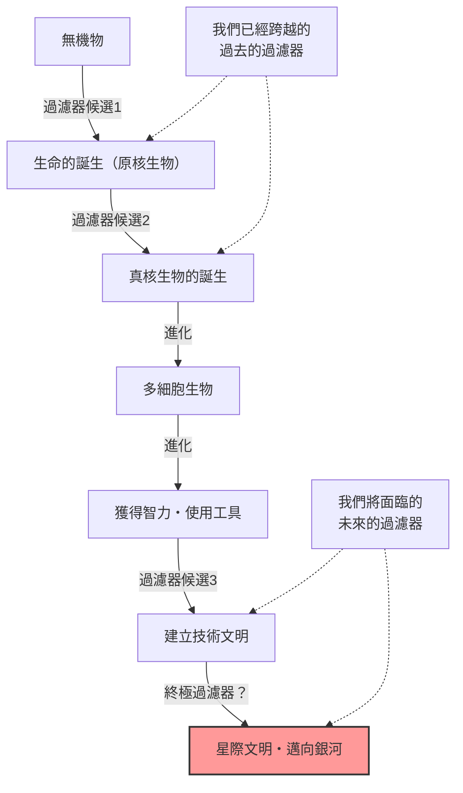
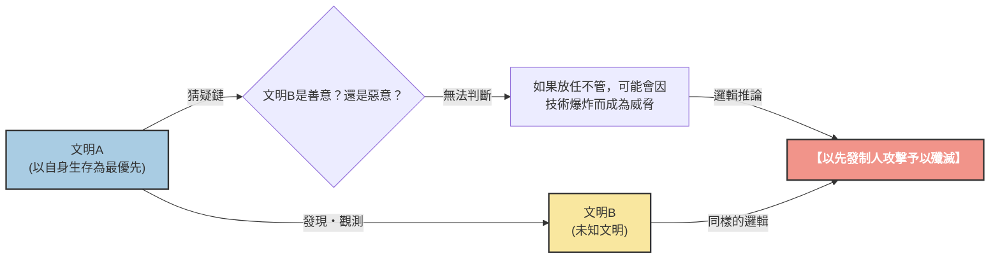

# 序章：「大家都去哪裡了？」

1950年夏天，在洛斯阿拉莫斯國家實驗室的餐廳裡，諾貝爾物理學獎得主恩里科·費米（Enrico Fermi）正與他的物理學家同事們（愛德華·泰勒、赫伯特·約克、埃米爾·科諾平斯基）共進午餐。他們的話題圍繞著當時媒體熱炒的UFO目擊事件，以及比光速更快的宇宙飛船的可能性。

對話轉移到另一個話題，過了一會兒，費米突然毫無徵兆地問道：

**「大家都去哪裡了？（Where is everybody?）」**

同事們立刻明白他是在談論外星人。費米的大腦以驚人的計算能力聞名。他在午餐這短短的時間內，就概算了宇宙的年齡、銀河系的恆星數量、生命誕生的機率，以及文明發展出星際航行技術所需的時間。

他的計算得出的結論很明確：**「外星文明早該在很久以前就造訪過地球了」**。然而，現實中卻沒有任何明確的證據。這種「計算上的高機率」與「現實中缺乏證據」之間的矛盾，正是後來被稱為**「費米悖論」**的現代天文學與天體生物學中最大的謎團之一。

本文將針對這個費米悖論，從其背景到現代科學提出的各種解答（假說），進行徹底的深究。讓我們踏上一場理解宇宙尺度、重新審視人類定位的知性之旅吧。

---

# 第1章：宇宙的尺度與德雷克方程式

費米悖論的根本在於「宇宙過於廣闊，且歷史過於悠久」這個事實。首先，讓我們用數字來掌握我們所居住的這個宇宙的尺度。

## 壓倒性的數量與時間

據估計，在我們可觀測的宇宙中，大約存在著2兆個星系。而且，每個星系平均包含1000億到4000億顆恆星。也就是說，整個宇宙大約有 $10^{24}$ 顆恆星，這個數字遠遠超過地球上所有沙粒的總和。

近年來，透過克卜勒太空望遠鏡等觀測，我們發現這些恆星中有很多都帶有行星，而且其中有相當比例是位於「適居帶（可以存在液態水的區域）」的類地行星。保守估計，光是在我們的銀河系中，就存在數十億到數百億個「第二地球」的候選者。

進一步思考時間的尺度。宇宙的年齡約為138億年，地球的年齡約為46億年。人類建立文明不過短短幾千年，開始使用電波通訊也才經過一百多年。如果在比地球早誕生10億年的行星上孕育出生命，並建立起文明的話，會發生什麼事呢？10億年這個時間，是一個足以讓人類進化史重複幾千次的壓倒性時間。他們的技術應該已經達到了我們無法想像的水平（例如，建造戴森球，或是殖民整個銀河系）。

## 德雷克方程式

在討論外星智慧生命存在的機率時，必定會出現「德雷克方程式」。這個方程式是由天文學家法蘭克·德雷克於1961年提出，用來估算我們銀河系中存在且能與人類通訊的外星文明數量（$N$）。

方程式由以下要素的乘積表示：

$$ N = R_* \times f_p \times n_e \times f_l \times f_i \times f_c \times L $$

*   $R_*$ : 銀河系中恆星形成的速率
*   $f_p$ : 這些恆星中擁有行星系的比例
*   $n_e$ : 在這些行星系中，具有適合生命生存環境的行星數量
*   $f_l$ : 在這些行星上實際誕生生命的比例
*   $f_i$ : 這些生命進化成智慧生命的比例
*   $f_c$ : 這些智慧生命擁有星際通訊技術的比例
*   $L$ : 這種技術文明能夠存續的時間

這個方程式最大的特徵，不在於「給出答案」，而在於「明確了應該討論的要素」。關於方程式左側（$R_*$, $f_p$, $n_e$），隨著天文學的進步，已經可以得出相當高精確度的數值。然而，對於右側（$f_l$, $f_i$, $f_c$, $L$），目前依然停留在推測的階段。

樂觀的天文學家（例如卡爾·薩根）主張，銀河系內存在著數百萬個文明。另一方面，如果採取悲觀的看法，也可能得出 $N=1$（也就是只有人類）的結果。但是，如果 $N$ 相當大，那麼我們又會回到費米的那個問題：「大家都去哪裡了？」

---

# 第2章：解釋沉默的諸多假說

對於費米悖論的解答，大致可以分為三個類別：

1.  **他們根本不存在**（外星生命，或是智慧生命極其稀有）
2.  **他們存在，但我們無法感知到**（通訊方式的不同、距離的阻礙、刻意保持沉默等）
3.  **他們已經來過地球了，只是我們沒有察覺**（或者被隱瞞了）

讓我們針對每個類別，深入探討一些代表性的假說。

## 類別1：他們根本不存在

### 稀有地球（Rare Earth）假說

這個假說主張，像微生物這樣簡單的生命在宇宙中可能很普遍，但要進化出像人類這樣複雜的智慧生命，必須具備極其罕見的天文學與地質學條件的疊加。

*   **木星的存在：** 由於像木星這樣巨大的氣體行星處於適當的位置，它成為了阻擋小行星和彗星撞擊地球的盾牌，防止了可能導致生命滅絕的大碰撞。
*   **巨大月球的存在：** 與地球相比，有一顆不成比例地巨大的月球存在，穩定了地球自轉軸的傾角（約23.4度），從而維持了溫和的氣候變化與四季。
*   **板塊構造與地磁場：** 活躍的板塊運動促進了碳循環，使溫室效應保持在適當的水平。此外，強大的磁場保護了地球大氣層和生命免受太陽風與宇宙射線的侵害。
*   **恆星的性質：** 像太陽這樣的G型主序星，壽命適度長久（約100億年），能量輻射也穩定。而宇宙中最常見的紅矮星（M型星），可能因為耀斑活動過於劇烈，或是行星被潮汐鎖定（總是同一面朝向恆星），而成為對生命進化極為嚴酷的環境。

要讓這些「奇蹟般的條件」全部湊齊的機率在天文學上微乎其微，因此這種觀點認為人類是孤獨的。

### 大過濾器理論（The Great Filter）

1996年由羅賓·漢森提出的「大過濾器」，是對費米悖論最令人恐懼、也最具說服力的解答之一。

這種觀點認為，在生命誕生並發展成星際文明的過程中，存在著極難跨越的「巨大障礙（過濾器）」。

關鍵在於：**「這個過濾器是在我們的過去，還是在我們的未來？」**

*   **過濾器在過去（我們是幸運的倖存者）：**
    生命的誕生（無生源論）本身可能就是一個奇蹟般的事件。或者，從簡單的原核生物，進化到像線粒體這樣具有複雜結構的真核生物的過程，在宇宙歷史中可能也是極其罕見的（地球上這個階段花了大約20億年）。如果是這樣的話，人類將是宇宙中最先進的物種之一。
*   **過濾器在未來（我們正走向毀滅）：**
    這是一個非常黯淡的前景。這個假說認為，即使生命的誕生和智慧文明的建立相對普遍，但在達到下一個階段的「星際文明」之前，文明必定會自我毀滅。也許因為核戰爭、人工智慧的失控、氣候變遷，或者我們還未察覺到的未知物理威脅，文明發展到一定水平就會注定自我毀滅。

有科學家主張，如果在火星等地發現了單細胞生物的化石，那對人類來說將會是最壞的消息。因為這意味著「生命的誕生不是過濾器」，過濾器在我們「未來」等待著的可能性將會大增。

---

## 類別2：他們存在，但我們無法感知到

這類假說認為，宇宙中存在著許多文明，但因為各種理由我們無法找到他們，或是他們刻意避免接觸。

### 宇宙過於廣闊且時間過於短暫

宇宙空間的廣闊程度遠超我們的直覺。即便是距離最近的恆星——比鄰星（Proxima Centauri），以光速也需要約4.2年才能抵達。以目前地球探測器（如航海家號）的速度，這是一段需要數萬年才能跨越的距離。

此外，還存在著「時間」的壁壘。人類開始電波通訊大約只有100年。也就是說，從地球發出的電波目前只到達了半徑100光年的範圍內。而銀河系的直徑大約有10萬光年，因此，我們宣示存在的區域，在整個銀河系中不過是極小的一點。
假設一個文明的存續時間只有幾千年到幾萬年左右，那麼在宇宙138億年的歷史中，兩個文明「同時」存在，且能夠接收到彼此訊號的時機剛好重疊的機率，可能非常低。

### 技術上的不匹配

我們在「SETI（搜尋地外智慧計畫）」中，主要是利用電波來尋找外星人。然而，這只不過是因為我們最近才發現了電波。

對於高度發達的文明來說，使用電波通訊可能被視為像「烽火」或「傳聲筒」一樣原始且低效的方式。他們可能正在使用微中子通訊、重力波，或是利用量子纏結的超光速通訊（雖在物理學上被否定，但作為假設）等，利用我們甚至還無法檢測到的未知物理法則進行通訊。當我們在黑暗中拼命尋找烽火時，他們可能就像在使用光纖通訊一樣。

### 動物園假說（Zoo Hypothesis）

這個由約翰·鮑爾在1973年提出的假說認為：「高度發達的外星文明知道地球的存在，但為了觀察人類自然進化，而刻意避免干涉。」

這種觀點認為，地球被當作是一種「隔離的動物園」或「保護區」，就像我們觀察自然保護區裡的野生動物一樣。這與《星艦迷航記》中出現的「最高指導原則（Prime Directive：不得干涉進化落後的文明）」是相同的概念。或許只有當人類達到足夠的倫理與技術成熟度（例如，建立起不會自我毀滅的世界政府，或是發展出星際航行技術等）時，他們才會與我們接觸。

### 黑暗森林假說（Dark Forest Theory）

這是因中國科幻作家劉慈欣的世界暢銷書《三體》系列而聞名，最令人恐懼且冷酷的假說。這個假說將宇宙比喻為「所有獵人都屏住呼吸隱藏其中的黑暗森林」。

這個假說以以下兩點作為宇宙社會學的公理前提：
1.  對於所有文明來說，生存是第一需要。
2.  宇宙的物質總量保持不變，文明會不斷擴張與發展。

此外，再加上由於星際間難以想像的距離，導致無法正確理解彼此意圖的「猜疑鏈」，以及技術可能會發生突變式飛躍的「技術爆炸」概念。

假設某個文明A發現了另一個文明B。對於文明A來說，沒有辦法知道文明B是友善還是敵對的。即使目前文明B的技術水平很低，也不知道他們何時會發生「技術爆炸」而超越文明A，成為威脅。
因此，為了確保自身的生存，最合理且安全的選擇就是：**「一發現其他文明，就立即在對方察覺之前將其摧毀」**。

如果遵循這個理論，宇宙沉默的理由就很明確了。像地球這樣輕率地發射電波、暴露自己位置的愚蠢文明，很快就會被抹殺；或者所有明智的文明，都在黑暗中屏息隱藏著，兩者必居其一。

### 模擬假說

這個假說認為，我們所生活的這個宇宙本身，不過是更高階的存在（超高等文明或AI）所創造的電腦模擬。牛津大學的哲學家尼克·博斯特羅姆等人正認真地討論這個問題。

如果我們是模擬程式裡的居民，除非程式設計師把「其他外星人」寫進這個模擬中，否則我們永遠遇不到外星人。如果這個世界只是一個專為人類模擬的沙盒，那麼宇宙的沉默就是必然的結果。

---

# 第3章：未來的展望與人類的課題

對於費米悖論，現在世界各地的科學家們仍透過各種不同的方法在挑戰它。

## 技術印記（Technosignatures）的探索

傳統的SETI尋找的是刻意發出的通訊訊號（電波），而近年來，尋找「技術印記（技術的痕跡）」的活動變得更加活躍。
例如，如果存在著高度文明為了完全利用恆星能量而建造的「戴森球」，那麼我們應該能觀測到來自該恆星的特殊紅外線輻射。詹姆斯·韋伯太空望遠鏡（JWST）等最新的觀測設備，具備分析遙遠系外行星大氣成分的能力，能找出自然界中不可能產生的工業氣體（如氟利昂）或人造光的痕跡。

我們不再等待「他們來跟我們說話」，而是主動試圖找出「他們在那裡生活的痕跡」。

## 悖論擺在我們面前的課題

費米悖論不僅僅是一個科幻式的思想實驗。它也是對我們人類自身存續與未來的強烈叩問。

如果「大過濾器」存在於未來，那麼我們現在正面臨著氣候變遷、核武威脅、AI控制等，由我們自己創造的存亡危機（Existential Risk）。如果無法克服這些危機，人類也將不過是消失在宇宙沉默中的無數「失敗文明」之一罷了。

相反地，如果稀有地球假說是正確的，人類是在這浩瀚宇宙中奇蹟般誕生的唯一智慧，那麼我們肩負著無可估量的責任。作為給宇宙帶來自我認知的存在，我們或許背負著讓意識的火炬不滅，將其傳遞向未來，並終有一日擴展到星辰大海的使命。

恩里科·費米那句不經意的「大家都去哪裡了？」，即使經過了70多年，至今仍然作為人類歷史上最重要的提問之一閃耀著光芒，促使我們深刻思考我們是誰、該走向何方。

宇宙的沉默，是對我們的警告，還是等待著我們邁出第一步的廣闊新天地呢？能夠給出這個答案的，將取決於人類未來的選擇。
