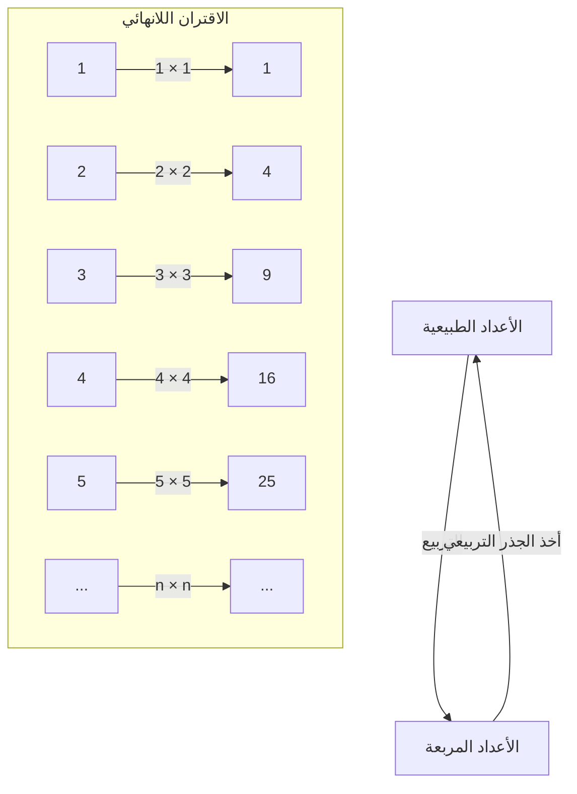
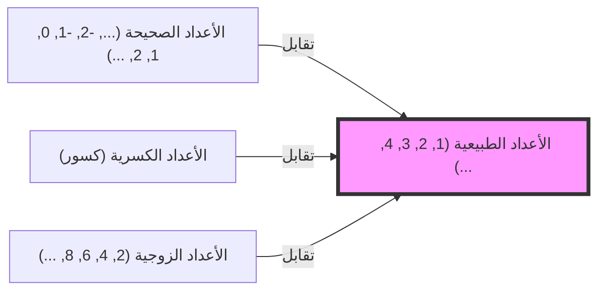

## مقدمة: الهاوية المسماة اللانهاية

عندما تسمع كلمة "اللانهاية"، ما هي الصورة التي تتبادر إلى ذهنك؟ كون لا نهاية له، زمن لا ينتهي أبدًا، أو ربما نجوم لا حصر لها... لقد افتتن البشر بمفهوم "اللانهاية" منذ العصور القديمة، وشعروا بالخوف منه في نفس الوقت.

لقد تم تنمية حدسنا اليومي في عالم محدود. "يوجد 3 تفاحات"، "قراءة كتاب من 100 صفحة"، تُعامل الأعداد دائمًا كشيء له نهاية. ومع ذلك، عندما تخطو إلى عالم الرياضيات، يجب أن تواجه المفهوم الهائل "للانهاية" وجهاً لوجه.

هذه المرة، دعونا نتعمق في مفارقة غريبة طرحها أب العلم، غاليليو غاليلي (1564-1642)، في كتابه "حوارات حول علمين جديدين" في أواخر حياته. يطلق عليها "مفارقة غاليليو"، وأصبحت مفتاحًا مهمًا يفتح باب اللانهاية، مما أدى إلى "نظرية المجموعات" لعلماء الرياضيات اللاحقين، وخاصة جورج كانتور.

في هذا المقال، سنشرح بالتفصيل قدر الإمكان عبر آلاف الكلمات عن عجائب مفهوم "اللانهاية"، والانحراف عن الحدس الرياضي، وحكمة البشرية التي تغلبت على ذلك. يرجى الانضمام إلينا في هذه الرحلة من المغامرة الفكرية.

---

## ما هي مفارقة غاليليو؟

عند الحديث عن غاليليو غاليلي، فهو عالم عظيم معروف باقتراحه لنظرية مركزية الشمس، والملاحظات الفلكية باستخدام التلسكوب، وقانون سقوط الأجسام، لكنه ترك أيضًا رؤى عميقة في الرياضيات والفلسفة.

"مفارقة اللانهاية" التي لاحظها تبدأ بسؤال بسيط للغاية.

**هل "كل الأعداد الطبيعية (1, 2, 3, 4, ...)" أم "كل مربعاتها (1, 4, 9, 16, ...)" أكثر؟**

إذا اتبعنا حدسنا، فإن الإجابة واضحة. "الأعداد الطبيعية أكثر بكثير". السبب في ذلك هو أن الأعداد الطبيعية تحتوي على عدد لا يحصى من الأعداد التي ليست مربعات (2, 3, 5, 6, 7, 8...). تبدو الأعداد المربعة وكأنها "جزء صغير" فقط من المجموعة الضخمة المسماة الأعداد الطبيعية.

تتضمن بديهيات عالم الرياضيات اليوناني الشهير إقليدس أيضًا عبارة **"الكل أكبر من الجزء"**. هذه البديهية هي حقيقة لا تتزعزع في عالم محدود. إذا أخذت 3 تفاحات من أصل 10، فسيتبقى 7. من الواضح أن الـ 10 الأصلية (الكل) أكبر من الـ 3 المأخوذة (الجزء).

ومع ذلك، أدرك غاليليو حقيقة معينة هنا.

### علاقة التناظر الفردي (التقابل)

أظهر غاليليو أنه لكل عدد طبيعي، هناك دائمًا "مربعه" الفريد، وعلى العكس من ذلك، لكل عدد مربع، هناك دائمًا "جذره التربيعي (العدد الطبيعي الأصلي)" الفريد.

كما يوضح هذا الشكل، إذا قمت بربط العدد الطبيعي $n$ بالعدد المربع $n^2$، يمكنك تكوين أزواج مثالية دون ترك أي منها.
إذا كان من الممكن إقران عناصر مجموعتين (فئتين) بشكل مثالي دون ترك أي عنصر، فلا يسعنا إلا أن نقول إن "عدد (كمية)" عناصر هاتين المجموعتين **متساوٍ**.

على سبيل المثال، عندما تريد حساب عدد الرجال والنساء في حفلة رقص، إذا كان الجميع في أزواج من الذكور والإناث ولم يتبق أحد، فأنت تعلم أن "عدد الرجال والنساء هو نفسه" دون الحاجة إلى عدهم واحدًا تلو الآخر.

بتطبيق هذا على اكتشاف غاليليو، يؤدي ذلك إلى استنتاج مفاده أن **"عدد الأعداد الطبيعية" و"عدد الأعداد المربعة" متساويان تمامًا**.

- الحدس: "الأعداد الطبيعية أكثر من الأعداد المربعة" (الكل أكبر من الجزء)
- المنطق: "عدد الأعداد الطبيعية والأعداد المربعة متساوٍ" (يمكن إقامة تقابل)

هذه الحالة، حيث يتعارض الفطرة السليمة والمنطق وجهًا لوجه، هي بالضبط "مفارقة غاليليو".

---

## ماذا تعني المفارقة

ما هو الاستنتاج الذي توصل إليه غاليليو نفسه لهذه المفارقة؟
في كتابه، جعل إحدى الشخصيات، سالفياتي، يقول ما يلي.

> "يجب أن نستنتج أن الكلمات 'كثير' و'قليل' و'متساوٍ' يجب تطبيقها فقط على الكميات المحدودة، وليس على الكميات اللانهائية."

بمعنى آخر، اعتقد غاليليو أنه "في عالم اللانهاية، تنهار فكرة مقارنة الأحجام والأرقام نفسها". تجنب التعمق أكثر بقوله أن "اللانهاية ليس لها حجم".

في الإطار الرياضي في ذلك الوقت، كان هذا هو الحكم الأكثر معقولية وحكمة. يمكن القول إن الحدس القائل بأنه من الخطر إدخال قواعد العالم المحدود (الكل أكبر من الجزء) إلى عالم اللانهاية كان صحيحًا بطريقة ما.

ومع ذلك، لم يتوقف تاريخ الرياضيات هنا. بعد حوالي 250 عامًا، في النصف الثاني من القرن التاسع عشر، واجه عالم رياضيات عبقري هذا الوحش المسمى "اللانهاية" وجهاً لوجه. كان ذلك جورج كانتور.

---

## جورج كانتور وولادة نظرية المجموعات

أدخل كانتور نهجًا جديدًا في عالم اللانهاية الذي استسلم له غاليليو لأنه "لا يمكن مقارنته". لقد ابتكر مفهوم "المجموعات (Sets)" وحاول إثبات أن اللانهاية لها أيضًا "حجم (أصلية: Cardinality)".

كان في صميم تفكير كانتور بالتحديد طريقة **"التقابل (دالة تقابلية: Bijection)"** التي وجدها غاليليو.
وسع كانتور مفهوم التقابل وعرّفه على النحو التالي.

**"عندما يمكن إقامة تقابل بين مجموعتين A و B، فإن عدد عناصر (أصلية) A و B متساوٍ"**

إذا قبلنا هذا التعريف، فلن تعد مفارقة غاليليو مفارقة بعد الآن.
المجموعة "كل الأعداد الطبيعية" والمجموعة "كل الأعداد المربعة" كلاهما لهما عناصر لا نهائية، لكن "حجمها اللانهائي (الأصلية)" **متساوٍ تمامًا**.

والأمر الأكثر إثارة للدهشة، أنه أثبت أن الأعداد الطبيعية و"كل الأعداد الزوجية" أو "كل الأعداد الفردية"، أو حتى "كل الأعداد الصحيحة" و"كل الأعداد الكسرية (الأعداد التي يمكن التعبير عنها بكسر)" يمكن أن تكون في تقابل، لذلك تم إثبات أنها جميعًا **"لانهاية بنفس حجم الأعداد الطبيعية"**.

أطلق كانتور على حجم اللانهاية للمجموعة التي تتوافق في تقابل مع الأعداد الطبيعية اسم **ألف-نول ($\aleph_0$)** باستخدام الحرف الأول من الأبجدية العبرية، "ألف ($\aleph$)". هذا هو أول "حجم لانهائي" يتم تعريفه رياضيًا.

### انهيار بديهية "الكل أكبر من الجزء"

هنا، أصبح من الواضح أن بديهية إقليدس "الكل أكبر من الجزء"، والتي كانت من البديهيات في العالم المحدود، لا تنطبق في عالم اللانهاية.

في الرياضيات الحديثة (نظرية المجموعات)، تُعرّف المجموعة اللانهائية أحيانًا على النحو التالي.
**"المجموعة التي يمكن وضعها في تقابل مع مجموعة جزئية فعلية خاصة بها (جزء أصغر حقًا من الكل) تسمى مجموعة لا نهائية"**

بمعنى آخر، إن "الخاصية التي تجعل الجزء والكل متساويين"، والتي شعر غاليليو أنها مفارقة، تم رفعها إلى التعريف الأساسي نفسه الذي يجعل اللانهاية لانهائية.

---

## اللانهاية لها تسلسل هرمي: حجة كانتور القطرية

مع العلم أن الأعداد الطبيعية والأعداد الزوجية والأعداد الصحيحة والأعداد الكسرية... كلها من نفس الحجم اللانهائي (ألف-نول)، فقد نعتقد ما يلي.
"في النهاية، أليس كل اللانهاية بنفس الحجم؟"

ومع ذلك، اكتشف كانتور حقيقة مروعة أخرى. لقد أثبت أن مجموعة **"الأعداد الحقيقية (كل الأعداد على خط الأعداد)"** هي **أكبر حقًا** من مجموعة الأعداد الطبيعية.

ما تم استخدامه لإثبات ذلك هو **"حجة كانتور القطرية"** الشهيرة.
ببساطة، إنه برهان بالخلف ينص على أنه "على افتراض أنه يمكنك إدراج جميع الأعداد الحقيقية (هنا، الكسور العشرية بين 0 و 1) في تقابل مع الأعداد الطبيعية، يمكنك دائمًا إنشاء عدد حقيقي جديد سيتم حذفه بالتأكيد من تلك القائمة".

أكد هذا الاكتشاف أن اللانهاية لها "أحجام مختلفة".
إن لانهاية الأعداد الحقيقية (متصل: لانهاية غير قابلة للعد) أكبر بكثير من لانهاية الأعداد الطبيعية أو الكسرية (لانهاية قابلة للعد: لانهاية يمكن عدها).

تحطم حدس غاليليو بأن "اللانهاية لا يمكن مقارنتها" بواسطة كانتور، وأصبح من الواضح أن هناك "برجًا لانهائيًا (تسلسل هرمي لألف)" لا نهاية له داخل اللانهاية.

---

## ما نتعلمه من مفارقة غاليليو

مفارقة غاليليو ليست مجرد تلاعب بالكلمات أو سفسطة. إنها تعلمنا كيف يرتبط "حدسنا" البشري بالتجربة اليومية المحدودة (العالم المحدود).

1. **معرفة حدود الحدس**
   لقد تطورت أدمغتنا لمعالجة الأشياء المحدودة. لذلك، عندما نخطو إلى عالم "اللانهاية"، نشعر بشعور قوي بعدم الارتياح (مفارقة) حتى لو كان ذلك منطقيًا. غالبًا ما يبدأ التقدم في العلوم والرياضيات بقبول هذه "الخيانة للحدس".

2. **الشجاعة للإيمان بالمنطق**
   أدرك غاليليو حقيقة التقابل، لكنه توقف عند هذا الحد بسبب قيود العصر. ومع ذلك، اعتقد كانتور أنه "إذا كان المنطق يخبرنا بذلك، فيجب أن نقبله حتى لو كان ضد الحدس"، وقام ببناء نظرية جديدة (نظرية المجموعات) كانت تسمى بالجنون. نتيجة لذلك، تم الانتهاء من الأساس المتين الذي يشكل جوهر الرياضيات الحديثة وعلوم الكمبيوتر.

3. **إعادة تعريف المفاهيم**
   عند مواجهة مفارقة، بدلاً من تجنبها، فإن مراجعة تعريف الكلمات والمفاهيم نفسها يصبح انفراجة. من خلال استبدال التعريف الأساسي لـ "ماذا يعني وجود عدد كبير من العناصر" بـ "التقابل"، توقفت المفارقة عن كونها مفارقة وانفتح عالم رياضي جديد.

## خاتمة

"العلاقة الغامضة بين الأعداد الطبيعية والأعداد المربعة" التي كتبها غاليليو غاليلي في القرن السابع عشر، ازدهرت لتصبح الرياضيات الحديثة التي تتعامل مع اللانهاية عبر مئات السنين.

لا يزال مفهوم اللانهاية يحمل العديد من الألغاز. لقد توصل السؤال، "هل هناك لانهاية ذات حجم مختلف بين لانهاية الأعداد الطبيعية ولانهاية الأعداد الحقيقية؟" (فرضية الاستمرارية)، إلى استنتاج مذهل مفاده أنه "لا يمكن إثباته ولا دحضه" في النظام البديهي للرياضيات اليوم.

كيف تبدو حافة الكون؟ هل سيستمر الوقت إلى الأبد؟ وماذا يكمن وراء التسلسل الهرمي اللانهائي الذي يمتد في عالم الرياضيات؟ إن مفارقة غاليليو هي حلقة ترمز إلى روعة الذكاء البشري، حيث يمكننا ككائنات محدودة أن نلمس "اللانهاية" من خلال التفكير.

في المرة القادمة التي تنظر فيها إلى سماء الليل، لماذا لا تفكر في كل من الكون اللامتناهي الذي نظر إليه غاليليو من خلال تلسكوبه و"لانهاية الأرقام" التي تخيلها في ذهنه.
