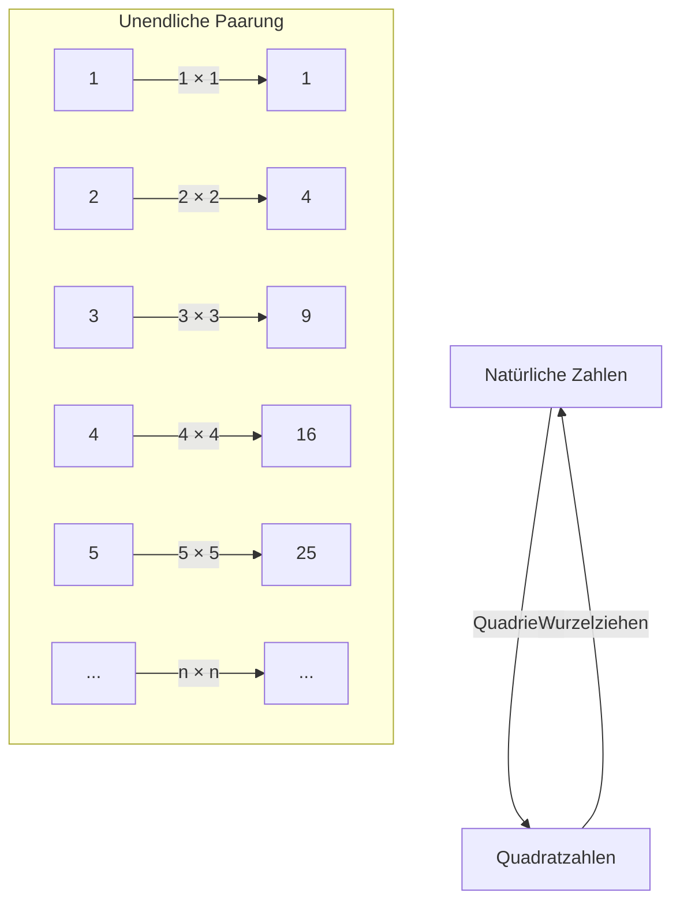
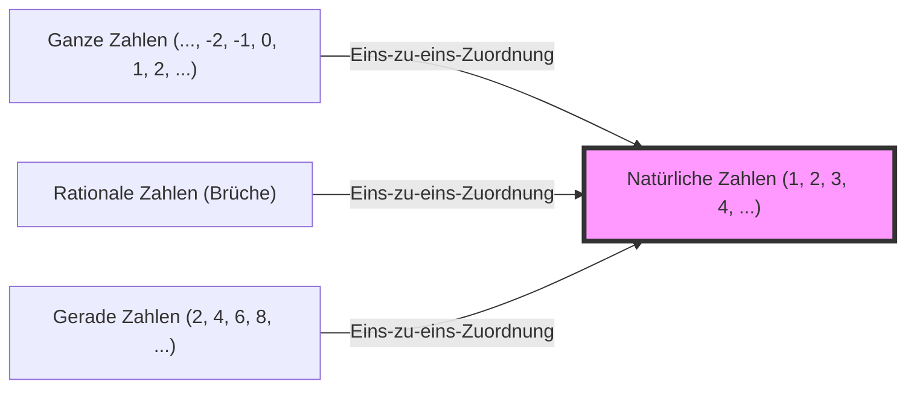

## Einführung: Der Abgrund namens Unendlichkeit

Welches Bild kommt Ihnen in den Sinn, wenn Sie das Wort „Unendlichkeit“ hören? Das endlos weite Universum, die niemals endende Zeit oder vielleicht unzählige Sterne ... Die Menschheit war seit jeher vom Konzept der „Unendlichkeit“ fasziniert und fürchtete sich gleichzeitig davor.

Unsere alltägliche Intuition wird in einer endlichen Welt geprägt. Zahlen werden stets als etwas betrachtet, das ein Ende hat, wie zum Beispiel „es gibt drei Äpfel“ oder „ein Buch mit 100 Seiten lesen“. Betritt man jedoch die Welt der Mathematik, muss man sich mit dem enormen Konzept der „Unendlichkeit“ auseinandersetzen.

Dieses Mal werden wir uns eingehend mit einem seltsamen Paradoxon befassen, das von Galileo Galilei (1564-1642), der als Vater der Wissenschaft gilt, in seinen späten Jahren in seinem Buch „Discorsi e dimostrazioni matematiche, intorno a due nuove scienze“ (Unterredungen und mathematische Demonstrationen über zwei neue Wissenszweige) aufgeworfen wurde. Es wird das „Galilei-Paradoxon“ genannt und war ein wichtiger Schlüssel zum Öffnen der Tür zur Unendlichkeit, was zu späteren Mathematikern und insbesondere zur „Mengenlehre“ von [Georg Cantor](/de/p/cantor/) führte.

In diesem Artikel werden wir auf mehreren tausend Zeichen die Wunder des Begriffs der „Unendlichkeit“, die Diskrepanz zur mathematischen Intuition und die Weisheit der Menschheit, die diese überwunden hat, so detailliert wie möglich erklären. Begleiten Sie uns auf diesem intellektuellen Abenteuer.

---

## Was ist das Galilei-Paradoxon?

Apropos Galileo Galilei: Er ist ein großartiger Wissenschaftler, der für sein Eintreten für die heliozentrische Theorie, astronomische Beobachtungen mit einem Teleskop und das Gesetz des freien Falls bekannt ist, aber er hinterließ auch tiefe philosophische und mathematische Einsichten.

Das „Paradoxon der Unendlichkeit“, das ihm auffiel, beginnt mit einer sehr einfachen Frage.

**Gibt es mehr „natürliche Zahlen (1, 2, 3, 4, ...)“ oder „Quadratzahlen (1, 4, 9, 16, ...)“?**

Wenn wir unserer Intuition folgen, ist die Antwort offensichtlich. „Es sollte überwältigend mehr natürliche Zahlen geben.“ Denn es gibt viele Zahlen (2, 3, 5, 6, 7, 8 ...), die keine Quadratzahlen unter den natürlichen Zahlen sind. Quadratzahlen scheinen nur ein „winziger Teil“ der riesigen Ansammlung natürlicher Zahlen zu sein.

In den Axiomen des berühmten griechischen Mathematikers [Euklid](/de/p/euclid/) steht auch der Satz: **„Das Ganze ist größer als der Teil“**. Dieses Axiom ist eine absolut unerschütterliche Wahrheit in einer endlichen Welt. Nimmt man 3 Äpfel von 10 weg, bleiben 7 übrig. Die ursprünglichen 10 (das Ganze) sind offensichtlich größer als die weggenommenen 3 (der Teil).

Allerdings erkannte Galilei hier eine bestimmte Tatsache.

### Eins-zu-eins-Zuordnung (Bijektion)

Galilei zeigte, dass es für jede natürliche Zahl immer nur eine „Quadratzahl“ gibt und umgekehrt für jede Quadratzahl immer nur eine „Quadratwurzel (die ursprüngliche natürliche Zahl)“.

Wie diese Abbildung zeigt, lassen sich natürliche Zahlen $n$ und Quadratzahlen $n^2$ perfekt paarweise zusammenfügen, ohne dass eine Zahl übrig bleibt.
Wenn die Elemente zweier Gruppen (Mengen) perfekt miteinander gepaart werden können, ohne dass eines übrig bleibt, müssen wir sagen, dass die „Anzahl“ der Elemente in den beiden Gruppen **gleich** ist.

Wenn man beispielsweise die Anzahl der Männer und Frauen auf einer Tanzparty zählen möchte, ohne jede Person einzeln zählen zu müssen, weiß man, dass „die Anzahl der Männer und Frauen gleich ist“, wenn alle zu gemischten Paaren zusammengefunden haben und niemand übrig ist.

Wendet man dies auf Galileis Entdeckung an, so führt dies zu der Schlussfolgerung, dass **„die Anzahl der natürlichen Zahlen“ und „die Anzahl der Quadratzahlen“ vollkommen gleich sind**.

- Intuition: „Es gibt mehr natürliche Zahlen als Quadratzahlen“ (Das Ganze ist größer als der Teil)
- Logik: „Die Anzahl der natürlichen Zahlen und Quadratzahlen ist gleich“ (Eins-zu-eins-Zuordnung ist möglich)

Dieser Zustand, in dem der gesunde Menschenverstand und die Logik direkt kollidieren, ist genau das „Galilei-Paradoxon“.

---

## Was das Paradoxon bedeutet

Welche Schlussfolgerungen zog Galilei selbst aus diesem Paradoxon?
In seinem Buch lässt er eine der Figuren, Salviati, Folgendes sagen:

> „Wir müssen daraus schließen, dass die Begriffe ‚mehr‘, ‚weniger‘ und ‚gleich‘ nur auf endliche Größen und nicht auf unendliche Größen angewendet werden sollten.“

Mit anderen Worten: Galilei dachte: „In der Welt des Unendlichen bricht die Idee des Vergleichs von Größen und Mengen zusammen.“ Er mied es, sich weiter in die Materie zu vertiefen und meinte: „Unendlichkeit hat keine Größe.“

Im mathematischen Rahmen jener Zeit war dies das vernünftigste und klügste Urteil. In gewisser Weise war die Intuition richtig, dass es gefährlich ist, die Regeln der endlichen Welt (das Ganze ist größer als der Teil) in die Welt der Unendlichkeit zu übertragen.

Die Geschichte der Mathematik endete hier jedoch nicht. Etwa 250 Jahre später, in der zweiten Hälfte des 19. Jahrhunderts, stellte sich ein geniales Mathematik-Genie dem Monster der „Unendlichkeit“ frontal entgegen. Das war [Georg Cantor](/de/p/cantor/).

---

## Georg Cantor und die Geburt der Mengenlehre

Cantor lieferte neue Erkenntnisse für die Welt des Unendlichen, die Galilei als „nicht vergleichbar“ aufgegeben hatte. Er schuf das Konzept der „Mengen“ (Sets) und versuchte zu beweisen, dass die Unendlichkeit auch eine „Größe“ (Kardinalität) hat.

Im Kern von Cantors Denken stand genau die von Galilei entdeckte Methode der **„Eins-zu-eins-Zuordnung (Bijektion)“**.
Cantor erweiterte das Konzept der Eins-zu-eins-Zuordnung und definierte es wie folgt:

**„Wenn eine Eins-zu-eins-Zuordnung zwischen zwei Mengen A und B hergestellt werden kann, ist die Anzahl der Elemente (Kardinalität) von A und B gleich.“**

Akzeptiert man diese Definition, ist Galileis Paradoxon kein Paradoxon mehr.
Sowohl die Menge „alle natürlichen Zahlen“ als auch die Menge „alle Quadratzahlen“ haben unendlich viele Elemente, aber ihre „unendliche Größe (Kardinalität)“ ist **vollkommen gleich**.

Erstaunlicherweise wurde bewiesen, dass es eine Eins-zu-eins-Zuordnung zwischen natürlichen Zahlen und „allen geraden Zahlen“, „allen ungeraden Zahlen“, ja sogar „allen ganzen Zahlen“ und „allen rationalen Zahlen (als Brüche darstellbare Zahlen)“ gibt, was bedeutet, dass sie alle **„Unendlichkeiten derselben Größe wie die natürlichen Zahlen“** sind.

Cantor nannte die unendliche Größe einer Menge, die eins-zu-eins den natürlichen Zahlen entspricht, **Aleph-Null ($\aleph_0$)**, wobei er den ersten hebräischen Buchstaben „Aleph ($\aleph$)“ verwendete. Dies ist die erste mathematisch definierte „Größe der Unendlichkeit“.

### Der Zusammenbruch des Axioms „Das Ganze ist größer als der Teil“

Hier wurde klar, dass Euklids Axiom „Das Ganze ist größer als der Teil“, das in der endlichen Welt gesunder Menschenverstand war, in der Welt der Unendlichkeit nicht gilt.

In der modernen Mathematik (Mengenlehre) werden unendliche Mengen manchmal sogar wie folgt definiert:
**„Eine Menge, für die eine Eins-zu-eins-Zuordnung zu ihrer eigenen echten Teilmenge (einem Teil, der echt kleiner als das Ganze ist) hergestellt werden kann, wird als unendliche Menge bezeichnet.“**

Mit anderen Worten: Gerade die Eigenschaft, bei der „der Teil und das Ganze gleich werden“, die Galilei als Paradoxon empfand, wurde in die wesentliche Definition dessen überführt, was die Unendlichkeit ausmacht.

---

## Die Unendlichkeit hat Hierarchien: Cantors Diagonalargument

Da wir nun wissen, dass natürliche Zahlen, gerade Zahlen, ganze Zahlen, rationale Zahlen ... alle gleich große Unendlichkeiten sind (Aleph-Null), könnten wir uns Folgendes denken:
„Ist letztendlich nicht jede Unendlichkeit gleich groß?“

Cantor entdeckte jedoch eine weitere schockierende Tatsache. Er bewies, dass die Menge der **„reellen Zahlen (alle Zahlen auf der Zahlengeraden)“** **echt größer** ist als die Menge der natürlichen Zahlen.

Um dies zu beweisen, verwendete er das berühmte **„Cantorsche Diagonalargument“**.
Einfach ausgedrückt ist es ein Beweis durch Widerspruch, der besagt: „Wenn wir davon ausgehen, dass alle reellen Zahlen (hier als Dezimalzahlen zwischen 0 und 1 betrachtet) in einer Eins-zu-eins-Entsprechung mit natürlichen Zahlen aufgelistet werden könnten, könnten wir stets eine neue reelle Zahl erzeugen, die garantiert in dieser Liste fehlt.“

Diese Entdeckung bestätigte, dass es „Größen“ der Unendlichkeit gibt.
Die Unendlichkeit der reellen Zahlen (Kontinuum: überabzählbare Unendlichkeit) ist weitaus größer als die Unendlichkeit der natürlichen und rationalen Zahlen (abzählbare Unendlichkeit).

Galileis Intuition, dass „Unendlichkeiten nicht verglichen werden können“, wurde von Cantor gebrochen, und es wurde klar, dass in der Unendlichkeit ein endloser „Turm der Unendlichkeit (Aleph-Hierarchie)“ existiert.

---

## Was wir aus Galileis Paradoxon lernen können

Galileis Paradoxon ist kein bloßes Wortspiel oder Haarspalterei. Es zeigt uns, wie sehr die menschliche „Intuition“ an unsere begrenzte alltägliche Erfahrung (die endliche Welt) gebunden ist.

1. **Die Grenzen der Intuition kennen**
   Unser Gehirn hat sich so entwickelt, dass es endliche Objekte verarbeitet. Wenn wir daher in den Bereich der „Unendlichkeit“ vordringen, empfinden wir selbst bei logisch korrekten Dingen ein starkes Unbehagen (Paradoxon). Wissenschaftliche und mathematische Fortschritte beginnen oft damit, diesen „Verrat der Intuition“ zu akzeptieren.

2. **Der Mut, der Logik zu vertrauen**
   Obwohl Galilei die Tatsache der Eins-zu-eins-Zuordnung erkannte, blieb er aufgrund der Beschränkungen seiner Zeit dort stehen. Cantor glaubte jedoch: „Wenn die Logik es uns sagt, sollten wir es akzeptieren, auch wenn es der Intuition widerspricht“, und baute eine neue Theorie auf (Mengenlehre), die sogar als Wahnsinn bezeichnet wurde. Das Ergebnis ist das solide Fundament, das der modernen Mathematik und Informatik zugrunde liegt.

3. **Neudefinition von Konzepten**
   Wenn wir mit einem Paradoxon konfrontiert werden, besteht der Durchbruch nicht darin, es zu vermeiden, sondern die Definition der Wörter und Konzepte selbst zu überdenken. Indem man die grundlegende Definition von „Was bedeutet es, viele Elemente zu haben“ durch „Eins-zu-eins-Zuordnung“ ersetzte, hörte das Paradoxon auf, ein Paradoxon zu sein, und eine neue mathematische Welt öffnete sich.

## Fazit

Die im 17. Jahrhundert von Galileo Galilei niedergeschriebene „mysteriöse Beziehung zwischen natürlichen Zahlen und Quadratzahlen“ hat hunderte von Jahren überdauert und ist in der modernen Mathematik erblüht, die sich mit der Unendlichkeit befasst.

Das Konzept der Unendlichkeit birgt immer noch viele Geheimnisse. Die Frage: „Gibt es eine andere Unendlichkeit zwischen der Unendlichkeit der natürlichen Zahlen und der Unendlichkeit der reellen Zahlen?“ ([Kontinuumshypothese](/de/p/continuum-hypothesis/)) hat die erstaunliche Schlussfolgerung erreicht, dass sie im Axiomensystem der aktuellen Mathematik „weder bewiesen noch widerlegt werden kann“.

Wie sieht es am Ende des Universums aus? Wird die Zeit ewig weitergehen? Und was liegt hinter der endlosen Hierarchie der Unendlichkeit, die sich in der Welt der Mathematik ausbreitet? Das Galilei-Paradoxon ist eine Episode, die die Brillanz des menschlichen Intellekts symbolisiert, der in der Lage ist, durch bloße Gedanken die „Unendlichkeit“ zu berühren, obwohl wir endliche Wesen sind.

Wenn Sie das nächste Mal in den Nachthimmel schauen, warum denken Sie nicht sowohl an das unendliche Universum, das Galilei durch sein Teleskop betrachtete, als auch an die „unendliche Anzahl von Zahlen“, die er sich in seinem Kopf ausmalte?
