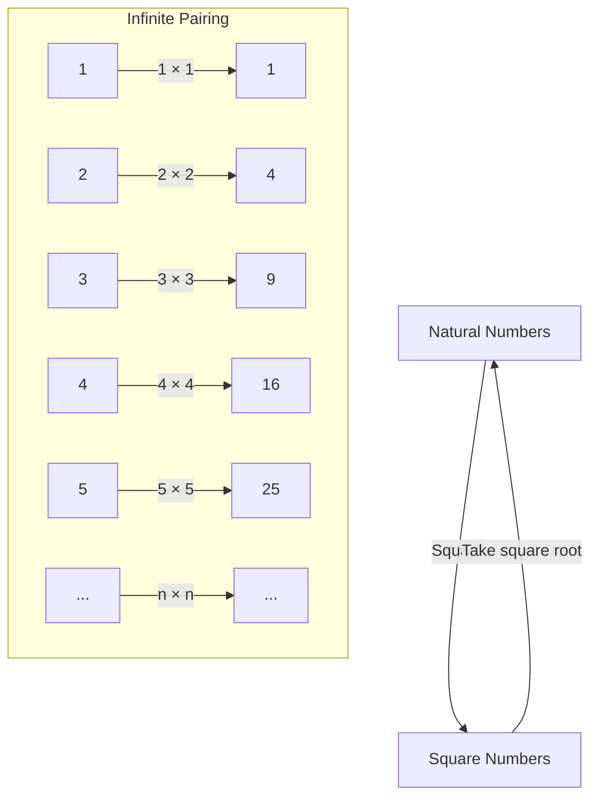
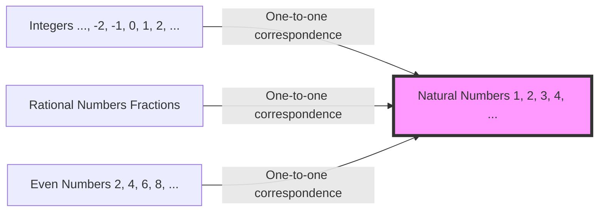

## Introduction: The Abyss Named Infinity

What kind of image comes to mind when you hear the word "infinity"? The endless universe, time that never ends, or perhaps countless stars... Humanity has long been fascinated by the concept of "infinity" while simultaneously fearing it.

Our everyday intuition is cultivated in a finite world. As in "there are 3 apples" or "reading a 100-page book," numbers are always treated as having an end. However, once you step into the world of mathematics, you must face this extraordinary concept of "infinity" head-on.

This time, let's delve into a strange paradox raised by Galileo Galilei (1564-1642), known as the father of science, in his later book "Two New Sciences." It is called "Galileo's Paradox," and it became an important key that opened the door to infinity, leading to the "set theory" of later mathematicians, especially Georg Cantor.

In this article, spanning thousands of characters, we will explain in as much detail as possible the mystery of the concept of "infinity," its deviation from mathematical intuition, and the human wisdom that overcame it. Please join us on this intellectual adventure.

---

## What is Galileo's Paradox?

When speaking of Galileo Galilei, he is a great scientist known for advocating the heliocentric theory, making astronomical observations with a telescope, and the law of falling bodies, but he also left profound insights in mathematics and philosophy.

The "paradox of infinity" that he noticed begins with a very simple question.

**Which is greater in number, "all natural numbers (1, 2, 3, 4, ...)" or "all of their squares (1, 4, 9, 16, ...)"?**

Following our intuition, the answer is obvious. There should be "overwhelmingly more natural numbers." This is because natural numbers contain countless numbers that are not squares (2, 3, 5, 6, 7, 8...). Square numbers seem to be just a "tiny fraction" of the massive collection of natural numbers.

A famous axiom by the Greek mathematician Euclid also states, **"The whole is greater than the part."** This axiom is an absolute truth in the finite world. If you take 3 apples out of 10, there are 7 left. The original 10 (the whole) is clearly greater than the 3 taken out (the part).

However, Galileo noticed a certain fact here.

### 1-to-1 Correspondence (Bijection)

Galileo showed that for every natural number, there is exactly one corresponding "square," and conversely, for every square number, there is exactly one corresponding "square root (the original natural number)."

As this figure shows, if we associate each natural number $n$ with its square $n^2$, we can form perfect pairs without either side having any leftovers.

If the elements of two groups (sets) can be paired perfectly without any leftovers, we have no choice but to say that the "number (quantity)" of elements in those two groups is **equal**.

For example, when you want to count the number of men and women at a dance party, even without counting them one by one, if everyone forms a male-female pair and no one is left over, you know that "the number of men and women is the same."

Applying this to Galileo's discovery leads to the conclusion that **"the number of natural numbers" and "the number of square numbers" are completely equal**.

- Intuition: "There are more natural numbers than square numbers" (The whole is greater than the part)
- Logic: "The number of natural numbers and square numbers is the same" (One-to-one correspondence is possible)

This state, where common sense and logic collide head-on, is exactly what is called "Galileo's Paradox."

---

## What the Paradox Means

What conclusion did Galileo himself draw regarding this paradox?
In his book, he has one of the characters, Salviati, say the following:

> "We must conclude that the words 'greater,' 'less,' and 'equal' should only be applied to finite quantities, and not to infinite quantities."

In other words, Galileo thought, "In the world of the infinite, the very idea of comparing sizes or quantities breaks down." He avoided delving further, assuming that "infinity has no size."

In the mathematical framework of the time, this was the most reasonable and wise judgment. The intuition that it is dangerous to bring the rules of the finite world (the whole is greater than the part) into the infinite world was, in a sense, correct.

However, the history of mathematics did not stop there. About 250 years later, in the late 19th century, a genius mathematician confronted this monster called "infinity" head-on. That man was Georg Cantor.

---

## Georg Cantor and the Birth of Set Theory

Cantor brought a new perspective to the world of the infinite that Galileo had given up on as "incomparable." He created the concept of "Sets" and sought to prove that infinity also has a "size (Cardinality)."

At the core of Cantor's thinking was exactly the method of **"one-to-one correspondence (Bijection)"** that Galileo had discovered.
Cantor expanded the concept of one-to-one correspondence and defined it as follows:

**"When a one-to-one correspondence can be established between two sets A and B, the number of elements (cardinality) of A and B is equal."**

If we accept this definition, Galileo's Paradox is no longer a paradox.
The set of "all natural numbers" and the set of "all square numbers" both have infinite elements, but their "infinite size (cardinality)" is **completely equal**.

Even more surprisingly, because it is possible to establish a one-to-one correspondence between natural numbers and "all even numbers," "all odd numbers," and even "all integers" or "all rational numbers (numbers that can be expressed as fractions)," it was proven that they are all **"infinities of the same size as natural numbers."**

Cantor named the infinite size of a set that has a one-to-one correspondence with natural numbers **Aleph-null ($\aleph_0$)**, using the first letter of the Hebrew alphabet, "Aleph ($\aleph$)." This is the first mathematically defined "size of infinity."

### The Collapse of the Axiom "The Whole is Greater Than the Part"

Here, it became clear that Euclid's axiom, "the whole is greater than the part," which was common sense in the finite world, does not hold true in the infinite world.

In modern mathematics (set theory), an infinite set is sometimes even defined as follows:
**"A set that can be placed into a one-to-one correspondence with a proper subset of itself (a part truly smaller than the whole) is called an infinite set."**

In other words, the very "property where the part becomes equal to the whole" that Galileo felt was a paradox, was elevated to the essential definition that makes infinity infinite.

---

## Infinity Has Hierarchies: Cantor's Diagonal Argument

Learning that natural numbers, even numbers, integers, and rational numbers... are all infinities of the same size (Aleph-null), we might think the following:
"In the end, aren't all infinities the same size?"

However, Cantor discovered an even more shocking fact. He proved that the set of **"real numbers (all numbers on the number line)"** is **strictly greater** than the set of natural numbers.

The famous **"Cantor's diagonal argument"** was used to prove this.
Simply put, it is a proof by contradiction: "Assuming that all real numbers (let's say decimals between 0 and 1 here) could be listed in a one-to-one correspondence with natural numbers, we could always create a new real number that is omitted from that list."

With this discovery, it was confirmed that there are "sizes" to infinity.
The infinity of real numbers (the continuum: uncountable infinity) is a far more massive infinity than the infinity of natural numbers or rational numbers (countable infinity: infinity that can be counted).

Galileo's intuition that "infinities cannot be compared" was shattered by Cantor, and it became clear that an endless "tower of infinities (hierarchy of Alephs)" exists within infinity.

---

## What We Learn from Galileo's Paradox

Galileo's Paradox is not just wordplay or sophistry. It teaches us how much human "intuition" is bound by limited daily experiences (the finite world).

1. **Knowing the Limits of Intuition**
   Our brains evolved to process finite objects. Therefore, when we step into the realm of "infinity," we feel an intense sense of incongruity (a paradox), even if it is logically correct. The progress of science and mathematics often begins with accepting such "betrayals of intuition."

2. **The Courage to Believe in Logic**
   Although Galileo realized the fact of one-to-one correspondence, he stopped there due to the limitations of his time. However, Cantor thought, "If logic dictates so, I should accept it even if it goes against intuition," and built a new theory (set theory) that was even called madness. As a result, a solid foundation was completed that forms the basis of modern mathematics and computer science.

3. **Redefining Concepts**
   When faced with a paradox, rather than avoiding it, rethinking the very definitions of words and concepts becomes a breakthrough. By replacing the fundamental definition of "what it means to have more elements" with "one-to-one correspondence," the paradox ceased to be a paradox, and a new mathematical world opened up.

## Conclusion

The "mysterious relationship between natural numbers and square numbers" written by Galileo Galilei in the 17th century blossomed into modern mathematics dealing with infinity over hundreds of years.

The concept of infinity still holds many mysteries today. The question "Does an infinity of another size exist between the infinity of natural numbers and the infinity of real numbers?" (Continuum Hypothesis) has reached the astonishing conclusion that it "can neither be proven nor disproven" in the current axiom system of mathematics.

What is at the edge of the universe? Will time continue forever? And what lies beyond the infinite hierarchy expanding in the world of mathematics? Galileo's Paradox is an episode that symbolizes the brilliance of human intellect, showing that even though we are finite beings, we can touch the "infinite" through thought.

The next time you look up at the night sky, why not reflect on both the infinite universe Galileo peered into with his telescope and the "infinity of numbers" he envisioned in his mind?
