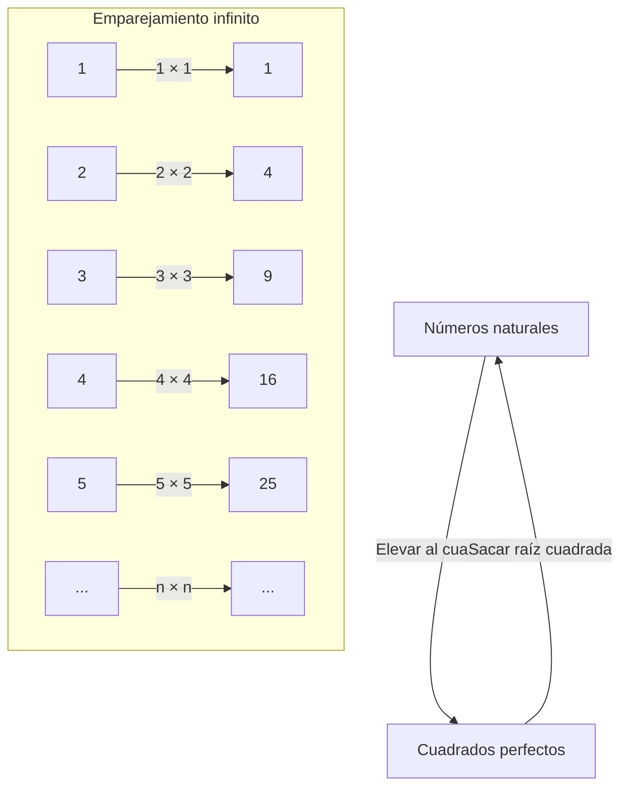
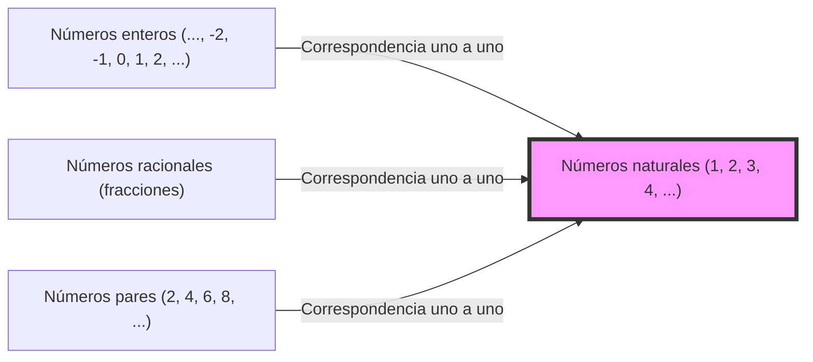

## Introducción: El abismo llamado infinito

Cuando escuchas la palabra "infinito", ¿qué imagen te viene a la mente? Un universo interminable, un tiempo que nunca termina, o tal vez incontables estrellas... La humanidad ha estado fascinada por el concepto de "infinito" desde la antigüedad y, al mismo tiempo, le ha tenido miedo.

Nuestra intuición diaria se cultiva en un mundo finito. Como "hay 3 manzanas" o "leer un libro de 100 páginas", los números siempre se tratan como si tuvieran un final. Sin embargo, al entrar en el mundo de las matemáticas, debemos enfrentarnos de frente al tremendo concepto de "infinito".

Esta vez, profundizaremos en una extraña paradoja planteada por Galileo Galilei (1564-1642), conocido como el padre de la ciencia, en su obra tardía "Discursos y demostraciones matemáticas en torno a dos nuevas ciencias". Se le llama la "Paradoja de Galileo" y se convirtió en una clave importante para abrir la puerta al infinito, conectando con matemáticos posteriores, especialmente con la "teoría de conjuntos" de Georg Cantor.

En este artículo, a lo largo de miles de palabras, explicaremos con el mayor detalle posible las maravillas del concepto de "infinito", la discrepancia con la intuición matemática y la sabiduría humana que la superó. Por favor, acompáñame en este viaje de aventura intelectual.

---

## ¿Qué es la paradoja de Galileo?

Cuando pensamos en Galileo Galilei, pensamos en un gran científico conocido por proponer la teoría heliocéntrica, observar las estrellas con un telescopio y la ley de la caída de los cuerpos, pero también dejó profundas reflexiones en matemáticas y filosofía.

La "paradoja del infinito" de la que se dio cuenta comienza con una pregunta muy simple.

**Entre el "conjunto de todos los números naturales (1, 2, 3, 4, ...)" y el "conjunto de todos sus cuadrados perfectos (1, 4, 9, 16, ...)", ¿cuál tiene más elementos?**

Siguiendo nuestra intuición, la respuesta es clara. Los "números naturales" deberían ser "abrumadoramente más numerosos". Esto se debe a que entre los números naturales hay muchísimos números que no son cuadrados perfectos (2, 3, 5, 6, 7, 8...). Los cuadrados perfectos parecen ser solo "una pequeña parte" de la enorme colección llamada números naturales.

En los axiomas del famoso matemático griego Euclides también se encuentra la frase **"el todo es mayor que la parte"**. Este axioma es una verdad absoluta e inquebrantable en un mundo finito. Si sacas 3 manzanas de un grupo de 10, te quedan 7. Los 10 originales (el todo) son obviamente mayores que los 3 que sacaste (la parte).

Sin embargo, Galileo se da cuenta de un hecho en este punto.

### Relación de correspondencia 1 a 1 (Biyección)

Galileo demostró que, para todo número natural, siempre existe exactamente "su cuadrado" correspondiente, y a la inversa, para todo cuadrado perfecto, siempre existe exactamente "su raíz cuadrada (el número natural original)".

Como muestra esta figura, si emparejamos cada número natural $n$ con su cuadrado $n^2$, podemos crear pares perfectos sin que sobre ninguno en ningún lado.
Si los elementos de dos grupos (conjuntos) se pueden emparejar perfectamente sin dejar ninguno fuera, no tenemos más remedio que decir que el "número (cantidad)" de elementos de los dos grupos es **igual**.

Por ejemplo, al querer contar el número de hombres y mujeres en una fiesta de baile, no es necesario contar uno por uno; si todos forman parejas de hombre y mujer y nadie sobra, sabemos que "el número de hombres y mujeres es el mismo".

Al aplicar esto al descubrimiento de Galileo, se llega a la conclusión de que **"la cantidad de números naturales" y "la cantidad de cuadrados perfectos" son completamente iguales**.

- Intuición: "Hay más números naturales que cuadrados perfectos" (el todo es mayor que la parte)
- Lógica: "La cantidad de números naturales y de cuadrados perfectos es la misma" (es posible la correspondencia uno a uno)

Este estado donde el sentido común y la lógica chocan de frente es exactamente la "Paradoja de Galileo".

---

## El significado de la paradoja

¿Qué conclusión sacó el propio Galileo sobre esta paradoja?
En su libro, hace que uno de los personajes, Salviati, diga lo siguiente:

> "Debemos concluir que las palabras 'mayor', 'menor' e 'igual' solo deben aplicarse a cantidades finitas, y no a cantidades infinitas".

En otras palabras, Galileo pensó que "en el mundo del infinito, la idea misma de comparar tamaños y cantidades se desmorona". Concluyó que "el infinito no tiene tamaños" y evitó profundizar más en el tema.

En el marco matemático de la época, esta fue la decisión más razonable y sensata. Se puede decir que su intuición de que es peligroso llevar las reglas del mundo finito (el todo es mayor que la parte) al mundo infinito fue correcta en cierto sentido.

Sin embargo, la historia de las matemáticas no se detuvo ahí. Aproximadamente 250 años después, a finales del siglo XIX, un matemático genio se enfrentó a este monstruo llamado "infinito" de frente. Fue Georg Cantor.

---

## Georg Cantor y el nacimiento de la teoría de conjuntos

Cantor introdujo un nuevo bisturí en el mundo infinito que Galileo había abandonado por ser "incomparable". Creó el concepto de "conjuntos (Sets)" e intentó demostrar que el infinito también tiene "tamaño (cardinalidad: Cardinality)".

En la raíz del pensamiento de Cantor estaba exactamente el método de **"correspondencia uno a uno (biyección: Bijection)"** que Galileo había encontrado.
Cantor amplió el concepto de correspondencia uno a uno y lo definió de la siguiente manera:

**"Cuando se puede establecer una correspondencia uno a uno entre dos conjuntos A y B, el número de elementos (cardinalidad) de A y B es igual"**

Si aceptamos esta definición, la paradoja de Galileo ya no es una paradoja.
Tanto el conjunto de "todos los números naturales" como el conjunto de "todos los cuadrados perfectos" tienen infinitos elementos, pero su "tamaño infinito (cardinalidad)" es **completamente igual**.

Aún más sorprendente, se demostró que debido a que los números naturales pueden tener una correspondencia uno a uno con "todos los números pares", "todos los números impares", e incluso "todos los números enteros" y "todos los números racionales (números que se pueden expresar como fracciones)", todos ellos son **"infinitos del mismo tamaño que los números naturales"**.

Cantor nombró el tamaño infinito de los conjuntos que tienen una correspondencia uno a uno con los números naturales usando la primera letra del alfabeto hebreo, "Aleph ($\aleph$)", llamándolo **Aleph-cero ($\aleph_0$)**. Este es el primer "tamaño del infinito" definido matemáticamente.

### El colapso del axioma "El todo es mayor que la parte"

Aquí quedó claro que el axioma de Euclides de "el todo es mayor que la parte", que era de sentido común en el mundo finito, no se sostiene en el mundo infinito.

En las matemáticas modernas (teoría de conjuntos), un conjunto infinito a veces se define de la siguiente manera:
**"Un conjunto se llama infinito si puede establecer una correspondencia uno a uno con un subconjunto propio suyo (una parte estrictamente menor que el todo)"**

Es decir, la propiedad de "que la parte y el todo sean iguales", que Galileo percibió como una paradoja, se elevó a la definición esencial misma que hace que el infinito sea infinito.

---

## El infinito tiene jerarquías: El argumento de la diagonal de Cantor

Al saber que los números naturales, los pares, los enteros, los racionales... son todos infinitos del mismo tamaño (Aleph-cero), podríamos pensar lo siguiente:
"¿Acaso no son todos los infinitos del mismo tamaño al fin y al cabo?"

Sin embargo, Cantor hizo un descubrimiento aún más impactante. Demostró que el conjunto de los **"números reales (todos los números en la recta numérica)"** es **estrictamente mayor** que el conjunto de los números naturales.

Para probar esto, se utilizó el famoso **"argumento de la diagonal de Cantor"**.
En pocas palabras, es una reducción al absurdo que establece: "Si suponemos que podemos listar todos los números reales (digamos, los decimales entre 0 y 1) emparejándolos uno a uno con los números naturales, siempre podemos crear un nuevo número real que inevitablemente se omitirá de esa lista".

Este descubrimiento confirmó que hay "tamaños" en el infinito.
El infinito de los números reales (el continuo: un infinito no numerable) es un infinito mucho más grande que el infinito de los números naturales y racionales (infinito numerable: un infinito que se puede contar).

La intuición de Galileo de que "el infinito no se puede comparar" fue derribada por Cantor, revelando que hay una interminable "torre de infinitos (jerarquía de Aleph)" dentro del infinito.

---

## Qué aprender de la paradoja de Galileo

La paradoja de Galileo no es un mero juego de palabras o sofistería. Nos enseña cómo la "intuición" humana está atada a nuestra limitada experiencia diaria (el mundo finito).

1. **Conocer los límites de la intuición**
   Nuestros cerebros han evolucionado para procesar objetos finitos. Por lo tanto, cuando nos adentramos en el reino del "infinito", sentimos una intensa incomodidad (paradoja), incluso si es lógicamente correcto. El avance de la ciencia y las matemáticas a menudo comienza por aceptar esta "traición de la intuición".

2. **El valor para confiar en la lógica**
   Aunque Galileo notó el hecho de la correspondencia uno a uno, se detuvo allí debido a las limitaciones de su tiempo. Sin embargo, Cantor pensó: "Si la lógica lo dice, debo aceptarlo aunque vaya en contra de la intuición", y construyó una nueva teoría (la teoría de conjuntos) que incluso se llamó locura. Como resultado, se completó una base sólida que constituye el núcleo de las matemáticas y la informática modernas.

3. **Redefinición de conceptos**
   Cuando nos enfrentamos a una paradoja, en lugar de evitarla, el avance consiste en revisar la definición misma de palabras y conceptos. Al reemplazar la definición fundamental de "¿qué significa tener muchos elementos?" con la "correspondencia uno a uno", la paradoja dejó de ser una paradoja y abrió un nuevo mundo matemático.

## Conclusión

La "misteriosa relación entre los números naturales y los cuadrados perfectos" escrita por Galileo Galilei en el siglo XVII floreció a través de los siglos hacia las matemáticas modernas que manejan el infinito.

El concepto de infinito todavía encierra muchos misterios en la actualidad. La pregunta "¿Existe otro tamaño de infinito entre el infinito de los números naturales y el infinito de los números reales?" (la hipótesis del continuo) ha llegado a la sorprendente conclusión de que "no se puede demostrar ni refutar" bajo el sistema axiomático matemático actual.

¿Cómo es el fin del universo? ¿El tiempo continuará por siempre? ¿Y qué hay más allá de la jerarquía infinita que se extiende en el mundo de las matemáticas? La paradoja de Galileo es un episodio que simboliza la maravilla de la inteligencia humana, que puede alcanzar el "infinito" a través del pensamiento a pesar de ser seres finitos.

La próxima vez que mires al cielo nocturno, ¿qué te parece pensar tanto en el universo infinito que Galileo miró con su telescopio, como en el "infinito de los números" que imaginó en su mente?
