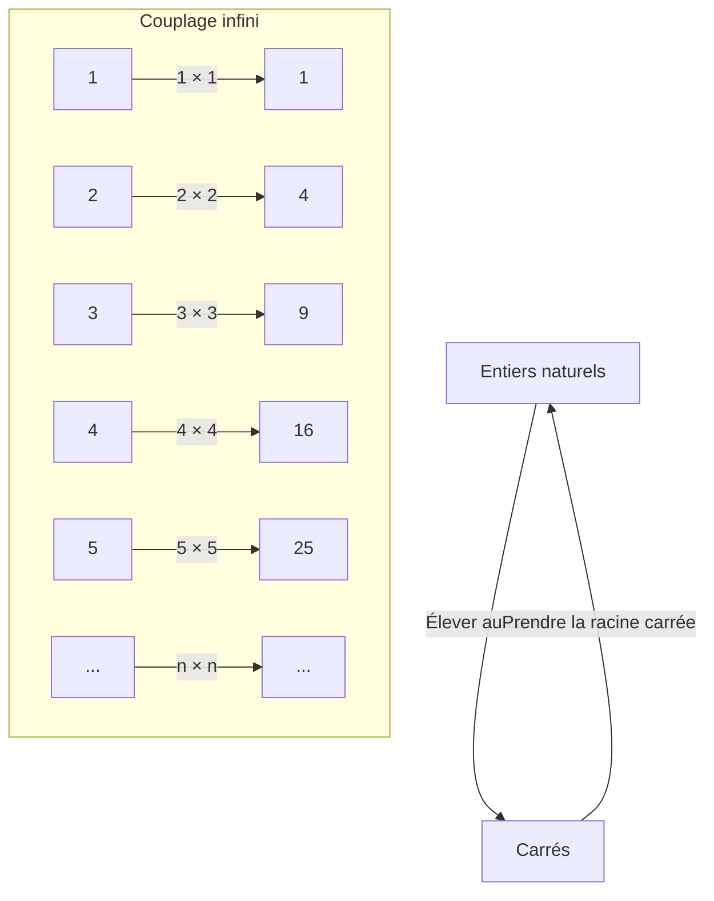
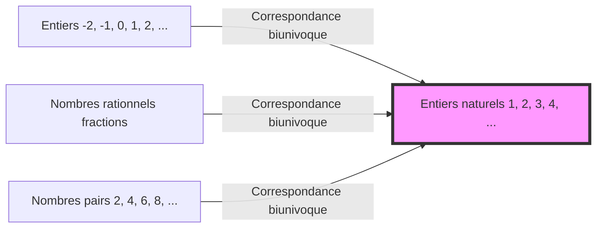

## Introduction : l'abîme nommé l'infini

Quand vous entendez le mot « infini », quelle image vous vient à l'esprit ? Un univers sans fin, un temps qui ne s'arrête jamais, ou peut-être d'innombrables étoiles... Depuis l'Antiquité, l'humanité est fascinée et en même temps effrayée par le concept de l'« infini ».

Notre intuition quotidienne est cultivée dans un monde fini. Comme « il y a 3 pommes » ou « lire un livre de 100 pages », les nombres sont toujours traités comme ayant une fin. Cependant, lorsque l'on pénètre dans le monde des mathématiques, on doit affronter de front le concept extraordinaire de l'« infini ».

Cette fois, plongeons-nous dans un étrange paradoxe soulevé par Galileo Galilei (1564-1642), connu comme le père de la science, dans son livre *Discours concernant deux sciences nouvelles* au cours de ses dernières années. Il est appelé le « paradoxe de Galilée » et est devenu une clé importante pour ouvrir la porte de l'infini, menant à la « théorie des ensembles » par les mathématiciens ultérieurs, en particulier Georg Cantor.

Dans cet article, sur plusieurs milliers de mots, nous expliquerons le plus en détail possible la merveille du concept de l'« infini », l'écart avec l'intuition mathématique et la sagesse humaine qui l'a surmonté. Rejoignez-nous pour cette aventure intellectuelle.

---

## Qu'est-ce que le paradoxe de Galilée ?

Galileo Galilei est un grand scientifique connu pour avoir proposé la théorie héliocentrique, les observations astronomiques à l'aide d'un télescope et la loi de la chute des corps, mais il a également laissé de profondes réflexions en mathématiques et en philosophie.

Le « paradoxe de l'infini » qu'il a remarqué commence par une question très simple.

**« Tous les entiers naturels (1, 2, 3, 4, ...) » ou « tous leurs carrés (1, 4, 9, 16, ...) » : lesquels sont les plus nombreux ?**

Si nous suivons notre intuition, la réponse est évidente. « Les entiers naturels doivent être beaucoup plus nombreux ». Parce que parmi les entiers naturels, il y a beaucoup de nombres qui ne sont pas des carrés (2, 3, 5, 6, 7, 8...). Les carrés semblent n'être qu'une « infime partie » du vaste ensemble des entiers naturels.

Le célèbre mathématicien grec Euclide a également un axiome qui dit : **« Le tout est plus grand que la partie »**. Cet axiome est une vérité absolue et inébranlable dans un monde fini. Si vous prenez 3 pommes parmi 10, il en reste 7. Les 10 originales (le tout) sont clairement plus grandes que les 3 que vous avez prises (la partie).

Cependant, Galilée a remarqué un fait ici.

### Correspondance 1 à 1 (Bijection)

Galilée a montré que pour chaque entier naturel, il y a exactement un « carré de ce nombre », et inversement, pour chaque carré, il y a exactement une « racine carrée (l'entier naturel d'origine) ».

Comme le montre cette figure, si vous associez un entier naturel $n$ à son carré $n^2$, vous pouvez former des paires parfaites sans qu'il en reste d'un côté ou de l'autre.
Si les éléments de deux groupes (ensembles) peuvent être parfaitement appariés sans en laisser un seul de reste, nous sommes obligés de dire que le « nombre (quantité) » des éléments dans ces deux groupes est **égal**.

Par exemple, lorsque vous voulez compter le nombre d'hommes et de femmes lors d'une soirée dansante, même sans les compter un par un, si tout le monde est en couple homme-femme et que personne n'est laissé pour compte, vous savez que « le nombre d'hommes et de femmes est le même ».

En appliquant cela à la découverte de Galilée, on arrive à la conclusion que **« le nombre d'entiers naturels » et « le nombre de carrés » sont complètement égaux**.

- Intuition : « Les entiers naturels sont plus nombreux que les carrés » (Le tout est plus grand que la partie)
- Logique : « Le nombre d'entiers naturels et de carrés est le même » (Une correspondance biunivoque est possible)

Cet état où le bon sens et la logique entrent directement en collision est précisément le « paradoxe de Galilée ».

---

## Ce que signifie le paradoxe

Quelle conclusion Galilée lui-même a-t-il tirée de ce paradoxe ?
Dans son livre, il fait parler un des personnages, Salviati, de la manière suivante :

> « Nous devons conclure que les mots "plus nombreux", "moins nombreux" et "égaux" ne doivent s'appliquer qu'à des quantités finies, et non à des quantités infinies. »

En d'autres termes, Galilée pensait que « dans le monde de l'infini, l'idée même de comparer les tailles ou les quantités s'effondre ». Il a évité d'aller plus loin en disant que « l'infini n'a pas de taille ».

Dans le cadre mathématique de l'époque, c'était le jugement le plus raisonnable et le plus sage. D'une certaine manière, l'intuition selon laquelle il est dangereux d'introduire les règles du monde fini (le tout est plus grand que la partie) dans le monde de l'infini était correcte.

Cependant, l'histoire des mathématiques ne s'est pas arrêtée là. Environ 250 ans plus tard, dans la seconde moitié du 19e siècle, un mathématicien de génie a affronté ce monstre qu'est l'« infini » de front. Il s'agissait de Georg Cantor.

---

## Georg Cantor et la naissance de la théorie des ensembles

Cantor a introduit un nouveau scalpel dans le monde de l'infini, que Galilée avait abandonné comme étant « incomparable ». Il a créé le concept d'« Ensembles » et a tenté de prouver que l'infini a aussi une « taille (Cardinalité) ».

Au cœur de la pensée de Cantor se trouvait précisément la méthode de **« correspondance biunivoque (Bijection) »** que Galilée avait trouvée.
Cantor a étendu le concept de correspondance biunivoque et l'a défini comme suit :

**« Lorsque l'on peut établir une correspondance biunivoque entre deux ensembles A et B, le nombre d'éléments (la cardinalité) de A et B est égal »**

Si l'on accepte cette définition, le paradoxe de Galilée n'est plus un paradoxe.
L'ensemble de « tous les entiers naturels » et l'ensemble de « tous les carrés » ont tous deux des éléments infinis, mais leur « taille de l'infini (cardinalité) » est **complètement égale**.

Plus surprenant encore, il a été prouvé qu'une correspondance biunivoque peut être établie entre les entiers naturels et « tous les nombres pairs », « tous les nombres impairs », et même « tous les entiers » et « tous les nombres rationnels (nombres pouvant être exprimés sous forme de fractions) », ce qui signifie qu'ils sont tous **« des infinis de la même taille que les entiers naturels »**.

Cantor a nommé la taille infinie d'un ensemble qui a une correspondance biunivoque avec les entiers naturels **Aleph-zéro ($\aleph_0$)**, en utilisant la première lettre de l'alphabet hébreu, « Aleph ($\aleph$) ». C'est la première « taille de l'infini » mathématiquement définie.

### L'effondrement de l'axiome « Le tout est plus grand que la partie »

Ici, il est devenu clair que l'axiome d'Euclide selon lequel « le tout est plus grand que la partie », qui était de sens commun dans le monde fini, ne tient pas dans le monde de l'infini.

En mathématiques modernes (théorie des ensembles), un ensemble infini est même parfois défini comme suit :
**« Un ensemble qui peut être mis en correspondance biunivoque avec l'un de ses propres sous-ensembles stricts (une partie strictement plus petite que le tout) est appelé un ensemble infini »**

En d'autres termes, la « propriété où la partie et le tout deviennent égaux », que Galilée ressentait comme un paradoxe, a été élevée à la définition même qui fait de l'infini l'infini.

---

## L'infini a une hiérarchie : l'argument de la diagonale de Cantor

En apprenant que les entiers naturels, les nombres pairs, les entiers, les nombres rationnels... sont tous des infinis de la même taille (Aleph-zéro), nous pourrions penser ce qui suit :
« En fin de compte, tous les infinis ne sont-ils pas de la même taille ? »

Cependant, Cantor a découvert un fait encore plus choquant. Il a prouvé que l'ensemble des **« nombres réels (tous les nombres sur la droite numérique) »** est **strictement plus grand** que l'ensemble des entiers naturels.

Ce qui a été utilisé pour le prouver est le célèbre **« argument de la diagonale de Cantor »**.
En termes simples, c'est une preuve par l'absurde qui dit : « Si l'on suppose que tous les nombres réels (ici, disons les nombres décimaux entre 0 et 1) peuvent être mis en correspondance biunivoque avec les entiers naturels et listés, on peut toujours créer un nouveau nombre réel qui a été omis de cette liste ».

Avec cette découverte, il a été déterminé que l'infini a des « tailles différentes ».
L'infini des nombres réels (le continu : un infini indénombrable) est un infini bien plus vaste que l'infini des entiers naturels ou des nombres rationnels (infini dénombrable : un infini qui peut être compté).

L'intuition de Galilée selon laquelle « les infinis ne peuvent pas être comparés » a été brisée par Cantor, et il est devenu clair qu'il existe une « tour d'infinis (hiérarchie des Alephs) » sans fin au sein de l'infini.

---

## Ce que nous apprend le paradoxe de Galilée

Le paradoxe de Galilée n'est pas un simple jeu de mots ou un sophisme. Il nous apprend à quel point l'« intuition » humaine est liée à notre expérience quotidienne limitée (le monde fini).

1. **Connaître les limites de l'intuition**
   Nos cerveaux ont évolué pour traiter des objets finis. Par conséquent, lorsque nous entrons dans le domaine de l'« infini », même si c'est logiquement correct, nous ressentons un malaise intense (un paradoxe). Les progrès de la science et des mathématiques commencent souvent par l'acceptation de ces « trahisons de l'intuition ».

2. **Le courage de croire en la logique**
   Galilée a remarqué le fait de la correspondance biunivoque, mais s'y est arrêté en raison des limites de son époque. Cependant, Cantor pensait que « si la logique le dit, on devrait l'accepter même si cela va à l'encontre de l'intuition », et a construit une nouvelle théorie (la théorie des ensembles) qui était même qualifiée de folie. En conséquence, les fondations solides de ce qui constitue la base des mathématiques et de l'informatique modernes ont été achevées.

3. **Redéfinition des concepts**
   Face à un paradoxe, la solution n'est pas de l'éviter, mais de revoir la définition même des mots et des concepts. En remplaçant la définition fondamentale de « ce que signifie avoir de nombreux éléments » par « correspondance biunivoque », le paradoxe a cessé d'en être un, et un nouveau monde mathématique s'est ouvert.

## Conclusion

L'« étrange relation entre les entiers naturels et les carrés » écrite par Galileo Galilei au 17e siècle s'est épanouie après des centaines d'années dans les mathématiques modernes qui traitent de l'infini.

Le concept de l'infini cache encore de nombreux mystères aujourd'hui. La question « Existe-t-il un infini d'une autre taille entre l'infini des entiers naturels et l'infini des nombres réels ? » (l'hypothèse du continu) a atteint la conclusion surprenante qu'elle « ne peut être ni prouvée ni réfutée » dans le système axiomatique actuel des mathématiques.

À quoi ressemble le bord de l'univers ? Le temps continuera-t-il éternellement ? Et qu'y a-t-il au-delà de la hiérarchie infinie qui s'étend dans le monde des mathématiques ? Le paradoxe de Galilée est un épisode qui symbolise la merveille de l'intellect humain, montrant que même si nous sommes des êtres finis, nous pouvons toucher à l'« infini » par la pensée.

La prochaine fois que vous regarderez le ciel nocturne, pourquoi ne pas penser à la fois à l'univers infini que Galilée a observé à travers son télescope, et à l'« infinité des nombres » qu'il a imaginée dans son esprit ?
