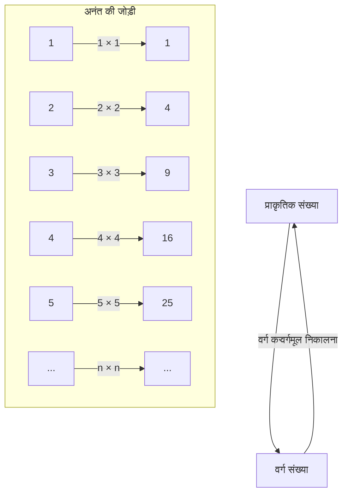
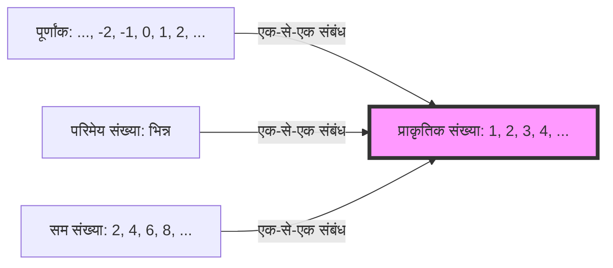

## परिचय: अनंत नामक रसातल

"अनंत" शब्द सुनकर आपके मन में क्या छवि उभरती है? एक अंतहीन ब्रह्मांड, कभी न खत्म होने वाला समय, या शायद अनगिनत तारे... मानवता लंबे समय से "अनंत" की अवधारणा से आकर्षित रही है और साथ ही इससे भयभीत भी रही है।

हमारी रोज़मर्रा की समझ एक सीमित दुनिया में विकसित हुई है। जैसे "3 सेब हैं" या "100 पन्नों की किताब पढ़ना", संख्याओं को हमेशा अंत वाली चीज़ों के रूप में देखा जाता है। हालाँकि, जब हम गणित की दुनिया में कदम रखते हैं, तो हमें "अनंत" जैसी विशाल अवधारणा का सीधे सामना करना पड़ता है।

इस बार, आइए एक अजीब विरोधाभास में गहराई से उतरें जिसे विज्ञान के पिता कहे जाने वाले गैलीलियो गैलिली (1564-1642) ने अपने बाद के वर्षों में अपनी पुस्तक "टू न्यू साइंसेज़" में उठाया था। इसे "गैलीलियो का विरोधाभास" कहा जाता है, और यह अनंत के द्वार खोलने वाली एक महत्वपूर्ण कुंजी बन गया, जिसने बाद के गणितज्ञों, विशेष रूप से जॉर्ज कैंटर के "समुच्चय सिद्धांत" को जन्म दिया।

इस लेख में, हम कई हज़ार शब्दों में "अनंत" की अवधारणा के आश्चर्यों, गणितीय अंतर्ज्ञान के साथ इसके विचलन, और मानवता की उस बुद्धिमत्ता के बारे में यथासंभव विस्तार से बताएंगे जिसने इसे पार किया। कृपया इस बौद्धिक रोमांच की यात्रा में शामिल हों।

---

## गैलीलियो का विरोधाभास क्या है?

गैलीलियो गैलिली एक महान वैज्ञानिक थे जो सूर्यकेन्द्रित सिद्धांत के प्रस्ताव, दूरबीन से खगोलीय पिंडों के निरीक्षण, और गिरते हुए पिंडों के नियम के लिए जाने जाते हैं, लेकिन उन्होंने गणित और दर्शन में भी गहरी अंतर्दृष्टि छोड़ी।

उन्होंने जिस "अनंत के विरोधाभास" पर ध्यान दिया, वह एक बहुत ही सरल प्रश्न से शुरू होता है।

**"सभी प्राकृतिक संख्याएँ 1, 2, 3, 4, ..." और "उनके सभी वर्ग 1, 4, 9, 16, ..." में से कौन अधिक है?**

यदि हम अपने अंतर्ज्ञान का पालन करें, तो उत्तर स्पष्ट है। "प्राकृतिक संख्याएँ बहुत अधिक होनी चाहिए।" ऐसा इसलिए है क्योंकि प्राकृतिक संख्याओं में अनगिनत ऐसी संख्याएँ शामिल हैं जो वर्ग नहीं हैं (2, 3, 5, 6, 7, 8...) । ऐसा लगता है कि वर्ग, प्राकृतिक संख्याओं के विशाल समूह का केवल "एक छोटा सा हिस्सा" हैं।

प्रसिद्ध यूनानी गणितज्ञ यूक्लिड के स्वयं-सिद्ध प्रमाण में भी यह कहा गया है कि **"संपूर्ण, भाग से बड़ा होता है"**। सीमित दुनिया में यह स्वयं-सिद्ध प्रमाण एक अटल सत्य है। यदि आप 10 सेबों में से 3 निकालते हैं, तो 7 बचते हैं। मूल 10 (संपूर्ण) स्पष्ट रूप से निकाले गए 3 (भाग) से बड़े हैं।

हालाँकि, गैलीलियो ने यहाँ एक तथ्य देखा।

### 1-से-1 संबंध (एक-से-एक पत्राचार)

गैलीलियो ने दिखाया कि प्रत्येक प्राकृतिक संख्या के लिए, हमेशा केवल एक "वर्ग" होता है, और इसके विपरीत, प्रत्येक वर्ग के लिए, हमेशा केवल एक "वर्गमूल - मूल प्राकृतिक संख्या" होता है।

जैसा कि यह चित्र दिखाता है, यदि हम किसी प्राकृतिक संख्या $n$ को एक वर्ग संख्या $n^2$ से जोड़ते हैं, तो कोई भी बिना जुड़े नहीं बचता, और हम एक आदर्श जोड़ी बना सकते हैं।
यदि 2 समूहों (समुच्चयों) के तत्वों को बिना किसी अवशेष के एक दूसरे के साथ पूरी तरह से जोड़ा जा सकता है, तो हमें यह कहना होगा कि उन दो समूहों के तत्वों की "संख्या - मात्रा" **समान** है।

उदाहरण के लिए, जब आप किसी डांस पार्टी में पुरुषों और महिलाओं की संख्या गिनना चाहते हैं, तो आपको उन्हें एक-एक करके गिनने की आवश्यकता नहीं है; यदि हर कोई एक पुरुष-महिला की जोड़ी में है और कोई भी नहीं बचा है, तो आप जानते हैं कि "पुरुषों और महिलाओं की संख्या समान है।"

इसे गैलीलियो की खोज पर लागू करने से यह निष्कर्ष निकलता है कि **"प्राकृतिक संख्याओं की मात्रा" और "वर्ग संख्याओं की मात्रा" पूरी तरह से समान हैं**।

- अंतर्ज्ञान: "प्राकृतिक संख्याएँ वर्ग संख्याओं से अधिक हैं" (संपूर्ण, भाग से बड़ा है)
- तर्क: "प्राकृतिक संख्याओं और वर्ग संख्याओं की संख्या समान है" (एक-से-एक संबंध संभव है)

यह स्थिति, जहाँ सामान्य ज्ञान और तर्क सीधे टकराते हैं, "गैलीलियो का विरोधाभास" है।

---

## विरोधाभास का क्या अर्थ है

गैलीलियो स्वयं इस विरोधाभास के संबंध में किस निष्कर्ष पर पहुँचे?
अपनी पुस्तक में, उन्होंने एक पात्र साल्वीती से निम्नलिखित बातें कहलवाई हैं:

> "हमें यह निष्कर्ष निकालना चाहिए कि 'अधिक', 'कम' और 'समान' शब्दों को केवल सीमित मात्राओं पर लागू किया जाना चाहिए, न कि अनंत मात्राओं पर।"

दूसरे शब्दों में, गैलीलियो ने सोचा कि "अनंत की दुनिया में, आकार और मात्रा की तुलना करने का विचार ही विफल हो जाता है।" उन्होंने यह मानकर कि "अनंत में कोई आकार नहीं होता", इसमें और गहराई तक जाने से परहेज किया।

उस समय के गणितीय ढांचे में, यह सबसे उचित और बुद्धिमानी भरा निर्णय था। यह अंतर्ज्ञान कि सीमित दुनिया के नियमों (संपूर्ण, भाग से बड़ा है) को अनंत की दुनिया में लाना खतरनाक है, एक मायने में सही था।

हालाँकि, गणित का इतिहास यहीं नहीं रुका। लगभग 250 साल बाद, 19वीं सदी के अंत में, एक प्रतिभाशाली गणितज्ञ ने "अनंत" के इस राक्षस का सीधे सामना किया। वे थे जॉर्ज कैंटर।

---

## जॉर्ज कैंटर और समुच्चय सिद्धांत का जन्म

कैंटर ने अनंत की उस दुनिया में एक नई शुरुआत की जिसे गैलीलियो ने यह कहते हुए छोड़ दिया था कि "इसकी तुलना नहीं की जा सकती।" उन्होंने "समुच्चय - Sets" की अवधारणा बनाई और यह साबित करने का प्रयास किया कि अनंत का भी एक "आकार - Cardinality" होता है।

कैंटर की सोच का आधार ठीक वही **"एक-से-एक संबंध - Bijection"** विधि थी जिसे गैलीलियो ने खोजा था।
कैंटर ने एक-से-एक संबंध की अवधारणा का विस्तार किया और इसे निम्नानुसार परिभाषित किया:

**"जब 2 समुच्चयों A और B के बीच एक-से-एक संबंध स्थापित किया जा सकता है, तो A और B के तत्वों की संख्या समान होती है"**

यदि हम इस परिभाषा को स्वीकार करते हैं, तो गैलीलियो का विरोधाभास अब विरोधाभास नहीं रह जाता है।
"सभी प्राकृतिक संख्याओं" का समुच्चय और "सभी वर्ग संख्याओं" का समुच्चय, दोनों में अनंत तत्व हैं, लेकिन उनका "अनंत का आकार" **पूरी तरह से समान** है।

और भी आश्चर्यजनक बात यह है कि प्राकृतिक संख्याओं का "सभी सम संख्याओं", "सभी विषम संख्याओं", और यहाँ तक कि "सभी पूर्णांकों" और "सभी परिमेय संख्याओं - जिन्हें भिन्न के रूप में व्यक्त किया जा सकता है" के साथ एक-से-एक संबंध स्थापित किया जा सकता है, इसलिए यह सिद्ध हो गया कि वे सभी **"प्राकृतिक संख्याओं के समान आकार के अनंत"** हैं।

कैंटर ने उन समुच्चयों के अनंत आकार को, जिनका प्राकृतिक संख्याओं के साथ एक-से-एक संबंध है, इब्रानी वर्णमाला के पहले अक्षर "अलेफ $\aleph$" का उपयोग करके **अलेफ-शून्य $\aleph_0$** नाम दिया। यह गणितीय रूप से परिभाषित पहला "अनंत का आकार" है।

### "संपूर्ण भाग से बड़ा है" स्वयंसिद्ध का पतन

यहाँ यह स्पष्ट हो गया कि यूक्लिड का यह स्वयंसिद्ध कि "संपूर्ण भाग से बड़ा है," जो सीमित दुनिया का सामान्य ज्ञान था, अनंत की दुनिया में लागू नहीं होता है।

आधुनिक गणित - समुच्चय सिद्धांत में, अनंत समुच्चयों को कभी-कभी इस प्रकार परिभाषित किया जाता है:
**"एक समुच्चय जिसका अपने स्वयं के उचित उपसमुच्चय - संपूर्ण से वास्तव में छोटा एक भाग, के साथ एक-से-एक संबंध स्थापित किया जा सकता है, उसे अनंत समुच्चय कहा जाता है।"**

दूसरे शब्दों में, गैलीलियो को जो "भाग और संपूर्ण के समान हो जाने का गुण" विरोधाभासी लगा था, वह उस आवश्यक परिभाषा में बदल गया जो अनंत को अनंत बनाती है।

---

## अनंत का एक पदानुक्रम है: कैंटर का विकर्ण तर्क

जब हम सीखते हैं कि प्राकृतिक संख्याएँ, सम संख्याएँ, पूर्णांक, परिमेय संख्याएँ... ये सभी समान आकार के अनंत - अलेफ-शून्य हैं, तो हम निम्नलिखित सोच सकते हैं:
"क्या अंततः सभी अनंत समान आकार के नहीं हैं?"

हालाँकि, कैंटर ने एक और चौंकाने वाले तथ्य की खोज की। उन्होंने सिद्ध किया कि **"वास्तविक संख्याओं - संख्या रेखा पर सभी संख्याएँ"** का समुच्चय प्राकृतिक संख्याओं के समुच्चय से **वास्तव में बड़ा** है।

इसे सिद्ध करने के लिए प्रसिद्ध **"कैंटर के विकर्ण तर्क"** का उपयोग किया गया था।
सरल शब्दों में, यह एक विरोधाभास द्वारा प्रमाण है: "यह मानते हुए कि आप प्राकृतिक संख्याओं के साथ 1-से-1 संबंध में सभी वास्तविक संख्याओं - यहाँ 0 और 1 के बीच दशमलव मानते हैं, को सूचीबद्ध कर सकते हैं, आप हमेशा एक नई वास्तविक संख्या बना सकते हैं जो उस सूची से छूट जाएगी।"

इस खोज के साथ, यह निश्चित हो गया कि अनंत के "आकार" होते हैं।
वास्तविक संख्याओं का अनंत - अनगिनत अनंत, प्राकृतिक और परिमेय संख्याओं के अनंत - गिना जा सकने वाला अनंत, से बहुत बड़ा है।

गैलीलियो के इस अंतर्ज्ञान को कि "अनंत की तुलना नहीं की जा सकती" कैंटर ने तोड़ दिया, और यह स्पष्ट हो गया कि अनंत के भीतर एक अंतहीन "अनंत का टॉवर - अलेफ का पदानुक्रम" मौजूद है।

---

## गैलीलियो के विरोधाभास से सीखना

गैलीलियो का विरोधाभास केवल शब्दों का खेल या कुतर्क नहीं है। यह हमें सिखाता है कि मानव "अंतर्ज्ञान" कैसे हमारे सीमित रोजमर्रा के अनुभव - एक सीमित दुनिया से बंधा हुआ है।

1. **अंतर्ज्ञान की सीमाओं को जानना**
   हमारा मस्तिष्क सीमित वस्तुओं को संसाधित करने के लिए विकसित हुआ है। इसलिए, যখন हम "अनंत" के दायरे में कदम रखते हैं, तो भले ही कुछ तार्किक रूप से सही हो, हम असुविधा की एक मजबूत भावना - विरोधाभास महसूस करते हैं। विज्ञान और गणित में प्रगति अक्सर "अंतर्ज्ञान के विश्वासघात" को स्वीकार करने से शुरू होती है।

2. **तर्क में विश्वास करने का साहस**
   यद्यपि गैलीलियो ने एक-से-एक संबंध के तथ्य पर ध्यान दिया, वे अपने युग की सीमाओं के कारण वहीं रुक गए। हालाँकि, कैंटर ने सोचा, "यदि तर्क मुझे ऐसा कहता है, तो मुझे इसे स्वीकार करना चाहिए, भले ही यह अंतर्ज्ञान के विरुद्ध हो," और एक नया सिद्धांत - समुच्चय सिद्धांत बनाया जिसे पागलपन भी कहा गया। परिणामस्वरूप, एक मजबूत नींव पूरी हुई जो आधुनिक गणित और कंप्यूटर विज्ञान का आधार बनती है।

3. **अवधारणाओं की पुनर्परिभाषा**
   जब किसी विरोधाभास का सामना करना पड़ता है, तो सफलता इससे बचने में नहीं बल्कि शब्दों और अवधारणाओं की परिभाषाओं पर पुनर्विचार करने में होती है। "तत्वों की एक बड़ी संख्या होने का क्या अर्थ है" की मौलिक परिभाषा को "एक-से-एक संबंध" से बदलकर, विरोधाभास अब विरोधाभास नहीं रहा, और गणित की एक नई दुनिया खुल गई।

## निष्कर्ष

17वीं सदी में गैलीलियो गैलिली द्वारा छोड़े गए "प्राकृतिक संख्याओं और वर्ग संख्याओं के बीच रहस्यमय संबंध" ने सैकड़ों वर्षों के बाद अनंत को संभालने वाले आधुनिक गणित के रूप में विकास किया।

अनंत की अवधारणा अभी भी कई रहस्य रखती है। यह प्रश्न - continuum hypothesis कि "क्या प्राकृतिक संख्याओं के अनंत और वास्तविक संख्याओं के अनंत के बीच किसी अन्य आकार का अनंत मौजूद है?" इस आश्चर्यजनक निष्कर्ष पर पहुँच गया है कि इसे "गणित की वर्तमान स्वयंसिद्ध प्रणाली के साथ न तो सिद्ध किया जा सकता है और न ही गलत साबित किया जा सकता है।"

ब्रह्मांड के अंत में क्या है? क्या समय हमेशा के लिए चलता रहेगा? और गणित की दुनिया में फैले अनंत के पदानुक्रम से परे क्या है? गैलीलियो का विरोधाभास मानव बुद्धि की महानता का प्रतीक एक प्रसंग है, जो यह दर्शाता है कि यद्यपि हम सीमित प्राणी हैं, हम विचार के माध्यम से "अनंत" को छू सकते हैं।

अगली बार जब आप रात के आकाश की ओर देखेंगे, तो उस अनंत ब्रह्मांड के बारे में क्यों न सोचें जिसे गैलीलियो ने अपनी दूरबीन से देखा था, और "संख्याओं के अनंत" के बारे में भी जो उन्होंने अपने दिमाग में सोचा था。
