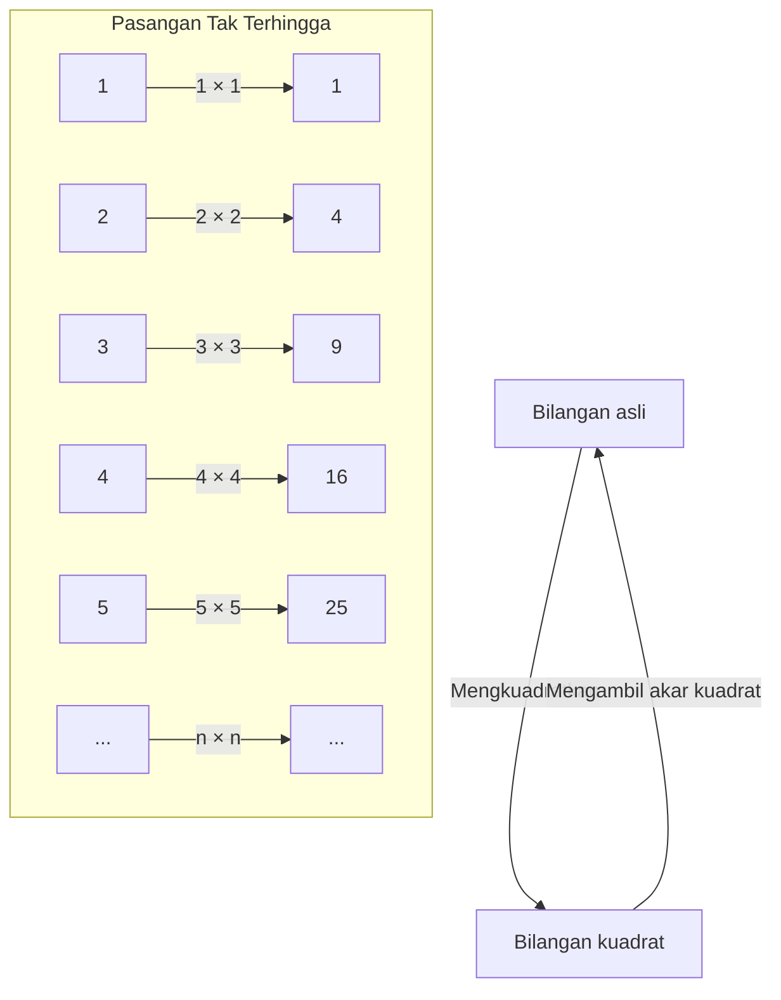
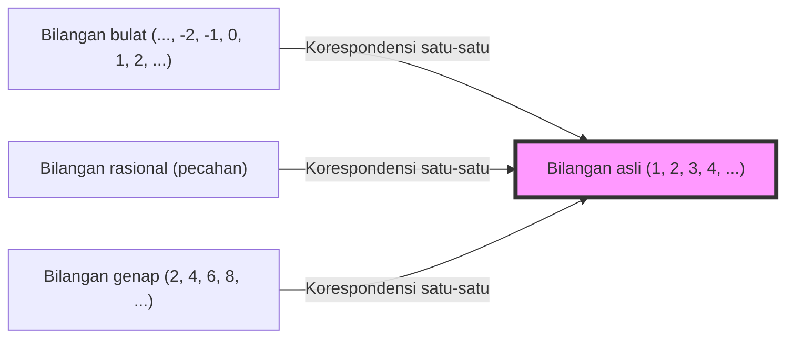

## Pendahuluan: Jurang Bernama Ketakterhinggaan

Mendengar kata "ketakterhinggaan", bayangan seperti apa yang muncul di pikiran Anda? Alam semesta yang tak berujung, waktu yang tak pernah berakhir, atau mungkin bintang-bintang yang tak terhitung jumlahnya... Sejak zaman dahulu, umat manusia telah terpesona sekaligus merasa takut akan konsep "ketakterhinggaan".

Intuisi kita sehari-hari terbentuk di dunia yang terbatas. Sama seperti "ada 3 buah apel" atau "membaca buku setebal 100 halaman", angka selalu diperlakukan sebagai sesuatu yang memiliki akhir. Namun, ketika melangkah ke dunia matematika, kita harus berhadapan langsung dengan konsep luar biasa bernama "ketakterhinggaan".

Kali ini, mari kita gali lebih dalam tentang sebuah paradoks aneh yang diajukan oleh bapak sains, Galileo Galilei (1564-1642) dalam bukunya "Dialog Dua Ilmu Baru" di masa tuanya. Ini disebut "Paradoks Galileo", dan menjadi kunci penting yang membuka pintu ketakterhinggaan, yang kemudian terhubung ke "teori himpunan" oleh para matematikawan generasi berikutnya, khususnya Georg Cantor.

Dalam artikel ini, sepanjang ribuan karakter, kita akan menjelaskan sedetail mungkin mengenai keajaiban konsep "ketakterhinggaan", penyimpangannya dari intuisi matematis, dan kebijaksanaan umat manusia dalam mengatasinya. Silakan nikmati perjalanan petualangan intelektual ini.

---

## Apa itu Paradoks Galileo?

Berbicara tentang Galileo Galilei, dia adalah ilmuwan hebat yang dikenal karena mengusulkan heliosentrisme, pengamatan astronomi menggunakan teleskop, serta hukum benda jatuh, namun dia juga meninggalkan wawasan mendalam dalam matematika dan filsafat.

"Paradoks ketakterhinggaan" yang disadarinya berawal dari sebuah pertanyaan yang sangat sederhana.

**Manakah yang lebih banyak, "seluruh bilangan asli (1, 2, 3, 4, ...)" atau "seluruh bilangan kuadratnya (1, 4, 9, 16, ...)"?**

Jika kita mengikuti intuisi kita, jawabannya sudah jelas. "Bilangan asli pasti jauh lebih banyak". Alasannya adalah karena di dalam bilangan asli terdapat banyak sekali bilangan yang bukan merupakan bilangan kuadrat (2, 3, 5, 6, 7, 8...). Bilangan kuadrat tampaknya hanyalah "sebagian kecil" dari kumpulan besar yang disebut bilangan asli.

Dalam aksioma terkenal matematikawan Yunani Euclid, terdapat juga kalimat **"Keseluruhan lebih besar dari sebagian"**. Aksioma ini adalah kebenaran yang tak tergoyahkan di dunia yang terbatas. Jika Anda mengambil 3 dari 10 buah apel, sisanya adalah 7. Keseluruhan aslinya (10 buah) jelas lebih besar dari bagian yang diambil (3 buah).

Namun, Galileo menyadari sebuah fakta di sini.

### Hubungan Korespondensi 1-ke-1 (Korespondensi Satu-Satu)

Galileo menunjukkan bahwa untuk setiap bilangan asli, pasti ada tepat satu "bilangan kuadratnya", dan sebaliknya, untuk setiap bilangan kuadrat, pasti ada tepat satu "akar kuadratnya (bilangan asli asalnya)".

Seperti yang ditunjukkan diagram ini, jika kita memasangkan sebuah bilangan asli $n$ dengan bilangan kuadratnya $n^2$, kita bisa membuat pasangan yang sempurna tanpa ada yang tersisa di kedua sisi.
Jika anggota-anggota dari 2 kelompok (himpunan) dapat dipasangkan secara sempurna tanpa sisa, kita harus mengatakan bahwa "jumlah (banyaknya)" anggota dari kedua kelompok tersebut adalah **sama**.

Misalnya, ketika kita ingin menghitung jumlah pria dan wanita di sebuah pesta dansa, tanpa harus menghitung satu per satu, jika semua orang berpasangan pria-wanita dan tidak ada yang tersisa, kita tahu bahwa "jumlah pria dan wanita adalah sama".

Menerapkan hal ini pada penemuan Galileo, kita sampai pada kesimpulan bahwa **"jumlah bilangan asli" dan "jumlah bilangan kuadrat" adalah sama persis**.

- Intuisi: "Bilangan asli lebih banyak daripada bilangan kuadrat" (Keseluruhan lebih besar dari sebagian)
- Logika: "Jumlah bilangan asli dan bilangan kuadrat adalah sama" (Memungkinkan korespondensi satu-satu)

Kondisi di mana akal sehat dan logika saling bertabrakan secara langsung inilah yang disebut "Paradoks Galileo".

---

## Apa Arti Paradoks Ini?

Kesimpulan apa yang ditarik oleh Galileo sendiri terhadap paradoks ini?
Dalam bukunya, ia membiarkan salah satu karakternya, Salviati, berbicara sebagai berikut.

> "Kita harus menyimpulkan bahwa kata-kata 'lebih banyak', 'lebih sedikit', dan 'sama' hanya boleh diterapkan pada kuantitas yang terbatas, dan tidak boleh diterapkan pada kuantitas yang tak terhingga."

Dengan kata lain, Galileo berpikir bahwa "dalam dunia ketakterhinggaan, pemikiran untuk membandingkan ukuran atau jumlah itu sendiri menjadi hancur". Ia menolak untuk menyelidiki lebih jauh dengan menyatakan bahwa "ketakterhinggaan tidak memiliki besar atau kecil".

Dalam kerangka matematika pada masa itu, ini adalah penilaian yang paling masuk akal dan bijaksana. Bisa dikatakan, intuisi bahwa berbahaya membawa aturan dunia terbatas (keseluruhan lebih besar dari sebagian) ke dunia tak terbatas pada titik tertentu adalah benar.

Namun, sejarah matematika tidak berhenti di situ. Sekitar 250 tahun kemudian, di paruh kedua abad ke-19, seorang matematikawan jenius menghadapi "monster" ketakterhinggaan ini secara langsung. Dia adalah Georg Cantor.

---

## Georg Cantor dan Lahirnya Teori Himpunan

Cantor melakukan pendekatan baru terhadap dunia ketakterhinggaan yang telah diserahken oleh Galileo karena dianggap "tak dapat dibandingkan". Ia menciptakan konsep "Himpunan (Sets)" dan berusaha membuktikan bahwa ketakterhinggaan pun memiliki "ukuran (Kardinalitas: Cardinality)".

Dasar pemikiran Cantor tiada lain adalah metode **"Korespondensi satu-satu (Bijeksi: Bijection)"** yang ditemukan oleh Galileo.
Cantor memperluas konsep korespondensi satu-satu dan mendefinisikannya sebagai berikut:

**"Jika korespondensi satu-satu dapat dibuat antara dua himpunan A dan B, maka jumlah elemen (kardinalitas) A dan B adalah sama."**

Jika kita menerima definisi ini, Paradoks Galileo bukan lagi sebuah paradoks.
Himpunan "seluruh bilangan asli" dan himpunan "seluruh bilangan kuadrat" sama-sama memiliki elemen yang tak terhingga, namun "ukuran ketakterhinggaannya (kardinalitas)" adalah **sama persis**.

Lebih mengejutkan lagi, karena korespondensi satu-satu dapat dibuat antara bilangan asli dengan "seluruh bilangan genap", "seluruh bilangan ganjil", bahkan "seluruh bilangan bulat", atau "seluruh bilangan rasional (bilangan yang dapat dinyatakan dalam pecahan)", terbukti bahwa semuanya merupakan **"ketakterhinggaan yang berukuran sama dengan bilangan asli"**.

Cantor menamai ukuran ketakterhinggaan dari himpunan yang memiliki korespondensi satu-satu dengan bilangan asli dengan menggunakan huruf pertama dalam abjad Ibrani, "Aleph ($\aleph$)", sebagai **Aleph-nol ($\aleph_0$)**. Ini adalah "ukuran ketakterhinggaan" pertama yang didefinisikan secara matematis.

### Runtuhnya Aksioma "Keseluruhan Lebih Besar dari Sebagian"

Di sini, menjadi jelas bahwa aksioma Euclid "keseluruhan lebih besar dari sebagian", yang merupakan akal sehat di dunia terbatas, tidak berlaku di dunia yang tak terbatas.

Dalam matematika modern (teori himpunan), himpunan tak terhingga bahkan terkadang didefinisikan sebagai berikut:
**"Sebuah himpunan yang dapat memiliki korespondensi satu-satu dengan himpunan bagian sejatinya (bagian yang benar-benar lebih kecil dari keseluruhannya) disebut himpunan tak terhingga."**

Dengan kata lain, sifat "bagian dan keseluruhan menjadi sama" yang dianggap sebagai paradoks oleh Galileo, justru diangkat menjadi esensi utama yang mendefinisikan apa yang membuat ketakterhinggaan itu tak terhingga.

---

## Ketakterhinggaan Memiliki Tingkatan: Argumen Diagonal Cantor

Mengetahui bahwa bilangan asli, bilangan genap, bilangan bulat, dan bilangan rasional... semuanya adalah ketakterhinggaan berukuran sama (Aleph-nol), kita mungkin akan berpikir seperti ini:
"Pada akhirnya, bukankah semua ketakterhinggaan berukuran sama?"

Namun, Cantor menemukan fakta mengejutkan lainnya. Ia membuktikan bahwa himpunan **"bilangan real (seluruh bilangan pada garis bilangan)"** adalah **benar-benar lebih besar** daripada himpunan bilangan asli.

Untuk membuktikannya, ia menggunakan metode terkenal yang disebut **"Argumen Diagonal Cantor"**.
Sederhananya, ini adalah pembuktian melalui kontradiksi (reductio ad absurdum) yang menyatakan, "Jika kita mengasumsikan bahwa seluruh bilangan real (misalnya desimal antara 0 dan 1) dapat didaftarkan dengan membuat korespondensi satu-satu dengan bilangan asli, pasti akan tercipta sebuah bilangan real baru yang lolos dari daftar tersebut."

Dengan penemuan ini, dapat dipastikan bahwa ada "besar dan kecil" dalam ketakterhinggaan.
Ketakterhinggaan dari bilangan real (kontinum: ketakterhinggaan tak terhitung) jauh lebih besar daripada ketakterhinggaan bilangan asli atau bilangan rasional (ketakterhinggaan terhitung: ketakterhinggaan yang dapat dihitung).

Intuisi Galileo yang menyatakan bahwa "ketakterhinggaan tidak dapat dibandingkan" telah dipatahkan oleh Cantor, dan terungkaplah bahwa ada "menara ketakterhinggaan (hirarki Aleph)" yang tak berujung di dalam ketakterhinggaan.

---

## Apa yang Bisa Dipelajari dari Paradoks Galileo

Paradoks Galileo bukan sekadar permainan kata atau pembenaran belaka. Ini mengajarkan kepada kita betapa "intuisi" manusia sangat terikat pada pengalaman sehari-hari yang terbatas (dunia yang terbatas).

1. **Mengetahui Batas Intuisi**
   Otak kita telah berevolusi untuk memproses objek-objek yang terbatas. Karena itu, ketika kita melangkah ke ranah "ketakterhinggaan", meskipun secara logis benar, kita akan merasakan keanehan yang hebat (paradoks). Kemajuan dalam sains dan matematika seringkali dimulai dengan menerima "pengkhianatan intuisi" semacam ini.

2. **Keberanian untuk Mempercayai Logika Sampai Akhir**
   Meskipun menyadari fakta korespondensi satu-satu, Galileo berhenti di sana karena keterbatasan zamannya. Namun, Cantor berpikir bahwa "jika logika menyatakan demikian, kita harus menerimanya meskipun bertentangan dengan intuisi", dan ia membangun sebuah teori baru (teori himpunan) yang bahkan disebut sebagai sebuah kegilaan. Hasilnya, fondasi yang kuat yang membentuk inti matematika dan ilmu komputer modern telah rampung.

3. **Mendefinisikan Ulang Konsep**
   Ketika dihadapkan dengan sebuah paradoks, terobosannya adalah bukan dengan menghindarinya, melainkan meninjau ulang definisi dari kata atau konsep itu sendiri. Dengan mengganti definisi mendasar tentang "apa artinya memiliki jumlah elemen yang banyak" menjadi "korespondensi satu-satu", paradoks tersebut tidak lagi menjadi paradoks, dan dunia matematika yang baru telah terbuka.

## Penutup

"Hubungan misterius antara bilangan asli dan bilangan kuadrat" yang ditulis oleh Galileo Galilei pada abad ke-17 telah melampaui ratusan tahun dan berkembang menjadi matematika modern yang menangani ketakterhinggaan.

Konsep ketakterhinggaan masih menyimpan banyak misteri hingga saat ini. Pertanyaan "Apakah ada ukuran ketakterhinggaan lain di antara ketakterhinggaan bilangan asli dan ketakterhinggaan bilangan real?" (Hipotesis Kontinum) telah mencapai kesimpulan mengejutkan bahwa "hal ini tidak dapat dibuktikan maupun disangkal" dalam sistem aksioma matematika saat ini.

Seperti apa ujung dari alam semesta? Apakah waktu akan berlanjut selamanya? Dan apa yang ada di balik tingkatan ketakterhinggaan yang meluas di dunia matematika? Paradoks Galileo adalah sebuah kisah yang melambangkan kehebatan kecerdasan manusia, bahwa meskipun kita adalah makhluk yang terbatas, kita bisa menyentuh "ketakterhinggaan" melalui pemikiran.

Ketika Anda menatap langit malam berikutnya, mengapa tidak meluangkan waktu untuk memikirkan alam semesta tak terhingga yang Galileo amati melalui teleskopnya, sekaligus "ketakterhinggaan bilangan" yang ia bayangkan di dalam kepalanya?
