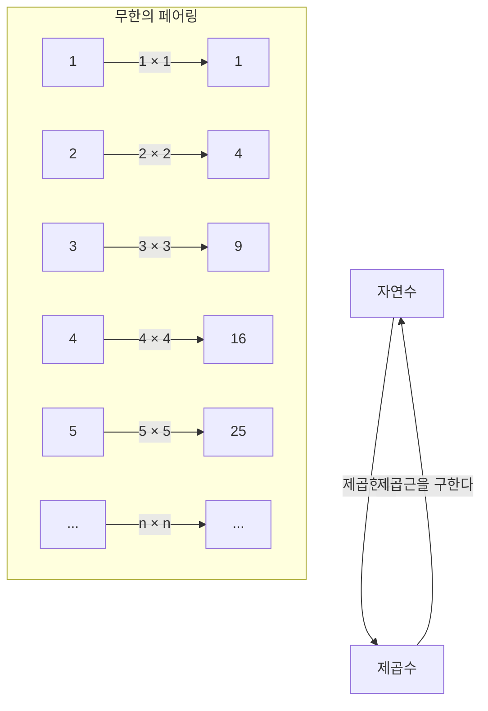
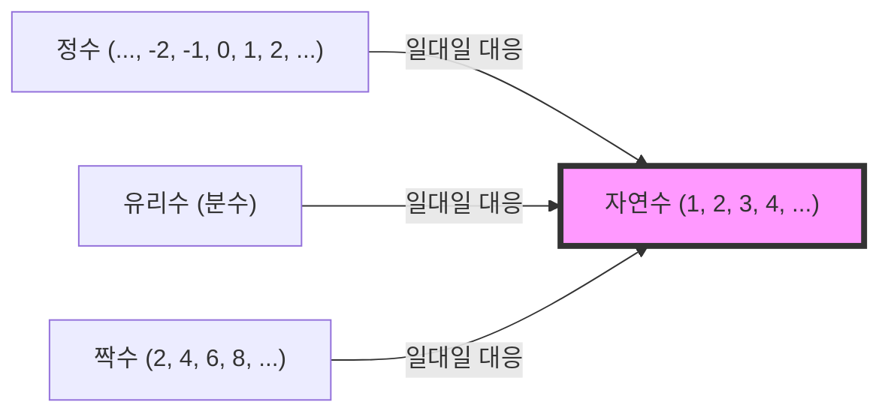

## 서론: 무한이라는 이름의 심연

"무한"이라는 단어를 들으면, 당신은 어떤 이미지를 떠올리시나요? 끝없이 이어지는 우주, 영원히 끝나지 않는 시간, 혹은 셀 수 없을 만큼 많은 별들……. 인류는 예로부터 "무한"이라는 개념에 매료되었고, 동시에 두려움을 품어왔습니다.

우리의 일상적인 직관은 유한한 세계에서 길러졌습니다. "사과가 3개 있다", "100쪽짜리 책을 읽는다"와 같이 수는 항상 끝이 있는 것으로 취급됩니다. 하지만 수학의 세계에 발을 들여놓으면, "무한"이라는 어마어마한 개념과 정면으로 마주해야만 합니다.

이번에는 과학의 아버지라 불리는 갈릴레오 갈릴레이(1564-1642)가 말년에 저서 『새로운 두 과학』(신과학대화)에서 제기한, 어떤 기묘한 역설에 대해 깊이 파헤쳐 보겠습니다. 그것은 "갈릴레오의 역설"이라 불리며, 훗날 수학자들, 특히 게오르크 칸토어에 의한 "집합론"으로 이어지는, 무한의 문을 여는 중요한 열쇠가 되었습니다.

이 기사에서는 수천 자에 걸쳐 "무한"이라는 개념의 신비, 수학적인 직관과의 괴리, 그리고 그것을 뛰어넘은 인류의 지혜에 대해 가능한 한 상세하게 해설해 나가겠습니다. 부디 이 지적인 모험의 여행에 함께해 주시기 바랍니다.

---

## 갈릴레오의 역설이란 무엇인가?

갈릴레오 갈릴레이라고 하면, 지동설 제창이나 망원경을 통한 천체 관측, 낙하의 법칙 등으로 알려진 위대한 과학자이지만, 그는 수학과 철학에서도 깊은 통찰을 남겼습니다.

그가 깨달은 "무한의 역설"은 매우 단순한 질문에서 시작됩니다.

**"자연수 전체(1, 2, 3, 4, ...)"와, "그 제곱수 전체(1, 4, 9, 16, ...)"는 어느 쪽이 더 많을까?**

우리의 직관에 따르면, 답은 명백합니다. "자연수 쪽이 압도적으로 많다"일 것입니다. 왜냐하면, 자연수 안에는 제곱수가 아닌 수(2, 3, 5, 6, 7, 8...)가 수없이 포함되어 있기 때문입니다. 제곱수는 자연수라는 거대한 집단 안의 "극히 일부"에 불과한 것처럼 보입니다.

유명한 그리스의 수학자 유클리드의 공리에도 **"전체는 부분보다 크다"**라는 말이 있습니다. 이 공리는 유한한 세계에서는 절대 흔들리지 않는 진리입니다. 10개의 사과 중에서 3개를 꺼내면 남은 것은 7개. 원래의 10개(전체)는 꺼낸 3개(부분)보다 명백히 큽니다.

하지만 갈릴레오는 여기서 어떤 사실을 깨닫고 맙니다.

### 1대1 대응 관계 (일대일 대응)

갈릴레오는 모든 자연수에 대해 반드시 "그 제곱수"가 1개만 존재하고, 반대로 모든 제곱수에 대해 반드시 "그 제곱근(원래의 자연수)"이 1개만 존재한다는 것을 보여주었습니다.

이 그림이 보여주듯, 자연수 $n$ 에 대해 제곱수 $n^2$ 을 연결하면, 어느 쪽도 남는 것 없이 완벽하게 짝을 지을 수 있습니다.
만약 두 그룹(집합)의 요소끼리 단 하나도 남김없이 완벽하게 짝을 지을 수 있다면, 그 두 그룹의 요소의 "수(개수)"는 **같다**고 말할 수밖에 없습니다.

예를 들어, 댄스 파티에서 남성의 수와 여성의 수를 세고 싶을 때, 일일이 한 명씩 세지 않아도 전원이 남녀 짝이 되어 아무도 남지 않는다면 "남성과 여성의 수는 같다"는 것을 알 수 있습니다.

이것을 갈릴레오의 발견에 적용하면, **"자연수의 개수"와 "제곱수의 개수"는 완전히 같다**는 결론이 도출되고 맙니다.

- 직관: "자연수 쪽이 제곱수보다 많다" (전체는 부분보다 크다)
- 논리: "자연수와 제곱수의 수는 같다" (일대일 대응이 가능)

이처럼 상식과 논리가 정면으로 충돌하는 상태야말로 "갈릴레오의 역설"입니다.

---

## 역설이 의미하는 것

갈릴레오 자신은 이 역설에 대해 어떤 결론을 내렸을까요?
그는 저서 안에서 등장인물 중 한 명인 살비아티에게 다음과 같이 말하게 했습니다.

> "우리는 '많다', '적다', '같다'라는 말을 유한한 양에만 적용해야 하며, 무한한 양에 적용해서는 안 된다고 결론지어야 한다"

즉 갈릴레오는 "무한의 세계에서는 크기나 개수를 비교한다는 생각 자체가 파탄 나버린다"고 생각했습니다. "무한에는 대소가 없다"며 그 이상 깊이 파고드는 것을 피했던 것입니다.

당시의 수학적 틀 안에서는 이것이 가장 타당하고 현명한 판단이었습니다. 유한한 세계의 규칙(전체는 부분보다 크다)을 무한의 세계로 가져가는 것은 위험하다는 직관은, 어떤 의미에서는 옳았다고 할 수 있습니다.

하지만 수학의 역사는 여기서 멈추지 않았습니다. 약 250년 후, 19세기 후반이 되어 한 천재 수학자가 이 "무한"이라는 괴물과 정면으로 맞섭니다. 그가 바로 게오르크 칸토어입니다.

---

## 게오르크 칸토어와 집합론의 탄생

칸토어는 갈릴레오가 "비교할 수 없다"며 포기했던 무한의 세계에 새로운 메스를 가했습니다. 그는 "집합(Sets)"이라는 개념을 창안해 내어, 무한에도 "크기(농도: Cardinality)"가 있다는 것을 증명하고자 했던 것입니다.

칸토어의 사고방식의 근본에 있었던 것은 바로 갈릴레오가 찾아낸 **"일대일 대응(전단사: Bijection)"**이라는 기법이었습니다.
칸토어는 일대일 대응의 개념을 확장하여 다음과 같이 정의했습니다.

**"두 집합 A와 B 사이에 일대일 대응이 이루어질 때, A와 B의 요소의 수(농도)는 같다"**

이 정의를 받아들인다면, 갈릴레오의 역설은 더 이상 역설이 아니게 됩니다.
"자연수 전체"라는 집합과, "제곱수 전체"라는 집합은 모두 무한한 요소를 가지고 있지만, 그 "무한의 크기(농도)"는 **완전히 같은** 것입니다.

더욱 놀라운 것은, 자연수와 "짝수 전체"나 "홀수 전체", 나아가 "정수 전체"나 "유리수 전체(분수로 나타낼 수 있는 수)"조차도 일대일 대응을 시킬 수 있기 때문에, 모두 **"자연수와 같은 크기의 무한"**이라는 것이 증명되었습니다.

칸토어는 자연수와 일대일 대응이 되는 집합의 무한의 크기를, 히브리 문자의 첫 글자인 "알레프($\aleph$)"를 사용하여 **알레프 제로($\aleph_0$)**라고 이름 붙였습니다. 이것이 수학적으로 정의된 최초의 "무한의 크기"입니다.

### "전체는 부분보다 크다"는 공리의 붕괴

여기서 유한한 세계의 상식이던 "전체는 부분보다 크다"는 유클리드의 공리는 무한의 세계에서는 성립하지 않는다는 것이 명확해졌습니다.

현대의 수학(집합론)에서 무한 집합은 다음과 같이 정의되기도 합니다.
**"자기 자신의 진부분집합(전체보다 진정으로 작은 부분)과 일대일 대응이 되는 집합을 무한 집합이라 부른다"**

즉, 갈릴레오가 역설이라고 느꼈던 "부분과 전체가 같아지는 성질"이야말로 무한을 무한하게 만드는 본질적인 정의 그 자체로 승화된 것입니다.

---

## 무한에는 계층이 있다: 칸토어의 대각선 논법

자연수, 짝수, 정수, 유리수…… 이것들이 모두 같은 크기의 무한(알레프 제로)이라는 것을 알게 되면, 우리는 다음과 같이 생각할지도 모릅니다.
"결국 무한은 모두 같은 크기가 아닐까?"

하지만 칸토어는 더욱 충격적인 사실을 발견합니다. **"실수(수직선 상의 모든 수)"**의 집합은 자연수의 집합보다 **진정으로 크다**는 것을 증명한 것입니다.

이것을 증명하기 위해 사용된 것이 유명한 **"칸토어의 대각선 논법"**입니다.
간단히 말해, "모든 실수(여기서는 0과 1 사이의 소수라고 가정합니다)를 자연수와 1대1로 대응시켜 리스트화할 수 있다고 가정하면, 반드시 그 리스트에서 빠지게 되는 새로운 실수를 만들어 낼 수 있다"는 귀류법입니다.

이 발견에 의해 무한에는 "대소"가 있다는 것이 확정되었습니다.
자연수나 유리수의 무한(가산 무한: 셀 수 있는 무한)보다, 실수의 무한(연속체: 셀 수 없는 무한) 쪽이 훨씬 거대한 무한인 것입니다.

갈릴레오가 "무한은 비교할 수 없다"고 했던 직관은 칸토어에 의해 깨어졌고, 무한 속에 끝없는 "무한의 탑(알레프의 계층)"이 존재한다는 것이 밝혀졌습니다.

---

## 갈릴레오의 역설에서 배우는 것

갈릴레오의 역설은 단순한 말장난이나 억지가 아닙니다. 그것은 인간의 "직관"이라는 것이 얼마나 제한된 일상 경험(유한한 세계)에 얽매여 있는지를 가르쳐 줍니다.

1. **직관의 한계를 안다**
   우리의 뇌는 유한한 물체를 처리하도록 진화해 왔습니다. 그렇기 때문에 "무한"이라는 영역에 발을 들이면, 논리적으로 올바른 것이라 하더라도 맹렬한 위화감(역설)을 느끼게 됩니다. 과학이나 수학의 진보는 종종 이러한 "직관의 배신"을 받아들이는 것에서부터 시작됩니다.

2. **논리를 끝까지 믿는 용기**
   갈릴레오는 일대일 대응의 사실을 깨닫고도 시대적 한계 때문에 그곳에 멈춰 섰습니다. 하지만 칸토어는 "논리가 그렇게 말하고 있다면 직관에 반하더라도 그것을 받아들여야 한다"고 생각했고, 광기라고까지 불린 새로운 이론(집합론)을 구축했습니다. 그 결과 현대 수학이나 컴퓨터 과학의 근간을 이루는 견고한 토대가 완성된 것입니다.

3. **개념의 재정의**
   역설에 직면했을 때, 그것을 피하는 것이 아니라 언어나 개념의 정의 자체를 다시 살펴보는 것이 돌파구가 됩니다. "요소의 수가 많다는 것은 무슨 뜻인가"라는 근본적인 정의를 "일대일 대응"으로 대체함으로써 역설은 역설이 아니게 되었고, 새로운 수학의 세계가 열렸습니다.

## 맺음말

갈릴레오 갈릴레이가 17세기에 남긴 "자연수와 제곱수의 신비한 관계"는 수백 년이라는 시간을 넘어 무한을 다루는 현대 수학으로 꽃피웠습니다.

무한이라는 개념은 지금도 여전히 많은 수수께끼를 간직하고 있습니다. "자연수의 무한과 실수의 무한 사이에 다른 크기의 무한은 존재하는가?"라는 질문(연속체 가설)은 현재 수학의 공리계에서는 "증명도 반증도 할 수 없다"는 놀라운 결론에 도달했습니다.

우주의 끝은 어떻게 되어 있을까요? 시간은 영원히 이어질까요? 그리고 수학의 세계에 펼쳐진 무한한 계층 너머에는 무엇이 있을까요? 갈릴레오의 역설은 우리가 유한한 존재이면서도 사고를 통해 "무한"에 닿을 수 있다는, 인간 지성의 훌륭함을 상징하는 에피소드인 것입니다.

다음번에 밤하늘을 올려다볼 때는, 갈릴레오가 망원경으로 들여다본 무한한 우주와, 그가 머릿속으로 그린 "수의 무한" 양쪽 모두에 대해 생각을 떠올려 보는 것은 어떨까요?
