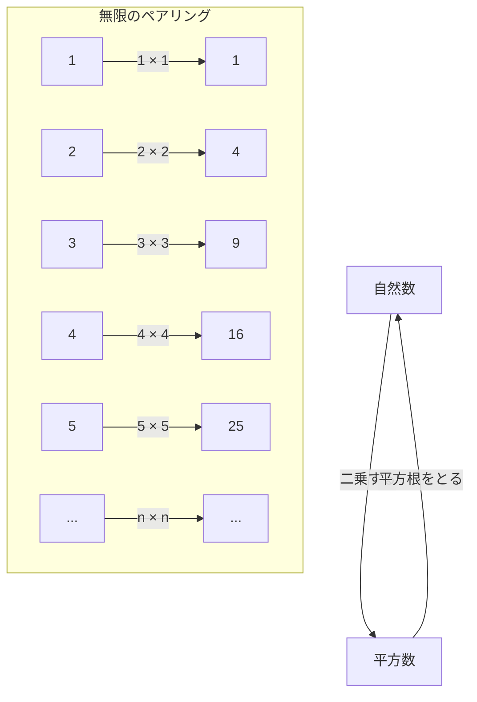
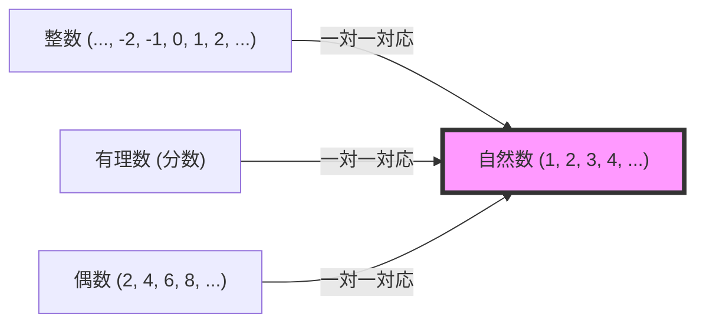

## はじめに：無限という名の深淵

「無限」という言葉を聞いて、あなたはどのようなイメージを思い浮かべるでしょうか。果てしなく続く宇宙、永遠に終わらない時間、あるいは、数えきれないほどの星々……。人類は古くから「無限」という概念に魅了され、同時に恐れを抱いてきました。

私たちの日常的な直感は、有限の世界で培われています。「りんごが3個ある」「100ページの本を読む」といったように、数は常に終わりがあるものとして扱われます。しかし、数学の世界に足を踏み入れると、「無限」という途方もない概念と正面から向き合わなければなりません。

今回は、科学の父と呼ばれるガリレオ・ガリレイ（1564-1642）が晩年に著書『新科学対話』の中で提起した、ある奇妙なパラドックスについて深掘りしていきましょう。それは「ガリレオのパラドックス」と呼ばれ、後の数学者たち、特にゲオルク・カントールによる「集合論」へと繋がる、無限の扉を開く重要な鍵となりました。

この記事では、数千文字にわたって「無限」という概念の不思議、数学的な直感とのズレ、そしてそれを乗り越えた人類の叡智について、可能な限り詳細に解説していきます。ぜひ、知的な冒険の旅にお付き合いください。

---

## ガリレオのパラドックスとは何か？

ガリレオ・ガリレイといえば、地動説の提唱や望遠鏡による天体観測、落体の法則などで知られる偉大な科学者ですが、彼は数学や哲学においても深い洞察を残しています。

彼が気づいた「無限のパラドックス」は、非常にシンプルな問いから始まります。

**「自然数全体（1, 2, 3, 4, ...）」と、「その平方数全体（1, 4, 9, 16, ...）」は、どちらが多いのか？**

私たちの直感に従えば、答えは明らかです。「自然数の方が圧倒的に多い」はずです。なぜなら、自然数の中には平方数でない数（2, 3, 5, 6, 7, 8...）がごまんと含まれているからです。平方数は、自然数という巨大な集まりの中の「ごく一部」に過ぎないように見えます。

有名なギリシャの数学者ユークリッドの公理にも**「全体は部分より大きい」**という言葉があります。この公理は、有限の世界では絶対に揺るがない真理です。10個のりんごの中から3個を取り出せば、残りは7個。元の10個（全体）は、取り出した3個（部分）よりも明らかに大きい。

しかし、ガリレオはここである事実に気づいてしまいます。

### 1対1の対応関係（一対一対応）

ガリレオは、すべての自然数に対して、必ず「その平方数」が1つだけ存在し、逆にすべての平方数に対して、必ず「その平方根（元の自然数）」が1つだけ存在することを示しました。

この図が示すように、自然数 $n$ に対して平方数 $n^2$ を結びつけると、どちらかが余ることなく、完璧にペアを作ることができます。
もし2つのグループ（集合）の要素同士を、一つも余すことなく完璧にペアにできるなら、その2つのグループの要素の「数（個数）」は**等しい**と言わざるを得ません。

例えば、ダンスパーティーで男性の数と女性の数を数えたい時、いちいち1人ずつ数えなくても、全員が男女ペアになって誰も余っていなければ「男性と女性の数は同じである」と分かります。

これをガリレオの発見に当てはめると、**「自然数の個数」と「平方数の個数」は完全に等しい**という結論が導き出されてしまいます。

- 直感：「自然数の方が平方数より多い」（全体は部分より大きい）
- 論理：「自然数と平方数の数は同じ」（一対一対応が可能）

この、常識と論理が真っ向から衝突する状態こそが、「ガリレオのパラドックス」です。

---

## パラドックスが意味するもの

ガリレオ自身は、このパラドックスに対してどのような結論を出したのでしょうか。
彼は著書の中で、登場人物の一人であるサルヴィアティに次のように語らせています。

> 「我々は『多い』『少ない』『等しい』という言葉を有限な量にのみ適用すべきであり、無限な量に適用すべきではないと結論づけなければならない」

つまりガリレオは、「無限の世界においては、大きさや個数を比較するという考え方自体が破綻してしまうのだ」と考えました。「無限には大小がない」として、それ以上深入りすることを避けたのです。

当時の数学的枠組みにおいては、これが最も妥当で賢明な判断でした。有限の世界のルール（全体は部分より大きい）を無限の世界に持ち込むことは危険であるという直感は、ある意味で正しかったと言えます。

しかし、数学の歴史はここで止まりませんでした。約250年後、19世紀後半になって、ひとりの天才数学者がこの「無限」という怪物に正面から立ち向かいます。それが、ゲオルク・カントールです。

---

## ゲオルク・カントールと集合論の誕生

カントールは、ガリレオが「比較できない」として諦めた無限の世界に、新しいメスを入れました。彼は「集合（Sets）」という概念を生み出し、無限にも「大きさ（濃度：Cardinality）」があることを証明しようとしたのです。

カントールの考え方の根本にあったのは、まさにガリレオが見出した**「一対一対応（全単射：Bijection）」**という手法でした。
カントールは、一対一対応の概念を拡張し、次のように定義しました。

**「2つの集合AとBの間に一対一対応がつけられるとき、AとBの要素の数（濃度）は等しい」**

この定義を受け入れるならば、ガリレオのパラドックスはもはやパラドックスではなくなります。
「自然数全体」という集合と、「平方数全体」という集合は、どちらも無限の要素を持っていますが、その「無限の大きさ（濃度）」は**完全に等しい**のです。

さらに驚くべきことに、自然数と「偶数全体」や「奇数全体」、さらには「整数全体」や「有理数全体（分数で表せる数）」でさえも、一対一対応をつけることができるため、すべて**「自然数と同じ大きさの無限」**であることが証明されました。

カントールは、自然数と一対一対応がつく集合の無限の大きさを、ヘブライ文字の最初である「アレフ（$\aleph$）」を使って**アレフ・ゼロ（$\aleph_0$）**と名付けました。これが、数学的に定義された最初の「無限のサイズ」です。

### 「全体は部分より大きい」という公理の崩壊

ここで、有限の世界の常識であった「全体は部分より大きい」というユークリッドの公理は、無限の世界においては成り立たないことが明確になりました。

現代の数学（集合論）において、無限集合は次のように定義されることさえあります。
**「自分自身の真部分集合（全体より真に小さい部分）と一対一対応がつくような集合を、無限集合と呼ぶ」**

つまり、ガリレオがパラドックスだと感じた「部分と全体が等しくなってしまう性質」こそが、無限を無限たらしめている本質的な定義そのものへと昇華されたのです。

---

## 無限には階層がある：カントールの対角線論法

自然数、偶数、整数、有理数……これらがすべて同じ大きさの無限（アレフ・ゼロ）であると知ると、私たちは次のように思うかもしれません。
「結局、無限はすべて同じ大きさなのではないか？」

しかし、カントールはさらなる衝撃的な事実を発見します。**「実数（数直線上のすべての数）」**の集合は、自然数の集合よりも**真に大きい**ことを証明したのです。

これを証明するために用いられたのが、有名な**「カントールの対角線論法」**です。
簡単に言えば、「すべての実数（ここでは0と1の間の小数とします）を自然数と1対1で対応させてリスト化できたと仮定すると、必ずそのリストから漏れてしまう新しい実数を作り出せてしまう」という背理法です。

この発見により、無限には「大小」があることが確定しました。
自然数や有理数の無限（可算無限：数え上げられる無限）よりも、実数の無限（連続体：数え上げられない無限）の方が、はるかに巨大な無限なのです。

ガリレオが「無限は比較できない」とした直感は、カントールによって打ち破られ、無限の中に果てしない「無限の塔（アレフの階層）」が存在することが明らかになりました。

---

## ガリレオのパラドックスから学ぶこと

ガリレオのパラドックスは、単なる言葉遊びや屁理屈ではありません。それは、人間の「直感」というものが、いかに限られた日常経験（有限の世界）に縛られているかを教えてくれます。

1. **直感の限界を知る**
   私たちの脳は、有限の物体を処理するように進化してきました。そのため、「無限」という領域に踏み込むと、論理的に正しいことであっても、猛烈な違和感（パラドックス）を覚えます。科学や数学の進歩は、しばしばこうした「直感の裏切り」を受け入れることから始まります。

2. **論理を信じ抜く勇気**
   ガリレオは一対一対応の事実に気づきながらも、時代の限界からそこで立ち止まりました。しかし、カントールは「論理がそう告げているなら、直感に反してでもそれを受け入れるべきだ」と考え、狂気とさえ呼ばれた新しい理論（集合論）を構築しました。その結果、現代の数学やコンピューターサイエンスの根幹を成す強固な土台が完成したのです。

3. **概念の再定義**
   パラドックスに直面したとき、それを避けるのではなく、言葉や概念の定義そのものを見直すことが突破口になります。「要素の数が多いとはどういうことか」という根本的な定義を「一対一対応」に置き換えることで、パラドックスはパラドックスではなくなり、新しい数学の世界が開けました。

## おわりに

ガリレオ・ガリレイが17世紀に書き残した「自然数と平方数の不思議な関係」は、数百年という時を超えて、無限を扱う現代数学へと花開きました。

無限という概念は、今もなお多くの謎を秘めています。「自然数の無限と実数の無限の間に、別の大きさの無限は存在するのか？」という問い（連続体仮説）は、今の数学の公理系では「証明も反証もできない」という驚くべき結論に達しています。

宇宙の果てはどうなっているのか。時間は永遠に続くのか。そして、数学の世界に広がる無限の階層の先には何があるのか。ガリレオのパラドックスは、私たちが有限の存在でありながら、思考によって「無限」に触れることができるという、人間の知性の素晴らしさを象徴するエピソードなのです。

次回夜空を見上げるときは、ガリレオが望遠鏡で覗き込んだ無限の宇宙と、彼が頭の中で思い描いた「数の無限」の双方に、思いを馳せてみてはいかがでしょうか。
