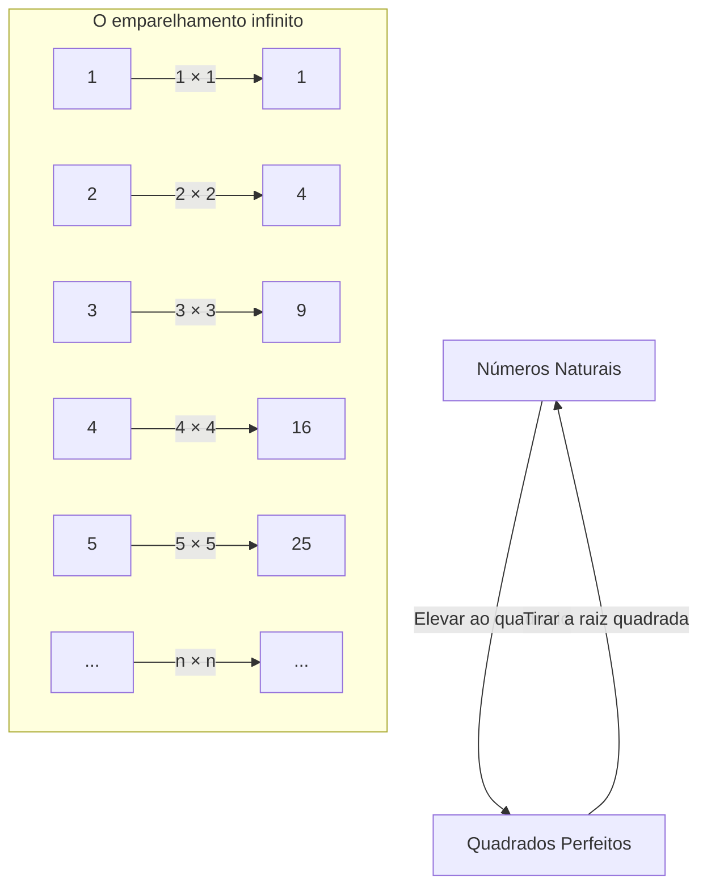
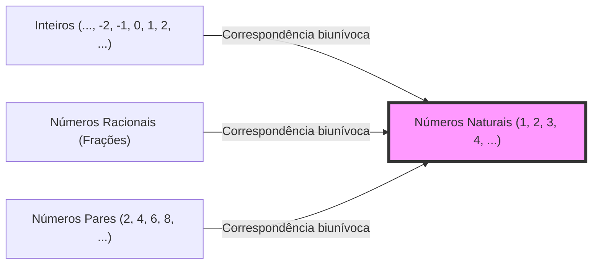

## Introdução: O abismo chamado infinito

Quando você ouve a palavra "infinito", que tipo de imagem vem à sua mente? Um universo sem fim, um tempo que nunca acaba ou inúmeras estrelas... A humanidade sempre foi fascinada e, ao mesmo tempo, amedrontada pelo conceito de "infinito" desde a antiguidade.

A nossa intuição diária é cultivada num mundo finito. Como "existem 3 maçãs" ou "ler um livro de 100 páginas", os números são sempre tratados como algo que tem um fim. No entanto, quando entramos no mundo da matemática, temos que enfrentar de frente o conceito formidável de "infinito".

Desta vez, vamos explorar um estranho paradoxo levantado pelo pai da ciência, Galileu Galilei (1564-1642), em seus últimos anos, no seu livro "Duas Novas Ciências". Conhecido como o "Paradoxo de Galileu", ele se tornou a chave importante que abriu a porta para o infinito, levando aos matemáticos posteriores, especialmente à "teoria dos conjuntos" de Georg Cantor.

Neste artigo, ao longo de vários milhares de palavras, explicaremos o mais detalhadamente possível o mistério do conceito de "infinito", o desvio da intuição matemática e a sabedoria da humanidade que o superou. Por favor, junte-se a nós nesta jornada de aventura intelectual.

---

## O que é o Paradoxo de Galileu?

Galileu Galilei é um grande cientista conhecido pela sua defesa da teoria heliocêntrica, observações astronômicas com um telescópio, a lei da queda dos corpos, entre outras coisas, mas ele também deixou insights profundos na matemática e filosofia.

O "paradoxo do infinito" que ele percebeu começa com uma questão muito simples.

**Qual é maior: "todos os números naturais (1, 2, 3, 4, ...)" ou "todos os seus quadrados perfeitos (1, 4, 9, 16, ...)"?**

Se seguirmos a nossa intuição, a resposta é óbvia. "Os números naturais devem ser esmagadoramente mais numerosos". Porque os números naturais contêm uma enorme quantidade de números que não são quadrados perfeitos (2, 3, 5, 6, 7, 8...). Os quadrados perfeitos parecem ser apenas "uma pequena parte" do enorme grupo dos números naturais.

O famoso axioma do matemático grego Euclides também afirma que **"o todo é maior que a parte"**. Este axioma é uma verdade inabalável num mundo finito. Se tirarmos 3 maçãs de 10, restam 7. As 10 maçãs originais (o todo) são claramente maiores do que as 3 que foram retiradas (a parte).

No entanto, Galileu percebe aqui um fato.

### A correspondência de 1 para 1 (Correspondência biunívoca)

Galileu mostrou que para todo número natural, existe sempre apenas um "quadrado perfeito", e inversamente, para todo quadrado perfeito, existe sempre apenas uma "raiz quadrada (o número natural original)".

Como este diagrama mostra, se associarmos um número natural $n$ ao seu quadrado $n^2$, podemos criar pares perfeitos sem sobrar nenhum de ambos os lados.
Se os elementos de dois grupos (conjuntos) podem ser emparelhados perfeitamente sem sobrar nenhum, devemos dizer que a "quantidade (número)" de elementos nesses dois grupos é **igual**.

Por exemplo, quando queremos contar o número de homens e mulheres numa festa de dança, mesmo sem contá-los um a um, se todos formarem pares de homem e mulher e ninguém sobrar, sabemos que "o número de homens e mulheres é o mesmo".

Aplicando isso à descoberta de Galileu, chegamos à conclusão de que **"a quantidade de números naturais" e "a quantidade de quadrados perfeitos" são completamente iguais**.

- Intuição: "Os números naturais são mais numerosos que os quadrados perfeitos" (O todo é maior que a parte)
- Lógica: "A quantidade de números naturais e de quadrados perfeitos é a mesma" (É possível a correspondência biunívoca)

Esse estado em que o senso comum e a lógica entram em conflito frontal é exatamente o "Paradoxo de Galileu".

---

## O que o paradoxo significa

A que conclusão chegou o próprio Galileu sobre este paradoxo?
No seu livro, ele faz Salviati, um dos personagens, dizer o seguinte:

> "Devemos concluir que as palavras 'maior', 'menor' e 'igual' devem ser aplicadas apenas a quantidades finitas, e não a quantidades infinitas."

Em outras palavras, Galileu pensou que "no mundo do infinito, a própria ideia de comparar tamanho ou quantidade desmorona". Ele evitou se aprofundar mais, afirmando que "o infinito não tem tamanho".

Dentro do quadro matemático da época, este era o julgamento mais razoável e sábio. Pode-se dizer que a sua intuição de que é perigoso trazer as regras do mundo finito (o todo é maior que a parte) para o mundo infinito estava certa de certa forma.

Mas a história da matemática não parou por aí. Cerca de 250 anos depois, na segunda metade do século 19, um matemático genial enfrentou de frente este monstro chamado "infinito". Foi Georg Cantor.

---

## Georg Cantor e o nascimento da teoria dos conjuntos

Cantor dissecou o mundo do infinito que Galileu havia desistido por considerá-lo "incomparável". Ele criou o conceito de "Conjuntos (Sets)" e tentou provar que o infinito também tem um "tamanho (Cardinalidade: Cardinality)".

Na raiz do pensamento de Cantor estava exatamente o método de **"correspondência biunívoca (Bijeção: Bijection)"** que Galileu havia encontrado.
Cantor expandiu o conceito de correspondência biunívoca e o definiu da seguinte forma:

**"Quando se pode estabelecer uma correspondência biunívoca entre os elementos de dois conjuntos A e B, o número (cardinalidade) dos elementos de A e B é igual."**

Se aceitarmos esta definição, o Paradoxo de Galileu já não é um paradoxo.
Tanto o conjunto de "todos os números naturais" quanto o conjunto de "todos os quadrados perfeitos" têm elementos infinitos, mas o "tamanho do seu infinito (cardinalidade)" é **completamente igual**.

Mais surpreendente ainda, como é possível estabelecer uma correspondência biunívoca entre os números naturais e "todos os números pares", "todos os números ímpares", e até mesmo "todos os números inteiros" ou "todos os números racionais (números que podem ser expressos em frações)", provou-se que todos eles são **"infinitos do mesmo tamanho que os números naturais"**.

Cantor nomeou o tamanho infinito dos conjuntos que têm correspondência biunívoca com os números naturais usando a primeira letra do alfabeto hebraico, "Aleph ($\aleph$)", chamando-o de **Aleph-zero ($\aleph_0$)**. Este é o primeiro "tamanho do infinito" definido matematicamente.

### O colapso do axioma "o todo é maior que a parte"

Aqui, ficou claro que o axioma de Euclides de que "o todo é maior que a parte", que era senso comum no mundo finito, não se sustenta no mundo infinito.

Na matemática moderna (teoria dos conjuntos), um conjunto infinito é frequentemente definido da seguinte forma:
**"Um conjunto é chamado de infinito se puder ser colocado em correspondência biunívoca com um subconjunto próprio de si mesmo (uma parte estritamente menor que o todo)."**

Em outras palavras, exatamente aquela "propriedade em que a parte e o todo se tornam iguais" que Galileu sentiu ser um paradoxo, foi elevada à própria definição essencial que faz o infinito ser infinito.

---

## Existem hierarquias no infinito: O argumento de diagonalização de Cantor

Quando descobrimos que números naturais, números pares, inteiros e racionais são todos do mesmo tamanho infinito (Aleph-zero), podemos pensar o seguinte:
"Afinal, não são todos os infinitos do mesmo tamanho?"

No entanto, Cantor fez uma descoberta ainda mais chocante. Ele provou que o conjunto dos **"números reais (todos os números na reta numérica)"** é **estritamente maior** do que o conjunto dos números naturais.

Para provar isso, ele usou o famoso **"Argumento de diagonalização de Cantor"**.
Simplificando, é uma prova por contradição que afirma: "Se assumirmos que todos os números reais (aqui, decimais entre 0 e 1) pudessem ser listados em uma correspondência 1 para 1 com os números naturais, sempre seria possível criar um novo número real que escaparia dessa lista."

Com esta descoberta, ficou confirmado que o infinito tem "tamanhos".
O infinito dos números reais (o contínuo: infinito incontável) é um infinito imensamente mais vasto do que o infinito dos números naturais ou racionais (infinito enumerável: infinito que pode ser contado).

A intuição de Galileu de que "os infinitos não podem ser comparados" foi quebrada por Cantor, e ficou claro que existe uma interminável "torre de infinitos (a hierarquia dos Alephs)" dentro do infinito.

---

## O que aprender com o Paradoxo de Galileu

O Paradoxo de Galileu não é apenas um jogo de palavras ou uma sutileza. Ele nos ensina o quanto a nossa "intuição" humana está ligada às nossas experiências diárias limitadas (o mundo finito).

1. **Conhecer os limites da intuição**
   Os nossos cérebros evoluíram para processar objetos finitos. Portanto, quando entramos no reino do "infinito", mesmo que algo seja logicamente correto, sentimos um intenso desconforto (paradoxo). O avanço da ciência e da matemática muitas vezes começa por aceitar essas "traições da intuição".

2. **A coragem para acreditar na lógica até ao fim**
   Apesar de perceber o fato da correspondência biunívoca, Galileu parou aí devido às limitações de sua época. No entanto, Cantor pensou que "se a lógica diz isso, devo aceitar mesmo que vá contra a intuição", e construiu uma nova teoria (teoria dos conjuntos) que até foi chamada de loucura. O resultado é a base sólida sobre a qual a matemática moderna e a ciência da computação se apoiam hoje.

3. **Redefinição de conceitos**
   Ao enfrentar um paradoxo, o avanço não é evitá-lo, mas sim reavaliar a própria definição de palavras e conceitos. Ao substituir a definição fundamental de "o que significa ter um grande número de elementos" por "correspondência biunívoca", o paradoxo deixou de ser um paradoxo e um novo mundo da matemática se abriu.

## Conclusão

A "estranha relação entre números naturais e quadrados perfeitos" que Galileu Galilei deixou por escrito no século 17, através de centenas de anos, floresceu na matemática moderna que lida com o infinito.

O conceito de infinito ainda guarda muitos mistérios. A questão de saber "se existe outro tamanho de infinito entre o infinito dos números naturais e o infinito dos números reais?" (a Hipótese do Contínuo) chegou à surpreendente conclusão de que "não pode ser provada nem refutada" no sistema de axiomas da matemática atual.

O que acontece no fim do universo? O tempo continuará para sempre? E o que existe além das hierarquias infinitas que se expandem no mundo da matemática? O Paradoxo de Galileu é um episódio que simboliza o esplendor da inteligência humana de que, apesar de sermos seres finitos, podemos tocar o "infinito" através do pensamento.

Da próxima vez que olhar para o céu noturno, por que não voltar os seus pensamentos tanto para o universo infinito que Galileu olhou através do seu telescópio, quanto para o "infinito dos números" que ele imaginou em sua mente?
