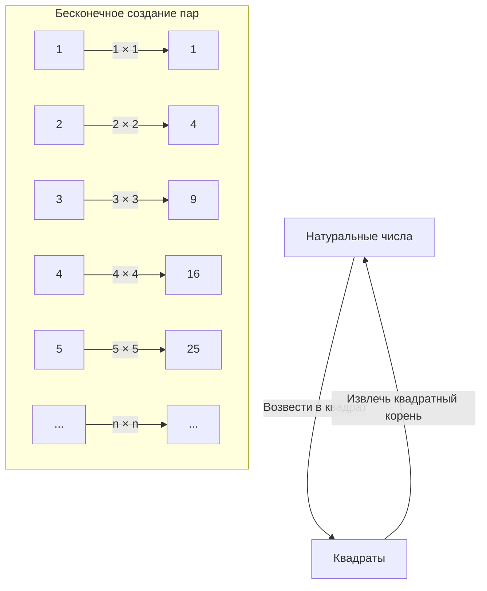
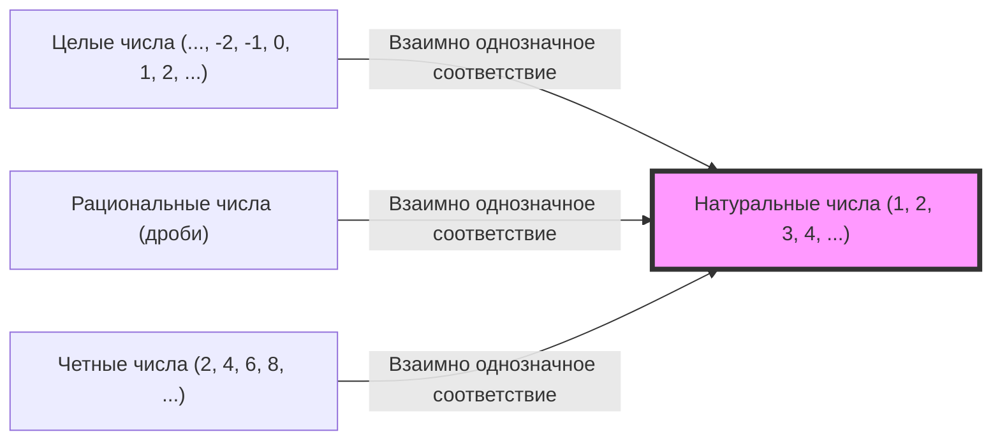

## Введение: Бездна по имени бесконечность

Слыша слово «бесконечность», какие образы приходят вам на ум? Бескрайняя вселенная, вечно длящееся время или же бесчисленное множество звезд... С древних времен человечество было очаровано концепцией «бесконечности» и одновременно испытывало перед ней страх.

Наша повседневная интуиция взращена в конечном мире. «Есть 3 яблока», «прочитать 100-страничную книгу» — числа всегда воспринимаются как имеющие конец. Однако, ступая в мир математики, нам приходится лицом к лицу столкнуться с колоссальной концепцией «бесконечности».

В этот раз давайте углубимся в один странный парадокс, который отец науки Галилео Галилей (1564-1642) в свои поздние годы поднял в книге «Беседы и математические доказательства, касающиеся двух новых отраслей науки». Он был назван «Парадоксом Галилея» и стал важным ключом, открывшим двери в бесконечность, что в дальнейшем привело к «теории множеств» математиков, в особенности Георга Кантора.

В этой статье на протяжении нескольких тысяч символов мы максимально подробно объясним чудеса концепции «бесконечности», ее расхождение с математической интуицией и человеческую мудрость, преодолевшую это. Пожалуйста, присоединяйтесь к этому интеллектуальному приключению.

---

## Что такое парадокс Галилея?

Хотя Галилео Галилей — великий ученый, известный утверждением гелиоцентрической системы, астрономическими наблюдениями с помощью телескопа и законами падения тел, он также оставил глубокий след в математике и философии.

«Парадокс бесконечности», который он заметил, начинается с очень простого вопроса.

**Чего больше: «всех натуральных чисел (1, 2, 3, 4, ...)» или «всех их квадратов (1, 4, 9, 16, ...)»?**

Если следовать нашей интуиции, ответ очевиден: «натуральных чисел в подавляющем большинстве больше». Это потому, что среди натуральных чисел существует множество таких, которые не являются квадратами (2, 3, 5, 6, 7, 8...). Кажется, что квадраты — это всего лишь «малая часть» огромного множества натуральных чисел.

Знаменитая аксиома греческого математика Евклида также гласит: **«Целое больше части»**. В конечном мире эта аксиома — абсолютная, непоколебимая истина. Если из 10 яблок взять 3, останется 7. Исходные 10 (целое) явно больше взятых 3 (части).

Однако здесь Галилей замечает один факт.

### Отношение «один к одному» (взаимно однозначное соответствие)

Галилей показал, что для каждого натурального числа обязательно существует ровно один «его квадрат», и наоборот — для каждого квадрата обязательно существует ровно один «его квадратный корень (исходное натуральное число)».

Как показывает эта схема, если каждому натуральному числу $n$ поставить в соответствие его квадрат $n^2$, можно создать идеальные пары, в которых ничего не останется без пары.
Если элементы двух групп (множеств) можно идеально разбить по парам без остатка, то мы вынуждены сказать, что «количество» (число элементов) этих двух групп **равно**.

Например, когда мы хотим подсчитать количество мужчин и женщин на танцевальной вечеринке, нам не нужно считать их по одному: если все разбились на разнополые пары и никто не остался лишним, мы понимаем, что «число мужчин и женщин одинаково».

Если применить это к открытию Галилея, мы придем к выводу, что **«количество натуральных чисел» и «количество квадратов» абсолютно равны**.

- Интуиция: «Натуральных чисел больше, чем квадратов» (целое больше части).
- Логика: «Количество натуральных чисел и квадратов одинаково» (возможно взаимно однозначное соответствие).

Именно эта ситуация, где здравый смысл и логика сталкиваются лоб в лоб, и называется «Парадоксом Галилея».

---

## Что означает этот парадокс

К какому же выводу пришел сам Галилей относительно этого парадокса?
В своей книге он вложил в уста одного из персонажей, Сальвиати, следующие слова:

> «Мы должны заключить, что слова «больше», «меньше» и «равно» следует применять только к конечным величинам, и нельзя применять их к бескоंचितным величинам».

Иными словами, Галилей решил, что «в мире бесконечности сама идея сравнения размеров или количеств рушится». Он избежал дальнейшего углубления в эту тему, посчитав, что «в бесконечности нет большего и меньшего».

В рамках математики того времени это было самым разумным и мудрым решением. Интуиция о том, что применять правила конечного мира (целое больше части) к бесконечному миру опасно, в каком-то смысле была правильной.

Но история математики на этом не остановилась. Примерно 250 лет спустя, во второй половине 19 века, гениальный математик столкнулся лицом к лицу с этим монстром «бесконечности». Это был Георг Кантор.

---

## Георг Кантор и зарождение теории множеств

Кантор заложил новые основы в мире бесконечности, о котором Галилей говорил, что его невозможно «сравнить». Он создал понятие «множеств (Sets)» и попытался доказать, что и у бесконечности есть «размер (мощность: Cardinality)».

В основе мышления Кантора лежал именно тот метод **«взаимно однозначного соответствия (биекции: Bijection)»**, который обнаружил Галилей.
Кантор расширил концепцию взаимно однозначного соответствия и определил ее так:

**«Если между двумя множествами A и B можно установить взаимно однозначное соответствие, то количество элементов (мощность) A и B равны».**

Если мы примем это определение, парадокс Галилея перестает быть парадоксом.
Множество «всех натуральных чисел» и множество «всех квадратов» оба имеют бесконечное число элементов, но их «размер бесконечности (мощность)» **абсолютно равен**.

Более того, поразительно то, что можно установить взаимно однозначное соответствие между натуральными числами и «всеми четными числами», «всеми нечетными числами», а также «всеми целыми числами» и даже «всеми рациональными числами (теми, что могут быть представлены в виде дроби)». Таким образом, было доказано, что все они представляют собой **«бесконечность того же размера, что и натуральные числа»**.

Размер бесконечности множеств, которые могут быть поставлены во взаимно однозначное соответствие с натуральными числами, Кантор назвал **алеф-ноль ($\aleph_0$)**, используя первую букву еврейского алфавита «Алеф ($\aleph$)». Это был первый математически определенный «размер бесконечности».

### Крах аксиомы «Целое больше части»

Здесь стало ясно, что аксиома Евклида «Целое больше части», бывшая здравым смыслом конечного мира, в бесконечном мире не работает.

В современной математике (теории множеств) бесконечное множество иногда даже определяется следующим образом:
**«Множество, которое может быть поставлено во взаимно однозначное соответствие со своим собственным подмножеством (частью, строго меньшей целого), называется бесконечным множеством»**

То есть, то самое свойство «равенства части и целого», которое Галилей считал парадоксом, было возведено в ранг фундаментального определения, делающего бесконечность бесконечностью.

---

## В бесконечности есть уровни: Диагональный аргумент Кантора

Узнав, что натуральные, четные, целые, рациональные числа — все это бесконечности одного размера (алеф-ноль), мы могли бы подумать:
«Значит ли это, что все бесконечности одинакового размера?»

Но Кантор делает еще одно шокирующее открытие. Он доказал, что множество **«действительных чисел (всех чисел на числовой прямой)»** строго **больше** множества натуральных чисел.

Для доказательства этого использовался знаменитый **«Диагональный аргумент Кантора»**.
Проще говоря, это доказательство от противного: «Если предположить, что мы смогли бы составить список всех действительных чисел (например, десятичных дробей от 0 до 1), установив взаимно однозначное соответствие с натуральными числами, то мы обязательно сможем создать новое действительное число, которое не попало в этот список».

Благодаря этому открытию было установлено, что у бесконечностей есть «размеры».
Бесконечность действительных чисел (континуум: несчетная бесконечность) неизмеримо огромнее, чем бесконечность натуральных или рациональных чисел (счетная бесконечность: та, которую можно пересчитать).

Интуиция Галилея о том, что «бесконечности нельзя сравнивать», была опровергнута Кантором, и стало ясно, что внутри бесконечности существует бесконечная «башня бесконечностей (иерархия алефов)».

---

## Чему нас учит парадокс Галилея

Парадокс Галилея — это не просто игра слов или софистика. Он учит нас тому, насколько человеческая «интуиция» привязана к нашему ограниченному повседневному опыту (конечному миру).

1. **Осознание ограниченности интуиции**
   Наш мозг эволюционировал для работы с конечными объектами. Поэтому, вторгаясь в область «бесконечности», даже сталкиваясь с чем-то логически верным, мы ощущаем сильный дискомфорт (парадокс). Прогресс науки и математики часто начинается с принятия таких «предательств интуиции».

2. **Смелость доверять логике**
   Хотя Галилей и заметил факт взаимно однозначного соответствия, из-за ограничений своего времени он остановился на этом. Но Кантор рассудил: «Если логика говорит так, мы должны принять это, даже если это противоречит интуиции», и построил новую теорию (теорию множеств), которую даже называли безумием. В результате был заложен прочный фундамент, лежащий в основе современной математики и информатики.

3. **Переопределение концепций**
   Столкнувшись с парадоксом, прорывом становится не его избегание, а пересмотр самих определений слов и концепций. Заменив фундаментальное определение того, что значит «много элементов», на «взаимно однозначное соответствие», парадокс перестал быть парадоксом, и открылся новый мир математики.

## В заключение

«Удивительная связь между натуральными числами и их квадратами», записанная Галилео Галилеем в 17 веке, спустя столетия расцвела в современную математику, оперирующую бесконечностью.

Концепция бесконечности и по сей день таит в себе множество загадок. Вопрос «Существует ли бесконечность другого размера между бесконечностью натуральных чисел и бесконечностью действительных чисел?» (Континуум-гипотеза) привел к поразительному выводу: в нынешней системе математических аксиом это «невозможно ни доказать, ни опровергнуть».

Где кончается Вселенная? Будет ли время длиться вечно? И что находится за пределами бесконечной иерархии в мире математики? Парадокс Галилея — это эпизод, символизирующий величие человеческого разума: будучи конечными существами, мы способны силой мысли прикоснуться к «бесконечности».

В следующий раз, когда вы посмотрите на ночное небо, почему бы не подумать как о бесконечной Вселенной, в которую Галилей смотрел через свой телескоп, так и о «бесконечности чисел», которую он рисовал в своем воображении.
