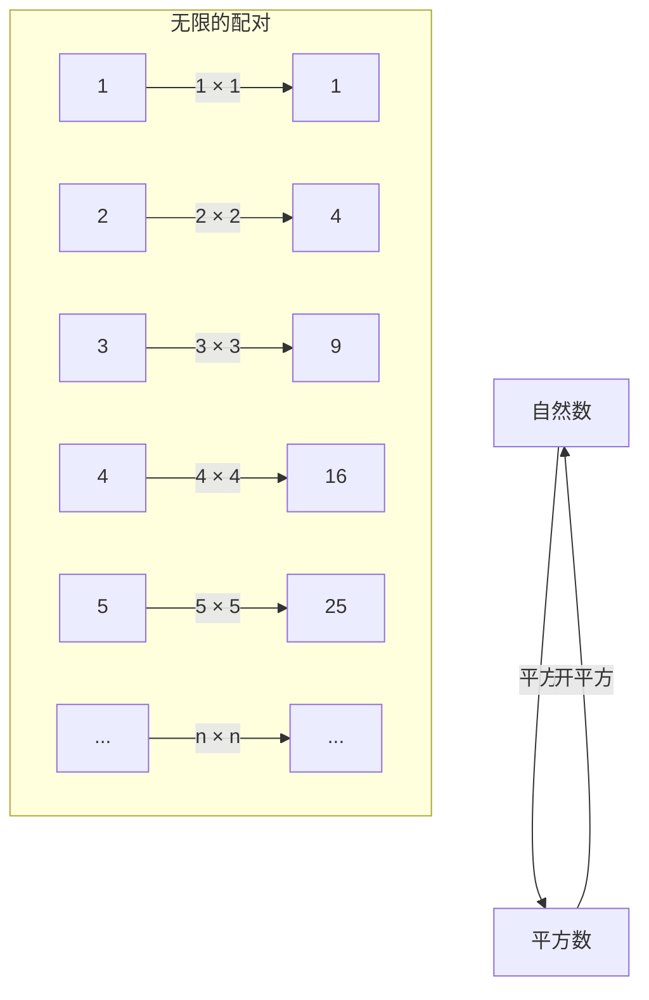
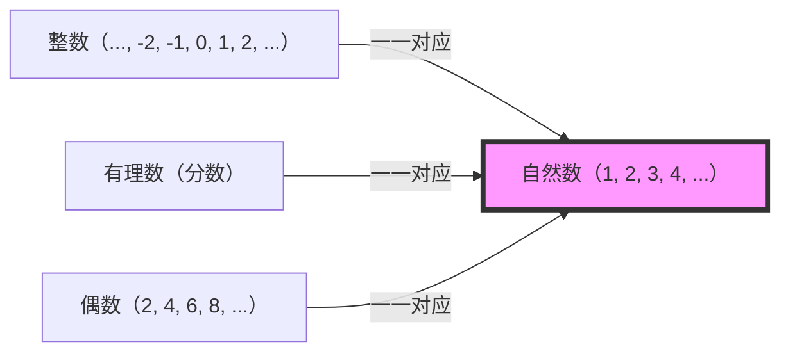

## 引言：名为无限的深渊

听到“无限”这个词，你会浮现出怎样的画面？无边无际的宇宙、永无止境的时间，亦或是数不尽的繁星……。人类自古以来就对“无限”的概念着迷，同时也怀有敬畏之心。

我们日常的直觉是在有限的世界中培养出来的。比如“有3个苹果”、“读完100页的书”等等，数量总是被视为有终点的事物。然而，一旦踏入数学的世界，我们就必须正面应对“无限”这个庞大的概念。

这一次，让我们深入探讨被誉为科学之父的伽利略·伽利莱（1564-1642）在晚年著作《关于两门新科学的对话》中提出的一个奇妙悖论。它被称为“伽利略悖论”，并成为连接后世数学家，特别是[格奥尔格·康托尔](/zh-cn/p/cantor/)的“集合论”，开启无限之门的重要钥匙。

在这篇文章中，我们将用数千字详细解说“无限”概念的奇妙之处、它与数学直觉的偏差，以及人类超越这一切的智慧。请务必加入这场智力冒险之旅。

---

## 什么是伽利略悖论？

说到伽利略·伽利莱，他是一位因提倡日心说、使用望远镜进行天文观测以及落体定律而闻名的伟大科学家，但他在数学和哲学方面也留下了深刻的见解。

他发现的“无限悖论”始于一个非常简单的问题。

**“所有自然数（1, 2, 3, 4, ...）”和“所有平方数（1, 4, 9, 16, ...）”，哪一个更多？**

按照我们的直觉，答案显而易见。“自然数显然更多”。因为自然数中包含了大量不是平方数的数字（2, 3, 5, 6, 7, 8...）。平方数似乎只是自然数这个巨大集合中的“极小一部分”。

著名的希腊数学家[欧几里得](/zh-cn/p/euclid/)的公理中也有一句话叫**“整体大于部分”**。这个公理在有限的世界中是绝对不可动摇的真理。从10个苹果中拿出3个，剩下7个。原来的10个（整体）显然大于拿出的3个（部分）。

然而，伽利略在这里注意到了一个事实。

### 1对1的对应关系（一一对应）

伽利略指出，对于每一个自然数，必定存在唯一一个“其平方数”；反之，对于每一个平方数，必定存在唯一一个“其平方根（原来的自然数）”。

正如该图所示，如果将自然数 $n$ 与平方数 $n^2$ 结合起来，它们可以完美地配对，没有任何剩余。
如果两个群体（集合）的元素之间可以完美配对且没有剩余，我们就不得不说这两个群体的元素“数量（个数）”是**相等**的。

例如，在舞会上想数男性和女性的人数时，不需要逐个数，如果所有人都能配成男女对且没有人剩下，就能知道“男性和女性的人数是一样的”。

将这一点应用到伽利略的发现中，就会得出**“自然数的个数”和“平方数的个数”完全相等**的结论。

- 直觉：“自然数比平方数多”（整体大于部分）
- 逻辑：“自然数和平方数的数量相同”（可以一一对应）

这种常识与逻辑发生正面冲突的状态，正是“伽利略悖论”。

---

## 悖论意味着什么

伽利略本人对这个悖论得出了什么结论呢？
在他的著作中，他让登场人物之一的萨尔维亚蒂这样说道：

> “我们必须得出结论，‘多’、‘少’、‘相等’这些词只应应用于有限的量，而不应应用于无限的量。”

也就是说，伽利略认为，“在无限的世界里，比较大小或数量的想法本身就会崩溃”。他认为“无限没有大小”，从而避免了进一步的深入研究。

在当时的数学框架下，这可以说是最妥当和明智的判断。在某种意义上，将有限世界的规则（整体大于部分）带入无限世界是危险的，这种直觉是正确的。

然而，数学的历史并没有在这里停止。大约250年后的19世纪下半叶，一位天才数学家正面迎击了这个名为“无限”的怪物。他就是[格奥尔格·康托尔](/zh-cn/p/cantor/)。

---

## 格奥尔格·康托尔与集合论的诞生

康托尔在被伽利略认为“无法比较”而放弃的无限世界中，开辟了新的领域。他创造了“集合（Sets）”的概念，试图证明无限也有“大小（势：Cardinality）”。

康托尔思想的根本，正是伽利略发现的**“一一对应（双射：Bijection）”**方法。
康托尔扩展了一一对应的概念，并作出了如下定义：

**“当两个集合A和B之间可以建立一一对应关系时，A和B的元素数量（势）是相等的”**

如果接受这个定义，伽利略悖论就不再是悖论了。
“所有自然数”这个集合与“所有平方数”这个集合都拥有无限的元素，但它们的“无限的大小（势）”是**完全相等**的。

更令人惊讶的是，自然数与“所有偶数”、“所有奇数”，甚至“所有整数”和“所有有理数（可以表示为分数的数）”之间，都可以建立一一对应关系，因此证明了它们都是**“与自然数大小相同的无限”**。

康托尔使用希伯来字母的第一个字母“阿列夫（$\aleph$）”，将能够与自然数建立一一对应关系的集合的无限大小命名为**阿列夫零（$\aleph_0$）**。这是在数学上定义的第一个“无限的尺寸”。

### “整体大于部分”这一公理的崩溃

到这里，明确了有限世界的常识——即[欧几里得](/zh-cn/p/euclid/)的公理“整体大于部分”，在无限的世界中是不成立的。

在现代数学（集合论）中，无限集合甚至被定义为：
**“能与自身的真子集（真切小于整体的部分）建立一一对应关系的集合，被称为无限集合”**

也就是说，被伽利略视为悖论的“部分与整体相等”的性质，恰恰升华为定义无限本质的属性本身。

---

## 无限存在层级：康托尔的对角线论证法

自然数、偶数、整数、有理数……当我们知道这些都是相同大小的无限（阿列夫零）时，我们可能会这样想：
“说到底，所有的无限不都是一样大吗？”

然而，康托尔发现了更令人震惊的事实。他证明了**“实数（数轴上的所有数）”**的集合，**真切地大于**自然数的集合。

为了证明这一点，他使用了著名的**“康托尔对角线论证法”**。
简单来说，这是一种反证法：“如果假设所有实数（这里以0和1之间的小数为例）能够与自然数进行一对一对应并列出清单，那么必然能创造出一个遗漏在该清单之外的新实数”。

由于这一发现，确定了无限也是有“大小”之分的。
与自然数或有理数的无限（可数无限：可以数出来的无限）相比，实数的无限（连续统：无法数出来的无限）是更为巨大的无限。

伽利略认为“无限无法比较”的直觉被康托尔打破，并揭示了无限之中存在着无尽的“无限之塔（阿列夫层级）”。

---

## 从伽利略悖论中学到的东西

伽利略悖论不仅是单纯的文字游戏或诡辩。它告诉我们，人类的“直觉”是如何受限于有限的日常经验（有限世界）的。

1. **认识直觉的局限**
   我们的大脑是为了处理有限物体而进化的。因此，当我们涉足“无限”领域时，即使逻辑上是正确的，也会产生强烈的违和感（悖论）。科学和数学的进步，往往始于接受这种对“直觉的背叛”。

2. **坚信逻辑的勇气**
   伽利略虽然注意到了一一对应的事实，但受限于时代的局限而止步不前。然而，康托尔认为“既然逻辑这么说，哪怕违背直觉也应该接受它”，并构建了甚至被称为疯狂的新理论（集合论）。结果，为现代数学和计算机科学奠定了坚实的基础。

3. **重新定义概念**
   面对悖论时，突破口不是回避它，而是重新审视词语或概念本身的定义。将“元素数量多意味着什么”这一根本定义替换为“一一对应”，悖论便不再是悖论，一个新的数学世界也随之开启。

## 结语

伽利略·伽利莱在17世纪写下的“自然数和平方数的奇妙关系”，跨越了数百年的时间，在处理无限的现代数学中开花结果。

“无限”这个概念，至今仍隐藏着许多谜团。“在自然数的无限和实数的无限之间，是否存在其他大小的无限？”这个问题（[连续统假设](/zh-cn/p/continuum-hypothesis/)），在当今的数学公理体系中达到了“既不能证明也不能证伪”的惊人结论。

宇宙的尽头是怎样的？时间会永远持续吗？而在数学世界中延展的无限层级的尽头又有什么呢？伽利略悖论象征着人类智慧的伟大：尽管我们是有限的存在，却能够通过思考触及“无限”。

下次当你仰望夜空时，不妨思索一下伽利略透过望远镜看到的无限宇宙，以及他在脑海中构想的“数字的无限”吧。
