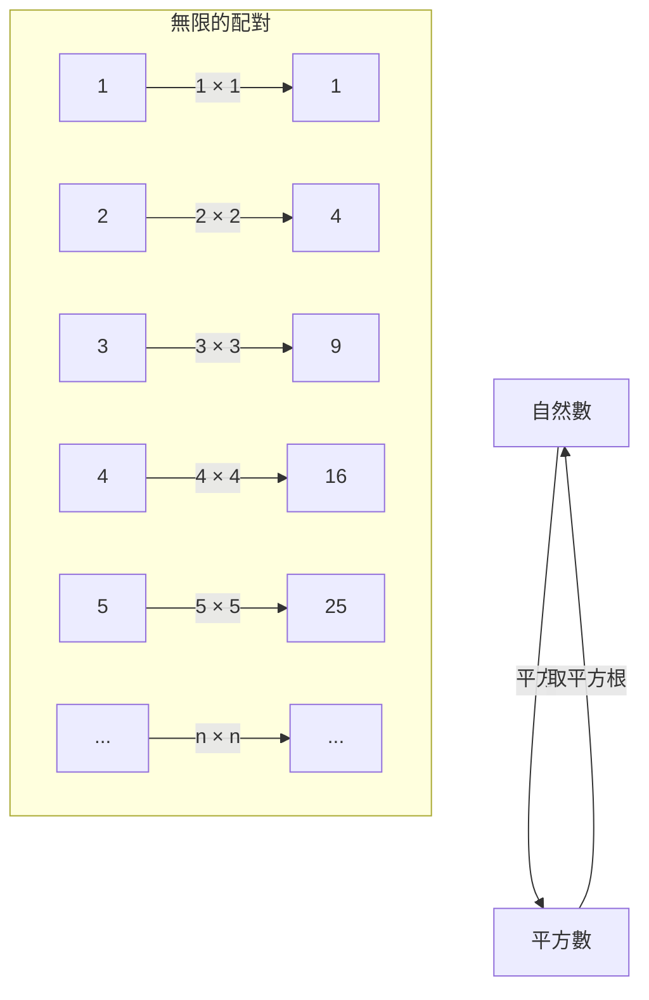
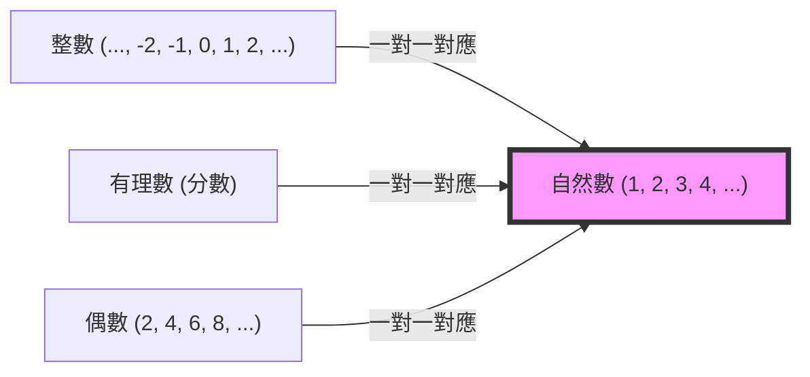

## 前言：名為無限的深淵

聽到「無限」這個詞，你會在腦海中浮現什麼樣的畫面？是無邊無際的宇宙、永無止境的時間，還是數不清的繁星……？自古以來，人類就對「無限」的概念深深著迷，同時也抱持著敬畏之心。

我們的日常直覺是在有限的世界中培養出來的。例如「有 3 顆蘋果」、「讀一本 100 頁的書」，數字總是被視為有盡頭的事物。然而，一旦踏入數學的世界，我們就必須正面迎擊「無限」這個驚人的概念。

這次，讓我們來深入探討被譽為科學之父的伽利略·伽利萊（1564-1642）在晚年的著作《關於兩門新科學的對話》中提出的奇妙悖論。它被稱為「伽利略的悖論」，並成為開啟無限之門的關鍵鑰匙，進而連結到後世數學家，特別是格奧爾格·康托爾的「集合論」。

在這篇數千字的文章中，我們將盡可能詳細地解說「無限」這個概念的奧秘、與數學直覺的落差，以及人類克服這些問題的智慧。請務必與我們一同踏上這趟充滿知性的冒險之旅。

---

## 什麼是伽利略的悖論？

提到伽利略·伽利萊，大家會想到他是提出地動說、使用望遠鏡觀測天體，以及發現落體定律的偉大科學家，但其實他在數學和哲學領域也留下了深刻的見解。

他所發現的「無限悖論」，始於一個非常簡單的問題。

**「全體自然數（1, 2, 3, 4, ...）」與「全體平方數（1, 4, 9, 16, ...）」，哪一個比較多？**

按照我們的直覺，答案顯而易見。應該是「自然數壓倒性地比較多」。因為在自然數中，包含了許許多多非平方數的數字（2, 3, 5, 6, 7, 8...）。平方數看起來只是自然數這個巨大集合中的「極小部分」。

著名的希臘數學家歐幾里得的公理中也有一句話：**「整體大於部分」**。這條公理在有限的世界裡是絕對無法動搖的真理。從 10 顆蘋果中取出 3 顆，剩下 7 顆。原本的 10 顆（整體）顯然比取出的 3 顆（部分）還要大。

然而，伽利略在這裡注意到了某個事實。

### 一對一的對應關係（一對一對應）

伽利略指出，對於每一個自然數，必定只存在一個「它的平方數」；反之，對於每一個平方數，也必定只存在一個「它的平方根（原來的自然數）」。

正如這張圖所示，將自然數 $n$ 與其平方數 $n^2$ 連結起來，雙方都不會有任何剩餘，可以完美地配對。
如果兩個群體（集合）的元素能一個不漏地完美配對，我們就不得不說這兩個群體元素的「數量（個數）」是**相等**的。

舉例來說，在舞會中想計算男性和女性的人數時，不必一個一個去數，只要所有人都能組成一男一女的舞伴而沒有人落單，就能知道「男性和女性的人數是一樣的」。

將這個概念套用到伽利略的發現中，就會導出**「自然數的個數」與「平方數的個數」完全相等**的結論。

- 直覺：「自然數比平方數多」（整體大於部分）
- 邏輯：「自然數和平方數的數量相同」（可建立一對一對應）

這種常識與邏輯正面衝突的狀態，正是「伽利略的悖論」。

---

## 悖論所代表的意義

伽利略本人對這個悖論得出了什麼結論呢？
他在著作中，讓其中一位登場人物薩爾維亞蒂說出了下面這段話：

> 「我們必須得出這樣的結論：『多』、『少』、『相等』這些詞彙只應適用於有限的量，而不該適用於無限的量。」

換言之，伽利略認為「在無限的世界裡，比較大小或個數的想法本身就已經破滅了」。他以「無限沒有大小之分」為由，避免了進一步的深究。

在當時的數學框架下，這是最妥當且明智的判斷。將有限世界的規則（整體大於部分）帶入無限世界是很危險的，這種直覺在某種意義上可以說是正確的。

然而，數學的歷史並沒有停留在這裡。大約 250 年後，到了 19 世紀後半葉，一位天才數學家正面迎擊了「無限」這頭怪物。他就是格奧爾格·康托爾（Georg Cantor）。

---

## 格奧爾格·康托爾與集合論的誕生

康托爾在伽利略以「無法比較」為由而放棄的無限世界中，劃下了嶄新的一刀。他創造了「集合（Sets）」的概念，試圖證明無限也有「大小（基數：Cardinality）」。

康托爾思想的根本，正是伽利略所發現的**「一對一對應（雙射：Bijection）」**手法。
康托爾擴展了一對一對應的概念，並做出以下定義：

**「當兩個集合 A 與 B 之間能建立一對一對應時，A 與 B 的元素數量（基數）相等。」**

如果接受這個定義，伽利略的悖論就不再是悖論了。
「全體自然數」這個集合與「全體平方數」這個集合，兩者都擁有無限的元素，但它們的「無限大小（基數）」是**完全相等**的。

更令人驚訝的是，自然數與「全體偶數」、「全體奇數」，甚至是「全體整數」和「全體有理數（能用分數表示的數）」之間，也能建立一對一對應，因此它們被證明全都是**「與自然數大小相同的無限」**。

康托爾將能與自然數建立一對一對應的集合的無限大小，使用希伯來字母的第一個字母「阿列夫（$\aleph$）」，命名為**阿列夫零（$\aleph_0$）**。這是數學上第一個被定義出的「無限尺寸」。

### 「整體大於部分」這項公理的崩壞

在此，有限世界的常識——歐幾里得「整體大於部分」的公理，在無限世界中不成立的事實已變得非常明確。

在現代數學（集合論）中，無限集合甚至可以被這樣定義：
**「能與自身的真部分集合（真正小於整體的部分）建立一對一對應的集合，稱為無限集合。」**

也就是說，伽利略認為是悖論的「部分與整體變得相等」的性質，正是將無限之所以為無限的本質定義，進行了昇華。

---

## 無限也有階層：康托爾的對角線論證

當我們得知自然數、偶數、整數、有理數……全都是一樣大小的無限（阿列夫零）時，我們可能會這樣想：
「說到底，難道所有的無限都是一樣大的嗎？」

然而，康托爾發現了更具衝擊性的事實。他證明了**「實數（數線上的所有數）」**的集合，比自然數的集合**真正地更大**。

用來證明這個論點的，就是著名的**「康托爾的對角線論證」**。
簡單來說，這是一種歸謬法：「假設所有實數（在此假設為 0 到 1 之間的小數）能與自然數建立一對一對應並列出清單，我們必定能創造出一個不在這份清單上的全新實數。」

透過這個發現，確定了無限存在著「大小」。
實數的無限（連續統：不可數的無限）遠比自然數或有理數的無限（可數無限：能數得清的無限）還要巨大得多。

伽利略認為「無限無法比較」的直覺被康托爾打破，無限之中存在著無窮無盡的「無限之塔（阿列夫的階層）」一事，也變得明朗起來。

---

## 從伽利略的悖論中學到的事

伽利略的悖論並不只是單純的文字遊戲或歪理。它告訴我們，人類的「直覺」是如何受到有限的日常經驗（有限的世界）所束縛。

1. **認知直覺的極限**
   我們的大腦是為了處理有限的物體而演化出來的。因此，當我們踏入「無限」的領域時，即使邏輯上是正確的，我們仍會感到強烈的違和感（悖論）。科學與數學的進步，往往就是從接受這些「違反直覺」的事物開始的。

2. **堅持相信邏輯的勇氣**
   伽利略雖然注意到了一對一對應的事實，卻因為時代的局限而停下腳步。然而，康托爾認為「既然邏輯是這麼說的，即使違反直覺也該接受」，並建構了甚至被稱為瘋狂的新理論（集合論）。結果，他完成了構成現代數學與電腦科學根基的堅固基礎。

3. **概念的重新定義**
   當面臨悖論時，不去逃避它，而是重新檢視詞彙與概念的定義本身，這將成為突破口。將「元素的數量較多是什麼意思」這個根本定義替換成「一對一對應」後，悖論就不再是悖論，嶄新的數學世界也隨之開啟。

## 結語

伽利略·伽利萊在 17 世紀留下的「自然數與平方數的不可思議關係」，跨越了數百年的時光，在處理無限的現代數學中開花結果。

無限這個概念，至今仍隱藏著許多謎團。「在自然數的無限與實數的無限之間，是否存在著另一種大小的無限？」這個問題（連續統假設），在目前的數學公理系統中，已達到「既無法證明也無法反證」這個令人驚訝的結論。

宇宙的盡頭是什麼模樣？時間會永遠持續下去嗎？還有，在數學世界裡展開的無限階層的盡頭又有什麼？伽利略的悖論，象徵著人類身為有限的存在，卻能透過思考觸及「無限」，這正是人類智慧偉大之處的絕佳例證。

下次仰望夜空時，不妨試著去想像伽利略透過望遠鏡窺探到的無限宇宙，以及他在腦海中描繪出的「數字的無限」吧。
