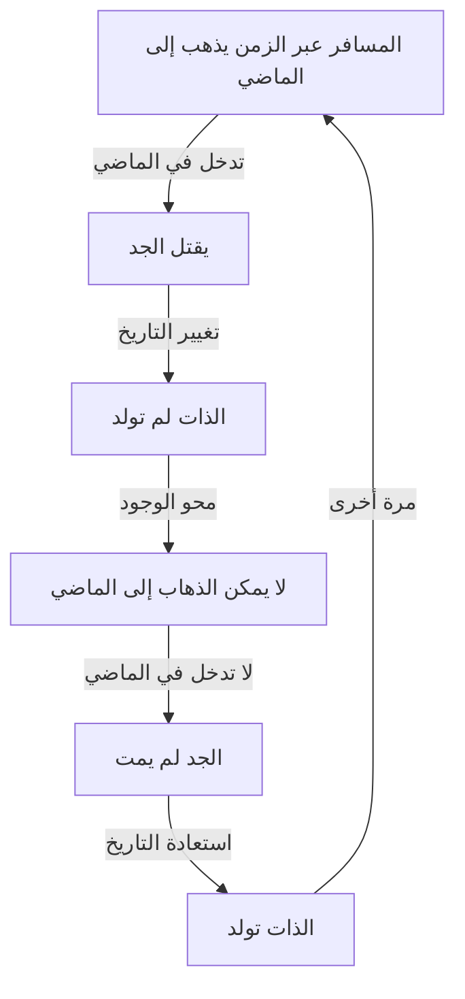
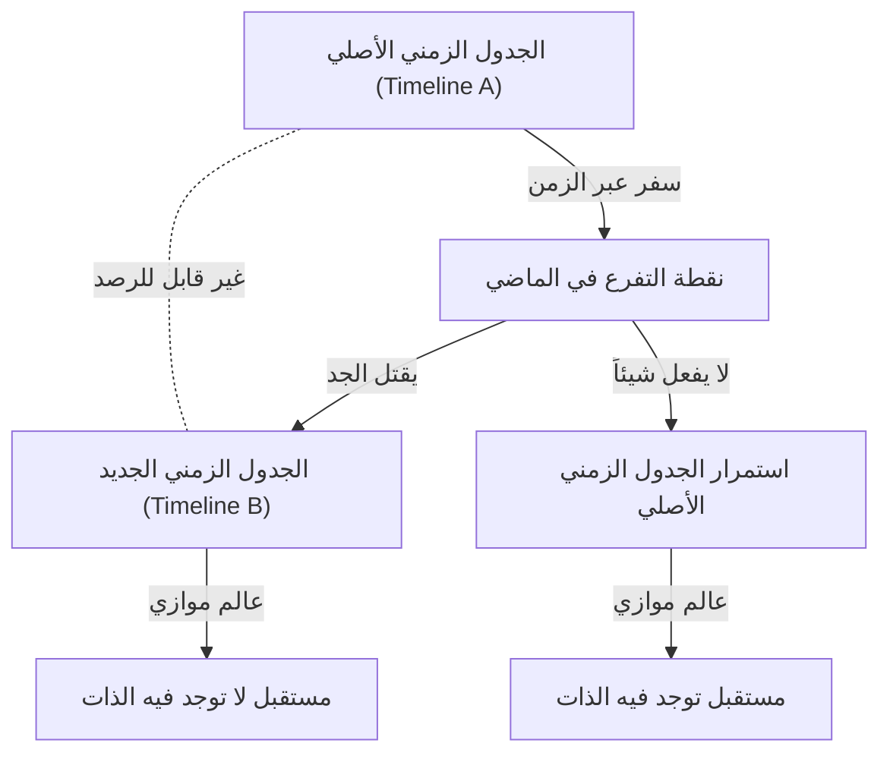

# مقدمة: حلم عبور الزمن ومفارقاته

لطالما كان لدى البشرية افتتان قوي بـ "عبور الزمن". بدءاً من رواية "آلة الزمن" لـ إتش جي ويلز، كان السفر عبر الزمن موضوعاً رئيسياً في العديد من أعمال الخيال العلمي. في القرن العشرين، أثبتت النظرية النسبية لألبرت أينشتاين أن الزمن ليس مطلقاً، بل نسبياً، حيث يتمدد ويتقلص اعتماداً على حالة حركة المراقب ومجال الجاذبية. أدى هذا إلى الارتقاء بالسفر عبر الزمن ليصبح "موضوعاً قابلاً للدراسة الفيزيائية".

ومع ذلك، بافتراض أن السفر عبر الزمن إلى الماضي ممكن، تبرز مشكلة خطيرة تؤدي إلى انهيار منطقي. هذه هي "مفارقة الجد" (Grandfather Paradox)، وهي الأشهر والأكثر تعقيداً من بين العديد من المفارقات المتعلقة بالسفر عبر الزمن.

في هذا المقال، سنتعمق في مفارقة الجد، من تعريفها وبنيتها المنطقية إلى الحلول المختلفة التي تقدمها الفيزياء الحديثة (مثل تفسير العوالم المتعددة، ومبدأ الاتساق الذاتي لنوفيكوف).

---

# هل السفر عبر الزمن ممكن فيزيائياً؟

## النسبية الخاصة والنسبية العامة
وفقاً للنظرية النسبية الخاصة لأينشتاين، يمر الزمن بشكل أبطأ داخل مركبة فضائية تتحرك بسرعة قريبة من سرعة الضوء مقارنة بمراقب يقف ثابتاً على الأرض. هذا يشير إلى أن السفر عبر الزمن إلى المستقبل ممكن.

من ناحية أخرى، أظهرت النسبية العامة أن الجاذبية تشوه الزمكان. بالقرب من كتلة هائلة (مثل الثقب الأسود)، يتقدم الزمن ببطء شديد.

## رحلة إلى الماضي: المنحنيات المغلقة الشبيهة بالزمن (CTC)
لوصف السفر عبر الزمن إلى الماضي، هناك حاجة إلى بنية زمكانية تسمى "المنحنى المغلق الشبيه بالزمن". إنه مسار في الزمكان حيث العودة فيه تؤدي في النهاية إلى نقطة البداية في الماضي.

بعض الحلول الشهيرة التي توجد فيها هذه المنحنيات تشمل: أسطوانة تيبلر، والثقوب الدودية.

---

# البنية المنطقية لـ "مفارقة الجد"

"مفارقة الجد" هي تجربة فكرية ظهرت بشكل متكرر في روايات الخيال العلمي. شكلها الأساسي كالتالي:

> "لنفترض أن شخصاً عاد بالزمن وقتل جده قبل أن يولد أحد والديه. إذا مات الجد، فلن يولد الوالد. وإذا لم يولد الوالد، فإن الشخص نفسه لن يولد. وإذا لم يولد الشخص، فلن يتمكن من صنع آلة زمن، والعودة إلى الماضي، وقتل جده. وإذا لم يقتل أحد الجد، فإن الجد ينجو، ويولد الوالد، ويولد الشخص أيضاً. ثم يعود بالزمن مرة أخرى ليقتل الجد..."

يقع هذا المنطق في حلقة مفرغة، مما يدمر السببية (السبب والنتيجة) تماماً.

لنتصور بنية هذه المفارقة باستخدام مخطط Mermaid التالي:

هذا الانهيار في السببية قاتل للفيزياء، لأن القوانين الفيزيائية مبنية أساساً على السببية.

---

# المناهج النظرية لتجنب المفارقة

## الحل الأول: تفسير العوالم المتعددة (الأكوان الموازية)

يطبق هذا الحل تفسير العوالم المتعددة في ميكانيكا الكم. وفقاً لهذه النظرية، في اللحظة التي يصل فيها المسافر عبر الزمن إلى الماضي ويتسبب في تغيير، يتفرع الزمكان إلى قسمين: "الجدول الزمني الأصلي" و"الجدول الزمني الجديد المعدل".

في هذا النموذج، قتل المسافر "الجد في الخط الزمني B". هذا يزيل التناقضات المنطقية تماماً.

## الحل الثاني: مبدأ الاتساق الذاتي لنوفيكوف

يفترض هذا المبدأ أن "قوانين الفيزياء لا تسمح بظهور تناقضات في جميع أنحاء الزمكان". بعبارة أخرى، "من المستحيل فيزيائياً تغيير الماضي".
إذا عاد مسافر عبر الزمن وأراد إطلاق النار على جده، فسيفشل حتماً: ستتعطل البندقية، أو يخطئ الهدف.

## الحل الثالث: قوة الشفاء للزمكان

فكرة أن الزمكان نفسه يكره المفارقات، وحتى لو تم إجراء تعديلات طفيفة، فإن التاريخ "يتقارب" بحيث لا تتغير أحداث المستقبل الكلية بشكل كبير.

---

# الفلسفة ومشكلة الإرادة الحرة

تطرح مفارقة الجد أسئلة فلسفية عميقة. هل يمتلك البشر إرادة حرة؟ إذا كانت قوانين الكون تمنع المسافر دائماً من تغيير التاريخ، فهذا يعني أن الأفعال البشرية حتمية ومقدرة.

---

# خاتمة: هل الزمن حقاً خط مستقيم؟

مفارقة الجد هي تجربة فكرية تتحدى الإدراك البديهي بأن "الزمن يتدفق في اتجاه واحد". التفكير في هذه المفارقة قد يكون في حد ذاته سفراً متواضعاً عبر الزمن يحرر عقولنا من قيود الوقت.
