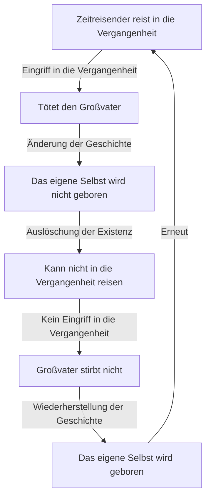
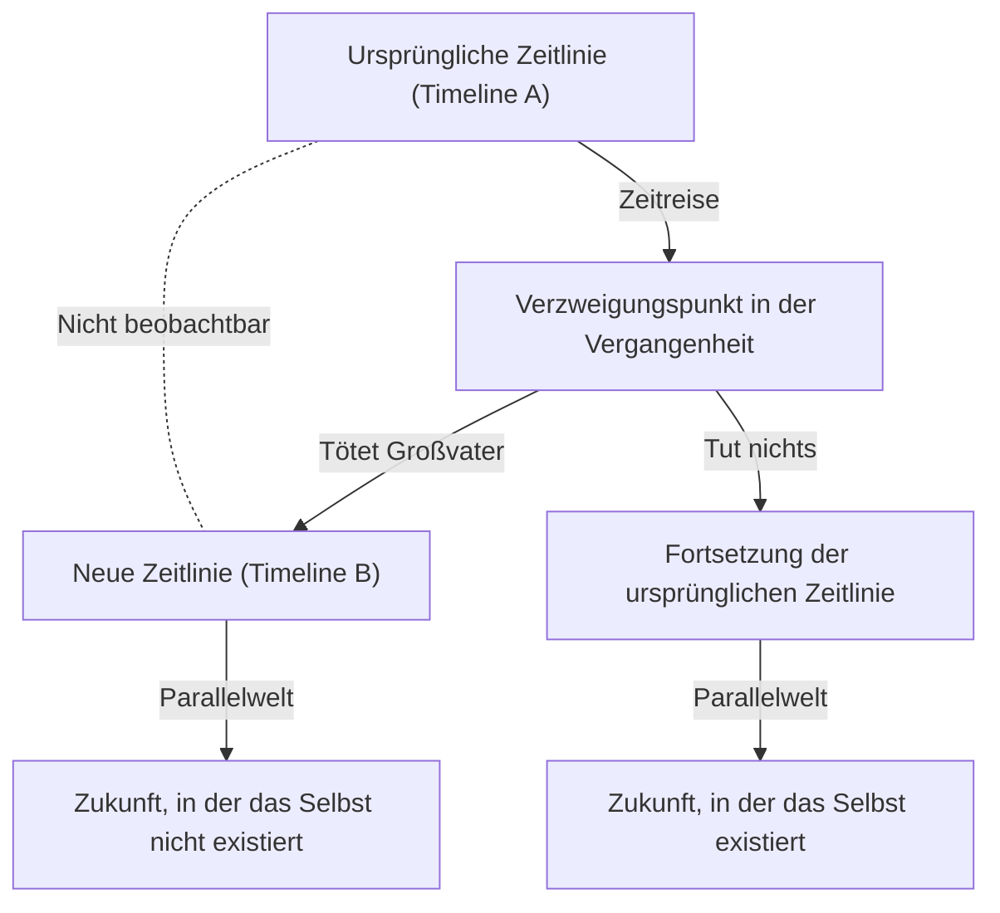

# Einleitung: Der Traum von der Zeitreise und seine Paradoxien

Die Menschheit hat seit langem eine starke Faszination für das "Durchqueren der Zeit". Beginnend mit H.G. Wells' *Die Zeitmaschine* war die Zeitreise ein Hauptthema in zahlreichen Science-Fiction-Literatur- und Filmwerken. Sie blieb jedoch nicht nur ein Produkt der Phantasie. Im 20. Jahrhundert bewies Albert Einsteins Relativitätstheorie, dass Zeit nicht absolut, sondern relativ ist und sich je nach Bewegungszustand des Beobachters und dem Gravitationsfeld dehnt und zusammenzieht. Dies erhob die Zeitreise zu einem "Gegenstand physikalischer Betrachtung".

Nimmt man jedoch an, dass eine Zeitreise in die Vergangenheit (rückwärtsgerichtete Zeitreise) möglich ist, entsteht ein ernstes Problem, das zu einem logischen Zusammenbruch führt. Dies ist das "Großvaterparadoxon", das berühmteste und problematischste der vielen Paradoxien im Zusammenhang mit Zeitreisen.

In diesem Artikel werden wir uns so tief wie möglich mit dem Großvaterparadoxon befassen, von seiner Definition und logischen Struktur bis hin zu den verschiedenen Lösungen, die von der modernen Physik präsentiert werden (wie die Viele-Welten-Interpretation, das Novikov-Selbstkonsistenzprinzip und quantenmechanische Ansätze).

---

# Ist Zeitreise physikalisch möglich?

Bevor wir das Großvaterparadoxon diskutieren, klären wir, wie die Zeitreise in die Vergangenheit im Rahmen der modernen Physik behandelt wird.

## Spezielle Relativitätstheorie und Allgemeine Relativitätstheorie

Gemäß Einsteins spezieller Relativitätstheorie vergeht die Zeit in einem Raumschiff, das sich mit nahezu Lichtgeschwindigkeit bewegt, langsamer im Vergleich zu einem stillstehenden Beobachter auf der Erde. Dies zeigt, dass eine Zeitreise in die Zukunft theoretisch und praktisch möglich ist (tatsächlich wird diese Zeitverzögerung bei GPS-Satelliten korrigiert).

Andererseits zeigte die allgemeine Relativitätstheorie, dass Gravitation die Raumzeit verzerrt. In der Nähe einer enormen Masse (wie in der Nähe des Ereignishorizonts eines Schwarzen Lochs) vergeht die Zeit extrem langsam. All dies sind jedoch "Einwegreisen in die Zukunft".

## Reise in die Vergangenheit: Geschlossene zeitartige Kurven (CTC)

Um die Zeitreise in die Vergangenheit physikalisch zu beschreiben, ist eine Raumzeitstruktur namens "Geschlossene zeitartige Kurve (CTC)" erforderlich. Eine CTC ist eine Trajektorie in der Raumzeit, bei der man, wenn man in die Zukunft geht, schließlich an seinen Ausgangspunkt in der Vergangenheit zurückkehrt.

Zu den bekannten Lösungen, bei denen CTCs existieren, gehören:

1. **Gödel-Metrik**: Im Jahr 1949 zeigte der Mathematiker Kurt Gödel, dass die Gleichungen der allgemeinen Relativitätstheorie CTCs zulassen, wenn wir annehmen, dass das gesamte Universum rotiert.
2. **Tipler-Zylinder**: Im Jahr 1974 zeigte Frank Tipler, dass man in die Vergangenheit reisen könnte, indem man in einer bestimmten Bahn um einen unendlich langen, ultradichten, schnell rotierenden Zylinder kreist.
3. **Wurmlöcher**: Kip Thorne und andere zeigten, dass ein Tunnel, der zwei entfernte Punkte in der Raumzeit verbindet (ein "Wurmloch"), als Zeitmaschine funktionieren könnte, wenn er durch negative Energie (exotische Materie) stabilisiert wird.

Daher wird die Zeitreise in die Vergangenheit im mathematischen Rahmen der allgemeinen Relativitätstheorie nicht völlig geleugnet. Genau deshalb ist die Frage, wie logische Paradoxien vermieden werden können, Gegenstand ernsthafter Debatten unter Physikern.

---

# Die logische Struktur des "Großvaterparadoxons"

Das "Großvaterparadoxon" ist ein Gedankenexperiment, das in Science-Fiction-Romanen der 1920er und 1930er Jahre häufig auftauchte. Die grundlegendste Form lautet wie folgt:

> "Angenommen, eine Person reist mit einer Zeitmaschine in die Vergangenheit und tötet ihren Großvater, bevor ihr eigener Elternteil geboren wird. Wenn der Großvater stirbt, wird der Elternteil nicht geboren. Wenn der Elternteil nicht geboren wird, wird die Person selbst natürlich nicht geboren. Wenn die Person nicht geboren wird, kann sie keine Zeitmaschine bauen, in die Vergangenheit reisen und den Großvater töten. Wenn niemand den Großvater tötet, überlebt der Großvater, der Elternteil wird geboren, und auch die Person wird geboren. Dann reist sie wieder in die Vergangenheit, um den Großvater zu töten..."

Diese Logik führt zu einer Endlosschleife und zerstört die Kausalität (Ursache und Wirkung) vollständig.

Lassen Sie uns die Struktur dieses Paradoxons mit dem folgenden Mermaid-Diagramm visualisieren.

Dieses Paradoxon erfordert nicht zwingend einen "Großvater". Es tritt in allen Fällen auf, in denen eine Änderung eines Ereignisses in der Vergangenheit die Prämisse der aktuellen Handlungen aufhebt.

Dieser Zusammenbruch der Kausalität ist fatal für die Physik, da physikalische Gesetze grundlegend auf Kausalität aufbauen. Wenn dieses Paradoxon nicht gelöst werden kann, muss man folgern, dass Zeitreisen in die Vergangenheit logisch unmöglich sind.

---

# Theoretische Ansätze zur Vermeidung des Paradoxons

Wie vermeiden (oder lösen) Physik und Philosophie dieses Paradoxon? Es gibt hauptsächlich drei Ansätze.

## Lösung 1: Viele-Welten-Interpretation (Multiversum / Parallelwelten)

Der bekannteste Ansatz, der häufig in Sci-Fi-Werken angewendet wird, basiert auf der "Viele-Welten-Interpretation". Hierbei verzweigt sich die Raumzeit in dem Moment, in dem ein Zeitreisender eine Änderung verursacht, in zwei: die "ursprüngliche Zeitlinie" und die "geänderte neue Zeitlinie".

In diesem Modell tötete der Zeitreisende den "Großvater in Timeline B". Daher wurde der Zeitreisende in Timeline A normal geboren und reiste mit der Zeitmaschine in die Vergangenheit von Timeline B. Diese Lösung beseitigt logische Widersprüche perfekt.

## Lösung 2: Novikov-Selbstkonsistenzprinzip

Ein weiterer starker Ansatz ist das "Novikov-Selbstkonsistenzprinzip". Es geht davon aus, dass "physikalische Gesetze keine Widersprüche in der gesamten Raumzeit zulassen".

Wenn ein Zeitreisender in die Vergangenheit reist, um seinen Großvater zu erschießen, wird er unweigerlich scheitern:
- Die Waffe klemmt.
- Er verfehlt sein Ziel.
- Der Großvater war in Wirklichkeit jemand anderes.

Nach Novikovs Prinzip wirkt die Wahrscheinlichkeitsverteilung des gesamten Universums so, dass "die Wahrscheinlichkeit von paradoxieauslösenden Handlungen auf null gesetzt wird".

## Lösung 3: Die Heilkraft der Raumzeit (Selbstheilende Zeitlinie)

Ein Sci-Fi-Ansatz ist das Konzept der "Selbstheilungskraft der Geschichte". Selbst wenn der Großvater getötet wird, kommt ein anderer Mann mit der Großmutter zusammen, und durch Zufall entsteht jemand, der dem Zeitreisenden extrem ähnlich ist.

---

# Philosophie und das Problem des freien Willens

Das Großvaterparadoxon wirft philosophische Fragen auf: "Haben Menschen einen freien Willen?"
Wenn ein Zeitreisender trotz eines perfekten Plans immer von den Gesetzen des Universums behindert wird, bedeutet das, dass menschliche Handlungen determiniert sind.
Die Viele-Welten-Interpretation bietet hier eine Rettung, bringt aber neue existenzielle Ängste mit sich.

---

# Fazit: Ist die Zeit wirklich eine gerade Linie?

Das Großvaterparadoxon hinterfragt unsere intuitive Wahrnehmung, dass "Zeit eindimensional fließt". Durch die Diskussion dieses Paradoxons erkennen wir die Schönheit der logischen Struktur unseres Universums und die Fragilität der menschlichen Existenz. Das Nachdenken darüber ist vielleicht selbst eine kleine Zeitreise, die unseren Verstand befreit.
