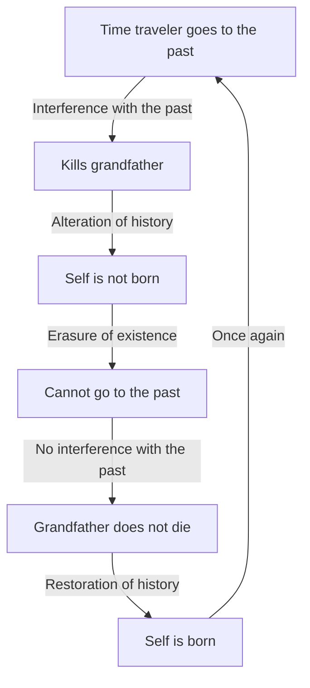
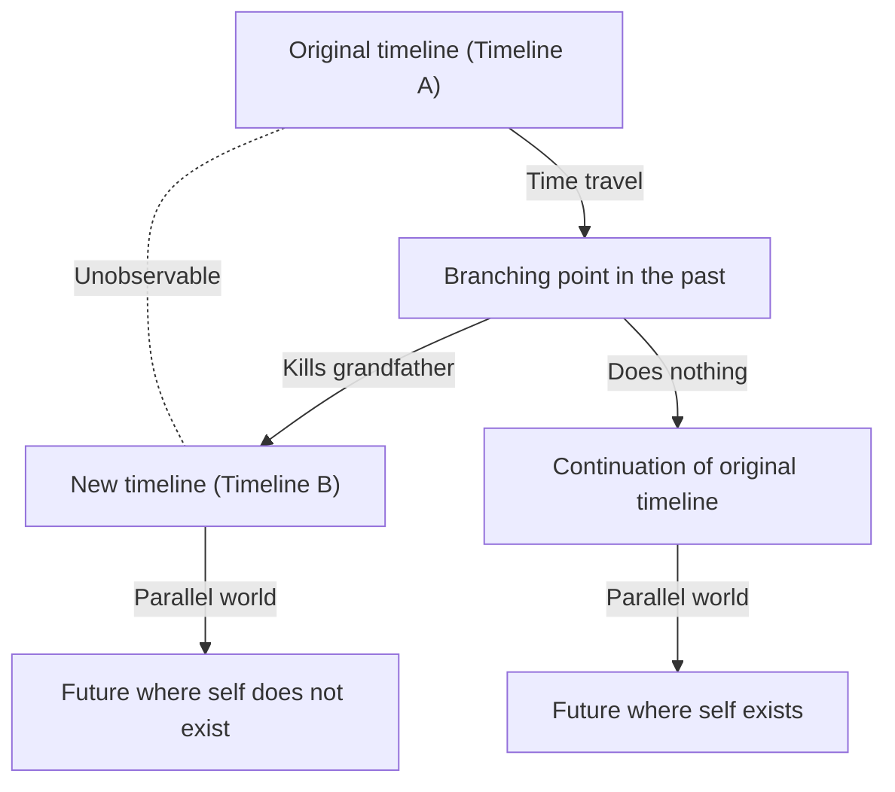

# Introduction: The Dream of Crossing Time and Its Paradoxes

Humanity has long held a strong fascination with "crossing time." Starting with H.G. Wells' *The Time Machine*, time travel has been a major theme in numerous sci-fi literature and films. However, it did not remain merely a product of fantasy. In the 20th century, Albert Einstein's theory of relativity proved that time is not absolute but relative, stretching and shrinking depending on the observer's state of motion and gravitational field. This elevated time travel to an "object of physical consideration."

However, assuming time travel to the past (backward time travel) is possible, a severe problem arises that leads to logical collapse. This is the "Grandfather Paradox," the most famous and troublesome among the many paradoxes related to time travel.

In this article, we will delve as deeply and in as much detail as possible into the grandfather paradox, from its definition and logical structure to the various solutions presented by modern physics (such as the many-worlds interpretation, Novikov's self-consistency principle, and quantum mechanical approaches).

---

# Is Time Travel Physically Possible?

Before discussing the grandfather paradox, let's clarify how time travel to the past is handled within the framework of modern physics.

## Special Relativity and General Relativity

According to Einstein's special theory of relativity, time passes more slowly inside a spaceship moving at a speed close to the speed of light compared to an observer standing still on Earth. This indicates that time travel to the future is theoretically and practically possible (indeed, this time delay is corrected in GPS satellites, etc.).

On the other hand, the general theory of relativity showed that gravity distorts spacetime. Near a massive mass (like near the event horizon of a black hole), time progresses extremely slowly. However, these are all "one-way trips to the future."

## Journey to the Past: Closed Timelike Curves (CTC)

To physically describe time travel to the past, a spacetime structure called a "Closed Timelike Curve (CTC)" is necessary. A CTC is a trajectory in spacetime where moving forward into the future eventually returns you to your starting point in the past.

Some famous solutions where CTCs exist include:

1. **Gödel metric**: In 1949, mathematician Kurt Gödel showed that if we assume the entire universe is rotating, the equations of general relativity allow for CTCs.
2. **Tipler cylinder**: In 1974, Frank Tipler showed that one could travel back in time by orbiting in a specific trajectory around an infinitely long, ultra-dense, rapidly rotating cylinder.
3. **Wormholes**: Kip Thorne and others showed that a tunnel connecting two distant points in spacetime, a "wormhole," could function as a time machine if stabilized by negative energy (exotic matter) and one end is moved at a speed close to light and then returned.

Thus, within the mathematical framework of general relativity, time travel to the past is not completely denied. This is exactly why how to avoid logical paradoxes is the subject of serious debate among physicists.

---

# The Logical Structure of the "Grandfather Paradox"

The "Grandfather Paradox" is a thought experiment that frequently appeared in sci-fi novels from the 1920s to the 1930s. The most basic form is as follows:

> "Suppose a person goes back in time using a time machine and kills their grandfather before their own parent is born. If the grandfather dies, the parent is not born. If the parent is not born, the person themselves naturally is not born. If the person is not born, they cannot build a time machine, go back in time, and kill the grandfather. If no one kills the grandfather, the grandfather survives, the parent is born, and the person is also born. Then they go back in time again to kill the grandfather..."

This logic falls into an infinite loop, completely destroying causality (cause and effect).

Let's visualize the structure of this paradox with the following Mermaid diagram.

This paradox does not necessarily require a "grandfather." It occurs in all cases where altering a past event removes the premise of one's current actions, such as "going back to destroy the time machine itself," "killing one's past self (autoinfanticide paradox)," or "assassinating Hitler."

This collapse of causality is fatal for physics. This is because physical laws are basically built on causality, where if the initial conditions are determined, the subsequent state is determined (or probabilistically predictable). If this paradox cannot be resolved, one must conclude that time travel to the past is logically impossible (Stephen Hawking's "Chronology Protection Conjecture" takes this stance).

---

# Theoretical Approaches to Avoid the Paradox

So, assuming time travel to the past is possible, how do physics and philosophy avoid (or resolve) this paradox? There are primarily three prominent approaches.

## Solution 1: Many-Worlds Interpretation (Multiverse / Parallel Worlds)

The most famous approach, frequently adopted in sci-fi works, is based on the "Many-Worlds Interpretation." This applies Everett's many-worlds interpretation, a quantum mechanical interpretation, to the branching of macro-time axes.

According to this theory, the moment a time traveler arrives in the past and causes a change (like killing the grandfather), spacetime branches into two: the "original timeline" and the "altered new timeline."

In this model, the time traveler killed the "grandfather in Timeline B," while the "grandfather in Timeline A" is safe. Therefore, the time traveler was normally born in Timeline A and traveled to the past of Timeline B via the time machine. The time traveler themselves will not be born in the future of Timeline B, but the time traveler who came from Timeline A will continue to live in Timeline B.

This solution perfectly eliminates logical contradictions. Because the cause (arrival from Timeline A) and the effect (the grandfather's death in Timeline B) belong to different universes, a causal loop does not occur. Physicists like David Deutsch have mathematically suggested using quantum computing models that such a quantum superposition of states (effectively many worlds) will inevitably occur in spacetimes where CTCs exist.

## Solution 2: Novikov's Self-Consistency Principle

Another powerful approach is the "Novikov self-consistency principle" proposed by Russian physicist Igor Novikov.

This principle assumes that "physical laws do not allow contradictions to arise, either locally or globally, throughout spacetime." In other words, the idea is that "it is physically impossible to change the past."

If a time traveler goes back in time and pulls the trigger to shoot their grandfather, they will inevitably fail for some reason.
- The gun jams.
- The aim is off, only grazing his shoulder.
- The person thought to be the grandfather was actually someone else.
- The very act of the time traveler going to the past was actually a necessary part of history for their own birth (a closed causal loop = bootstrap paradox).

According to Novikov's principle, the probability distribution of the entire universe acts to "make the probability of actions causing paradoxes zero." Therefore, the time traveler either has no "free will" to change history, or their actions resulting from free will ultimately act to complete history.
Kip Thorne and others calculated the "billiard ball paradox," where a billiard ball travels back in time through a wormhole and collides with its past self to deflect its trajectory, proving that regardless of the initial conditions, a "consistent trajectory (such as a trajectory that just grazes and successfully enters the time machine)" always exists (a self-consistent solution).

## Solution 3: The Healing Power of Spacetime (Self-Healing Timeline)

A more sci-fi approach discussed in recent years is the concept of "history's self-healing power." This is the idea that spacetime itself dislikes paradoxes, and even if minor alterations are made, history "converges" so that macro future events do not change significantly.

For example, even if the grandfather is killed, another man gets together with the grandmother, and through a coincidence of genetics and environmental factors, history is adjusted so that a being extremely close to the original time traveler (or someone who inherits their soul and role) is born. This can be said to be an application of the concept of "attractors" in chaos theory and complex systems to history, rather than strict physics.

---

# Philosophy and the Problem of Free Will

The grandfather paradox poses deep philosophical questions as well as being a physical problem. Particularly when premising "Novikov's self-consistency principle," the classic problem resurfaces: "Do humans have Free Will?"

If, despite a time traveler going back in time with a strong will of "I will absolutely kill my grandfather" and a perfect plan, they are always obstructed by the laws of the universe (probability distribution), it means that human actions are destined and deterministically predetermined. Are the "choices" we make every day actually just pieces of a giant spacetime puzzle, mere puppets meant to maintain the overall consistency?

The many-worlds interpretation offers one salvation to this problem of free will. Since all possible choices are realized in their respective parallel universes, one is freed from deterministic constraints within a single universe. However, at the same time, it causes another existential anxiety: "There are countless versions of me living the choices I didn't make."

---

# Conclusion: Is Time Really a Straight Line?

The grandfather paradox is a thought experiment that cuts sharply into the intuitive perception we usually accept as a given: "Time flows one way from the past to the future."

Just as Einstein remarked, "The distinction between past, present, and future is only a stubbornly persistent illusion," at the forefront of modern physics (such as block universe theory), the view that all time already exists simultaneously in the spacetime continuum is influential.

What emerges through the discussion surrounding the grandfather paradox is not just the possibility of time travel itself, but the beauty of the logical structure of this universe we live in, and the fragility of human consciousness and the concept of causality. We do not know if the day will come when a time machine is invented. However, the very act of thinking about this paradox might be a modest form of time travel, freeing our intellect from the bounds of time.
