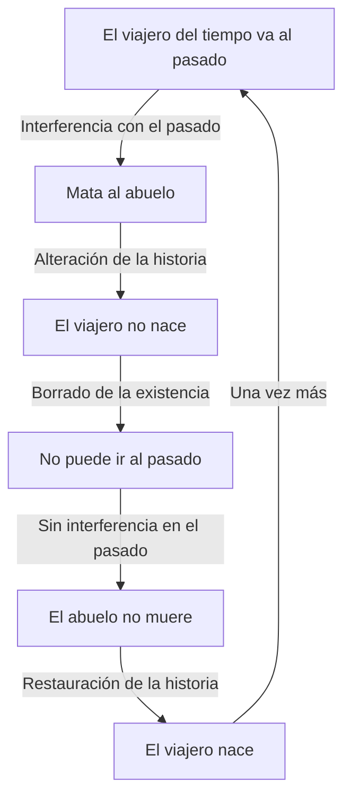
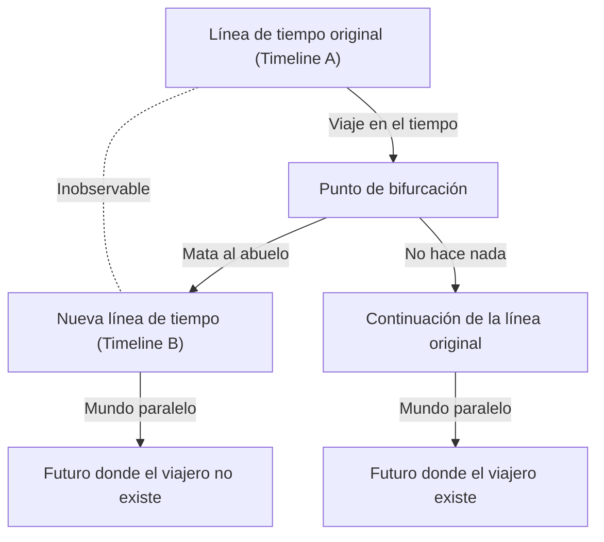

# Introducción: El sueño de cruzar el tiempo y sus paradojas

La humanidad siempre ha sentido una fuerte fascinación por "cruzar el tiempo". Comenzando con *La máquina del tiempo* de H.G. Wells, el viaje en el tiempo ha sido un tema principal en numerosas obras de literatura y películas de ciencia ficción. Sin embargo, no se quedó solo en un producto de la fantasía. En el siglo XX, la teoría de la relatividad propuesta por Albert Einstein demostró que el tiempo no es absoluto, sino relativo, estirándose y encogiéndose dependiendo del estado de movimiento del observador y el campo gravitacional. Esto elevó el viaje en el tiempo a un "objeto de estudio físico".

Sin embargo, asumiendo que el viaje en el tiempo hacia el pasado es posible, surge un grave problema que lleva al colapso lógico. Esta es la "Paradoja del abuelo" (Grandfather Paradox), la más famosa y problemática de las paradojas relacionadas con el viaje en el tiempo.

En este artículo, profundizaremos en la paradoja del abuelo, desde su definición y estructura lógica hasta las diversas soluciones presentadas por la física moderna (como la interpretación de los muchos mundos, el principio de autoconsistencia de Novikov y enfoques mecano-cuánticos).

---

# ¿Es físicamente posible viajar en el tiempo?

Antes de discutir la paradoja del abuelo, aclaremos cómo se maneja el viaje al pasado en el marco de la física moderna.

## Relatividad Especial y Relatividad General

Según la teoría de la relatividad especial de Einstein, el tiempo pasa más lentamente dentro de una nave espacial que se mueve a una velocidad cercana a la de la luz en comparación con un observador quieto en la Tierra. Esto indica que el viaje en el tiempo hacia el futuro es teórica y prácticamente posible (de hecho, este retraso temporal se corrige en los satélites GPS).

Por otro lado, la teoría de la relatividad general demostró que la gravedad distorsiona el espacio-tiempo. Cerca de una masa enorme (como cerca del horizonte de sucesos de un agujero negro), el tiempo avanza de manera extremadamente lenta. Sin embargo, todos estos son "viajes de ida hacia el futuro".

## Viaje al pasado: Curvas Temporales Cerradas (CTC)

Para describir físicamente el viaje al pasado, es necesaria una estructura del espacio-tiempo llamada "Curva Temporal Cerrada (CTC)". Una CTC es una trayectoria en el espacio-tiempo donde, al avanzar hacia el futuro, terminas regresando a tu punto de partida en el pasado.

Algunas soluciones famosas donde existen las CTC incluyen:

1. **Métrica de Gödel**: En 1949, el matemático [Kurt Gödel](/es/p/godel/) demostró que si asumimos que todo el universo está rotando, las ecuaciones de la relatividad general permiten las CTC.
2. **Cilindro de Tipler**: En 1974, Frank Tipler demostró que uno podría retroceder en el tiempo orbitando en una trayectoria específica alrededor de un cilindro infinitamente largo, ultradenso y que gira rápidamente.
3. **Agujeros de gusano**: Kip Thorne y otros demostraron que un túnel que conecta dos puntos distantes en el espacio-tiempo, un "agujero de gusano", podría funcionar como una máquina del tiempo si se estabiliza mediante energía negativa (materia exótica) y uno de los extremos se mueve a una velocidad cercana a la de la luz y luego regresa.

Por lo tanto, dentro del marco matemático de la relatividad general, el viaje al pasado no se niega por completo. Es precisamente por eso que la forma de evitar las paradojas lógicas es un tema de serio debate entre los físicos.

---

# La estructura lógica de la "Paradoja del abuelo"

La "Paradoja del abuelo" es un experimento mental que apareció con frecuencia en las novelas de ciencia ficción de las décadas de 1920 y 1930. Su forma más básica es la siguiente:

> "Supongamos que una persona viaja al pasado en una máquina del tiempo y asesina a su abuelo antes de que nazca su padre. Si el abuelo muere, el padre no nacerá. Si el padre no nace, la persona misma naturalmente no nace. Si la persona no nace, no puede construir una máquina del tiempo, viajar al pasado y matar a su abuelo. Si nadie mata al abuelo, el abuelo sobrevive, nace el padre y también nace la persona. Luego, viajan al pasado nuevamente para matar al abuelo..."

Esta lógica cae en un bucle infinito, destruyendo completamente la causalidad (causa y efecto).

Visualicemos la estructura de esta paradoja con el siguiente diagrama Mermaid.

Esta paradoja no requiere necesariamente de un "abuelo". Ocurre en todos los casos donde alterar un evento pasado elimina la premisa de las acciones actuales de uno, como "volver para destruir la propia máquina del tiempo", "matar al propio yo del pasado (paradoja de la autoinfanticidio)" o "asesinar a Hitler".

Este colapso de la causalidad es fatal para la física. Esto se debe a que las leyes físicas se construyen básicamente sobre la causalidad, donde si se determinan las condiciones iniciales, se determina el estado posterior (o se puede predecir probabilísticamente). Si esta paradoja no se puede resolver, se debe concluir que el viaje en el tiempo al pasado es lógicamente imposible (la "Conjetura de protección de la cronología" de Stephen Hawking adopta esta postura).

---

# Enfoques teóricos para evitar la paradoja

Entonces, asumiendo que el viaje en el tiempo al pasado es posible, ¿cómo evita (o resuelve) la física y la filosofía esta paradoja? Existen principalmente tres enfoques destacados.

## Solución 1: Interpretación de los Muchos Mundos (Multiverso / Mundos Paralelos)

El enfoque más famoso, frecuentemente adoptado en obras de ciencia ficción, se basa en la "Interpretación de los Muchos Mundos". Aplica la interpretación de los muchos mundos de Everett en la mecánica cuántica a la ramificación de los ejes macro-temporales.

Según esta teoría, en el momento en que un viajero del tiempo llega al pasado y causa un cambio (como matar al abuelo), el espacio-tiempo se bifurca en dos: la "línea de tiempo original" y la "nueva línea de tiempo alterada".

En este modelo, el viajero del tiempo mató al "abuelo en la Timeline B", mientras que el "abuelo en la Timeline A" está a salvo. Por lo tanto, el viajero del tiempo nació normalmente en la Timeline A y viajó al pasado de la Timeline B en la máquina del tiempo. El viajero del tiempo en sí no nacerá en el futuro de la Timeline B, pero el viajero del tiempo que provino de la Timeline A seguirá viviendo en la Timeline B.

Esta solución elimina perfectamente las contradicciones lógicas. Debido a que la causa (la llegada desde la Timeline A) y el efecto (la muerte del abuelo en la Timeline B) pertenecen a universos diferentes, no se produce un bucle causal. Físicos como David Deutsch han sugerido matemáticamente utilizando modelos de computación cuántica que tal superposición cuántica de estados (efectivamente muchos mundos) ocurrirá inevitablemente en los espacios-tiempos donde existen las CTC.

## Solución 2: Principio de Autoconsistencia de Novikov

Otro enfoque poderoso es el "Principio de autoconsistencia de Novikov", propuesto por el físico ruso Igor Novikov.

Este principio asume que "las leyes de la física no permiten que surjan contradicciones, ni local ni globalmente, en todo el espacio-tiempo". En otras palabras, la idea es que "es físicamente imposible cambiar el pasado".

Si un viajero del tiempo retrocede en el tiempo y aprieta el gatillo para dispararle a su abuelo, inevitablemente fracasará por alguna razón.
- El arma se atasca.
- La puntería falla, solo rozándole el hombro.
- La persona que se pensaba que era el abuelo era en realidad otra persona.
- El acto mismo del viajero del tiempo de ir al pasado era en realidad una parte necesaria de la historia para su propio nacimiento (un bucle causal cerrado = paradoja de la predeterminación).

Según el principio de Novikov, la distribución de probabilidad de todo el universo actúa para "hacer que la probabilidad de acciones que causen paradojas sea cero". Por lo tanto, el viajero del tiempo no tiene "libre albedrío" para cambiar la historia, o las acciones resultantes de su libre albedrío finalmente actúan para completar la historia.
Kip Thorne y otros calcularon la "paradoja de la bola de billar", donde una bola de billar viaja al pasado a través de un agujero de gusano y choca consigo misma para desviar su trayectoria, demostrando que independientemente de las condiciones iniciales, siempre existe una "trayectoria consistente" (como una trayectoria que simplemente roza y entra exitosamente a la máquina del tiempo).

## Solución 3: El poder curativo del espacio-tiempo (Línea de tiempo autocurativa)

Un enfoque más de ciencia ficción discutido en años recientes es el concepto del "poder curativo de la historia". Esta es la idea de que al espacio-tiempo en sí no le gustan las paradojas, e incluso si se realizan alteraciones menores, la historia "converge" de modo que los eventos macro futuros no cambien significativamente.

Por ejemplo, incluso si se mata al abuelo, otro hombre se junta con la abuela, y por una coincidencia genética y factores ambientales, la historia se ajusta para que nazca un ser extremadamente parecido al viajero del tiempo original (o alguien que hereda su alma y su rol). Esto se puede considerar como una aplicación del concepto de "atractores" en la teoría del caos y los sistemas complejos a la historia, más que como física estricta.

---

# La filosofía y el problema del libre albedrío

La paradoja del abuelo plantea profundas cuestiones filosóficas, además de ser un problema físico. Particularmente cuando se parte del "Principio de autoconsistencia de Novikov", resurge el problema clásico: "¿Tienen los humanos libre albedrío?".

Si, a pesar de que un viajero del tiempo retroceda en el tiempo con una fuerte voluntad de "mataré absolutamente a mi abuelo" y un plan perfecto, siempre se ve obstaculizado por las leyes del universo (distribución de probabilidades), significa que las acciones humanas están predeterminadas y regidas por el determinismo. ¿Son las "elecciones" que hacemos cada día en realidad solo piezas de un gigantesco rompecabezas del espacio-tiempo, meras marionetas destinadas a mantener la coherencia general?

La interpretación de los muchos mundos ofrece una salvación a este problema del libre albedrío. Como todas las elecciones posibles se realizan en sus respectivos universos paralelos, uno se libera de las restricciones deterministas dentro de un solo universo. Sin embargo, al mismo tiempo, provoca otra ansiedad existencial: "Hay innumerables versiones de mí viviendo las elecciones que no tomé".

---

# Conclusión: ¿Es el tiempo realmente una línea recta?

La paradoja del abuelo es un experimento mental que cuestiona profundamente la percepción intuitiva que solemos aceptar como un hecho: "El tiempo fluye en una sola dirección desde el pasado hacia el futuro".

Al igual que Einstein comentó: "La distinción entre pasado, presente y futuro es sólo una ilusión obstinadamente persistente", en la vanguardia de la física moderna (como la teoría del universo de bloque), influye la visión de que todo el tiempo ya existe simultáneamente en el continuo espacio-tiempo.

Lo que surge a través de la discusión en torno a la paradoja del abuelo no es solo la posibilidad del viaje en el tiempo en sí, sino la belleza de la estructura lógica de este universo en el que vivimos, y la fragilidad de la conciencia humana y del concepto de causalidad. No sabemos si llegará el día en que se invente una máquina del tiempo. Sin embargo, el mero acto de pensar sobre esta paradoja podría ser una forma modesta de viajar en el tiempo, liberando nuestro intelecto de las ataduras del tiempo.
