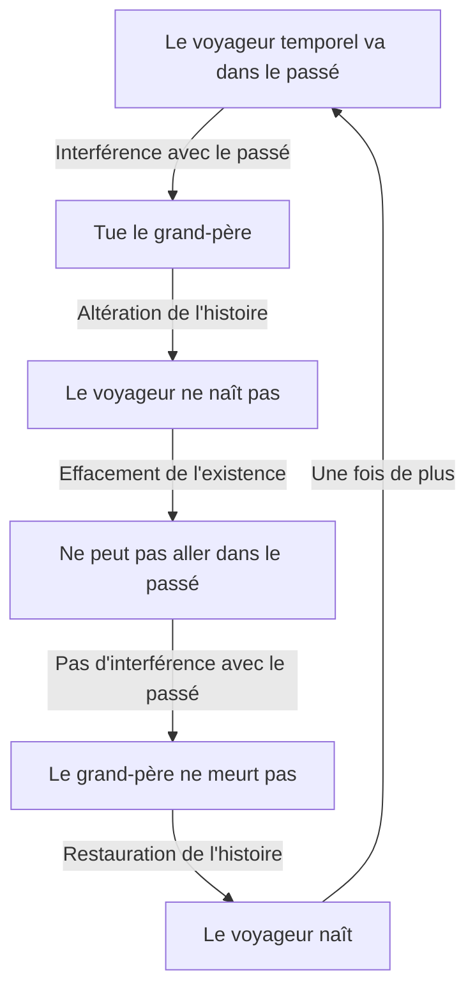
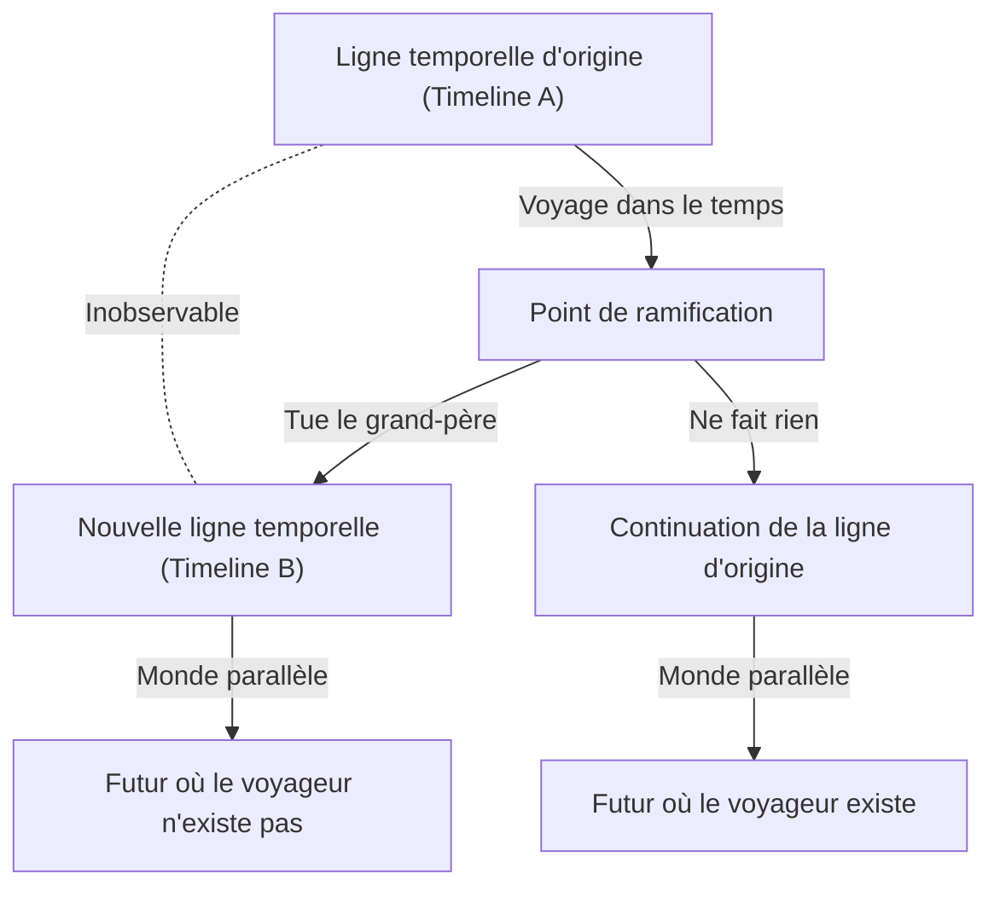

# Introduction : Le rêve de traverser le temps et ses paradoxes

L'humanité a depuis longtemps une forte fascination pour l'idée de « traverser le temps ». En commençant par *La Machine à explorer le temps* de H.G. Wells, le voyage dans le temps a été un thème majeur dans de nombreuses œuvres littéraires et cinématographiques de science-fiction. Cependant, il n'est pas resté un simple produit de l'imagination. Au 20ème siècle, la théorie de la relativité d'Albert Einstein a prouvé que le temps n'est pas absolu, mais relatif, s'étirant et se contractant selon l'état de mouvement de l'observateur et le champ gravitationnel. Cela a élevé le voyage dans le temps au rang d'« objet d'étude physique ».

Cependant, en supposant que le voyage dans le temps vers le passé (voyage rétrograde) soit possible, un grave problème se pose, conduisant à un effondrement logique. C'est le « Paradoxe du grand-père », le plus célèbre et le plus problématique des nombreux paradoxes liés au voyage dans le temps.

Dans cet article, nous explorerons en détail le paradoxe du grand-père, de sa définition et sa structure logique aux diverses solutions présentées par la physique moderne (telles que l'interprétation des mondes multiples, le principe d'autocohérence de Novikov et les approches de la mécanique quantique).

---

# Le voyage dans le temps est-il physiquement possible ?

Avant de discuter du paradoxe du grand-père, clarifions comment le voyage vers le passé est abordé dans le cadre de la physique moderne.

## Relativité restreinte et Relativité générale

Selon la théorie de la relativité restreinte d'Einstein, le temps s'écoule plus lentement à l'intérieur d'un vaisseau spatial se déplaçant à une vitesse proche de celle de la lumière par rapport à un observateur immobile sur Terre. Cela indique que le voyage vers le futur est théoriquement et pratiquement possible (en fait, ce retard temporel est corrigé dans les satellites GPS).

D'autre part, la théorie de la relativité générale a montré que la gravité déforme l'espace-temps. Près d'une masse énorme (comme près de l'horizon des événements d'un trou noir), le temps s'écoule extrêmement lentement. Cependant, il s'agit toujours de « voyages à sens unique vers le futur ».

## Voyage vers le passé : Courbes de genre temps fermées (CTC)

Pour décrire physiquement le voyage vers le passé, une structure de l'espace-temps appelée « courbe de genre temps fermée » (CTC) est nécessaire. Une CTC est une trajectoire dans l'espace-temps où, en avançant vers le futur, on finit par revenir à son point de départ dans le passé.

Quelques solutions célèbres où existent des CTC :

1. **Univers de Gödel** : En 1949, le mathématicien Kurt Gödel a montré que si l'on suppose que l'univers entier est en rotation, les équations de la relativité générale permettent l'existence de CTC.
2. **Cylindre de Tipler** : En 1974, Frank Tipler a montré qu'on pouvait remonter le temps en orbitant sur une trajectoire spécifique autour d'un cylindre infiniment long, ultra-dense et en rotation rapide.
3. **Trous de ver** : Kip Thorne et d'autres ont montré qu'un tunnel reliant deux points distants dans l'espace-temps, un « trou de ver », pourrait fonctionner comme une machine à voyager dans le temps s'il était stabilisé par de l'énergie négative (matière exotique) et qu'une de ses extrémités était déplacée à une vitesse proche de la lumière puis ramenée.

Ainsi, dans le cadre mathématique de la relativité générale, le voyage vers le passé n'est pas complètement nié. C'est précisément pour cela que la manière d'éviter les paradoxes logiques fait l'objet de débats sérieux parmi les physiciens.

---

# La structure logique du « Paradoxe du grand-père »

Le « Paradoxe du grand-père » est une expérience de pensée fréquemment apparue dans les romans de science-fiction des années 1920 et 1930. Sa forme la plus élémentaire est la suivante :

> « Supposons qu'une personne retourne dans le passé à l'aide d'une machine à voyager dans le temps et tue son grand-père avant la naissance de son parent. Si le grand-père meurt, le parent ne naîtra pas. Si le parent ne naît pas, la personne elle-même ne naîtra naturellement pas. Si la personne ne naît pas, elle ne peut pas construire de machine à voyager dans le temps, retourner dans le passé et tuer son grand-père. Si personne ne tue le grand-père, le grand-père survit, le parent naît et la personne naît également. Ensuite, elle retourne dans le passé pour tuer son grand-père... »

Cette logique tombe dans une boucle infinie, détruisant complètement la causalité (cause et effet).

Visualisons la structure de ce paradoxe avec le diagramme Mermaid suivant.

Ce paradoxe ne nécessite pas forcément un « grand-père ». Il se produit dans tous les cas où l'altération d'un événement passé supprime la prémisse des actions actuelles de la personne, comme « retourner détruire la machine à voyager dans le temps elle-même », « tuer son soi du passé (paradoxe de l'autoinfanticide) » ou « assassiner Hitler ».

Cet effondrement de la causalité est fatal pour la physique. Les lois de la physique sont en effet construites sur la causalité : si les conditions initiales sont déterminées, l'état futur est déterminé (ou prévisible de manière probabiliste). Si ce paradoxe ne peut être résolu, il faut conclure que le voyage vers le passé est logiquement impossible (la « conjecture de protection chronologique » de Stephen Hawking adopte cette position).

---

# Approches théoriques pour éviter le paradoxe

Ainsi, en supposant que le voyage vers le passé soit possible, comment la physique et la philosophie évitent-elles (ou résolvent-elles) ce paradoxe ? Il y a principalement trois grandes approches.

## Solution 1 : L'interprétation des mondes multiples (Multivers / Mondes parallèles)

L'approche la plus célèbre, fréquemment adoptée dans les œuvres de science-fiction, repose sur l'« Interprétation des mondes multiples ». Elle applique l'interprétation d'Everett en mécanique quantique à la ramification des axes temporels macroscopiques.

Selon cette théorie, au moment où un voyageur temporel arrive dans le passé et provoque un changement (comme tuer le grand-père), l'espace-temps se scinde en deux : la « ligne temporelle d'origine » et la « nouvelle ligne temporelle altérée ».

Dans ce modèle, le voyageur a tué le « grand-père de la Timeline B », tandis que le « grand-père de la Timeline A » est sain et sauf. Par conséquent, le voyageur est né normalement dans la Timeline A et a voyagé dans le passé de la Timeline B avec la machine. Le voyageur lui-même ne naîtra pas dans le futur de la Timeline B, mais le voyageur venu de la Timeline A continuera de vivre dans la Timeline B.

Cette solution élimine parfaitement les contradictions logiques. La cause (l'arrivée depuis la Timeline A) et l'effet (la mort du grand-père dans la Timeline B) appartenant à des univers différents, il n'y a pas de boucle causale.

## Solution 2 : Le principe d'autocohérence de Novikov

Une autre approche puissante est le « principe d'autocohérence de Novikov », proposé par le physicien russe Igor Novikov.

Ce principe suppose que « les lois de la physique ne permettent pas l'apparition de contradictions, ni localement ni globalement, dans tout l'espace-temps ». En d'autres termes, l'idée est qu'« il est physiquement impossible de changer le passé ».

Si un voyageur remonte le temps et appuie sur la gâchette pour abattre son grand-père, il échouera inévitablement pour une raison quelconque.
- Le pistolet s'enraye.
- Le tir dévie, ne faisant qu'érafler son épaule.
- La personne que l'on croyait être le grand-père était en fait quelqu'un d'autre.
- Le simple fait que le voyageur aille dans le passé était en fait une partie nécessaire de l'histoire pour sa propre naissance (boucle causale fermée = paradoxe de l'écrivain).

Selon le principe de Novikov, la distribution de probabilité de l'univers agit pour « rendre nulle la probabilité d'actions causant des paradoxes ». Ainsi, le voyageur n'a pas le « libre arbitre » de changer l'histoire, ou bien ses actions finissent par compléter l'histoire.

## Solution 3 : Le pouvoir de guérison de l'espace-temps (Ligne temporelle auto-cicatrisante)

Une approche plus proche de la science-fiction discutée ces dernières années est le concept du « pouvoir de guérison de l'histoire ». C'est l'idée que l'espace-temps lui-même n'aime pas les paradoxes, et que même si des altérations mineures sont apportées, l'histoire « converge » de sorte que les événements macroscopiques futurs ne changent pas de manière significative.

Par exemple, même si le grand-père est tué, un autre homme s'unit à la grand-mère et, par une coïncidence génétique et des facteurs environnementaux, l'histoire s'ajuste pour qu'un être extrêmement proche du voyageur d'origine (ou quelqu'un qui hérite de son âme et de son rôle) naisse. C'est une application des « attracteurs » de la théorie du chaos à l'histoire.

---

# La philosophie et le problème du libre arbitre

Le paradoxe du grand-père soulève également de profondes questions philosophiques. Particulièrement avec le « principe d'autocohérence de Novikov », le problème classique ressurgit : « Les humains ont-ils le libre arbitre ? ».

Si, malgré la volonté du voyageur de « tuer absolument son grand-père », il est toujours contrecarré par les lois de l'univers, cela signifie que les actions humaines sont déterministes. Nos « choix » ne sont-ils que des pièces d'un gigantesque puzzle spatio-temporel ?

L'interprétation des mondes multiples offre une forme de salut. Puisque tous les choix se réalisent dans des univers parallèles respectifs, on est libéré des contraintes déterministes d'un seul univers. Cependant, cela provoque une autre angoisse existentielle : « Il y a d'innombrables versions de moi vivant les choix que je n'ai pas faits ».

---

# Conclusion : Le temps est-il vraiment une ligne droite ?

Le paradoxe du grand-père est une expérience de pensée qui remet en question la perception que nous acceptons généralement : « Le temps s'écoule du passé vers le futur de manière unidirectionnelle ».

Comme l'a dit Einstein : « La distinction entre le passé, le présent et le futur n'est qu'une illusion obstinément persistante ». À la pointe de la physique moderne (théorie de l'univers-bloc), l'idée que tout le temps existe déjà simultanément dans le continuum espace-temps est influente.

Ce qui ressort de la discussion autour de ce paradoxe n'est pas seulement la possibilité du voyage dans le temps, mais la beauté de la structure logique de cet univers dans lequel nous vivons, et la fragilité de la conscience humaine. Nous ne savons pas si une machine à voyager dans le temps sera un jour inventée. Cependant, le simple fait de réfléchir à ce paradoxe pourrait être une forme modeste de voyage dans le temps, libérant notre intellect des contraintes du temps.
