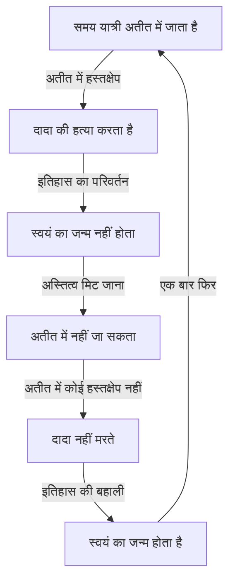
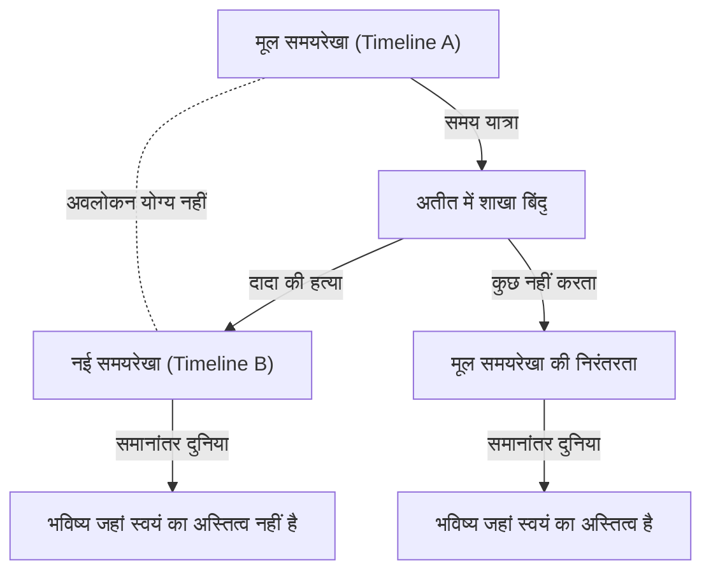

# परिचय: समय पार करने का सपना और इसके विरोधाभास

मानवता में प्राचीन काल से ही "समय पार करने" की तीव्र लालसा रही है। एच.जी. वेल्स की 'द टाइम मशीन' से शुरू होकर, समय यात्रा कई विज्ञान कथा साहित्य और फिल्मों में एक प्रमुख विषय रहा है। 20वीं सदी में, अल्बर्ट आइंस्टीन के सापेक्षता के सिद्धांत ने साबित कर दिया कि समय पूर्ण नहीं है, बल्कि सापेक्ष है, जो पर्यवेक्षक की गति की स्थिति और गुरुत्वाकर्षण क्षेत्र के आधार पर खिंचता और सिकुड़ता है। इसने समय यात्रा को "भौतिक रूप से विचारणीय विषय" में बदल दिया।

हालांकि, अगर हम यह मान लें कि अतीत में समय यात्रा संभव है, तो एक गंभीर समस्या उत्पन्न होती है जो तार्किक पतन की ओर ले जाती है। यह "दादा विरोधाभास" (Grandfather Paradox) है, जो समय यात्रा से संबंधित कई विरोधाभासों में सबसे प्रसिद्ध और सबसे अधिक परेशानी वाला है।

इस लेख में, हम दादा विरोधाभास पर विस्तार से चर्चा करेंगे, इसकी परिभाषा से लेकर आधुनिक भौतिकी द्वारा प्रस्तुत विभिन्न समाधानों तक।

---

# क्या समय यात्रा भौतिक रूप से संभव है?

## विशेष सापेक्षता और सामान्य सापेक्षता
आइंस्टीन के विशेष सापेक्षता के सिद्धांत के अनुसार, प्रकाश की गति के करीब की गति से चलने वाले अंतरिक्ष यान के अंदर का समय पृथ्वी पर खड़े पर्यवेक्षक की तुलना में धीमा हो जाता है। यह इंगित करता है कि भविष्य की यात्रा संभव है। 

दूसरी ओर, सामान्य सापेक्षता के सिद्धांत से पता चला है कि गुरुत्वाकर्षण अंतरिक्ष-समय को विकृत करता है। भारी द्रव्यमान (जैसे ब्लैक होल) के पास, समय बेहद धीमी गति से आगे बढ़ता है।

## अतीत की यात्रा: क्लोज्ड टाइमलाइक कर्व्स (CTC)
अतीत में समय यात्रा का भौतिक वर्णन करने के लिए, "क्लोज्ड टाइमलाइक कर्व (CTC)" नामक अंतरिक्ष-समय संरचना की आवश्यकता होती है। यह एक ऐसा प्रक्षेपवक्र है जहां भविष्य की ओर बढ़ते हुए आप अंततः अतीत में अपने शुरुआती बिंदु पर लौट आते हैं। 

गॉडेल का मेट्रिक, टिपलर सिलेंडर, और वर्महोल (Wormhole) ऐसे कुछ ज्ञात समाधान हैं जहां CTC मौजूद हो सकते हैं।

---

# "दादा विरोधाभास" की तार्किक संरचना

"दादा विरोधाभास" एक विचार प्रयोग (Thought experiment) है। इसका मूल रूप इस प्रकार है:

> "मान लीजिए एक व्यक्ति टाइम मशीन से अतीत में जाता है और अपने पिता के जन्म से पहले अपने दादा को मार डालता है। यदि दादा की मृत्यु हो जाती है, तो पिता का जन्म नहीं होता है। यदि पिता का जन्म नहीं होता है, तो वह व्यक्ति भी जन्म नहीं लेगा। यदि व्यक्ति पैदा ही नहीं हुआ है, तो वह टाइम मशीन नहीं बना सकता, अतीत में नहीं जा सकता, और दादा को नहीं मार सकता। यदि कोई दादा को नहीं मारता है, तो दादा जीवित रहता है, पिता पैदा होता है, और व्यक्ति भी पैदा होता है। फिर वह व्यक्ति फिर से अतीत में जाकर दादा को मार देता है..."

यह तर्क एक अनंत लूप (Infinite loop) में फंस जाता है, जिससे कार्य-कारण (Causality) पूरी तरह से नष्ट हो जाता है।

आइए इस विरोधाभास को निम्नलिखित मर्मेड (Mermaid) आरेख के साथ देखें:

यह विरोधाभास भौतिकी के लिए घातक है क्योंकि भौतिक नियम कारण और प्रभाव (Cause and Effect) पर आधारित हैं।

---

# विरोधाभास से बचने के लिए सैद्धांतिक दृष्टिकोण

## समाधान 1: कई-दुनिया की व्याख्या (Many-Worlds Interpretation)

यह सबसे प्रसिद्ध दृष्टिकोण है। इस सिद्धांत के अनुसार, जिस क्षण कोई समय यात्री अतीत में पहुंचता है और कोई बदलाव करता है, अंतरिक्ष-समय दो शाखाओं में विभाजित हो जाता है: "मूल समयरेखा" और "नई समयरेखा"।

इस मॉडल में, यात्री ने "टाइमलाइन बी" के दादा को मार डाला, जबकि "टाइमलाइन ए" के दादा सुरक्षित हैं। यह समाधान तार्किक अंतर्विरोधों को पूरी तरह से समाप्त कर देता है।

## समाधान 2: नोविकोव का आत्म-संगति सिद्धांत (Novikov's Self-Consistency Principle)

रूसी भौतिक विज्ञानी इगोर नोविकोव ने प्रस्ताव दिया कि "भौतिक नियम अंतरिक्ष-समय में कहीं भी विरोधाभास उत्पन्न होने की अनुमति नहीं देते हैं।" इसका मतलब है कि अतीत को बदलना भौतिक रूप से असंभव है।

यदि यात्री दादा को गोली मारने की कोशिश करता है, तो वह अनिवार्य रूप से विफल हो जाएगा:
- बंदूक जाम हो जाएगी।
- निशाना चूक जाएगा।
- वह व्यक्ति वास्तव में उसका दादा नहीं था।

इस सिद्धांत के अनुसार, यात्री के पास इतिहास बदलने की कोई "स्वतंत्र इच्छा (Free will)" नहीं है।

## समाधान 3: अंतरिक्ष-समय की उपचार शक्ति

एक अन्य विचार यह है कि अंतरिक्ष-समय स्वयं विरोधाभासों को नापसंद करता है। यदि कोई छोटा बदलाव किया भी जाता है, तो इतिहास ऐसे "समायोजित" हो जाता है कि मैक्रो स्तर पर भविष्य की घटनाएं महत्वपूर्ण रूप से नहीं बदलती हैं।

---

# दर्शन और स्वतंत्र इच्छा का प्रश्न

दादा विरोधाभास भौतिक होने के साथ-साथ दार्शनिक प्रश्न भी खड़े करता है। विशेषकर नोविकोव के सिद्धांत के साथ, यह सवाल उठता है: "क्या मनुष्यों के पास स्वतंत्र इच्छा है?" यदि ब्रह्मांड के नियम हमेशा यात्री को अतीत बदलने से रोकते हैं, तो इसका अर्थ है कि हमारे कार्य पूर्व निर्धारित हैं। कई-दुनिया की व्याख्या इसका समाधान देती है, लेकिन अस्तित्व संबंधी अन्य चिंताओं को जन्म देती है।

---

# निष्कर्ष

दादा विरोधाभास एक विचार प्रयोग है जो हमारी इस सहज धारणा को चुनौती देता है कि "समय अतीत से भविष्य की ओर एक दिशा में बहता है।"

जैसा कि आइंस्टीन ने कहा था, "अतीत, वर्तमान और भविष्य के बीच का अंतर केवल एक माया है।" समय यात्रा संभव होगी या नहीं, यह हम नहीं जानते। लेकिन इस विरोधाभास के बारे में विचार करना ही अपने आप में एक छोटी सी समय यात्रा है, जो हमारी बुद्धि को समय के बंधनों से मुक्त करती है।
