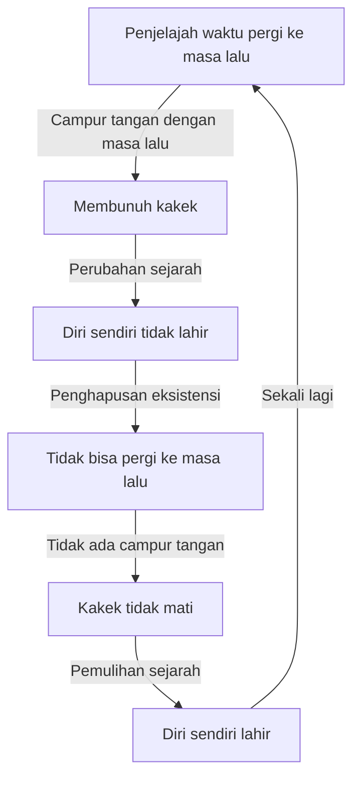
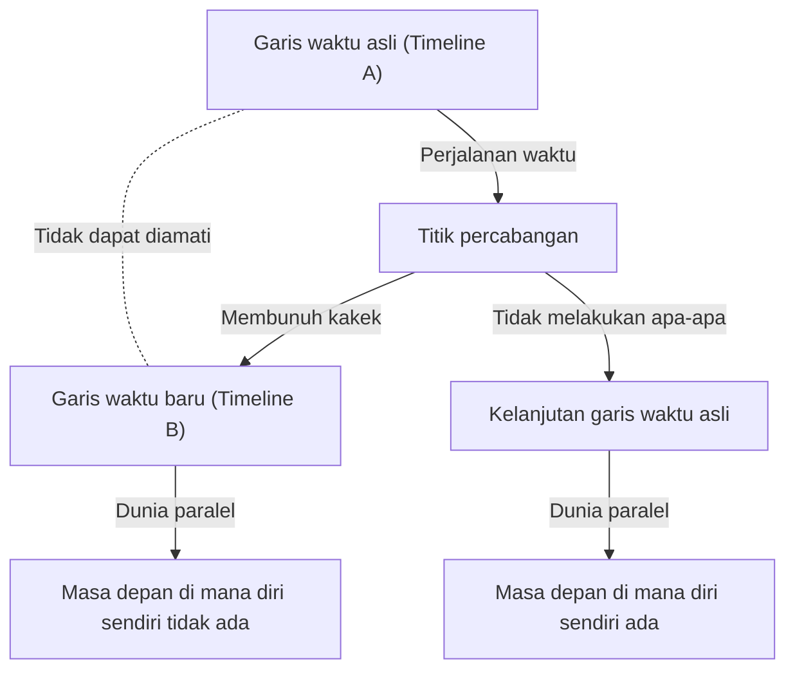

# Pendahuluan: Impian Melintasi Waktu dan Paradoksnya

Umat manusia telah lama memiliki ketertarikan yang kuat untuk "melintasi waktu". Pada abad ke-20, teori relativitas Albert Einstein membuktikan bahwa waktu tidak mutlak, tetapi relatif. Ini mengangkat perjalanan waktu menjadi "objek pertimbangan fisik".

Namun, dengan asumsi bahwa perjalanan waktu ke masa lalu itu mungkin, muncul masalah serius yang mengarah pada keruntuhan logis. Ini adalah "Paradoks Kakek" (Grandfather Paradox).

Dalam artikel ini, kita akan mempelajari paradoks kakek, dari definisi dan struktur logisnya hingga berbagai solusi yang dihadirkan oleh fisika modern.

---

# Apakah Perjalanan Waktu Secara Fisik Mungkin?

Menurut relativitas khusus dan umum Einstein, perjalanan ke masa depan secara teoretis mungkin terjadi karena dilatasi waktu pada kecepatan tinggi atau gravitasi masif. Namun, untuk pergi ke masa lalu, struktur ruang-waktu yang disebut *Closed Timelike Curve* (CTC) atau "Kurva Serupa Waktu Tertutup" diperlukan (seperti silinder Tipler atau lubang cacing).

---

# Struktur Logis "Paradoks Kakek"

Bentuk dasarnya adalah sebagai berikut:

> "Misalkan seseorang kembali ke masa lalu dan membunuh kakeknya sebelum orang tuanya lahir. Jika sang kakek meninggal, orang tuanya tidak akan lahir. Jika orang tuanya tidak lahir, orang itu tidak akan lahir. Jika dia tidak lahir, dia tidak mungkin membuat mesin waktu untuk membunuh kakeknya. Jika tidak ada yang membunuh sang kakek, kakek bertahan hidup, dan orang tersebut pada akhirnya lahir. Kemudian dia kembali lagi ke masa lalu..."

Logika ini jatuh ke dalam putaran tak berujung yang menghancurkan kausalitas (sebab-akibat).

---

# Pendekatan Teoretis untuk Menghindari Paradoks

## Solusi 1: Interpretasi Banyak Dunia (Multiverse)

Saat penjelajah waktu tiba di masa lalu, ruang-waktu bercabang menjadi dua garis waktu.

Dalam model ini, pembunuhan terjadi di "Timeline B", sehingga tidak ada kontradiksi logis dengan asal penjelajah waktu ("Timeline A").

## Solusi 2: Prinsip Konsistensi Diri Novikov

Fisikawan Igor Novikov mengusulkan bahwa "hukum fisika tidak mengizinkan kontradiksi terjadi di ruang-waktu". Sangat tidak mungkin secara fisik untuk mengubah masa lalu. Senjata akan macet, atau tembakan akan meleset.

## Solusi 3: Kekuatan Penyembuhan Ruang-Waktu

Gagasan bahwa alam semesta sendiri "menyembuhkan" perubahan kecil dalam sejarah sehingga kejadian-kejadian makro tidak banyak berubah di masa depan.

---

# Filsafat dan Masalah Kehendak Bebas

Paradoks kakek juga memunculkan pertanyaan filosofis yang mendalam: "Apakah manusia memiliki Kehendak Bebas?" Jika alam semesta selalu mencegah kita mengubah sejarah (seperti prinsip Novikov), maka tindakan kita bersifat deterministik.

---

# Kesimpulan

Paradoks kakek menantang persepsi intuitif kita bahwa "waktu mengalir ke satu arah". Memikirkan paradoks ini mungkin merupakan bentuk perjalanan waktu kecil-kecilan yang membebaskan kecerdasan kita dari batasan waktu.
