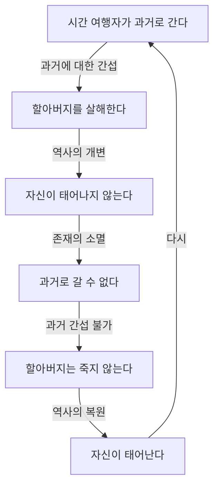
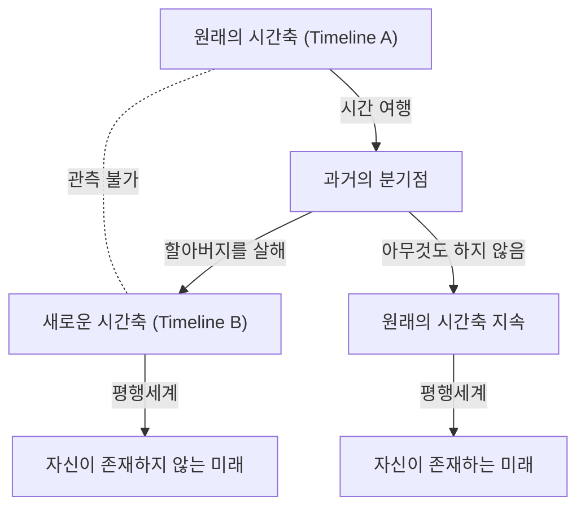

# 서론: 시간을 초월하는 꿈과 역설

인류는 예로부터 '시간을 초월하는 것'에 대해 강한 동경을 품어왔습니다. H.G. 웰스의 『타임 머신』을 시작으로, 수많은 SF 문학과 영화에서 시간 여행은 주요한 테마로 다루어져 왔습니다. 그러나 이는 단순한 공상의 산물에 머물지 않고, 20세기에 들어 알베르트 아인슈타인이 제창한 상대성 이론에 의해 시간이 절대적인 것이 아니라 관측자의 운동 상태나 중력장에 따라 늘어나고 줄어드는 상대적인 것임이 증명되었습니다. 이로써 시간 여행은 '물리학적으로 고찰 가능한 대상'으로 승화되었습니다.

그러나 과거로의 시간 여행(후방 시간 이동)이 가능하다고 가정할 경우, 논리적인 파탄을 초래하는 심각한 문제가 발생합니다. 그것이 바로 시간 여행에 관한 수많은 역설 중에서도 가장 유명하고 까다로운 '할아버지 역설(Grandfather Paradox)'입니다.

본 기사에서는 이 할아버지 역설에 대해 그 정의부터 논리적 구조, 그리고 현대 물리학이 제시하는 다양한 해결책(다세계 해석, 노비코프의 자기 일관성 원칙, 양자역학적 접근 등)까지 가능한 한 깊고 상세하게 파헤쳐 보겠습니다.

---

# 시간 여행은 물리학적으로 가능한가?

할아버지 역설을 논하기 전에, 과거로의 시간 여행이 현대 물리학의 틀 안에서 어떻게 다루어지고 있는지 정리해 보겠습니다.

## 특수 상대성 이론과 일반 상대성 이론

아인슈타인의 특수 상대성 이론에 따르면, 빛의 속도에 가깝게 이동하는 우주선 안에서는 정지해 있는 지구상의 관측자에 비해 시간의 흐름이 느려집니다. 이는 미래로의 시간 여행이 이론적으로나 현실적으로 가능하다는 것을 보여줍니다(실제로 GPS 위성 등에서는 이러한 시간 지연이 보정되고 있습니다).

한편, 일반 상대성 이론은 중력이 시공간을 왜곡한다는 것을 보여주었습니다. 거대한 질량 곁(블랙홀의 사건의 지평선 근처 등)에서는 시간이 극단적으로 느리게 진행됩니다. 그러나 이들은 모두 '미래로의 일방통행' 시간 여행입니다.

## 과거로의 여행: 닫힌 시간 곡선(CTC)

과거로의 시간 여행을 물리학적으로 기술하기 위해서는 '닫힌 시간 곡선(Closed Timelike Curve : CTC)'이라 불리는 시공간의 구조가 필요합니다. CTC란 시공간 속을 미래를 향해 나아가다 보면 어느새 과거의 출발점으로 돌아오게 되는 궤도를 말합니다.

CTC가 존재하는 해로서 유명한 것들에는 다음과 같은 것들이 있습니다:

1. **괴델 해**: 1949년 수학자 [쿠르트 괴델](/ko/p/godel/)은 우주 전체가 회전하고 있다고 가정할 경우 일반 상대성 이론의 방정식이 CTC를 허용한다는 것을 보여주었습니다.
2. **티플러의 원통**: 1974년 프랭크 티플러는 무한히 길고 초고밀도이며 고속 회전하는 원통 주위를 특정 궤도로 돎으로써 과거로 거슬러 올라갈 수 있음을 보여주었습니다.
3. **웜홀**: 킵 손 등은 시공간의 떨어진 두 점을 잇는 터널인 '웜홀'을 음의 에너지(특이 물질)로 안정화시켜, 한쪽 출입구를 빛에 가까운 속도로 이동시켰다가 되돌려 놓음으로써 타임 머신으로 기능함을 보여주었습니다.

이처럼 일반 상대성 이론의 수학적 틀 안에서는 과거로의 시간 여행이 완전히 부정되는 것은 아닙니다. 그렇기 때문에 논리적 역설을 어떻게 회피할 것인가가 물리학자들의 진지한 논의 대상이 되고 있는 것입니다.

---

# '할아버지 역설'의 논리 구조

'할아버지 역설'은 1920년대부터 1930년대 SF 소설에서 빈번하게 다루어지게 된 사고 실험입니다. 가장 기본적인 형태는 다음과 같습니다.

> "어떤 인물이 타임 머신으로 과거로 돌아가, 자신이 태어나기 전의 자신의 할아버지를 살해했다고 하자. 할아버지가 죽으면 자신의 부모는 태어나지 않는다. 부모가 태어나지 않으면 당연히 자신도 태어나지 않는다. 자신이 태어나지 않으면 타임 머신을 만들어 과거로 돌아가 할아버지를 죽일 수도 없다. 아무도 할아버지를 죽이지 않는다면 할아버지는 살아남아 부모가 태어나고 자신도 태어나게 된다. 그리고 다시 과거로 돌아가 할아버지를 죽인다……"

이 논리는 무한 루프에 빠지며, 원인과 결과의 인과율(Causality)이 완전히 붕괴되어 버립니다.

아래의 Mermaid 도해로 이 역설의 구조를 시각화해 보겠습니다.

이 인과율의 붕괴는 물리학에 있어 치명적입니다. 물리학 법칙은 기본적으로 초기 조건이 정해지면 그 후의 상태가 결정된다(혹은 확률적으로 예측할 수 있다)는 인과율 위에 성립하기 때문입니다.

---

# 역설을 회피하는 이론적 접근

그렇다면 과거로의 시간 여행이 가능하다는 전제에 섰을 때, 물리학과 철학은 어떻게 이 역설을 피할 수 있을까요? 주로 3가지 유력한 접근법이 존재합니다.

## 해결책 1: 다세계 해석(멀티버스 / 평행우주)

가장 유명하며 SF 작품에서도 자주 채용되는 것이 '다세계 해석(Many-Worlds Interpretation)'에 기반한 접근법입니다. 시간 여행자가 과거에 도착해 무언가 변화(할아버지 살해 등)를 일으키는 순간, 시공간은 '원래의 시간축'과 '개변된 새로운 시간축'의 2개로 분기(브랜칭)합니다.

이 모델에서 시간 여행자가 죽인 것은 'Timeline B의 할아버지'이며, 'Timeline A의 할아버지'는 무사합니다. 따라서 원인과 결과가 서로 다른 우주에 속해 인과율 루프가 발생하지 않습니다.

## 해결책 2: 노비코프의 자기 일관성 원칙

러시아의 물리학자 이고르 노비코프가 제창한 '자기 일관성 원칙(Novikov self-consistency principle)'입니다. 이 원칙은 "물리 법칙은 시공간 전체에 걸쳐 국소적으로나 대역적으로 모순을 발생시키지 않는다"고 가정합니다. 즉, '과거를 바꾸는 것은 물리적으로 불가능하다'는 생각입니다.

시간 여행자가 총을 쏘려 해도 반드시 실패합니다. 총알이 걸리거나 빗나갑니다. 우주 전체의 확률 분포가 '역설을 일으킬 확률을 0'으로 만들기 때문입니다.

## 해결책 3: 시공간의 복원력(자가 치유하는 타임라인)

시공간 자체가 역설을 싫어하여, 미소한 개변이 이루어지더라도 거시적인 미래의 사건이 크게 변하지 않도록 역사가 '수렴'한다는 생각입니다.

---

# 철학과 자유 의지의 문제

할아버지 역설은 철학적인 질문도 던집니다. '인간에게는 자유 의지(Free Will)가 있는가?' 노비코프의 원칙을 전제로 한다면 인간의 행동은 운명론적으로 정해져 있음을 의미합니다.

---

# 결론: 시간은 정말 일직선인가

할아버지 역설은 우리가 당연시하는 '시간은 과거에서 미래로 흐른다'는 직관적 인식에 예리한 메스를 가하는 사고 실험입니다. 타임 머신이 발명될 날이 올지는 알 수 없으나, 이 역설에 대해 사고하는 행위 자체가 우리의 지성을 시간의 속박에서 해방시키는 소소한 시간 여행일지도 모릅니다.
