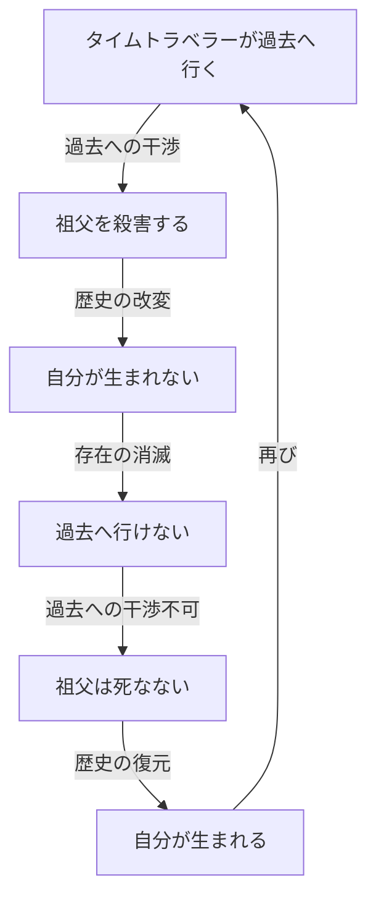
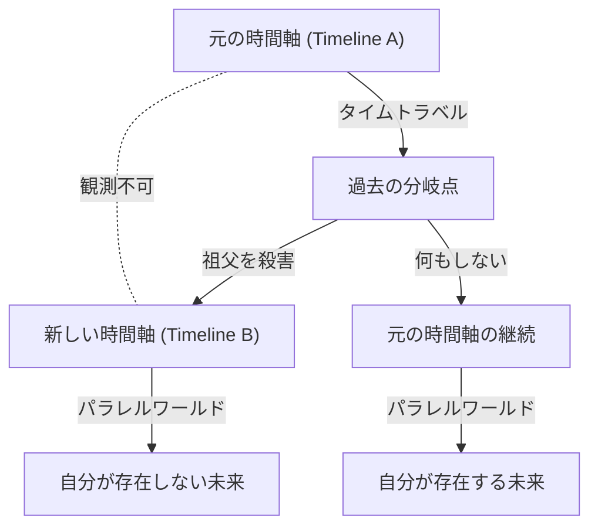

# はじめに：時を超える夢とパラドックス

人類は古くから「時間を超えること」に対して強い憧れを抱いてきました。H.G.ウェルズの『タイム・マシン』に始まり、数多くのSF文学や映画においてタイムトラベルは主要なテーマとして扱われてきました。しかし、単なる空想の産物にとどまらず、20世紀に入ってアルベルト・アインシュタインが提唱した相対性理論によって、時間は絶対的なものではなく、観測者の運動状態や重力場によって伸び縮みする相対的なものであることが証明されました。これにより、タイムトラベルは「物理学的に考察可能な対象」へと昇華されたのです。

しかし、過去へのタイムトラベル（後方時間移動）が可能であると仮定した場合、そこには論理的な破綻をきたす深刻な問題が生じます。それが、時間旅行に関する数あるパラドックスの中でも最も有名で、かつ最も厄介な「親殺しのパラドックス（Grandfather Paradox）」です。

本記事では、この親殺しのパラドックスについて、その定義から論理的構造、そして現代物理学が提示する様々な解決策（多世界解釈、ノヴィコフの自己無矛盾性原則、量子力学的なアプローチなど）までを、可能な限り深く、詳細に掘り下げていきます。

---

# タイムトラベルは物理学的に可能か？

親殺しのパラドックスを議論する前に、そもそも過去へのタイムトラベルが現代物理学の枠組みにおいてどのように扱われているのかを整理しておきましょう。

## 特殊相対性理論と一般相対性理論

アインシュタインの特殊相対性理論によれば、光速に近い速度で移動する宇宙船の中では、静止している地球上の観測者に比べて時間の進み方が遅くなります。これは「ウラシマ効果」とも呼ばれ、未来へのタイムトラベルが理論的にも現実的にも可能であることを示しています（実際にGPS衛星などではこの時間の遅れが補正されています）。

一方、一般相対性理論は重力が時空を歪めることを示しました。巨大な質量のそば（ブラックホールの事象の地平面付近など）では時間が極端に遅く進みます。しかし、これらはいずれも「未来への一方通行」のタイムトラベルです。

## 過去への旅：閉じた時間線（CTC）

過去へのタイムトラベルを物理学的に記述するためには、「閉じた時間線（Closed Timelike Curve : CTC）」と呼ばれる時空の構造が必要です。CTCとは、時空の中を未来に向かって進んでいくと、いつの間にか過去の出発点に戻ってきてしまうような軌道のことです。

CTCが存在する解として有名なものには、以下のいくつかがあります。

1. **ゲーデル解**: 1949年、数学者クルト・ゲーデルは、宇宙全体が回転していると仮定した場合、一般相対性理論の方程式がCTCを許容することを示しました。
2. **ティプラーの円柱**: 1974年、フランク・ティプラーは、無限に長く、超高密度で高速回転する円柱の周囲を特定の軌道で回ることで過去へ遡れることを示しました。
3. **ワームホール**: キップ・ソーンらは、時空の離れた2点を結ぶトンネル「ワームホール」を負のエネルギー（エキゾチック物質）によって安定化させ、一方の出入り口を光速に近い速度で移動させてから戻すことで、タイムマシンとして機能することを示しました。

このように、一般相対性理論の数学的な枠組みの中では、過去へのタイムトラベルは完全に否定されているわけではありません。だからこそ、論理的なパラドックスをどう回避するかが物理学者たちの真剣な議論の対象となっているのです。

---

# 「親殺しのパラドックス」の論理構造

「親殺しのパラドックス」は、1920年代から1930年代のSF小説で頻繁に取り上げられるようになった思考実験です。最も基本的な形は次のようなものです。

> 「ある人物がタイムマシンで過去に戻り、自分が生まれる前の自分の祖父を殺害したとする。祖父が死ねば、自分の親は生まれない。親が生まれなければ、当然自分も生まれない。自分が生まれなければ、タイムマシンを作って過去に戻り、祖父を殺すこともできない。誰も祖父を殺さないのであれば、祖父は生き延びて親が生まれ、自分も生まれることになる。そして再び過去に戻って祖父を殺す……」

この論理は無限ループに陥り、原因と結果の因果律（Causality）が完全に崩壊してしまいます。

以下のMermaid図解で、このパラドックスの構造を視覚化してみましょう。

このパラドックスは、「祖父」である必要はありません。「過去に戻ってタイムマシンそのものを破壊する」「過去の自分自身を殺す（自己殺しのパラドックス）」「ヒトラーを暗殺する」など、過去の事象を改変することで現在の自分の行動の前提が失われるケースすべてにおいて発生します。

この因果律の崩壊は物理学にとって致命的です。なぜなら、物理法則は基本的に初期条件が定まればその後の状態が決定される（あるいは確率的に予測できる）という因果律の上に成り立っているからです。このパラドックスを解決できなければ、過去へのタイムトラベルは論理的に不可能であると結論づけるしかありません（スティーヴン・ホーキングの「時間順序保護仮説」はこの立場をとります）。

---

# パラドックスを回避する理論的アプローチ

では、過去へのタイムトラベルが可能であるという前提に立った場合、物理学や哲学はどのようにしてこのパラドックスを回避（あるいは解決）するのでしょうか。主に3つの有力なアプローチが存在します。

## 解決策1：多世界解釈（マルチバース / パラレルワールド）

最も有名で、SF作品でも頻繁に採用されるのが「多世界解釈（Many-Worlds Interpretation）」に基づくアプローチです。これは量子力学の解釈の一つであるエヴェレットの多世界解釈をマクロな時間軸の分岐に適用したものです。

この理論によれば、タイムトラベラーが過去に到着して何か変化（祖父の殺害など）を起こした瞬間に、時空は「元の時間軸」と「改変された新しい時間軸」の2つに分岐（ブランチング）します。

このモデルでは、タイムトラベラーが殺したのは「Timeline Bの祖父」であり、「Timeline Aの祖父」は無事です。したがって、Timeline Aにおいてタイムトラベラーは正常に誕生し、タイムマシンに乗ってTimeline Bの過去へ移動したことになります。
Timeline Bの未来にはタイムトラベラー自身は誕生しませんが、Timeline AからやってきたタイムトラベラーはTimeline Bで生き続けることになります。

この解法は論理的な矛盾を完璧に排除します。原因（Timeline Aからの来訪）と結果（Timeline Bでの祖父の死）が別の宇宙に属しているため、因果律のループが発生しないからです。デイヴィッド・ドイッチュなどの物理学者は、量子コンピューティングのモデルを用いて、CTCが存在する時空では必ずこのような量子的な状態の重ね合わせ（事実上の多世界）が生じることを数学的に示唆しています。

## 解決策2：ノヴィコフの自己無矛盾性原則

もう一つの強力なアプローチが、ロシアの物理学者イゴール・ノヴィコフが提唱した「自己無矛盾性の原則（Novikov self-consistency principle）」です。

この原則は、「物理法則は、時空全体にわたって局所的にも大域的にも矛盾を生じさせない」と仮定します。つまり、「過去を変えることは物理的に不可能である」という考え方です。

タイムトラベラーが過去に戻り、銃の引き金を引いて祖父を撃とうとした場合、何らかの理由で必ず失敗します。
- 銃の弾がジャムる（詰まる）。
- 狙いが外れて肩をかすめるだけで済む。
- 実は祖父だと思っていた人物が別人だった。
- タイムトラベラーが過去に行ったことそのものが、実は自分が生まれるための歴史の必然的な一部だった（閉じた因果のループ＝ブートストラップ・パラドックス）。

ノヴィコフの原則によれば、宇宙全体の確率分布が「パラドックスを引き起こす行動の確率をゼロにする」ように働くため、タイムトラベラーには歴史を変える「自由意志」が存在しないか、あるいはその自由意志による行動が結果的に歴史を補完するように作用します。
キップ・ソーンらは、ビリヤードの球がワームホールを通って過去に戻り、過去の自分自身に衝突して軌道を逸らすという「ビリヤードボール・パラドックス」を計算し、どのような初期条件であっても、必ず「矛盾のない軌道（かすってうまくタイムマシンに入るような軌道など）」が存在すること（自己無矛盾解）を証明しました。

## 解決策3：時空の修復力（自己治癒するタイムライン）

近年議論されているよりSF的なアプローチとして、「歴史の自己治癒力」という概念があります。これは、時空そのものがパラドックスを嫌い、微小な改変が行われても、マクロな未来の出来事が大きく変わらないように歴史が「収束」するという考え方です。

たとえば、祖父を殺したとしても、別の男性が祖母と結ばれ、遺伝子の偶然や環境要因によって、元のタイムトラベラーと極めて近い存在（あるいは魂や役割を受け継ぐ者）が生まれるように歴史が調整されるというものです。これは物理学というよりは、カオス理論や複雑系の「アトラクター（引き込み要素）」の概念を歴史に応用したものと言えます。

---

# 哲学と自由意志の問題

親殺しのパラドックスは、物理学的な問題であると同時に、深い哲学的な問いを投げかけます。特に「ノヴィコフの自己無矛盾性原則」を前提とした場合、「人間には自由意志（Free Will）があるのか？」という古典的な問題が再燃します。

もし、タイムトラベラーが「絶対に祖父を殺してやる」という強い意志と完璧な計画を持って過去に戻ったにもかかわらず、宇宙の法則（確率分布）によって必ず邪魔が入るのだとすれば、それは人間の行動が運命論的、決定論的に定められていることを意味します。我々が日々行っている「選択」は、実は巨大な時空のパズルのピースに過ぎず、全体の無矛盾性を保つための操り人形でしかないのでしょうか？

多世界解釈は、この自由意志の問題に対する一つの救済となります。すべての可能な選択がそれぞれの並行宇宙で実現されるため、一つの宇宙内での決定論的制約から解放されるからです。しかしそれは同時に、「自分が選ばなかった選択肢を歩む無数の自分が存在する」という、別の実存的な不安を引き起こすものでもあります。

---

# まとめ：時間は本当に一直線なのか

親殺しのパラドックスは、私たちが普段当たり前のように受け入れている「時間は過去から未来へと一方通行で流れる」という直感的な認識に鋭いメスを入れる思考実験です。

アインシュタインが「過去、現在、未来の区別は、どんなに頑固なものであっても、ただの幻想にすぎない」と言い残したように、現代物理学の最前線（ブロック宇宙論など）では、すべての時間はすでに時空連続体の中に同時に存在していると考える見方が有力です。

親殺しのパラドックスを巡る議論を通して見えてくるのは、タイムトラベルの可能性そのものよりも、私たちが生きるこの宇宙の論理的構造の美しさと、人間の意識や因果律という概念の脆弱さです。タイムマシンが発明される日が来るかどうかはわかりません。しかし、このパラドックスについて思考を巡らせる行為そのものが、私たちの知性を時間の縛りから解き放つ、ささやかなタイムトラベルなのかもしれません。
