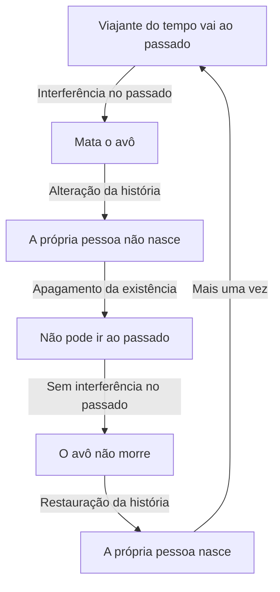
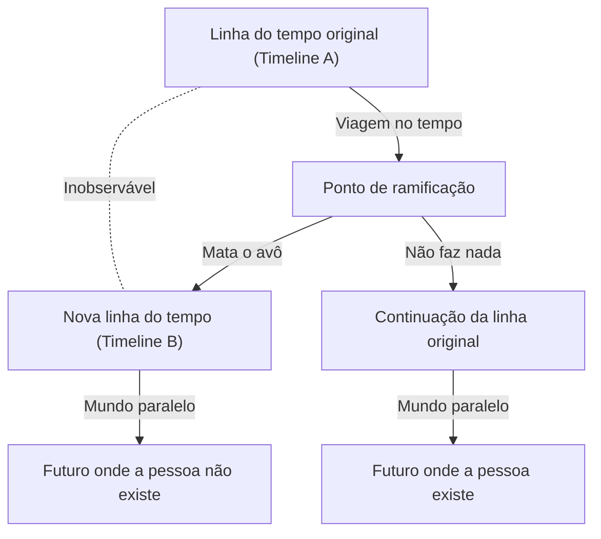

# Introdução: O Sonho de Cruzar o Tempo e Seus Paradoxos

A humanidade sempre teve um forte fascínio por "cruzar o tempo". Começando com *A Máquina do Tempo* de H.G. Wells, a viagem no tempo tem sido um tema principal na literatura e em filmes de ficção científica. No século XX, a teoria da relatividade de Albert Einstein provou que o tempo não é absoluto, mas relativo, esticando e encolhendo dependendo do estado de movimento do observador e do campo gravitacional.

No entanto, assumindo que a viagem no tempo para o passado seja possível, surge um problema grave que leva ao colapso lógico. Este é o "Paradoxo do Avô" (Grandfather Paradox).

Neste artigo, aprofundaremos no paradoxo do avô, desde a sua definição até as várias soluções apresentadas pela física moderna.

---

# A Viagem no Tempo é Fisicamente Possível?

## Relatividade Especial e Geral
Segundo a teoria da relatividade especial, o tempo passa mais lentamente para quem viaja próximo à velocidade da luz. Isso indica que viajar para o futuro é possível. A relatividade geral mostrou que a gravidade distorce o espaço-tempo, retardando também o tempo perto de grandes massas (como buracos negros).

## Curvas Tipo Tempo Fechadas (CTC)
Para descrever fisicamente a viagem ao passado, é necessária uma estrutura chamada "Curva Tipo Tempo Fechada" (CTC), como as propostas pela métrica de Gödel, Cilindro de Tipler e Buracos de Minhoca.

---

# A Estrutura Lógica do "Paradoxo do Avô"

A forma mais básica do paradoxo é:

> "Suponha que uma pessoa viaje no tempo e mate o seu avô antes que seu pai nasça. Se o avô morre, o pai não nasce. Se o pai não nasce, a própria pessoa não nasce. Se não nasce, não pode viajar no tempo para matar o avô. Se o avô não morre, o pai nasce e a pessoa também. A pessoa então viaja e mata o avô..."

Essa lógica cai em um loop infinito, destruindo a causalidade.

---

# Abordagens Teóricas para Evitar o Paradoxo

## Solução 1: Interpretação de Muitos Mundos (Multiverso)

Ao mudar o passado, o espaço-tempo se divide em duas ramificações.

Neste modelo, o viajante matou o avô na Timeline B, enquanto o da Timeline A está a salvo. Não há paradoxo.

## Solução 2: Princípio de Autoconsistência de Novikov

Este princípio assume que "é fisicamente impossível mudar o passado". Qualquer tentativa de matar o avô falharia (a arma emperraria, etc.). O viajante não tem livre arbítrio para mudar a história.

## Solução 3: Poder de Cura do Espaço-Tempo

A história "converge" de tal forma que mesmo pequenas alterações não mudam significativamente o macro-futuro.

---

# Filosofia e o Problema do Livre Arbítrio

O paradoxo levanta a questão: "Os humanos têm livre arbítrio?" Se as leis do universo sempre impedem a mudança do passado, as ações humanas são determinísticas. A interpretação de muitos mundos resolve isso, mas traz angústia existencial sobre infinitas versões de nós mesmos.

---

# Conclusão

O paradoxo do avô desafia nossa percepção intuitiva do tempo como um fluxo de mão única. Pensar sobre esse paradoxo é, por si só, uma forma modesta de libertar o nosso intelecto das amarras do tempo.
