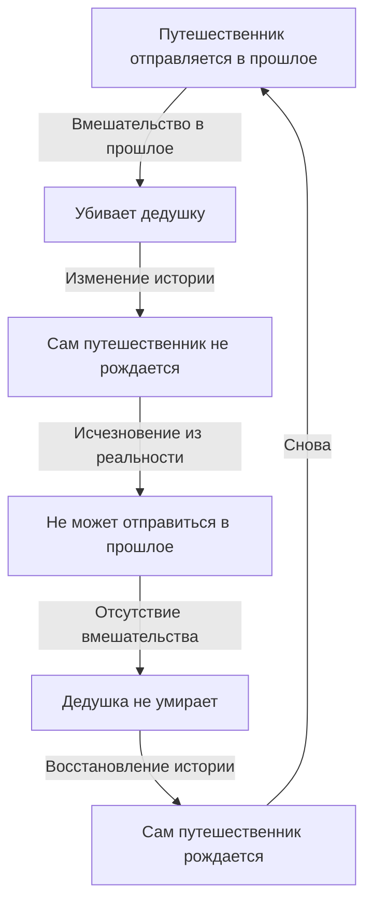
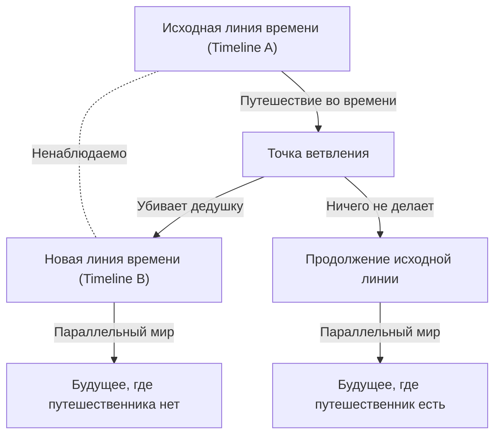

# Введение: Мечта о пересечении времени и парадоксы

Человечество издревле питало сильную страсть к «пересечению времени». Начиная с «Машины времени» Герберта Уэллса, путешествия во времени были главной темой многих научно-фантастических произведений. Однако в XX веке теория относительности Альберта Эйнштейна доказала, что время не является абсолютным, а относительно. Это сделало путешествия во времени «объектом физического рассмотрения».

Однако если предположить, что путешествие во времени в прошлое возможно, возникает серьезная проблема, ведущая к логическому краху. Это «Парадокс убитого дедушки» (Grandfather Paradox) — самый известный и самый сложный из всех парадоксов, связанных с путешествиями во времени.

---

# Возможно ли путешествие во времени физически?

## Специальная и Общая теория относительности
Согласно специальной теории относительности, время течет медленнее на космическом корабле, движущемся со скоростью, близкой к скорости света. Это означает, что путешествие в будущее возможно.
С другой стороны, общая теория относительности показала, что гравитация искажает пространство-время. Вблизи черной дыры время идет крайне медленно.

## Путешествие в прошлое: Замкнутые времениподобные кривые (CTC)
Для физического описания путешествия в прошлое необходима структура пространства-времени, называемая «Замкнутая времениподобная кривая (CTC)». В качестве примеров решений уравнений Эйнштейна, допускающих CTC, можно привести цилиндр Типлера и кротовые норы.

---

# Логическая структура «Парадокса дедушки»

Самая базовая форма парадокса звучит так:

> «Предположим, человек отправляется в прошлое и убивает своего дедушку до рождения своего родителя. Если дедушка умирает, родитель не рождается. Если родитель не рождается, сам человек не рождается. Если человек не рожден, он не может построить машину времени, отправиться в прошлое и убить дедушку. Если никто не убивает дедушку, он выживает, родитель рождается, и человек рождается. Затем он снова отправляется в прошлое...»

Эта логика попадает в бесконечный цикл, разрушая причинно-следственную связь.

Разрушение причинности фатально для физики, так как физические законы основаны на причинно-следственной связи.

---

# Теоретические подходы к избежанию парадокса

## Решение 1: Многомировая интерпретация (Мультивселенная)

Согласно этой теории, в момент, когда путешественник во времени изменяет прошлое, пространство-время разветвляется на две временные линии: «исходную» и «новую».

Это решает логическое противоречие, поскольку причина и следствие принадлежат разным вселенным.

## Решение 2: Принцип самосогласованности Новикова

Русский физик Игорь Новиков предложил принцип, согласно которому «физические законы не допускают возникновения противоречий». Это значит, что изменить прошлое физически невозможно. Если путешественник попытается выстрелить в дедушку, пистолет обязательно заклинит, или он промахнется.

## Решение 3: «Самовосстанавливающаяся» история

Концепция того, что само пространство-время сопротивляется парадоксам, и история «сходится» таким образом, чтобы макроскопические события будущего не изменились существенно.

---

# Философия и проблема свободы воли

Парадокс дедушки ставит вопрос: «Есть ли у человека свобода воли?» Если законы Вселенной всегда предотвращают парадоксы, значит, действия человека предопределены. Многомировая интерпретация спасает свободу воли, но порождает экзистенциальную тревогу о бесчисленных параллельных копиях нас самих.

---

# Заключение

Парадокс убитого дедушки бросает вызов нашему интуитивному восприятию времени как однонаправленного потока. И хотя мы не знаем, изобретут ли машину времени, размышления над этим парадоксом сами по себе являются небольшим путешествием, освобождающим наш разум от оков времени.
