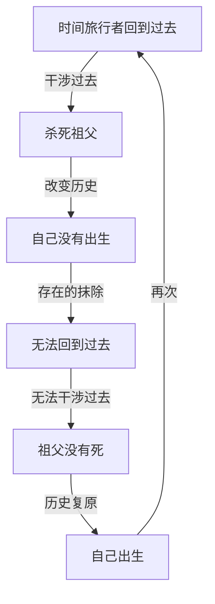
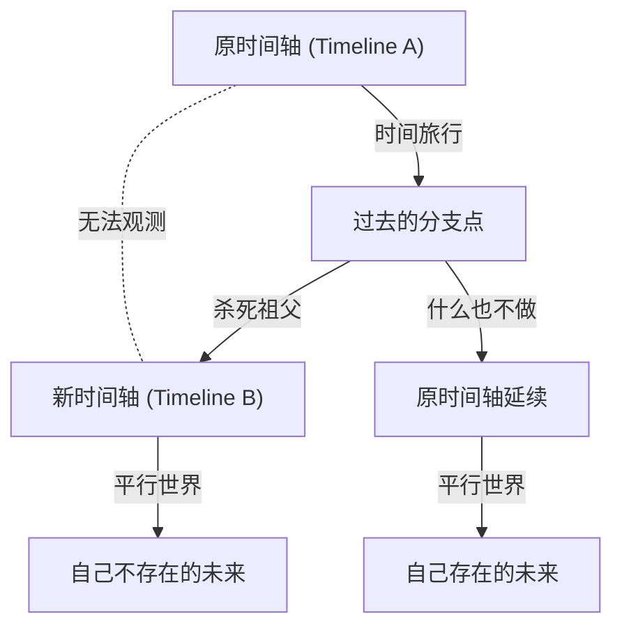

# 引言：跨越时间的梦想与悖论

人类自古以来就对“跨越时间”抱有强烈的向往。从H.G.威尔斯的《时间机器》开始，时间旅行在众多科幻文学和电影中一直是主要主题。然而，时间旅行并不仅仅停留在空想的产物。进入20世纪，阿尔伯特·爱因斯坦提出的相对论证明了时间并非绝对，而是根据观察者的运动状态和引力场而伸缩的相对存在。这使得时间旅行升华为“物理学上可探讨的对象”。

然而，如果假设能够向过去进行时间旅行（逆向时间旅行），就会产生导致逻辑崩溃的严重问题。这便是关于时间旅行的众多悖论中最著名、也最棘手的“祖父悖论（Grandfather Paradox）”。

本文将从其定义、逻辑结构，到现代物理学提出的各种解决方案（如多世界解释、诺维科夫自洽性原则、量子力学方法等），尽可能深入、详细地探讨这个祖父悖论。

---

# 时间旅行在物理学上可能吗？

在讨论祖父悖论之前，我们先理清现代物理学框架下是如何处理向过去的时间旅行的。

## 狭义相对论与广义相对论

根据爱因斯坦的狭义相对论，在以接近光速移动的宇宙飞船中，时间的流逝会比地球上静止的观察者慢。这表明通往未来的时间旅行在理论和现实中都是可能的（实际上，GPS卫星等设备也会对这种时间膨胀进行修正）。

另一方面，广义相对论表明引力会扭曲时空。在巨大质量附近（例如黑洞的事件视界附近），时间的流逝会变得极其缓慢。然而，这些都是“通往未来的单行道”时间旅行。

## 回到过去之旅：闭合类时曲线（CTC）

要在物理学上描述向过去的时间旅行，需要一种被称为“闭合类时曲线（Closed Timelike Curve : CTC）”的时空结构。CTC是指在时空中向着未来前进，却不知不觉地回到过去出发点的轨迹。

存在CTC的著名解包括以下几种：

1. **哥德尔解**：1949年，数学家库尔特·哥德尔证明，如果假设整个宇宙在旋转，广义相对论的方程允许CTC的存在。
2. **提普勒圆柱体**：1974年，弗兰克·提普勒证明，通过在无限长、超高密度且高速旋转的圆柱体周围以特定轨道运行，可以回到过去。
3. **虫洞**：基普·索恩等人证明，连接时空中两个遥远点的隧道“虫洞”，可以通过负能量（奇异物质）稳定下来，将其一个出入口以接近光速移动后再带回，就能作为时间机器发挥作用。

因此，在广义相对论的数学框架内，向过去的时间旅行并未被完全否定。正因如此，如何避免逻辑悖论成为了物理学家们认真争论的焦点。

---

# “祖父悖论”的逻辑结构

“祖父悖论”是20世纪20至30年代科幻小说中经常出现的思想实验。其最基本的形式如下：

> “假设某人乘坐时间机器回到过去，在自己父母出生前杀死了自己的祖父。如果祖父死了，父母就不会出生。如果父母不出生，自己自然也不会出生。如果自己没有出生，就不可能制造时间机器回到过去杀死祖父。如果没有人杀死祖父，祖父就会活下来，父母就会出生，自己也会出生。然后再次回到过去杀死祖父……”

这种逻辑陷入了无限循环，导致原因与结果的因果律（Causality）彻底崩溃。

让我们用以下的Mermaid图解来将这个悖论的结构可视化。

这个悖论未必需要“祖父”。在诸如“回到过去破坏时间机器本身”、“杀死过去的自己（自我谋杀悖论）”或“暗杀希特勒”等通过改变过去事件导致自己当前行为的前提丧失的所有情况中，都会发生这种悖论。

这种因果律的崩溃对物理学来说是致命的。因为物理定律基本上建立在只要确定初始条件就能决定（或概率性预测）后续状态的因果律之上。如果无法解决这个悖论，就只能得出向过去的时间旅行在逻辑上是不可能的结论（斯蒂芬·霍金的“时序保护猜想”就采取了这种立场）。

---

# 避免悖论的理论途径

那么，在假设向过去的时间旅行是可能的前提下，物理学和哲学是如何避免（或解决）这个悖论的呢？主要存在三种有力的途径。

## 解决方案1：多世界解释（多元宇宙 / 平行世界）

最著名、在科幻作品中也经常被采用的是基于“多世界解释（Many-Worlds Interpretation）”的方法。这是将量子力学中的埃弗雷特多世界解释应用到宏观时间轴的分支上。

根据这一理论，时间旅行者到达过去并引发某种改变（如杀死祖父）的瞬间，时空就会分支为两个：“原时间轴”和“被改变的新时间轴”。

在这个模型中，时间旅行者杀死的是“Timeline B的祖父”，而“Timeline A的祖父”安然无恙。因此，在Timeline A中，时间旅行者正常出生，并乘坐时间机器来到了Timeline B的过去。虽然Timeline B的未来不会诞生时间旅行者本人，但从Timeline A来的时间旅行者将会在Timeline B中继续生活。

这种解决方法完美地排除了逻辑矛盾。因为原因（来自Timeline A的造访）和结果（Timeline B中祖父的死亡）属于不同的宇宙，所以不会发生因果律的循环。大卫·多伊奇等物理学家利用量子计算模型在数学上暗示了在存在CTC的时空中必然会发生这种量子状态的叠加（事实上的多世界）。

## 解决方案2：诺维科夫自洽性原则

另一个强有力的方法是俄罗斯物理学家伊戈尔·诺维科夫提出的“自洽性原则（Novikov self-consistency principle）”。

该原则假设：“物理定律在整个时空中，无论局部还是全局，都不允许产生矛盾”。也就是说，其核心思想是“改变过去在物理上是不可能的”。

如果时间旅行者回到过去，扣动扳机试图开枪打死祖父，必然会因为某种原因失败。
- 枪卡壳了。
- 没瞄准好，只是擦伤了肩膀。
- 实际上以为是祖父的人其实是别人。
- 时间旅行者回到过去这件事本身，其实是自己出生所需历史的必然组成部分（闭合因果循环 = 引导悖论）。

根据诺维科夫原则，整个宇宙的概率分布会发挥作用以“使引发悖论的行为概率降为零”，因此时间旅行者要么不存在改变历史的“自由意志”，要么其自由意志导致的行为最终反而起到了补全历史的作用。
基普·索恩等人计算了“台球悖论（撞球悖论）”——即一个台球穿过虫洞回到过去，与过去的自己相撞并使其偏离轨道，证明了无论初始条件如何，必然存在“不矛盾的轨道（例如擦过并成功进入时间机器的轨道）”（自洽解）。

## 解决方案3：时空的修复力（自我愈合的时间线）

近年来被讨论的更具科幻色彩的方法是“历史的自我愈合力”概念。这是一种认为时空本身厌恶悖论的想法，即使发生了微小的改变，历史也会发生“收敛”，以确保宏观的未来事件不会发生重大改变。

例如，即使杀死了祖父，另一个男人也会和祖母结合，并且通过基因的巧合和环境因素，历史会进行自我调整，以至于诞生出一个与原时间旅行者极其相似的存在（或者继承其灵魂与角色的人）。这与其说是物理学，不如说是将混沌理论和复杂系统中的“吸引子（Attractor）”概念应用到了历史上。

---

# 哲学与自由意志问题

祖父悖论既是一个物理学问题，也提出了深刻的哲学疑问。特别是在以“诺维科夫自洽性原则”为前提时，“人类是否有自由意志（Free Will）？”这个经典问题就会重燃。

如果时间旅行者怀着“绝对要杀死祖父”的强烈意志和完美的计划回到过去，却依然不可避免地被宇宙定律（概率分布）所阻挠，那就意味着人类的行为是宿命论的、决定论的。我们日常所做的“选择”，真的只是巨大时空拼图中的一片，仅仅是为了维持整体自洽性的提线木偶吗？

多世界解释为这种自由意志问题提供了一种救赎。因为所有可能的选择都会在各自的平行宇宙中实现，从而摆脱了单一宇宙中的决定论束缚。然而，这同时也会引发另一种存在主义的焦虑：“存在着无数个经历着我没有做出的选择的‘我’”。

---

# 结语：时间真的是一条直线吗？

祖父悖论是一个尖锐剖析我们平时理所当然接受的直觉认知——“时间是从过去向未来单向流动的”——的思想实验。

正如爱因斯坦所说，“过去、现在和未来的区别，无论多么根深蒂固，都只不过是一种幻觉”，在现代物理学的最前沿（如块状宇宙论等），认为所有时间早已同时存在于时空连续体中的观点占据了主导地位。

通过围绕祖父悖论的讨论，我们看到的不仅是时间旅行本身的可能性，更是我们所居住的这个宇宙逻辑结构的壮丽，以及人类意识和因果律概念的脆弱。我们不知道发明时间机器的那一天是否会到来。但是，对这个悖论进行思考的行为本身，或许就是一次小小的将我们的智慧从时间束缚中解放出来的时间旅行。
