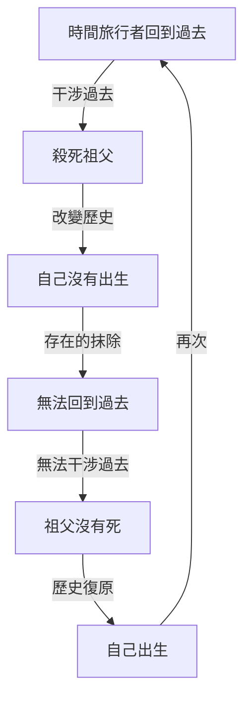
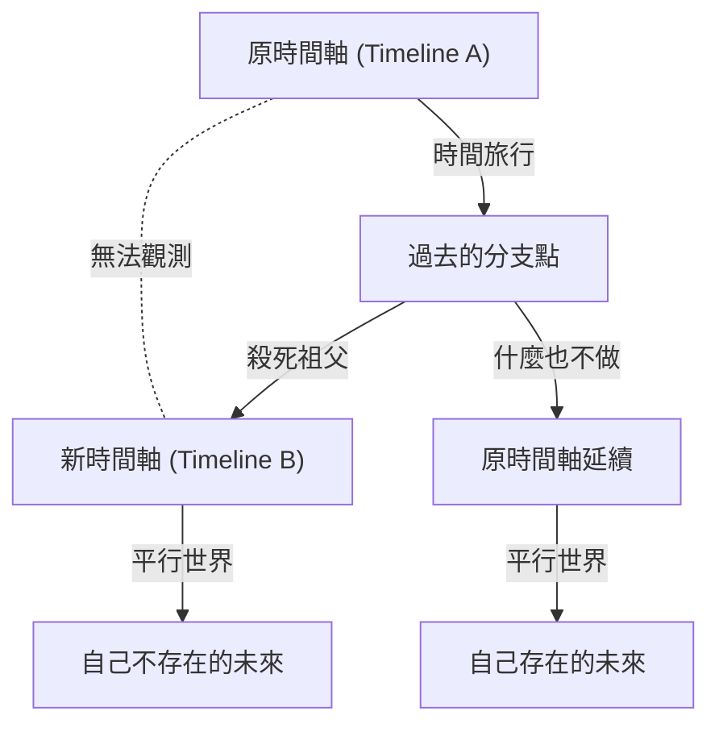

# 引言：跨越時間的夢想與悖論

人類自古以來就對「跨越時間」抱有強烈的嚮往。從H.G.威爾斯的《時間機器》開始，時間旅行在眾多科幻文學和電影中一直是主要主題。然而，時間旅行並不僅僅停留在空想的產物。進入20世紀，阿爾伯特·愛因斯坦提出的相對論證明了時間並非絕對，而是根據觀察者的運動狀態和引力場而伸縮的相對存在。這使得時間旅行昇華為「物理學上可探討的對象」。

然而，如果假設能夠向過去進行時間旅行（逆向時間旅行），就會產生導致邏輯崩潰的嚴重問題。這便是關於時間旅行的眾多悖論中最著名、也最棘手的「祖父悖論（Grandfather Paradox）」。

本文將從其定義、邏輯結構，到現代物理學提出的各種解決方案（如多世界解釋、諾維科夫自洽性原則、量子力學方法等），盡可能深入、詳細地探討這個祖父悖論。

---

# 時間旅行在物理學上可能嗎？

在討論祖父悖論之前，我們先理清現代物理學框架下是如何處理向過去的時間旅行的。

## 狹義相對論與廣義相對論

根據愛因斯坦的狹義相對論，在以接近光速移動的宇宙飛船中，時間的流逝會比地球上靜止的觀察者慢。這表明通往未來的時間旅行在理論和現實中都是可能的（實際上，GPS衛星等設備也會對這種時間膨脹進行修正）。

另一方面，廣義相對論表明引力會扭曲時空。在巨大質量附近（例如黑洞的事件視界附近），時間的流逝會變得極其緩慢。然而，這些都是「通往未來的單行道」時間旅行。

## 回到過去之旅：閉合類時曲線（CTC）

要在物理學上描述向過去的時間旅行，需要一種被稱為「閉合類時曲線（Closed Timelike Curve : CTC）」的時空結構。CTC是指在時空中向著未來前進，卻不知不覺地回到過去出發點的軌跡。

存在CTC的著名解包括以下幾種：

1. **哥德爾解**：1949年，數學家[庫爾特·哥德爾](/zh-tw/p/godel/)證明，如果假設整個宇宙在旋轉，廣義相對論的方程允許CTC的存在。
2. **提普勒圓柱體**：1974年，弗蘭克·提普勒證明，透過在無限長、超高密度且高速旋轉的圓柱體周圍以特定軌道運行，可以回到過去。
3. **蟲洞**：基普·索恩等人證明，連接時空中兩個遙遠點的隧道「蟲洞」，可以透過負能量（奇異物質）穩定下來，將其一個出入口以接近光速移動後再帶回，就能作為時間機器發揮作用。

因此，在廣義相對論的數學框架內，向過去的時間旅行並未被完全否定。正因如此，如何避免邏輯悖論成為了物理學家們認真爭論的焦點。

---

# 「祖父悖論」的邏輯結構

「祖父悖論」是20世紀20至30年代科幻小說中經常出現的思想實驗。其最基本的形式如下：

> 「假設某人乘坐時間機器回到過去，在自己父母出生前殺死了自己的祖父。如果祖父死了，父母就不會出生。如果父母不出生，自己自然也不會出生。如果自己沒有出生，就不可能製造時間機器回到過去殺死祖父。如果沒有人殺死祖父，祖父就會活下來，父母就會出生，自己也會出生。然後再次回到過去殺死祖父……」

這種邏輯陷入了無限循環，導致原因與結果的因果律（Causality）徹底崩潰。

讓我們用以下的Mermaid圖解來將這個悖論的結構視覺化。

這個悖論未必需要「祖父」。在諸如「回到過去破壞時間機器本身」、「殺死過去的自己（自我謀殺悖論）」或「暗殺希特勒」等透過改變過去事件導致自己當前行為的前提喪失的所有情況中，都會發生這種悖論。

這種因果律的崩潰對物理學來說是致命的。因為物理定律基本上建立在只要確定初始條件就能決定（或機率性預測）後續狀態的因果律之上。如果無法解決這個悖論，就只能得出向過去的時間旅行在邏輯上是不可能的結論（史蒂芬·霍金的「時序保護猜想」就採取了這種立場）。

---

# 避免悖論的理論途徑

那麼，在假設向過去的時間旅行是可能的前提下，物理學和哲學是如何避免（或解決）這個悖論的呢？主要存在三種有力的途徑。

## 解決方案1：多世界解釋（多元宇宙 / 平行世界）

最著名、在科幻作品中也經常被採用的是基於「多世界解釋（Many-Worlds Interpretation）」的方法。這是將量子力學中的艾弗雷特多世界解釋應用到宏觀時間軸的分支上。

根據這一理論，時間旅行者到達過去並引發某種改變（如殺死祖父）的瞬間，時空就會分支為兩個：「原時間軸」和「被改變的新時間軸」。

在這個模型中，時間旅行者殺死的是「Timeline B的祖父」，而「Timeline A的祖父」安然無恙。因此，在Timeline A中，時間旅行者正常出生，並乘坐時間機器來到了Timeline B的過去。雖然Timeline B的未來不會誕生時間旅行者本人，但從Timeline A來的時間旅行者將會在Timeline B中繼續生活。

這種解決方法完美地排除了邏輯矛盾。因為原因（來自Timeline A的造訪）和結果（Timeline B中祖父的死亡）屬於不同的宇宙，所以不會發生因果律的循環。大衛·多伊奇等物理學家利用量子計算模型在數學上暗示了在存在CTC的时空中必然會發生這種量子狀態的疊加（事實上的多世界）。

## 解決方案2：諾維科夫自洽性原則

另一個強有力的方法是俄羅斯物理學家伊戈爾·諾維科夫提出的「自洽性原則（Novikov self-consistency principle）」。

該原則假設：「物理定律在整個時空中，無論局部還是全局，都不允許產生矛盾」。也就是說，其核心思想是「改變過去在物理上是不可能的」。

如果時間旅行者回到過去，扣動扳機試圖開槍打死祖父，必然會因為某種原因失敗。
- 槍卡彈了。
- 沒瞄準好，只是擦傷了肩膀。
- 實際上以為是祖父的人其實是別人。
- 時間旅行者回到過去這件事本身，其實是自己出生所需歷史的必然組成部分（閉合因果循環 = 引導悖論）。

根據諾維科夫原則，整個宇宙的機率分佈會發揮作用以「使引發悖論的行為機率降為零」，因此時間旅行者要麼不存在改變歷史的「自由意志」，要麼其自由意志導致的行為最終反而起到了補全歷史的作用。
基普·索恩等人計算了「撞球悖論」——即一個撞球穿過蟲洞回到過去，與過去的自己相撞並使其偏離軌道，證明了無論初始條件如何，必然存在「不矛盾的軌道（例如擦過並成功進入時間機器的軌道）」（自洽解）。

## 解決方案3：時空的修復力（自我癒合的時間線）

近年來被討論的更具科幻色彩的方法是「歷史的自我癒合力」概念。這是一種認為時空本身厭惡悖論的想法，即使發生了微小的改變，歷史也會發生「收斂」，以確保宏觀的未來事件不會發生重大改變。

例如，即使殺死了祖父，另一個男人也會和祖母結合，並且透過基因的巧合和環境因素，歷史會進行自我調整，以至於誕生出一個與原時間旅行者極其相似的存在（或者繼承其靈魂與角色的人）。這與其說是物理學，不如說是將混沌理論和複雜系統中的「吸引子（Attractor）」概念應用到了歷史上。

---

# 哲學與自由意志問題

祖父悖論既是一個物理學問題，也提出了深刻的哲學疑問。特別是在以「諾維科夫自洽性原則」為前提時，「人類是否有自由意志（Free Will）？」這個經典問題就會重燃。

如果時間旅行者懷著「絕對要殺死祖父」的強烈意志和完美的計畫回到過去，卻依然不可避免地被宇宙定律（機率分佈）所阻撓，那就意味著人類的行為是宿命論的、決定論的。我們日常所做的「選擇」，真的只是巨大時空拼圖中的一片，僅僅是為了維持整體自洽性的提線木偶嗎？

多世界解釋為這種自由意志問題提供了一種救贖。因為所有可能的選擇都會在各自的平行宇宙中實現，從而擺脫了單一宇宙中的決定論束縛。然而，這同時也會引發另一種存在主義的焦慮：「存在著無數個經歷著我沒有做出的選擇的『我』」。

---

# 結語：時間真的是一條直線嗎？

祖父悖論是一個尖銳剖析我們平時理所當然接受的直覺認知——「時間是從過去向未來單向流動的」——的思想實驗。

正如愛因斯坦所說，「過去、現在和未來的區別，無論多麼根深蒂固，都只不過是一種幻覺」，在現代物理學的最前沿（如塊狀宇宙論等），認為所有時間早已同時存在於時空連續體中的觀點佔據了主導地位。

透過圍繞祖父悖論的討論，我們看到的不僅是時間旅行本身的可能性，更是我們所居住的這個宇宙邏輯結構的壯麗，以及人類意識和因果律概念的脆弱。我們不知道發明時間機器的哪一天是否會到來。但是，對這個悖論進行思考的行為本身，或許就是一次小小的將我們的智慧從時間束縛中解放出來的時間旅行。
