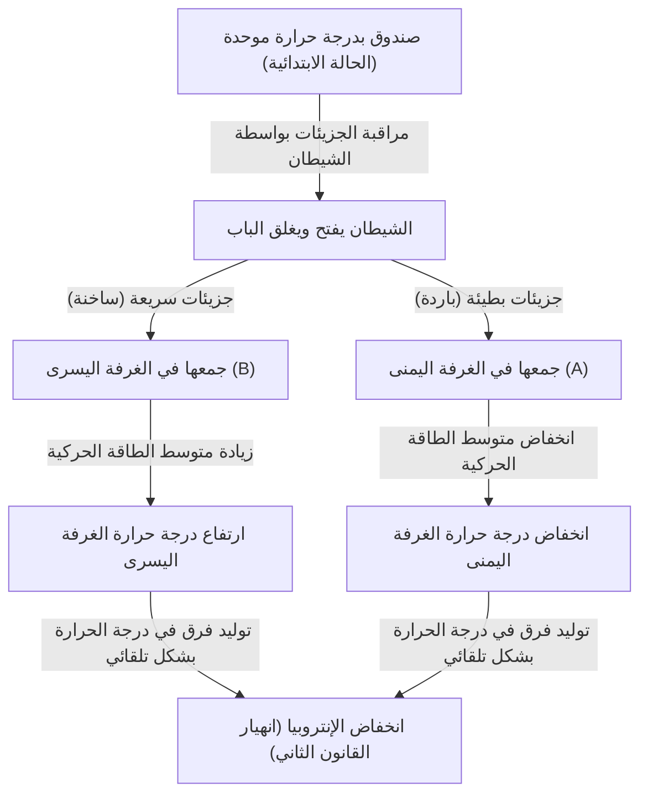
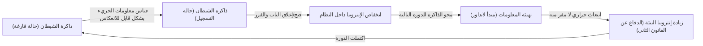

# مقدمة: القواعد التي يجب ألا تُكسر أبدًا

يوجد في الكون الذي نعيش فيه بعض القواعد المطلقة التي لا يمكن مخالفتها أبدًا. من بينها، والأكثر شهرة وتجذرًا بعمق في حياتنا اليومية، هو "القانون الثاني للديناميكا الحرارية". هذا القانون، الذي يُعرف أيضًا باسم "قانون زيادة الإنتروبيا"، يعبر باختصار عن حقيقة كونية حزينة (لكنها مطلقة) مفادها أن "الأشياء المنظمة تتجه نحو الفوضى بمرور الوقت"، أو بمعنى آخر "ما يُسكب لا يمكن استعادته".

إذا تركت قهوة ساخنة في الغرفة، فستصبح في النهاية باردة بنفس درجة حرارة الغرفة. على العكس من ذلك، من المستحيل تمامًا أن تغلي القهوة الباردة فجأة من تلقاء نفسها، وتصبح هواء الغرفة أكثر برودة نتيجة لذلك. إذا فتحت زجاجة عطر، ستنتشر الرائحة في جميع أنحاء الغرفة، لكن الرائحة المنتشرة لن تعود أبدًا تلقائيًا إلى داخل الزجاجة.

هذه "اللاانعكاسية" هي بالضبط حقيقة "سهم الزمن" الذي نشعر به، وهي السبب في أن القانون الثاني للديناميكا الحرارية يحتل مكانة خاصة في الفيزياء. حتى ألبرت أينشتاين أعرب عن احترامه العميق للديناميكا الحرارية باعتبارها النظرية المطلقة التي لن يتم دحضها أبدًا.

ومع ذلك، في القرن التاسع عشر، وجه الفيزيائي العظيم جيمس كليرك ماكسويل "تحديًا" واحدًا لهذا القانون المطلق. كانت هذه التجربة الفكرية المعروفة باسم "شيطان ماكسويل" (Maxwell's demon)، وهي الأشهر في تاريخ الفيزياء والتي أربكت معظم العلماء.

في هذا المقال، سنتعمق قدر الإمكان في المفارقة التي أحدثها شيطان ماكسويل، وكيف حارب الفيزيائيون هذا الشيطان لأكثر من قرن، وما هي النتيجة النهائية (دمج المعلومات والديناميكا الحرارية) التي توصلوا إليها.

---

# الفصل الأول: أساسيات الديناميكا الحرارية وميلاد شيطان ماكسويل

قبل الكشف عن هوية الشيطان الحقيقية، دعونا أولاً نراجع باختصار مسرح الأحداث، وهو "الديناميكا الحرارية".

## القانون الأول والثاني للديناميكا الحرارية

هناك ركيزتان هائلتان تحكمان الديناميكا الحرارية.

1. **القانون الأول للديناميكا الحرارية (قانون حفظ الطاقة)**
   ينص هذا القانون على أن الطاقة قد يتغير شكلها، لكنها لا تُستحدث ولا تُفنى. الحرارة أيضًا هي شكل من أشكال الطاقة، ومجموع الشغل الميكانيكي والطاقة الحرارية يظل دائمًا ثابتًا.
   
2. **القانون الثاني للديناميكا الحرارية (قانون زيادة الإنتروبيا)**
   ينص هذا القانون على أنه في أي نظام معزول (حيث لا يوجد تبادل للطاقة أو المادة مع الخارج)، فإن الإنتروبيا (درجة الفوضى أو العشوائية) تزداد دائمًا، أو تظل ثابتة في أحسن الأحوال. ولا تتناقص أبدًا. تنتقل الحرارة دائمًا من الجسم الساخن إلى الجسم البارد، ولا يمكن أن يحدث العكس أبدًا ما لم يتم بذل شغل (طاقة) من الخارج.

يقول القانون الأول إن "ميزانية (طاقة) الكون ثابتة"، ويقول القانون الثاني إن "طريقة إنفاق هذه الميزانية تتجه دائمًا نحو زيادة الهدر (الإنتروبيا)".

## تجربة ماكسويل الفكرية

في عام 1867، اقترح ماكسويل في رسالة إلى صديقه بيتر تيت تجربة فكرية تتجنب بذكاء هذا القانون الثاني. (يُذكر أن تسمية "الشيطان" (demon) لم يطلقها ماكسويل نفسه، بل صاغها لاحقًا ويليام طومسون (اللورد كلفن). وكان ماكسويل نفسه يسميه "كائنًا محدودًا" (finite being)).

تجربته الفكرية هي كالتالي:

تخيل صندوقًا معزولًا تمامًا عن الحرارة ولا يوجد به أي تبادل للطاقة من الخارج. ينقسم هذا الصندوق إلى قسمين بواسطة جدار مركزي: "الغرفة اليمنى (A)" و"الغرفة اليسرى (B)". يوجد غاز داخل الصندوق، وفي الحالة الابتدائية، تكون درجة الحرارة والضغط في كلتا الغرفتين متطابقتين تمامًا (حالة توازن حراري). تساوي درجة الحرارة يعني أن "متوسط" الطاقة الحركية لجزيئات الغاز متساوٍ. ومع ذلك، من منظور مجهري، تتحرك جزيئات الغاز الفردية بشكل عشوائي، وهناك مزيج من الجزيئات التي تتحرك بسرعة كبيرة (طاقة حركية كبيرة = درجة حرارة عالية) والجزيئات التي تتحرك ببطء (طاقة حركية صغيرة = درجة حرارة منخفضة).

الآن، لنضع "بابًا صغيرًا جدًا" في الجدار المركزي. ثم نضع كائنًا ذكيًا قادرًا على التحكم في فتح وإغلاق هذا الباب، أي **"شيطانًا"**.

يفتح الشيطان ويغلق الباب وفقًا للقواعد التالية:
- عندما يرى **"جزيئًا سريعًا"** يتجه من الغرفة اليمنى (A) إلى الغرفة اليسرى (B)، يفتح الباب ويسمح له بالمرور إلى B.
- عندما يرى **"جزيئًا بطيئًا"** يتجه من الغرفة اليمنى (A) إلى الغرفة اليسرى (B)، يغلق الباب ويبقيه في A.
- عندما يرى **"جزيئًا بطيئًا"** يتجه من الغرفة اليسرى (B) إلى الغرفة اليمنى (A)، يفتح الباب ويسمح له بالمرور إلى A.
- عندما يرى **"جزيئًا سريعًا"** يتجه من الغرفة اليسرى (B) إلى الغرفة اليمنى (A)، يغلق الباب ويبقيه في B.

دعونا نوضح هذا برسم بياني.

ماذا سيحدث إذا واصل الشيطان هذا العمل؟
بمرور الوقت، ستتجمع "الجزيئات السريعة" فقط في الغرفة اليسرى (B)، وتتجمع "الجزيئات البطيئة" فقط في الغرفة اليمنى (A). بمعنى آخر، على الرغم من أن درجة الحرارة كانت متساوية في البداية، إلا أنه بدون إضافة أي طاقة (شغل) من الخارج، أصبحت إحدى الغرف ساخنة والأخرى باردة.

إذا استخدمنا فرق درجات الحرارة هذا لتشغيل محرك حراري، فيمكننا استخراج شغل إلى الخارج. وبمجرد أن تصبح درجة الحرارة متساوية، يمكننا جعل الشيطان يفرز الجزيئات مرة أخرى. هذا يعني حرفيًا إكمال "محرك دائم من النوع الثاني" قادر على الاستمرار في استخراج الطاقة من الحرارة إلى ما لا نهاية.

على الرغم من عدم بذل شغل من الخارج (بافتراض أن الباب يفتح ويغلق بدون احتكاك وكتلته صفر)، إلا أن الإنتروبيا للنظام بأكمله قد انخفضت. هل انهار القانون الثاني للديناميكا الحرارية؟ هذه هي مفارقة "شيطان ماكسويل".

---

# الفصل الثاني: المعركة ضد المفارقة 〜 تاريخ طرد الشيطان

أثارت المفارقة التي طرحتها هذه التجربة الفكرية جدلاً كبيرًا في مجتمع الفيزياء. لابد من وجود "إغفال" في مكان ما في أفعال الشيطان لاستيفاء القانون الثاني للديناميكا الحرارية. اعتقد الفيزيائيون أنه "لابد أن تزيد الإنتروبيا في مكان ما خلال عملية قيام الشيطان بمراقبة وفرز الجزيئات".

## ماريان سمولوخوفسكي وليو زيلارد (1912-1929)

في عام 1912، درس الفيزيائي البولندي ماريان سمولوخوفسكي ما إذا كان يمكن إجراء هذا الفرز الجزيئي بواسطة "باب ميكانيكي مزود بنابض" بحت بدلاً من "شيطان" ككائن ذكي. ومع ذلك، أثبت أن الباب نفسه سيخضع لحركة حرارية (حركة براونية) بسبب الاصطدامات مع الجزيئات، مما سيؤدي في النهاية إلى فتح وإغلاق آلية النابض بشكل عشوائي، وستفشل عملية الفرز.

ثم في عام 1929، حقق الفيزيائي المجري ليو زيلارد أهم اختراق في تاريخ شيطان ماكسويل. لقد ابتكر نموذجًا مبسطًا يسمى "محرك زيلارد" بجزيء واحد فقط، وحلل عملية الشيطان بالتفصيل.

أعظم إنجاز لزيلارد هو **"ربط (الحصول على المعلومات (القياس)) و(الإنتروبيا)"**.
ركز زيلارد على العملية التي "يقيس (يلاحظ)" بها الشيطان سرعة الجزيء للحصول على تلك المعلومات. جادل بأنه حتى بالنسبة لشيطان ذكي، فإن معرفة سرعة الجزيء تتطلب نوعًا من التفاعل (مثل تسليط الضوء عليه)، وأن الزيادة في الإنتروبيا التي تحدث أثناء عملية القياس هذه يجب أن تتجاوز (أو تعوض) انخفاض الإنتروبيا للنظام ككل. كانت هذه فكرة رائدة أدخلت فعليًا مفهوم وحدة المعلومات "البت" إلى الديناميكا الحرارية لأول مرة.

## نموذج تشتت الضوء لليون بريلوين (الخمسينيات من القرن العشرين)

قام ليون بريلوين بتجسيد فكرة زيلارد بشكل أكبر. فقد اعتقد أنه من أجل أن "يرى" الشيطان الجزيء، يجب عليه تسليط ضوء (فوتون) من العالم الخارجي على الجزيء وتلقي الضوء المنعكس.

لرؤية جزيء في صندوق مظلم، يجب استخدام فوتونات بطاقة أعلى من إشعاع الجسم الأسود الخلفي (الإشعاع الحراري). عند حساب استهلاك الطاقة لهذه "الإضاءة" وتوليد الإنتروبيا الناتج عن تشتت الفوتونات، تم إثبات أن الزيادة في الإنتروبيا الناتجة عن استخدام الضوء ستكون دائمًا أكبر من المعلومات التي يكتسبها الشيطان (انخفاض الإنتروبيا عن طريق فرز الجزيئات).

بدا أن هذا قد دفن شيطان ماكسويل تمامًا. كان التفسير القائل بأن "الإنتروبيا تزداد هناك لأننا نسلط الضوء لرؤية الجزيئات" بديهيًا وسهل الفهم، وتم تدوينه في العديد من الكتب المدرسية.

ومع ذلك، لم تنته المعركة بعد.

## مبدأ لانداور: "محو" المعلومات هو المفتاح (1961)

كان هناك ثغرة في حل بريلوين. الفرضية القائلة بأن "الشيطان يستهلك الطاقة دائمًا وتزداد الإنتروبيا عند قياس الجزيئات" لم تكن صحيحة في الواقع.

في عام 1961، أوضح باحث شركة آي بي إم رولف لانداور ولاحقًا تشارلز بينيت وآخرون أن القياس القابل للانعكاس فيزيائيًا (قياس يكتسب معلومات دون استهلاك أي طاقة) ممكن نظريًا. بعبارة أخرى، كان هناك نموذج نظري يمكن تنفيذه دون زيادة الإنتروبيا إذا كان الأمر يقتصر على "تسجيل (قياس) المعلومات فقط".

هذا من شأنه أن يكسر القانون الثاني مرة أخرى. ومع ذلك، وجد لانداور جذور توليد الإنتروبيا في مكان مختلف تمامًا. وهو **"محو المعلومات"**.

وفقًا لمبدأ لانداور (Landauer's principle)، فإن العمليات القابلة للانعكاس لـ "تسجيل" أو "نسخ" المعلومات لا تتطلب طاقة، لكن العملية غير القابلة للانعكاس لـ **"محو (تهيئة)"** المعلومات يجب أن تطلق حرارة في البيئة، مما يؤدي حتمًا إلى زيادة الإنتروبيا. تم إثبات أن الحد الأدنى من كمية الطاقة المطلوبة لمحو 1 بت من المعلومات هو $k_B T \ln 2$ ($k_B$ هو ثابت بولتزمان، و$T$ هي درجة الحرارة المطلقة).

---

# الفصل الثالث: الإجابة النهائية لبينيت وفجر الديناميكا الحرارية للمعلومات

في عام 1982، استخدم تشارلز بينيت مبدأ لانداور لتوجيه الضربة القاضية النهائية لشيطان ماكسويل.

حجة بينيت هي كما يلي.
لكي يفرز الشيطان الجزيئات، يجب عليه "تذكر" معلومات سرعة الجزيئات في دماغه (أو ذاكرته). كما ذكرنا سابقًا، يمكن (بشكل مثالي) إجراء خطوة القياس والذاكرة هذه دون زيادة الإنتروبيا. ومن خلال فتح وإغلاق الباب لفرز الجزيئات وخلق فرق في درجة الحرارة داخل الصندوق، فإنه يقلل من إنتروبيا الصندوق.

ومع ذلك، فإن دماغ الشيطان (سعة الذاكرة) محدود. لكي يعمل كمحرك دائم، يجب على الشيطان تكرار هذه الدورة إلى الأبد. من أجل تذكر معلومات جزيء جديد، يجب عليه **"محو (نسيان)"** المعلومات القديمة لتفريغ الذاكرة.

وهذه اللحظة بالذات، لحظة "محو المعلومات"، هي وقت حساب الديناميكا الحرارية. وفقًا لمبدأ لانداور، عند محو المعلومات، يطلق الشيطان الحرارة في البيئة، مما يزيد من الإنتروبيا. هذه الزيادة في الإنتروبيا المرتبطة بمحو المعلومات **تتوازن تمامًا أو تتجاوز** الإنتروبيا المنخفضة في الصندوق الناتج عن قيام الشيطان بفرز الجزيئات.

كان حل بينيت هو اللحظة التي اندمجت فيها الفيزياء ونظرية المعلومات تمامًا.
**"المعلومات كيان مادي (Information is physical)"**
لقد تبين أن المعلومات ليست مجرد مفهوم تجريدي، بل يجب التعامل معها على أنها معادلة للطاقة والإنتروبيا في النظم الفيزيائية.

تم القضاء أخيرًا على الشيطان الذي أطلقه ماكسويل في القرن التاسع عشر بعد أكثر من قرن من الزمان، باستخدام المفاهيم الخاصة بعلوم الكمبيوتر: "القياس"، و"الذاكرة"، و"النسيان".

---

# الفصل الرابع: الشياطين في العصر الحديث (الإدراك العملي والتطبيقات)

لم يعد شيطان ماكسويل مجرد "تجربة فكرية". في القرن الحادي والعشرين، مع التقدم الهائل في تكنولوجيا النانو وتكنولوجيا المعلومات الكمومية، أصبح بإمكان العلماء بالفعل إنشاء "شياطين ماكسويل اصطناعية" في المختبرات والتحقق من مبدأ لانداور وقوانين الديناميكا الحرارية للمعلومات.

## الشيطان في المختبر

في عام 2010، استمد الدكتور تاكاهيرو ساغاوا (الآن أستاذ في جامعة طوكيو) والدكتور ماساهيتو أويدا من جامعة تشو معادلة معممة لـ "الديناميكا الحرارية للمعلومات" (معادلة ساغاوا-أويدا)، وصاغا بشكل صارم العلاقة بين المعلومات والإنتروبيا. بعد ذلك، أجريت تجارب تحاكي محرك زيلارد وشيطان ماكسويل في مختبرات حول العالم باستخدام جزيئات نانوية الحجم وإلكترونات مفردة.

من خلال هذه التجارب، تم إثبات عمليًا أنه "يمكن استخدام المعلومات لتحويل الطاقة الحرارية إلى شغل". بالطبع، إذا أخذنا في الاعتبار إجمالي توليد الإنتروبيا المطلوب لمعالجة المعلومات ومحوها، فلن يتم كسر القانون الثاني للديناميكا الحرارية، ولكن ثبت أنه في النظم المجهرية، من الممكن الحصول على القوة المحركة باستخدام "المعلومات" كنوع من "الوقود".

## الشياطين في الكائنات الحية

من المثير للاهتمام أن هناك العديد من الآليات في الأنظمة الحية التي تشبه "شيطان ماكسويل" إلى حد كبير.
على سبيل المثال، البروتينات الحركية مثل "الكينيسين" و"الداينين" التي تنقل المواد داخل الخلايا. على الرغم من أن داخل الخلية عبارة عن عاصفة من الحركة الحرارية (الحركة البراونية) للجزيئات، إلا أن هذه البروتينات الحركية تستخدم بذكاء التقلبات الحرارية المحيطة (الحركة العشوائية) مع استخدام التحلل المائي لـ ATP كمصدر للطاقة لتوليد حركة منظمة في اتجاه واحد.

تُعرف هذه الآلية باسم آلية السقاطة البراونية، وهي آلية على المستوى الجزيئي تشبه شيطان ماكسويل. تحافظ الحياة على "النظام" الذي يتحدى قانون زيادة الإنتروبيا من خلال المعالجة البارعة للمعلومات المجهرية مع القبول التام للقيود الديناميكية الحرارية التي يواجهها شيطان ماكسويل. الكلمات التي قالها شرودنجر في كتابه "ما هي الحياة؟"، "أن تعيش بالتغذي على الإنتروبيا السالبة"، تشير بوضوح إلى العلاقة بين المعلومات والديناميكا الحرارية.

---

# الخاتمة: ما علمنا إياه الشيطان

لم يتمكن شيطان ماكسويل من هزيمة القانون الثاني للديناميكا الحرارية. ومع ذلك، وبسبب وجود هذا الشيطان، حظيت الفيزياء بفوائد لا حصر لها.

1. **تأسيس الميكانيكا الإحصائية**: ترسخ المنظور الذي حدسه ماكسويل وبولتزمان بأن "القوانين العيانية (الديناميكا الحرارية) تنشأ من السلوك الإحصائي للجسيمات المجهرية".
2. **الفيزياء المتعلقة بالمعلومات**: تم دمج "المعلومات" في قوانين الفيزياء بواسطة زيلارد ولانداور وبينيت وآخرين. كشف هذا عن الحدود المادية لاستهلاك الطاقة في أجهزة الكمبيوتر.
3. **ولادة الديناميكا الحرارية للمعلومات**: اندمجت الميكانيكا الإحصائية غير المتوازنة ونظرية المعلومات، مما فتح مجالًا جديدًا يشكل أساس تكنولوجيا النانو الحديثة، وأجهزة الكمبيوتر الكمومية، والفيزياء الحيوية.

لو لم يبتكر ماكسويل هذا الشيطان، لربما استغرق الأمر وقتًا أطول بكثير حتى ترتبط الفيزياء وعلوم الكمبيوتر بهذه الدرجة العميقة.
واجهنا الشيطان بحقيقة كونية قاسية مفادها أن "المعلومات ليست مجانية" (Information is not free). لكن في الوقت نفسه، علمنا أيضًا أن "فهم المعلومات فيزيائيًا يفتح أبوابًا جديدة تمامًا للعالم المجهري".

لا يزال القانون الثاني للديناميكا الحرارية يحكم الكون بثبات. ومع ذلك، فقد تم تحديث الآثار المترتبة على هذا القانون، بتوجيه من الشيطان، من عصر المحركات البخارية في القرن التاسع عشر إلى عصر تكنولوجيا المعلومات الكمومية في القرن الحادي والعشرين.

ستستمر الإنتروبيا في الازدياد طالما استمر الكون، ولكن رحلة استكشافنا لكيفية تعاملنا مع المعلومات في هذه العملية قد بدأت للتو.

---

**المراجع والكتب الموصى بها:**
- ليو زيلارد "On the Decrease of Entropy in a Thermodynamic System by the Intervention of Intelligent Beings" (1929)
- رولف لانداور "Irreversibility and Heat Generation in the Computing Process" (1961)
- تشارلز بينيت "The Thermodynamics of Computation—a Review" (1982)
- مارك ميزرد، أندريا مونتاناري "Information, Physics, and Computation"
- تاكاهيرو ساغاوا "Nonequilibrium Statistical Mechanics" (الميكانيكا الإحصائية غير المتوازنة)
