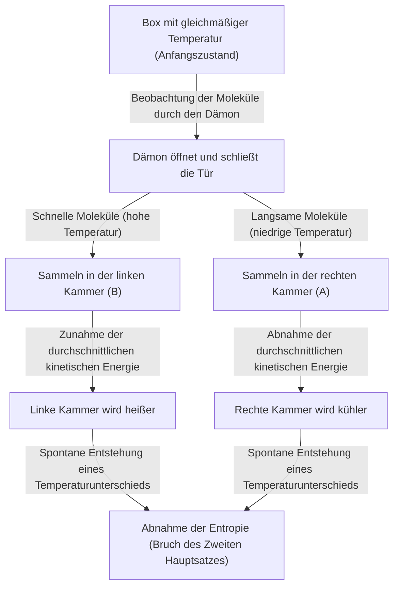
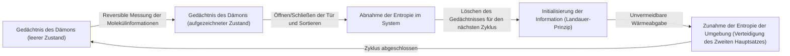

# Einleitung: Die Regeln, die niemals gebrochen werden sollten

In diesem Universum, in dem wir leben, gibt es einige absolute Regeln, denen man sich niemals widersetzen kann. Die bekannteste davon, die am tiefsten in unserem Alltag verwurzelt ist, ist der "Zweite Hauptsatz der Thermodynamik". Auch bekannt als das "Gesetz der Entropiezunahme", drückt dieses Gesetz die traurige (aber absolute) Wahrheit des Universums aus: "Geschehenes kann nicht ungeschehen gemacht werden" oder "Was geordnet ist, strebt mit der Zeit der Unordnung entgegen".

Wenn Sie heißen Kaffee im Zimmer stehen lassen, wird er schließlich auf Raumtemperatur abkühlen. Umgekehrt wird kalter Kaffee niemals plötzlich kochen, während die Raumluft im Gegenzug abkühlt, ohne dass man etwas tut. Wenn Sie eine Parfümflasche öffnen, breitet sich der Duft im Raum aus, aber der im Raum verteilte Duft wird niemals von selbst in die Flasche zurückkehren.

Diese "Irreversibilität" ist das wahre Gesicht des "Zeitpfeils", den wir spüren, und der Grund, warum der Zweite Hauptsatz der Thermodynamik eine besondere Stellung in der Physik einnimmt. Selbst Albert Einstein zollte der Thermodynamik tiefen Respekt und hielt sie für die ultimative Theorie, die niemals widerlegt werden würde.

Der große Physiker James Clerk Maxwell warf jedoch im 19. Jahrhundert eine "Herausforderung" gegen dieses absolute Gesetz. Dies war das berühmteste Gedankenexperiment in der Geschichte der Physik, das die meisten Gelehrten beschäftigte: "Maxwells Dämon" (Maxwell's demon).

In diesem Artikel werden wir so tief und detailliert wie möglich untersuchen, was für ein Paradoxon Maxwells Dämon mit sich brachte, wie Physiker über ein Jahrhundert lang gegen diesen Dämon kämpften und zu welcher endgültigen Schlussfolgerung (der Verschmelzung von Information und Thermodynamik) sie schließlich gelangten.

---

# Kapitel 1: Grundlagen der Thermodynamik und die Geburt von Maxwells Dämon

Bevor wir die wahre Identität des Dämons lüften, lassen Sie uns kurz die "Thermodynamik", die die Bühne bildet, rekapitulieren.

## Erster und Zweiter Hauptsatz der Thermodynamik

Es gibt zwei gewaltige Säulen, die die Thermodynamik beherrschen.

1. **Erster Hauptsatz der Thermodynamik (Energieerhaltungssatz)**
   Energie kann zwar ihre Form ändern, wird aber niemals neu erschaffen oder vernichtet. Wärme ist auch eine Form von Energie, und die Summe aus mechanischer Arbeit und Wärmeenergie bleibt immer konstant.
   
2. **Zweiter Hauptsatz der Thermodynamik (Gesetz der Entropiezunahme)**
   In einem isolierten System (einem Raum ohne Energie- oder Stoffaustausch mit der Umgebung) nimmt die Entropie (der Grad der Unordnung oder Zufälligkeit) immer zu oder bleibt im besten Fall konstant. Sie nimmt niemals ab. Wärme fließt immer von einem Körper höherer Temperatur zu einem Körper niedrigerer Temperatur, und das Gegenteil kann ohne äußere Arbeit (Energie) nicht geschehen.

Der Erste Hauptsatz besagt: "Das Budget (die Energie) des Universums ist konstant", und der Zweite Hauptsatz besagt: "Die Verwendung dieses Budgets führt immer zu mehr Verschwendung (Entropie)".

## Maxwells Gedankenexperiment

1867 schlug Maxwell in einem Brief an seinen Freund Peter Tait ein Gedankenexperiment vor, das dieses zweite Gesetz geschickt umging. (Der Begriff "Dämon" (demon) stammt übrigens nicht von Maxwell selbst, sondern wurde später von William Thomson (Lord Kelvin) geprägt. Maxwell selbst nannte ihn ein "endliches Wesen" (finite being)).

Sein Gedankenexperiment ist wie folgt:

Stellen Sie sich eine vollständig isolierte Box vor, bei der keinerlei Energie mit der Umgebung ausgetauscht wird. Diese Box ist durch eine zentrale Wand in "die rechte Kammer (A)" und "die linke Kammer (B)" unterteilt. Die Box enthält ein Gas, und im Anfangszustand sind Temperatur und Druck in beiden Kammern völlig gleich (thermisches Gleichgewicht). Gleiche Temperatur bedeutet, dass der "Durchschnittswert" der kinetischen Energie der Gasmoleküle gleich ist. Betrachtet man es jedoch mikroskopisch, so fliegen die einzelnen Gasmoleküle zufällig umher, und es gibt Moleküle, die sich sehr schnell bewegen (hohe kinetische Energie = hohe Temperatur), sowie solche, die sich langsam bewegen (niedrige kinetische Energie = niedrige Temperatur).

Nun installieren wir eine "extrem kleine Tür" in der zentralen Wand. Und wir platzieren eine intelligente Lebensform, also einen **"Dämon"**, der das Öffnen und Schließen dieser Tür steuern kann.

Der Dämon öffnet und schließt die Tür nach folgenden Regeln:
- Wenn er ein **"schnelles Molekül"** findet, das von der rechten Kammer (A) zur linken Kammer (B) fliegt, öffnet er die Tür und lässt es nach B durch.
- Wenn er ein **"langsames Molekül"** findet, das von der rechten Kammer (A) zur linken Kammer (B) fliegt, schließt er die Tür und hält es in A.
- Wenn er ein **"langsames Molekül"** findet, das von der linken Kammer (B) zur rechten Kammer (A) fliegt, öffnet er die Tür und lässt es nach A durch.
- Wenn er ein **"schnelles Molekül"** findet, das von der linken Kammer (B) zur rechten Kammer (A) fliegt, schließt er die Tür und hält es in B.

Lassen Sie uns dies grafisch darstellen.

Was passiert, wenn der Dämon diese Arbeit fortsetzt?
Im Laufe der Zeit sammeln sich nur noch "schnelle Moleküle" in der linken Kammer (B) und nur noch "langsame Moleküle" in der rechten Kammer (A). Das heißt, obwohl sie anfangs die gleiche Temperatur hatten, wurde ohne Zufuhr von äußerer Energie (Arbeit) eine Kammer heiß und die andere kalt.

Wenn man diesen Temperaturunterschied nutzt, um eine Wärmekraftmaschine (Motor) anzutreiben, kann man Arbeit nach außen verrichten. Und wenn die Temperatur wieder gleichmäßig ist, kann man den Dämon erneut die Moleküle sortieren lassen. Dies bedeutet die Vollendung eines "Perpetuum mobile zweiter Art", das unendlich lange Energie aus Wärme gewinnen kann.

Obwohl von außen keine Arbeit verrichtet wird (unter der Annahme, dass sich die Tür reibungslos öffnet und schließt und eine Masse von Null hat), hat die Entropie des gesamten Systems abgenommen. Ist der Zweite Hauptsatz der Thermodynamik zusammengebrochen? Das ist das Paradoxon von "Maxwells Dämon".

---

# Kapitel 2: Der Kampf gegen das Paradoxon - Die Geschichte der Dämonenaustreibung

Das Paradoxon, das dieses Gedankenexperiment aufwarf, löste eine große Kontroverse in der physikalischen Gemeinschaft aus. Es muss irgendwo in den Handlungen des Dämons ein "Übersehen" geben, das den Zweiten Hauptsatz der Thermodynamik erfüllt. Die Physiker dachten: "Irgendwo im Prozess, in dem der Dämon die Moleküle beobachtet und sortiert, muss die Entropie definitiv zunehmen."

## Marian Smoluchowski und Leó Szilárd (1912 - 1929)

Im Jahr 1912 untersuchte der polnische Physiker Marian Smoluchowski, ob diese Molekülsortierung nicht durch einen als intelligentes Wesen agierenden "Dämon", sondern durch eine rein physikalische "automatische federbelastete Tür" durchgeführt werden könnte. Er bewies jedoch, dass die Tür selbst durch Kollisionen mit Molekülen auch thermische Bewegungen (Brownsche Bewegung) ausführen würde und der Federmechanismus sich schließlich zufällig öffnen und schließen würde, wodurch die Sortierung nicht mehr funktionieren würde.

Und 1929 brachte der ungarische Physiker Leó Szilárd den wichtigsten Durchbruch in der Geschichte von Maxwells Dämon. Er entwarf ein vereinfachtes Modell mit nur einem einzigen Molekül, das als "Szilárd-Maschine" bezeichnet wird, und analysierte den Prozess des Dämons im Detail.

Szilárds größte Leistung war **die Verknüpfung von "Informationsgewinnung (Messung)" und "Entropie"**.
Szilárd konzentrierte sich auf den Prozess, in dem der Dämon die Geschwindigkeit des Moleküls "misst (beobachtet)", um diese Information zu erhalten. Selbst für einen intelligenten Dämon ist eine Art von Interaktion (z. B. das Anstrahlen mit Licht) erforderlich, um die Geschwindigkeit des Moleküls zu kennen, und er argumentierte, dass die Entropiezunahme, die während dieses Messprozesses auftritt, die Entropieabnahme des gesamten Systems übersteigen (oder ausgleichen) muss. Es war eine bahnbrechende Idee, die das Konzept der Informationseinheit "Bit" praktisch zum ersten Mal in die Thermodynamik einführte.

## Léon Brillouins Lichtstreuungsmodell (1950er Jahre)

Léon Brillouin konkretisierte Szilárds Idee weiter. Er argumentierte, dass der Dämon, um das Molekül "sehen" zu können, Licht (Photonen) aus der Umgebung auf das Molekül strahlen und das reflektierte Licht empfangen muss.

Um ein Molekül in einer dunklen Box zu sehen, müssen Photonen verwendet werden, die eine höhere Energie als die Hintergrundwärmestrahlung (Hohlraumstrahlung) haben. Wenn man den Energieverbrauch für diese "Beleuchtung" und die Entropieproduktion aufgrund der Lichtstreuung berechnet, so wurde bewiesen, dass die durch die Verwendung von Licht erzeugte Entropiezunahme immer größer ist als die Entropieabnahme durch die vom Dämon gewonnene Information (Sortierung der Moleküle).

Damit schien Maxwells Dämon endgültig begraben zu sein. Die Erklärung "Da man Licht ausstrahlt, um die Moleküle zu sehen, nimmt dort die Entropie zu" war intuitiv und leicht verständlich und wurde in vielen Lehrbüchern beschrieben.

Aber der Kampf war noch nicht vorbei.

## Das Landauer-Prinzip: Das "Löschen" von Informationen ist der Schlüssel (1961)

Brillouins Lösung hatte ein Schlupfloch. Die Prämisse, dass "der Dämon immer Energie verbraucht und die Entropie erhöht, wenn er Moleküle misst", war tatsächlich nicht richtig.

Im Jahr 1961 zeigten der IBM-Forscher Rolf Landauer und später Charles Bennett et al., dass eine physikalisch reversible Messung (eine Messung, die Informationen erhält, ohne jegliche Energie zu verbrauchen) theoretisch möglich ist. Mit anderen Worten, es gab ein theoretisches Modell, in dem das "bloße Aufzeichnen (Messen) von Informationen" ohne Erhöhung der Entropie durchgeführt werden konnte.

Dies würde den Zweiten Hauptsatz erneut brechen. Landauer fand jedoch die Wurzel der Entropieproduktion an einem völlig anderen Ort. Das ist **"das Löschen von Informationen"**.

Gemäß dem Landauer-Prinzip ist für reversible Operationen, die Informationen "aufzeichnen" oder "kopieren", keine Energie erforderlich, aber für irreversible Operationen, die Informationen **"löschen (initialisieren)"**, muss Wärme an die Umgebung abgegeben werden, was zwangsläufig zu einer Erhöhung der Entropie führt. Es wurde gezeigt, dass die minimale Energiemenge, die erforderlich ist, um 1 Bit Information zu löschen, $k_B T \ln 2$ beträgt ($k_B$ ist die Boltzmann-Konstante, $T$ ist die absolute Temperatur).

---

# Kapitel 3: Bennetts endgültige Antwort und das Aufkommen der Informationsthermodynamik

Im Jahr 1982 nutzte Charles Bennett das Landauer-Prinzip, um Maxwells Dämon den endgültigen Todesstoß zu versetzen.

Bennetts Argument lautet wie folgt:
Damit der Dämon die Moleküle sortieren kann, muss er die Geschwindigkeitsinformationen der Moleküle in seinem eigenen Gehirn (oder Speicher) "speichern". Wie oben erwähnt, kann dieser Mess- und Speicherschritt (idealerweise) ohne Erhöhung der Entropie durchgeführt werden. Und durch das Öffnen und Schließen der Tür, das Sortieren der Moleküle und das Erzeugen eines Temperaturunterschieds in der Box, verringert er die Entropie der Box.

Das Gehirn des Dämons (seine Speicherkapazität) ist jedoch endlich. Um als Perpetuum mobile zu funktionieren, muss der Dämon diesen Zyklus ewig wiederholen. Um neue Molekülinformationen zu speichern, muss er die alten Informationen **"löschen (vergessen)"**, um den Speicher zu leeren.

Und genau dieser Moment des "Informationslöschens" ist die Zeit für das Urteil der Thermodynamik. Nach dem Landauer-Prinzip gibt der Dämon beim Löschen von Informationen Wärme an die Umgebung ab und erhöht die Entropie. Diese Erhöhung der Entropie, die mit dem Löschen von Informationen einhergeht, **gleicht genau die Entropieabnahme in der Box aus, die der Dämon durch das Sortieren der Moleküle erreicht hat, oder übersteigt sie sogar.**

Bennetts Lösung war der Moment, in dem Physik und Informationstheorie vollständig miteinander verschmolzen.
**"Information ist physikalisch (Information is physical)"**
Es wurde gezeigt, dass Information nicht nur ein abstraktes Konzept ist, sondern in physikalischen Systemen als äquivalent zu Energie und Entropie behandelt werden muss.

Der Dämon, den Maxwell im 19. Jahrhundert entfesselte, wurde nach mehr als einem Jahrhundert endlich mit den computerwissenschaftlichen Konzepten von "Messung", "Erinnerung" und "Vergessen" besiegt.

---

# Kapitel 4: Dämonen in der modernen Ära (Experimentelle Realisierung und Anwendungen)

Maxwells Dämon ist nicht mehr nur ein "Gedankenexperiment". Im 21. Jahrhundert, mit den rasanten Fortschritten in der Nanotechnologie und der Quanteninformationstechnologie, waren Wissenschaftler in der Lage, "künstliche Maxwellsche Dämonen" im Labor zu erschaffen und das Landauer-Prinzip sowie die Gesetze der Informationsthermodynamik zu verifizieren.

## Dämonen im Labor

Im Jahr 2010 leiteten Dr. Takahiro Sagawa (jetzt Professor an der Universität Tokio) und Dr. Masahito Ueda von der Chuo-Universität die verallgemeinerte Gleichung der "Informationsthermodynamik" (Sagawa-Ueda-Gleichung) ab und formulierten die Beziehung zwischen Information und Entropie rigoros. Darauf aufbauend wurden in Labors auf der ganzen Welt Experimente durchgeführt, die die Szilárd-Maschine und Maxwells Dämon mit nanoskaligen Partikeln und Einzelelektronen nachahmten.

Diese Experimente haben experimentell bewiesen, dass "Information genutzt werden kann, um Wärmeenergie in Arbeit umzuwandeln". Natürlich wird der Zweite Hauptsatz der Thermodynamik nicht gebrochen, wenn die gesamte Entropieproduktion, die an der Informationsverarbeitung und dem Löschen beteiligt ist, mit in die Berechnung einbezogen wird, aber es wurde bewiesen, dass es in mikroskopischen Systemen möglich ist, "Information" wie eine Art "Brennstoff" zu verwenden, um Antriebskraft zu erhalten.

## Dämonen in der Biologie

Interessanterweise gibt es viele Mechanismen in biologischen Systemen, die sehr ähnlich zu "Maxwells Dämon" sind.
Ein Beispiel sind Motorproteine wie "Kinesin" und "Dynein", die Substanzen innerhalb von Zellen transportieren. Das Zellinnere wird von Stürmen thermischer Bewegung (Brownsche Bewegung) von Molekülen heimgesucht, aber diese Motorproteine nutzen die Hydrolyse von ATP als Energiequelle, während sie die umgebenden thermischen Fluktuationen (zufällige Bewegungen) geschickt ausnutzen, um eine geordnete Bewegung in eine Richtung zu erzeugen.

Dies wird als Brownscher Ratschenmechanismus (Brownian ratchet) bezeichnet und ist eine Apparatur auf molekularer Ebene, die Maxwells Dämon ähnelt. Das Leben erhält eine "Ordnung" aufrecht, die dem Gesetz der Entropiezunahme zu trotzen scheint, indem es mikroskopische Informationen geschickt verarbeitet, während es die thermodynamischen Beschränkungen, mit denen Maxwells Dämon konfrontiert ist, vollständig akzeptiert. Schrödingers Worte "Leben von negativer Entropie", die er in seinem Buch "Was ist Leben?" äußerte, deuteten genau auf die Verbindung zwischen Information und Thermodynamik hin.

---

# Fazit: Was uns der Dämon gelehrt hat

Maxwells Dämon konnte den Zweiten Hauptsatz der Thermodynamik nicht brechen. Aber dank der Existenz dieses Dämons hat die Physik unermessliche Vorteile erhalten.

1. **Etablierung der statistischen Mechanik**: Die von Maxwell und Boltzmann intuitiv erfasste Perspektive, dass "makroskopische Gesetze (Thermodynamik) aus dem statistischen Verhalten mikroskopischer Teilchen entstehen", wurde etabliert.
2. **Die Physikalisierung der Information**: Durch Szilárd, Landauer, Bennett und andere wurde "Information" in die Gesetze der Physik integriert. Dies deckte die physikalischen Grenzen des Energieverbrauchs von Computern auf.
3. **Geburt der Informationsthermodynamik**: Die Nichtgleichgewichts-Statistische Mechanik und die Informationstheorie verschmolzen miteinander und eröffneten ein neues Feld, das die Grundlage für moderne Nanotechnologie, Quantencomputer und Biophysik bildet.

Hätte Maxwell diesen Dämon nicht erdacht, hätte es vielleicht viel mehr Zeit gebraucht, bis Physik und Informatik so tief miteinander verbunden wären.
Der Dämon hat uns mit der kalten, harten Tatsache des Universums konfrontiert, dass "Information nicht kostenlos ist (Information is not free)". Aber gleichzeitig lehrte er uns, dass "ein physikalisches Verständnis von Information völlig neue Türen in die mikroskopische Welt öffnet".

Der Zweite Hauptsatz der Thermodynamik beherrscht das Universum auch heute noch unerschütterlich. Aber die Bedeutung dieses Gesetzes wurde durch die Führung des Dämons vom Zeitalter der Dampfmaschinen im 19. Jahrhundert zum Zeitalter der Quanteninformationstechnologie im 21. Jahrhundert wunderbar aktualisiert.

Solange das Universum andauert, wird die Entropie weiter zunehmen, aber unsere Entdeckungsreise, wie wir in diesem Prozess mit Informationen umgehen, hat gerade erst begonnen.

---

**Referenzen und empfohlene Bücher:**
- Leó Szilárd "On the Decrease of Entropy in a Thermodynamic System by the Intervention of Intelligent Beings" (1929)
- Rolf Landauer "Irreversibility and Heat Generation in the Computing Process" (1961)
- Charles Bennett "The Thermodynamics of Computation—a Review" (1982)
- Marc Mézard, Andrea Montanari "Information, Physics, and Computation"
- Takahiro Sagawa "Nichtgleichgewichts-Statistische Mechanik" (非平衡統計力学)
