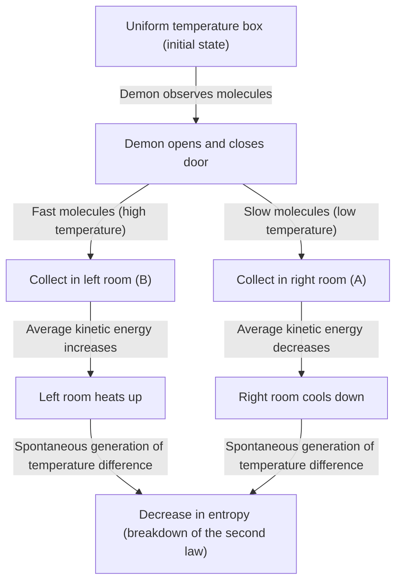
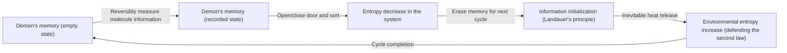

# Introduction: The Rule That Should Never Be Broken

In the universe we live in, there are several absolute rules that can never be defied. Among them, the most famous and deeply rooted in our daily lives is the "Second Law of Thermodynamics." Also known as the "Law of Entropy Increase," this law simply states "no use crying over spilt milk," representing the sad (but absolute) truth of the universe that "orderly things will move toward disorder over time."

If you leave hot coffee in a room, it will eventually become as cold as room temperature. Conversely, without doing anything, cold coffee will never suddenly boil and cause the air in the room to become colder. If you open a bottle of perfume, the scent will spread throughout the room, but the scent spread throughout the room will never spontaneously return into the bottle.

This "irreversibility" is the true identity of the "arrow of time" we perceive, and the reason why the Second Law of Thermodynamics occupies a special position in physics. Even Albert Einstein paid deep respect to thermodynamics, considering it the ultimate theory that would never be overturned.

However, the great 19th-century physicist James Clerk Maxwell threw a "challenge" to this absolute law. That is the thought experiment "Maxwell's Demon," the most famous paradox in the history of physics that troubled the most scholars.

In this article, we will delve as deeply and detailed as possible into what paradox this Maxwell's demon brought about, how physicists fought this demon for over a century, and what conclusion (the fusion of information and thermodynamics) they finally reached.

---

# Chapter 1: Fundamentals of Thermodynamics and the Birth of Maxwell's Demon

Before unraveling the true identity of the demon, let's briefly review the stage, "thermodynamics."

## The First and Second Laws of Thermodynamics

There are two massive pillars that govern thermodynamics.

1. **The First Law of Thermodynamics (Law of Conservation of Energy)**
   This law states that energy may change form, but it is never newly created or destroyed. Heat is also a form of energy, and the sum of mechanical work and heat energy is always kept constant.
   
2. **The Second Law of Thermodynamics (Law of Entropy Increase)**
   In an isolated system (a space with no exchange of energy or matter with the outside), entropy (the degree of disorder, or randomness) always increases, or at best, is kept constant. It never decreases. Heat always moves from a high-temperature object to a low-temperature object, and the reverse can never occur unless work (energy) is applied from the outside.

The First Law says "the budget (energy) of the universe is constant," and the Second Law says "the use of that budget always heads in the direction of increasing waste (entropy)."

## Maxwell's Thought Experiment

In 1867, in a letter to his friend Peter Tait, Maxwell proposed a thought experiment to cleverly bypass this Second Law. (Note that the name "demon" was not coined by Maxwell himself, but later by William Thomson (Lord Kelvin). Maxwell himself called it a "finite being").

His thought experiment goes like this:

Imagine a completely insulated box with no energy entering or leaving from the outside. This box is divided into two parts, a "right room (A)" and a "left room (B)," by a central wall. There is gas in the box, and initially, the temperature and pressure in both rooms are exactly the same (thermal equilibrium state). The same temperature means that the "average value" of the kinetic energy of the gas molecules is the same. However, from a microscopic perspective, each gas molecule flies around randomly, and some move very fast (large kinetic energy = high temperature) while others move slowly (small kinetic energy = low temperature).

Now, let's install a "very small door" in the central wall. Then, we place an intelligent life form, a **"demon,"** that can control the opening and closing of that door.

The demon opens and closes the door according to the following rules:
- If it sees a **"fast molecule"** coming from the right room (A) toward the left room (B), it opens the door and lets it through to B.
- If it sees a **"slow molecule"** coming from the right room (A) toward the left room (B), it closes the door and keeps it in A.
- If it sees a **"slow molecule"** coming from the left room (B) toward the right room (A), it opens the door and lets it through to A.
- If it sees a **"fast molecule"** coming from the left room (B) toward the right room (A), it closes the door and keeps it in B.

Let's illustrate this.

What happens if the demon continues this task?
Over time, only "fast molecules" will gather in the left room (B), and only "slow molecules" will gather in the right room (A). In other words, although they started at the same temperature, one room has become hotter and the other colder without applying any energy (work) from the outside.

If we run a heat engine using this temperature difference, we can extract work to the outside. And once the temperature becomes uniform, we can just let the demon sort the molecules again. This means the completion of a "perpetual motion machine of the second kind," which can endlessly extract energy from heat.

Despite doing no work from the outside (assuming the door opens and closes frictionlessly and has zero mass), the entropy of the entire system has decreased. Has the Second Law of Thermodynamics broken down? This is the paradox of "Maxwell's Demon."

---

# Chapter 2: The Fight Against the Paradox - The History of Exorcism

The paradox presented by this thought experiment caused a great controversy in the physics community. There must be an "oversight" somewhere in the demon's actions to satisfy the Second Law of Thermodynamics. Physicists thought, "Entropy must definitely be increasing somewhere in the process where the demon observes and sorts the molecules."

## Marian Smoluchowski and Leo Szilard (1912-1929)

In 1912, Polish physicist Marian Smoluchowski considered whether this molecular sorting could be done purely by a physical "automated spring-loaded door" rather than an "intelligent demon." However, he proved that because the door itself undergoes thermal motion (Brownian motion) due to collisions with molecules, the spring mechanism would eventually open and close randomly, causing the sorting to cease functioning.

Then, in 1929, Hungarian physicist Leo Szilard brought about the most important breakthrough in the history of Maxwell's demon. He devised a simplified model with only one molecule, called "Szilard's engine," and analyzed the demon's process in detail.

Szilard's greatest achievement was **connecting "information acquisition (measurement)" with "entropy."**
Szilard focused on the process where the demon "measures (observes)" the speed of the molecule to obtain its information. Even for an intelligent demon, some interaction (such as shining a light) is required to know the speed of the molecule, and he argued that the entropy increase occurring in the measurement process must exceed (or offset) the entropy decrease in the entire system. It was an epoch-making idea that effectively introduced the concept of the unit of information, "bit," into thermodynamics for the first time.

## Leon Brillouin's Light Scattering Model (1950s)

Leon Brillouin further substantiated Szilard's idea. He thought that in order for the demon to "see" the molecules, it would need to shine external light (photons) on the molecules and receive the reflected light.

To see molecules inside a dark box, one must use photons with higher energy than the background black-body radiation (thermal radiation). When calculating the energy consumption for this "illumination" and the entropy generation caused by photon scattering, it was proven that the entropy increase caused by using light would always be greater than the information the demon gained (the entropy decrease from sorting the molecules).

With this, Maxwell's demon seemed completely buried. The explanation that "shining a light to see molecules causes an increase in entropy" was intuitive and easy to understand, and was included in many textbooks.

However, the battle was not over yet.

## Landauer's Principle: "Erasure" of Information is the Key (1961)

There was a loophole in Brillouin's solution. The premise that "the demon always consumes energy and increases entropy when measuring a molecule" was actually incorrect.

In 1961, IBM researcher Rolf Landauer, followed by Charles Bennett and others, showed that a physically reversible measurement (a measurement that obtains information without consuming any energy) is theoretically possible. In other words, there existed a theoretical model where "just recording (measuring) information" could be executed without increasing entropy.

This would mean the Second Law is broken again. But Landauer found the root of entropy generation in an entirely different place. That is the **"erasure of information."**

According to Landauer's principle, reversible operations that "record" or "copy" information do not require energy, but irreversible operations that **"erase (initialize)"** information must release heat to the environment, inevitably increasing entropy. It was shown that the minimum amount of energy required to erase 1 bit of information is $k_B T \ln 2$ (where $k_B$ is the Boltzmann constant and $T$ is absolute temperature).

---

# Chapter 3: Bennett's Final Answer and the Dawn of Information Thermodynamics

In 1982, Charles Bennett used Landauer's principle to deliver the final blow to Maxwell's demon.

Bennett's argument is this:
In order for the demon to sort the molecules, it must "remember" the speed information of the molecules in its own brain (or memory). As mentioned earlier, this step of measurement and memory can (ideally) be done without increasing entropy. And by opening and closing the door to sort the molecules and creating a temperature difference in the box, it decreases the entropy of the box.

However, the demon's brain (memory capacity) is finite. In order to operate it as a perpetual motion machine, the demon must repeat this cycle forever. To remember the information of a new molecule, it must **"erase (forget)"** the old information to empty its memory.

And this moment of "erasing information" is exactly when the judgment of thermodynamics falls. According to Landauer's principle, when erasing information, the demon releases heat to the environment and increases entropy. The entropy increase accompanying this information erasure will **perfectly balance or exceed** the entropy in the box that the demon decreased by sorting the molecules.

Bennett's solution was the moment when physics and information theory were perfectly fused.
**"Information is physical"**
It was shown that information is not merely an abstract concept, but must be treated as equivalent to energy and entropy in physical systems.

The demon that Maxwell unleashed in the 19th century was finally exterminated after over a century by using computer science concepts such as "measurement," "memory," and "forgetting."

---

# Chapter 4: Demons in Modern Times (Experimental Realization and Application)

Maxwell's demon is no longer just a "thought experiment." Entering the 21st century, with rapid advancements in nanotechnology and quantum information technology, scientists can now actually create "artificial Maxwell's demons" in the laboratory to verify Landauer's principle and the laws of information thermodynamics.

## Demons in the Laboratory

In 2010, Dr. Takahiro Sagawa (currently a professor at the University of Tokyo) and Dr. Masahito Ueda of Chuo University derived a generalized equation of "information thermodynamics" (the Sagawa-Ueda equation), strictly formulating the relationship between information and entropy. Following this, experiments mimicking Szilard's engine and Maxwell's demon using nanoscale particles and single electrons were conducted in laboratories worldwide.

Through these experiments, it was experimentally proven that "heat energy can be converted into work using information." Of course, if the total entropy generation required for information processing and erasure is calculated, the Second Law of Thermodynamics is not broken, but it was demonstrated that in microscopic systems, it is possible to obtain power by using "information" like a kind of "fuel."

## Demons in Biology

Interestingly, there are many mechanisms closely resembling "Maxwell's demon" in biological systems.
For example, motor proteins like "kinesin" and "dynein" that transport substances within cells. Although a storm of thermal motion (Brownian motion) of molecules rages inside the cell, these motor proteins use the hydrolysis of ATP as an energy source while cleverly utilizing the surrounding thermal fluctuations (random movements) to produce orderly movement in one direction.

This is called the Brownian ratchet mechanism, a molecular-level device similar to Maxwell's demon. Life completely accepts the thermodynamic constraints faced by Maxwell's demon while cleverly processing microscopic information to maintain "order" that defies the law of increasing entropy. Schrödinger's words "feeding on negative entropy" in his book "What is Life?" suggested exactly the connection between information and thermodynamics.

---

# Conclusion: What the Demon Taught Us

Maxwell's demon could not break the Second Law of Thermodynamics. However, physics received immeasurable benefits thanks to the existence of this demon.

1. **Establishment of Statistical Mechanics**: The perspective intuited by Maxwell and Boltzmann that "macroscopic laws (thermodynamics) arise from the statistical behavior of microscopic particles" was established.
2. **Physicalization of Information**: Szilard, Landauer, Bennett, and others incorporated "information" into physical laws. This revealed the physical limits of computer energy consumption.
3. **Birth of Information Thermodynamics**: Non-equilibrium statistical mechanics and information theory merged, opening up a new field that forms the foundation of modern nanotechnology, quantum computers, and biophysics.

If Maxwell had not thought of this demon, it might have taken much more time for physics and information science to become so deeply intertwined.
The demon confronted us with the cold fact of the universe that "Information is not free." However, at the same time, it taught us that "understanding information physically opens completely new doors in the microscopic world."

The Second Law of Thermodynamics still rules the universe unshakeably. However, the meaning of that law has been brilliantly updated through the demon's guidance, from the age of the steam engine in the 19th century to the age of quantum information technology in the 21st century.

As long as the universe continues, entropy will continue to increase, but the journey to explore how we handle information in that process has only just begun.

---

**References and Recommended Books:**
- Leo Szilard, "On the Decrease of Entropy in a Thermodynamic System by the Intervention of Intelligent Beings" (1929)
- Rolf Landauer, "Irreversibility and Heat Generation in the Computing Process" (1961)
- Charles Bennett, "The Thermodynamics of Computation—a Review" (1982)
- Marc Mézard, Andrea Montanari, "Information, Physics, and Computation"
- Takahiro Sagawa, "Nonequilibrium Statistical Mechanics"
