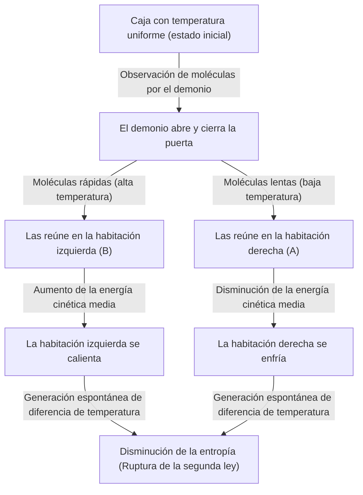
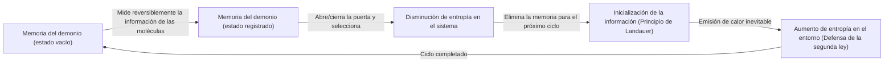

# Introducción: La regla que nunca debe romperse

En este universo en el que vivimos, existen algunas reglas absolutas que nunca pueden ser desafiadas. Entre ellas, la más famosa y la más arraigada en nuestra vida cotidiana es la "Segunda Ley de la Termodinámica". También conocida como la "Ley del aumento de la entropía", esta ley representa una triste (pero absoluta) verdad del universo que, en pocas palabras, dice "el agua derramada no se puede recoger", es decir, "las cosas ordenadas tienden al desorden con el tiempo".

Si dejas una taza de café caliente en una habitación, eventualmente se enfriará a la temperatura ambiente. A la inversa, un café frío nunca hervirá de repente sin que se haga nada, enfriando el aire de la habitación en el proceso. Si abres un frasco de perfume, el aroma se esparcirá por toda la habitación, pero el aroma esparcido nunca volverá espontáneamente dentro del frasco.

Esta "irreversibilidad" es precisamente la verdadera identidad de la "flecha del tiempo" que sentimos, y la razón por la que la Segunda Ley de la Termodinámica ocupa un lugar especial en la física. Incluso Albert Einstein tenía un profundo respeto por la termodinámica como la única teoría fundamental que nunca sería revocada.

Sin embargo, el gran físico del siglo XIX, James Clerk Maxwell, lanzó un "desafío" a esta ley absoluta. Ese es el experimento mental más famoso en la historia de la física, y el que más dolores de cabeza dio a los científicos: el "Demonio de Maxwell" (Maxwell's demon).

En este artículo, profundizaremos lo máximo posible en la paradoja que trajo este demonio de Maxwell, cómo los físicos lucharon contra él durante más de un siglo y, finalmente, a qué conclusión llegaron (la fusión de la información y la termodinámica).

---

# Capítulo 1: Fundamentos de la Termodinámica y el Nacimiento del Demonio de Maxwell

Antes de desentrañar la verdadera identidad del demonio, repasemos brevemente el escenario en el que se desarrolla: la "Termodinámica".

## Primera y Segunda Leyes de la Termodinámica

Existen dos grandes pilares que gobiernan la termodinámica.

1. **Primera Ley de la Termodinámica (Ley de conservación de la energía)**
   Esta ley establece que la energía puede cambiar de forma, pero nunca puede ser creada ni destruida. El calor también es una forma de energía, y la suma del trabajo mecánico y la energía térmica se mantiene siempre constante.
   
2. **Segunda Ley de la Termodinámica (Ley del aumento de la entropía)**
   En un sistema aislado (un espacio sin intercambio de energía o materia con el exterior), la entropía (el grado de desorden o caos) siempre aumenta o, en el mejor de los casos, se mantiene constante, pero nunca disminuye. El calor fluye siempre de un cuerpo caliente a uno frío, y lo contrario es imposible a menos que se aplique trabajo (energía) desde el exterior.

La primera ley dice que "el presupuesto (energía) del universo es constante", y la segunda ley dice que "el uso de ese presupuesto siempre tiende a aumentar el desperdicio (entropía)".

## El Experimento Mental de Maxwell

En 1867, Maxwell propuso en una carta a su amigo Peter Tait un experimento mental que eludía hábilmente esta segunda ley. (Cabe destacar que el término "demonio" (demon) no fue acuñado por el propio Maxwell, sino más tarde por William Thomson (Lord Kelvin). Maxwell mismo lo llamaba un "ser finito" (finite being)).

Su experimento mental es el siguiente:

Imagina una caja completamente aislada térmicamente, sin entrada ni salida de energía desde el exterior. Esta caja está dividida en dos compartimentos por una pared central: la "habitación derecha (A)" y la "habitación izquierda (B)". Dentro de la caja hay un gas, y en el estado inicial, la temperatura y la presión de ambas habitaciones son exactamente iguales (estado de equilibrio térmico). Que la temperatura sea la misma significa que el "valor medio" de la energía cinética de las moléculas del gas es el mismo. Sin embargo, desde una perspectiva microscópica, cada molécula de gas vuela al azar; hay moléculas que se mueven muy rápido (energía cinética alta = alta temperatura) y otras que se mueven lentamente (energía cinética baja = baja temperatura) mezcladas entre sí.

Ahora, se instala una "puerta extremadamente pequeña" en la pared central. Y se coloca un ser inteligente capaz de controlar la apertura y cierre de esa puerta, es decir, un **"demonio"**.

El demonio abre y cierra la puerta según las siguientes reglas:
- Si ve una **"molécula rápida"** que va de la habitación derecha (A) hacia la habitación izquierda (B), abre la puerta y la deja pasar a B.
- Si ve una **"molécula lenta"** que va de la habitación derecha (A) hacia la habitación izquierda (B), cierra la puerta y la mantiene en A.
- Si ve una **"molécula lenta"** que va de la habitación izquierda (B) hacia la habitación derecha (A), abre la puerta y la deja pasar a A.
- Si ve una **"molécula rápida"** que va de la habitación izquierda (B) hacia la habitación derecha (A), cierra la puerta y la mantiene en B.

Ilustremos esto con un diagrama.

¿Qué sucederá si el demonio continúa con este trabajo?
Con el paso del tiempo, en la habitación izquierda (B) solo se reunirán "moléculas rápidas", y en la habitación derecha (A) solo se reunirán "moléculas lentas". En otras palabras, aunque al principio estaban a la misma temperatura, sin agregar energía (trabajo) desde el exterior, una habitación se ha vuelto caliente y la otra fría.

Si se utiliza esta diferencia de temperatura para accionar una máquina térmica (motor), se puede extraer trabajo hacia el exterior. Y una vez que la temperatura vuelva a ser uniforme, bastaría con que el demonio volviera a seleccionar las moléculas. Esto significa la creación de una "máquina de movimiento perpetuo de segunda especie", capaz de extraer energía infinita a partir del calor.

A pesar de no realizar trabajo desde el exterior (asumiendo que la puerta se abre y cierra sin fricción y su masa es cero), la entropía de todo el sistema ha disminuido. ¿Acaso la Segunda Ley de la Termodinámica ha fallado? Esta es la paradoja del "Demonio de Maxwell".

---

# Capítulo 2: La Batalla contra la Paradoja - La Historia del Exorcismo del Demonio

La paradoja planteada por este experimento mental desató un enorme debate en la comunidad física. Debe haber alguna "omisión" en la acción del demonio para satisfacer la Segunda Ley de la Termodinámica. Los físicos pensaron: "En alguna parte del proceso en que el demonio observa y selecciona las moléculas, la entropía debe estar aumentando obligatoriamente".

## Marian Smoluchowski y Leo Szilard (1912 - 1929)

En 1912, el físico polaco Marian Smoluchowski consideró si esta selección de moléculas podría realizarse, no por un "demonio" como ser inteligente, sino puramente por una "puerta mecánica con resorte" puramente física. Sin embargo, demostró que la puerta misma también experimentaría un movimiento térmico (movimiento browniano) debido a las colisiones con las moléculas, de modo que finalmente el mecanismo del resorte se abriría y cerraría aleatoriamente, impidiendo que la selección funcionara.

Luego, en 1929, el físico húngaro Leo Szilard logró el avance más importante en la historia del Demonio de Maxwell. Ideó un modelo simplificado de una sola molécula llamado el "Motor de Szilard", y analizó en detalle el proceso del demonio.

El mayor logro de Szilard fue **conectar la "obtención de información (medición)" con la "entropía"**.
Szilard se centró en el proceso mediante el cual el demonio "mide (observa)" la velocidad de la molécula para obtener esa información. Sostuvo que, incluso para un demonio inteligente, se necesita algún tipo de interacción (por ejemplo, iluminarla con luz) para conocer la velocidad de la molécula, y que el aumento de entropía generado en ese proceso de medición debería superar (o anular) la disminución de entropía de todo el sistema. Fue una idea revolucionaria que prácticamente introdujo el concepto de la unidad de información, el "bit", en la termodinámica por primera vez.

## El Modelo de Dispersión de Luz de Léon Brillouin (Década de 1950)

Quien concretó aún más la idea de Szilard fue Léon Brillouin. Pensó que para que el demonio pudiera "ver" la molécula, necesitaba iluminarla con luz (fotones) desde el exterior, y el demonio debía recibir esa luz reflejada.

Para ver una molécula dentro de una caja a oscuras, se deben utilizar fotones con una energía mayor que la radiación de fondo del cuerpo negro (radiación térmica). Al calcular el consumo de energía para esta "iluminación" y la generación de entropía debido a la dispersión de los fotones, se demostró que el aumento de entropía causado por el uso de la luz siempre será mayor que la información obtenida por el demonio (la disminución de entropía debido a la selección de moléculas).

Con esto, parecía que [el demonio de Maxwell](/es/p/maxwells-demon/) había sido completamente enterrado. La explicación de que "la entropía aumenta porque se arroja luz para ver las moléculas" era intuitiva, fácil de entender y se incluyó en muchos libros de texto.

Sin embargo, la batalla aún no había terminado.

## El Principio de Landauer: La "Eliminación" de la Información es la Clave (1961)

La solución de Brillouin tenía un agujero. La premisa de que "el demonio siempre consume energía al medir una molécula, lo que aumenta la entropía" en realidad no era correcta.

En 1961, el investigador de IBM Rolf Landauer, y más tarde Charles Bennett y otros, demostraron que las mediciones físicamente reversibles (mediciones que obtienen información sin consumir ninguna energía) son teóricamente posibles. En otras palabras, existía un modelo teórico que permitía "solo registrar (medir) información" sin aumentar la entropía.

Esto significaba que la segunda ley volvía a romperse. Sin embargo, Landauer encontró la fuente de la generación de entropía en un lugar completamente diferente. Esa era la **"eliminación de la información"**.

Según el principio de Landauer (Landauer's principle), las operaciones reversibles como "registrar" o "copiar" información no requieren energía, pero en la operación irreversible de **"eliminar (inicializar)"** información, se debe liberar calor al entorno, lo que inevitablemente aumenta la entropía. Se demostró que la cantidad mínima de energía necesaria para eliminar 1 bit de información es $k_B T \ln 2$ (donde $k_B$ es la constante de Boltzmann y $T$ es la temperatura absoluta).

---

# Capítulo 3: La Respuesta Final de Bennett y el Amanecer de la Termodinámica de la Información

En 1982, Charles Bennett utilizó el principio de Landauer para darle el golpe de gracia final al demonio de Maxwell.

El argumento de Bennett es el siguiente:
Para que el demonio seleccione las moléculas, debe "memorizar" la información de la velocidad de las moléculas en su propio cerebro (o memoria). Como se mencionó antes, este paso de medición y memorización (idealmente) puede realizarse sin aumentar la entropía. Y al abrir y cerrar la puerta para seleccionar moléculas y crear una diferencia de temperatura dentro de la caja, se disminuye la entropía de la caja.

Sin embargo, el cerebro (capacidad de memoria) del demonio es finito. Para operar como una máquina de movimiento perpetuo, el demonio debe repetir este ciclo eternamente. Para memorizar la información de una nueva molécula, necesita **"eliminar (olvidar)"** la información antigua y vaciar la memoria.

Y es precisamente en este momento de "eliminar información" cuando cae el juicio de la termodinámica. Según el principio de Landauer, al eliminar información, el demonio libera calor al entorno, aumentando la entropía. Este aumento de entropía asociado a la eliminación de información **equilibra completamente, o supera,** la entropía dentro de la caja que el demonio había reducido al seleccionar las moléculas.

La solución de Bennett fue el momento en que la física y la teoría de la información se fusionaron por completo.
**"La información es física (Information is physical)"**
Se demostró que la información no es solo un concepto abstracto, sino que debe ser tratada como equivalente a la energía y la entropía en un sistema físico.

El demonio desatado por Maxwell en el siglo XIX fue finalmente derrotado más de un siglo después mediante el uso de conceptos de las ciencias de la computación como "medición", "memoria" y "olvido".

---

# Capítulo 4: Los Demonios en la Actualidad (Realizaciones Experimentales y Aplicaciones)

[El demonio de Maxwell](/es/p/maxwells-demon/) ya no se limita a un "experimento mental". En el siglo XXI, con el avance exponencial de la nanotecnología y la tecnología de la información cuántica, los científicos han podido crear un "demonio de Maxwell artificial" en el laboratorio y verificar el principio de Landauer y las leyes de la termodinámica de la información.

## Demonios en el Laboratorio

En 2010, el Dr. Takahiro Sagawa de la Universidad de Chuo (actualmente profesor en la Universidad de Tokio) y el Dr. Masahito Ueda derivaron la ecuación generalizada de la "termodinámica de la información" (la Ecuación de Sagawa-Ueda), y formularon rigurosamente la relación entre la información y la entropía. A esto le siguieron experimentos en laboratorios de todo el mundo utilizando partículas a escala nanométrica o electrones individuales para simular el motor de Szilard y [el demonio de Maxwell](/es/p/maxwells-demon/).

A través de estos experimentos, se demostró experimentalmente que "se puede utilizar la información para convertir la energía térmica en trabajo". Por supuesto, si se incluye en el cálculo la generación total de entropía requerida para procesar y eliminar información, la Segunda Ley de la Termodinámica no se rompe, pero se comprobó que en sistemas microscópicos es posible obtener energía utilizando la "información" como una especie de "combustible".

## Demonios dentro de los Seres Vivos

Curiosamente, dentro de los sistemas biológicos existen muchos mecanismos que se asemejan al "demonio de Maxwell".
Por ejemplo, las proteínas motoras como la "quinesina" y la "dineína" que transportan sustancias dentro de las células. Aunque dentro de la célula ruge una tormenta debido al movimiento térmico de las moléculas (movimiento browniano), estas proteínas motoras utilizan la hidrólisis del ATP como fuente de energía mientras aprovechan hábilmente las fluctuaciones térmicas (movimientos aleatorios) de su entorno para generar un movimiento ordenado en una sola dirección.

Esto se conoce como mecanismo de trinquete browniano y es un dispositivo a nivel molecular similar al demonio de Maxwell. La vida acepta plenamente las restricciones termodinámicas que enfrenta [el demonio de Maxwell](/es/p/maxwells-demon/), y procesa hábilmente la información microscópica para mantener un "orden" que parece desafiar la ley del aumento de la entropía. Las palabras que Erwin Schrödinger pronunció en su libro "¿Qué es la vida?", afirmando que los seres vivos se alimentan de "entropía negativa", sugerían precisamente la conexión entre la información y la termodinámica.

---

# Conclusión: Lo que el Demonio nos Enseñó

[El demonio de Maxwell](/es/p/maxwells-demon/) no pudo romper la Segunda Ley de la Termodinámica. Sin embargo, gracias a la existencia de este demonio, la física recibió inmensos beneficios.

1. **Establecimiento de la mecánica estadística**: Se consolidó la perspectiva, intuida por Maxwell y Boltzmann, de que "las leyes macroscópicas (termodinámica) surgen del comportamiento estadístico de las partículas microscópicas".
2. **Fisicalización de la información**: Szilard, Landauer, Bennett y otros incorporaron la "información" en las leyes de la física. Con esto, se aclararon los límites físicos del consumo de energía de las computadoras.
3. **Nacimiento de la termodinámica de la información**: La fusión de la mecánica estadística del no equilibrio y la teoría de la información abrió un nuevo campo que es la base de la nanotecnología moderna, la computación cuántica y la biofísica.

Si Maxwell no hubiera imaginado a este demonio, tal vez habría tomado mucho más tiempo para que la física y las ciencias de la información se entrelazaran tan profundamente.
El demonio nos enfrentó al frío hecho del universo de que "la información no es gratis" (Information is not free). Pero al mismo tiempo, nos enseñó que "comprender físicamente la información abre puertas completamente nuevas al mundo microscópico".

La Segunda Ley de la Termodinámica todavía gobierna el universo sin vacilar. Sin embargo, el significado de esa ley ha sido espléndidamente actualizado desde la era de la máquina de vapor en el siglo XIX a la era de la tecnología de la información cuántica en el siglo XXI, bajo la guía del demonio.

Mientras el universo continúe, la entropía seguirá aumentando, pero el viaje de exploración sobre cómo manejamos la información en ese proceso apenas comienza.

---

**Referencias y Libros Recomendados:**
- Leo Szilard "On the Decrease of Entropy in a Thermodynamic System by the Intervention of Intelligent Beings" (1929)
- Rolf Landauer "Irreversibility and Heat Generation in the Computing Process" (1961)
- Charles Bennett "The Thermodynamics of Computation—a Review" (1982)
- Marc Mézard, Andrea Montanari, "Information, Physics, and Computation"
- Takahiro Sagawa, "Mecánica Estadística del No Equilibrio" (en japonés)
