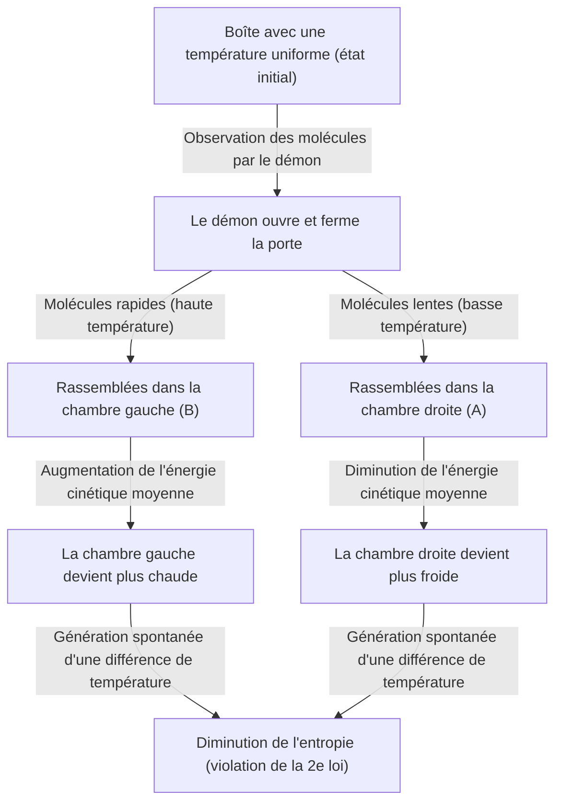
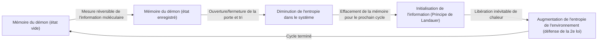

# Introduction : Les règles qui ne peuvent absolument pas être enfreintes

Dans cet univers où nous vivons, il existe quelques règles absolues auxquelles on ne peut jamais s'opposer. Parmi elles, la plus célèbre et celle qui est le plus profondément ancrée dans notre quotidien est la « deuxième loi de la thermodynamique ». Également connue sous le nom de « loi de l'augmentation de l'entropie », cette loi représente, en un mot, l'idée que « ce qui est fait est fait », c'est-à-dire la triste (mais absolue) vérité cosmique selon laquelle « ce qui est ordonné va inévitablement vers le désordre avec le temps ».

Si vous laissez un café chaud dans une pièce, il finira par se refroidir à la température ambiante. À l'inverse, un café froid ne se mettra jamais soudainement à bouillir spontanément, rendant l'air de la pièce plus froid en conséquence. Si vous ouvrez un flacon de parfum, le parfum se répandra dans toute la pièce, mais le parfum dispersé ne retournera jamais spontanément dans le flacon.

Cette « irréversibilité » est précisément la véritable nature de la « flèche du temps » que nous ressentons, et c'est la raison pour laquelle la deuxième loi de la thermodynamique occupe une place si particulière en physique. Même Albert Einstein lui vouait un profond respect, considérant la thermodynamique comme l'ultime théorie qui ne serait jamais renversée.

Cependant, au 19ème siècle, le grand physicien James Clerk Maxwell a lancé un « défi » à cette loi absolue. Il s'agit du « démon de Maxwell », l'expérience de pensée la plus célèbre de l'histoire de la physique, qui a tourmenté le plus grand nombre de scientifiques.

Dans cet article, nous allons explorer en profondeur et en détail quel genre de paradoxe ce démon de Maxwell a provoqué, comment les physiciens ont lutté contre ce démon pendant plus d'un siècle, et finalement à quelle conclusion (la fusion de l'information et de la thermodynamique) ils ont abouti.

---

# Chapitre 1 : Les bases de la thermodynamique et la naissance du démon de Maxwell

Avant de révéler la véritable identité du démon, faisons un bref rappel de la « thermodynamique », la scène sur laquelle se déroule l'histoire.

## Première et deuxième lois de la thermodynamique

Il existe deux piliers gigantesques qui régissent la thermodynamique.

1. **La première loi de la thermodynamique (loi de la conservation de l'énergie)**
   C'est la loi selon laquelle l'énergie peut changer de forme, mais elle n'est jamais nouvellement créée ni détruite. La chaleur est également une forme d'énergie, et la somme du travail mécanique et de l'énergie thermique reste toujours constante.
   
2. **La deuxième loi de la thermodynamique (loi de l'augmentation de l'entropie)**
   Dans un système isolé (un espace sans échange d'énergie ou de matière avec l'extérieur), l'entropie (le degré de désordre ou de chaos) augmente toujours ou, au mieux, reste constante. Elle ne diminue jamais. La chaleur se déplace toujours d'un objet chaud vers un objet froid, et l'inverse ne peut se produire sans l'apport d'un travail (énergie) de l'extérieur.

La première loi affirme que « le budget (l'énergie) de l'univers est constant », et la deuxième loi affirme que « l'utilisation de ce budget tend toujours vers une augmentation du gaspillage (entropie) ».

## L'expérience de pensée de Maxwell

En 1867, Maxwell a proposé dans une lettre à son ami Peter Tait une expérience de pensée permettant de contourner habilement cette deuxième loi. (À noter que le terme « démon » n'a pas été inventé par Maxwell lui-même, mais plus tard par William Thomson, Lord Kelvin. Maxwell lui-même l'appelait un « être fini »).

Son expérience de pensée est la suivante :

Imaginez une boîte parfaitement isolée, sans aucun échange d'énergie avec l'extérieur. Cette boîte est divisée en deux parties par une paroi centrale : la « chambre droite (A) » et la « chambre gauche (B) ». La boîte contient un gaz et, dans son état initial, la température et la pression des deux chambres sont parfaitement identiques (état d'équilibre thermique). Le fait que la température soit la même signifie que la valeur moyenne de l'énergie cinétique des molécules de gaz est la même. Cependant, d'un point de vue microscopique, chaque molécule de gaz vole de manière aléatoire : il y a des molécules qui bougent très vite (énergie cinétique élevée = haute température) et d'autres qui bougent lentement (faible énergie cinétique = basse température).

Maintenant, installons une « très petite porte » sur la paroi centrale. Et plaçons-y une entité intelligente capable de contrôler l'ouverture et la fermeture de cette porte, c'est-à-dire le **« démon »**.

Le démon ouvre et ferme la porte selon les règles suivantes :
- Lorsqu'il repère une **« molécule rapide »** se dirigeant de la chambre droite (A) vers la chambre gauche (B), il ouvre la porte pour la laisser passer en B.
- Lorsqu'il repère une **« molécule lente »** se dirigeant de la chambre droite (A) vers la chambre gauche (B), il ferme la porte pour la maintenir en A.
- Lorsqu'il repère une **« molécule lente »** se dirigeant de la chambre gauche (B) vers la chambre droite (A), il ouvre la porte pour la laisser passer en A.
- Lorsqu'il repère une **« molécule rapide »** se dirigeant de la chambre gauche (B) vers la chambre droite (A), il ferme la porte pour la maintenir en B.

Illustrons cela par un schéma.

Que se passera-t-il si le démon continue ce travail ?
Au fil du temps, seules des « molécules rapides » s'accumuleront dans la chambre gauche (B), et seules des « molécules lentes » s'accumuleront dans la chambre droite (A). En d'autres termes, bien que la température ait été initialement la même, sans aucun ajout d'énergie (travail) de l'extérieur, une chambre est devenue plus chaude et l'autre plus froide.

Si l'on utilise cette différence de température pour faire tourner une machine thermique (un moteur), on peut en extraire du travail vers l'extérieur. Et une fois que la température est redevenue uniforme, il suffit de laisser le démon trier à nouveau les molécules. Cela signifie l'achèvement d'une « machine à mouvement perpétuel de deuxième espèce » capable d'extraire de l'énergie de la chaleur à l'infini.

Bien qu'aucun travail n'ait été fourni de l'extérieur (en supposant que la porte s'ouvre et se ferme sans frottement et que sa masse est nulle), l'entropie de l'ensemble du système a diminué. La deuxième loi de la thermodynamique s'est-elle effondrée ? C'est le paradoxe du « démon de Maxwell ».

---

# Chapitre 2 : La lutte contre le paradoxe - L'histoire de l'exorcisme

Le paradoxe soulevé par cette expérience de pensée a déclenché une énorme controverse dans le monde de la physique. Il devait y avoir un « oubli » quelque part dans l'action du démon pour satisfaire à la deuxième loi de la thermodynamique. Les physiciens ont pensé que « l'entropie doit nécessairement augmenter quelque part dans le processus où le démon observe et trie les molécules ».

## Marian Smoluchowski et Leo Szilard (1912-1929)

En 1912, le physicien polonais Marian Smoluchowski a examiné s'il était possible d'effectuer ce tri moléculaire non pas avec un « démon » en tant qu'entité intelligente, mais avec un « mécanisme de porte à ressort purement physique ». Cependant, il a prouvé que la porte elle-même subit un mouvement thermique (mouvement brownien) dû aux collisions avec les molécules, ce qui entraîne finalement une ouverture et une fermeture aléatoires du mécanisme à ressort, rendant le tri inopérant.

Puis, en 1929, le physicien hongrois Leo Szilard a apporté la percée la plus importante de l'histoire du démon de Maxwell. Il a conçu un modèle simplifié avec une seule molécule, appelé « moteur de Szilard », et a analysé le processus du démon en détail.

La plus grande réalisation de Szilard a été **d'établir un lien entre « l'acquisition d'information (mesure) » et « l'entropie »**.
Szilard s'est concentré sur le processus par lequel le démon « mesure (observe) » la vitesse des molécules pour obtenir cette information. Il a soutenu que même pour un démon intelligent, une certaine forme d'interaction (par exemple, éclairer avec de la lumière) est nécessaire pour connaître la vitesse d'une molécule, et que l'augmentation de l'entropie résultant de ce processus de mesure doit nécessairement dépasser (ou annuler) la diminution de l'entropie dans l'ensemble du système. C'était une idée révolutionnaire qui introduisait pour la première fois le concept de l'unité d'information « bit » en thermodynamique.

## Le modèle de diffusion de la lumière de Léon Brillouin (Années 1950)

Léon Brillouin a davantage concrétisé l'idée de Szilard. Il a considéré que pour que le démon puisse « voir » les molécules, il doit les éclairer avec de la lumière (photons) de l'extérieur et recevoir la lumière réfléchie.

Pour voir des molécules dans une boîte sombre, il faut utiliser des photons ayant une énergie supérieure à celle du rayonnement du corps noir (rayonnement thermique) de fond. En calculant la consommation d'énergie pour cet « éclairage » et la production d'entropie due à la diffusion des photons, il a été prouvé que l'augmentation de l'entropie causée par l'utilisation de la lumière est toujours supérieure à l'information acquise par le démon (la diminution de l'entropie par le tri des molécules).

Avec cela, [le démon de Maxwell](/fr/p/maxwells-demon/) semblait avoir été définitivement enterré. L'explication selon laquelle « l'entropie augmente parce qu'on utilise de la lumière pour voir les molécules » était intuitive, facile à comprendre, et a été incluse dans de nombreux manuels.

Cependant, le combat n'était pas encore terminé.

## Le principe de Landauer : L'« effacement » de l'information est la clé (1961)

La solution de Brillouin comportait une faille. La prémisse selon laquelle « le démon consomme inévitablement de l'énergie et augmente l'entropie lorsqu'il mesure les molécules » s'est avérée être fausse.

En 1961, le chercheur d'IBM Rolf Landauer, suivi plus tard par Charles Bennett et d'autres, ont montré qu'une mesure physiquement réversible (une mesure qui obtient des informations sans consommer d'énergie) est théoriquement possible. En d'autres termes, il existait un modèle théorique capable « d'enregistrer (mesurer) des informations » sans augmenter l'entropie.

Cela aurait de nouveau enfreint la deuxième loi. Cependant, Landauer a trouvé la source de la production d'entropie dans un tout autre endroit. C'était **« l'effacement de l'information »**.

Selon le principe de Landauer, les opérations réversibles telles que « l'enregistrement » ou la « copie » d'informations ne nécessitent pas d'énergie, mais l'opération irréversible consistant à **« effacer (initialiser) »** l'information nécessite impérativement la libération de chaleur dans l'environnement, ce qui augmente inévitablement l'entropie. Il a été démontré que la quantité minimale d'énergie nécessaire pour effacer 1 bit d'information est de $k_B T \ln 2$ ($k_B$ étant la constante de Boltzmann et $T$ la température absolue).

---

# Chapitre 3 : La réponse finale de Bennett et l'aube de la thermodynamique de l'information

En 1982, Charles Bennett a utilisé le principe de Landauer pour porter le coup de grâce au démon de Maxwell.

L'argument de Bennett est le suivant :
Pour trier les molécules, le démon doit « mémoriser » l'information sur la vitesse des molécules dans son propre cerveau (ou mémoire). Comme mentionné précédemment, cette étape de mesure et de mémorisation peut (idéalement) être réalisée sans augmenter l'entropie. Ensuite, en ouvrant et fermant la porte pour trier les molécules et créer une différence de température dans la boîte, il diminue l'entropie de la boîte.

Cependant, le cerveau (la capacité de mémoire) du démon est limité. Pour fonctionner comme une machine à mouvement perpétuel, le démon doit répéter ce cycle indéfiniment. Afin de mémoriser les informations des nouvelles molécules, il doit **« effacer (oublier) »** les anciennes informations pour libérer de la mémoire.

Et ce moment même de « l'effacement de l'information » est l'heure du jugement de la thermodynamique. Selon le principe de Landauer, le démon libère de la chaleur dans l'environnement lors de l'effacement des informations, augmentant ainsi l'entropie. Cette augmentation de l'entropie associée à l'effacement de l'information est **parfaitement égale ou supérieure** à la diminution de l'entropie de la boîte que le démon a obtenue en triant les molécules.

La résolution de Bennett fut le moment où la physique et la théorie de l'information ont fusionné pour de bon.
**« L'information est une entité physique (Information is physical) »**
Il a été démontré que l'information n'est pas simplement un concept abstrait, mais qu'elle doit être traitée comme équivalente à l'énergie et à l'entropie dans un système physique.

Le démon libéré par Maxwell au 19ème siècle a finalement été vaincu plus d'un siècle plus tard grâce à l'utilisation de concepts de l'informatique tels que la « mesure », la « mémorisation » et « l'oubli ».

---

# Chapitre 4 : Les démons à l'époque moderne (réalisations expérimentales et applications)

[Le démon de Maxwell](/fr/p/maxwells-demon/) n'est plus une simple « expérience de pensée ». Au 21ème siècle, grâce aux progrès spectaculaires des nanotechnologies et des technologies de l'information quantique, les scientifiques sont désormais capables de créer de véritables « démons de Maxwell artificiels » en laboratoire, permettant de vérifier le principe de Landauer et les lois de la thermodynamique de l'information.

## Le démon en laboratoire

En 2010, le Dr Takahiro Sagawa (aujourd'hui professeur à l'Université de Tokyo) et le Dr Masahito Ueda de l'Université de Chuo ont dérivé une équation généralisée pour la « thermodynamique de l'information » (l'équation Sagawa-Ueda), formulant de manière rigoureuse la relation entre l'information et l'entropie. Suite à cela, des expériences simulant le moteur de Szilard et [le démon de Maxwell](/fr/p/maxwells-demon/) à l'aide de particules nanométriques ou d'électrons uniques ont été menées dans des laboratoires du monde entier.

Ces expériences ont prouvé expérimentalement qu'« il est possible de convertir l'énergie thermique en travail en utilisant l'information ». Bien sûr, si l'on prend en compte la production totale d'entropie impliquée dans le traitement et l'effacement de l'information, la deuxième loi de la thermodynamique n'est pas violée, mais il a été démontré que dans les systèmes microscopiques, il est possible d'utiliser « l'information » comme une sorte de « carburant » pour obtenir de l'énergie motrice.

## Le démon dans les organismes vivants

Fait intéressant, il existe de nombreux mécanismes très similaires au « démon de Maxwell » dans les systèmes biologiques.
Par exemple, les protéines motrices comme la « kinésine » et la « dynéine », qui transportent des substances à l'intérieur des cellules. L'intérieur d'une cellule est balayé par une tempête de mouvements thermiques moléculaires (mouvement brownien), mais ces protéines motrices utilisent l'hydrolyse de l'ATP comme source d'énergie tout en exploitant habilement les fluctuations thermiques environnantes (mouvements aléatoires) pour générer un mouvement ordonné unidirectionnel.

C'est ce qu'on appelle le mécanisme de cliquet brownien, un dispositif au niveau moléculaire similaire au démon de Maxwell. La vie, tout en acceptant pleinement les contraintes thermodynamiques auxquelles [le démon de Maxwell](/fr/p/maxwells-demon/) est confronté, traite habilement l'information microscopique pour maintenir un « ordre » qui semble défier la loi de l'augmentation de l'entropie. La phrase « se nourrir d'entropie négative pour vivre » utilisée par Schrödinger dans son livre « Qu'est-ce que la vie ? » suggérait précisément ce lien entre l'information et la thermodynamique.

---

# Conclusion : Ce que le démon nous a appris

[Le démon de Maxwell](/fr/p/maxwells-demon/) n'a pas réussi à briser la deuxième loi de la thermodynamique. Cependant, la physique a tiré d'immenses bénéfices de l'existence de ce démon.

1. **Établissement de la mécanique statistique** : La perspective pressentie par Maxwell et Boltzmann, selon laquelle « les lois macroscopiques (thermodynamique) découlent du comportement statistique des particules microscopiques », s'est établie.
2. **Matérialisation de l'information** : L'« information » a été intégrée aux lois physiques par Szilard, Landauer, Bennett et d'autres. Cela a révélé les limites physiques de la consommation d'énergie des ordinateurs.
3. **Naissance de la thermodynamique de l'information** : La mécanique statistique hors équilibre et la théorie de l'information ont fusionné, ouvrant un nouveau domaine qui sert de fondement aux nanotechnologies modernes, aux ordinateurs quantiques et à la biophysique.

Si Maxwell n'avait pas imaginé ce démon, il aurait peut-être fallu beaucoup plus de temps pour que la physique et l'informatique soient aussi profondément liées.
Le démon nous a confrontés au fait cosmique froid que « l'information n'est pas gratuite (Information is not free) ». Mais en même temps, il nous a appris que « comprendre physiquement l'information ouvre une toute nouvelle porte sur le monde microscopique ».

La deuxième loi de la thermodynamique régit toujours inébranlablement l'univers. Cependant, la signification de cette loi a été brillamment mise à jour par les conseils du démon, passant de l'ère de la machine à vapeur au 19ème siècle à l'ère des technologies de l'information quantique au 21ème siècle.

Tant que l'univers existera, l'entropie continuera d'augmenter, mais la façon dont nous traitons l'information dans ce processus est une quête qui ne fait que commencer.

---

**Références et lectures recommandées :**
- Leo Szilard "On the Decrease of Entropy in a Thermodynamic System by the Intervention of Intelligent Beings" (1929)
- Rolf Landauer "Irreversibility and Heat Generation in the Computing Process" (1961)
- Charles Bennett "The Thermodynamics of Computation—a Review" (1982)
- Marc Mézard, Andrea Montanari "Information, Physics, and Computation"
- Takahiro Sagawa "Non-Equilibrium Statistical Mechanics"
