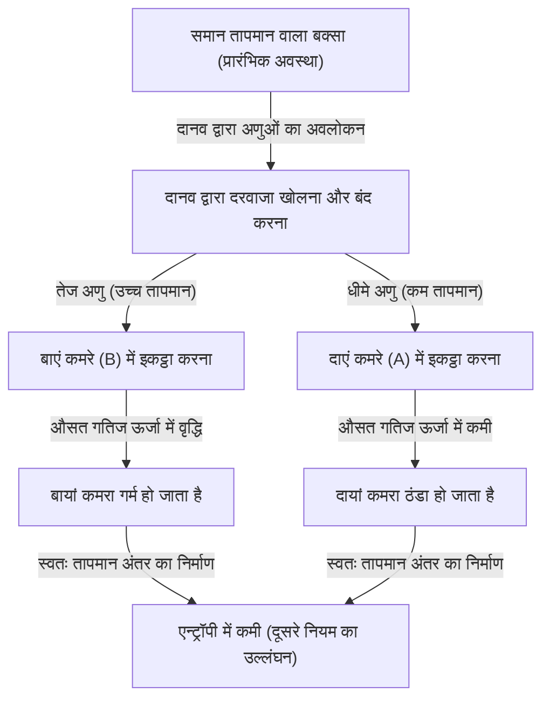
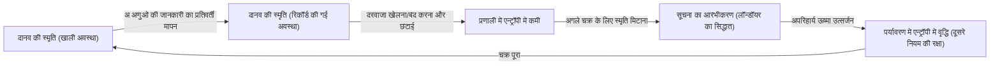

# परिचय: नियम जिन्हें कभी तोड़ा नहीं जाना चाहिए

हमारे ब्रह्मांड में कुछ पूर्ण नियम मौजूद हैं जिनका कभी भी उल्लंघन नहीं किया जा सकता है। इनमें से सबसे प्रसिद्ध और हमारे दैनिक जीवन में सबसे गहराई से निहित "ऊष्मागतिकी का दूसरा नियम" (Thermodynamics Second Law) है। इस नियम को "एन्ट्रॉपी वृद्धि का नियम" (Law of Entropy Increase) भी कहा जाता है, जो संक्षेप में "गिरे हुए दूध पर रोने से क्या फायदा" (जो हो गया सो हो गया) को दर्शाता है, जिसका अर्थ है कि "व्यवस्थित चीजें समय के साथ अव्यवस्था की ओर बढ़ती हैं"। यह ब्रह्मांड का एक दुखद (लेकिन पूर्ण) सत्य है।

यदि आप एक कमरे में गर्म कॉफी छोड़ते हैं, तो वह अंततः कमरे के तापमान के बराबर ठंडी हो जाएगी। इसके विपरीत, ऐसा कभी नहीं होगा कि बिना कुछ किए ठंडी कॉफी अचानक उबलने लगे और कमरे की हवा तदनुसार ठंडी हो जाए। यदि आप इत्र की बोतल खोलते हैं, तो सुगंध पूरे कमरे में फैल जाएगी, लेकिन कमरे में फैली सुगंध कभी भी अपने आप बोतल में वापस नहीं जाएगी।

यह "अपरिवर्तनीयता" ही है जो उस "समय के तीर" का वास्तविक स्वरूप है जिसे हम महसूस करते हैं, और यही कारण है कि ऊष्मागतिकी का दूसरा नियम भौतिकी में एक विशेष स्थान रखता है। यहां तक ​​कि अल्बर्ट आइंस्टीन ने भी गहरा सम्मान व्यक्त किया था कि ऊष्मागतिकी ही एकमात्र ऐसा अंतिम सिद्धांत है जिसे कभी भी पलटा नहीं जाएगा।

हालाँकि, 19वीं सदी के महान भौतिक विज्ञानी जेम्स क्लर्क मैक्सवेल ने इस पूर्ण नियम को एक "चुनौती" दी। भौतिकी के इतिहास में यह सबसे प्रसिद्ध और सबसे अधिक हैरान करने वाला विचार प्रयोग "मैक्सवेल का दानव" (Maxwell's demon) है।

इस लेख में, हम यथासंभव गहराई और विस्तार से जानेंगे कि मैक्सवेल के दानव ने कैसा विरोधाभास उत्पन्न किया, भौतिक विज्ञानियों ने एक सदी से भी अधिक समय तक इस दानव से कैसे लड़ाई लड़ी, और अंततः वे किस निष्कर्ष (सूचना और ऊष्मागतिकी का संलयन) पर पहुँचे।

---

# अध्याय 1: ऊष्मागतिकी के मूल सिद्धांत और मैक्सवेल के दानव का जन्म

दानव की वास्तविक पहचान को उजागर करने से पहले, आइए संक्षेप में "ऊष्मागतिकी" की समीक्षा करें, जो इस कहानी का मंच है।

## ऊष्मागतिकी का पहला और दूसरा नियम

ऊष्मागतिकी को नियंत्रित करने वाले दो विशाल स्तंभ मौजूद हैं।

1. **ऊष्मागतिकी का पहला नियम (ऊर्जा संरक्षण का नियम)**
   यह नियम कहता है कि ऊर्जा रूप बदल सकती है, लेकिन इसे न तो नया बनाया जा सकता है और न ही नष्ट किया जा सकता है। ऊष्मा भी ऊर्जा का ही एक रूप है, और यांत्रिक कार्य तथा ऊष्मीय ऊर्जा का कुल योग हमेशा स्थिर रहता है।
   
2. **ऊष्मागतिकी का दूसरा नियम (एन्ट्रॉपी वृद्धि का नियम)**
   एक पृथक प्रणाली (एक ऐसा स्थान जहाँ बाहरी वातावरण के साथ ऊर्जा या पदार्थ का कोई आदान-प्रदान नहीं होता) में, एन्ट्रॉपी (अव्यवस्था या यादृच्छिकता की डिग्री) हमेशा बढ़ती है, या अधिक से अधिक, स्थिर रहती है। यह कभी कम नहीं होती। ऊष्मा हमेशा उच्च तापमान वाली वस्तु से निम्न तापमान वाली वस्तु की ओर प्रवाहित होती है, और जब तक बाहर से कोई कार्य (ऊर्जा) न किया जाए, तब तक इसके विपरीत कभी नहीं हो सकता।

पहला नियम कहता है कि "ब्रह्मांड का बजट (ऊर्जा) स्थिर है", और दूसरा नियम कहता है कि "इस बजट का उपयोग हमेशा बर्बादी (एन्ट्रॉपी) बढ़ाने की दिशा में होता है"।

## मैक्सवेल का विचार प्रयोग

1867 में, मैक्सवेल ने अपने मित्र पीटर टैट को लिखे एक पत्र में एक विचार प्रयोग का प्रस्ताव रखा जो इस दूसरे नियम से चतुराई से बच निकलता था। (वैसे, "दानव" (demon) नाम स्वयं मैक्सवेल द्वारा नहीं, बल्कि बाद में विलियम थॉमसन (लॉर्ड केल्विन) द्वारा दिया गया था। मैक्सवेल ने स्वयं इसे "परिमित प्राणी" (finite being) कहा था)।

उनका विचार प्रयोग कुछ इस प्रकार है:

एक ऐसे बक्से की कल्पना करें जो पूरी तरह से ऊष्मारोधी है और जिसमें बाहर से ऊर्जा का कोई प्रवेश या निकास नहीं होता है। इस बक्से को बीच की एक दीवार द्वारा दो भागों "दायां कमरा (A)" और "बायां कमरा (B)" में बांटा गया है। बक्से के अंदर गैस है, और प्रारंभिक अवस्था में दोनों कमरों का तापमान और दबाव बिल्कुल समान (तापीय संतुलन अवस्था) है। समान तापमान का मतलब है कि गैस के अणुओं की गतिज ऊर्जा का "औसत मूल्य" समान है। हालाँकि, यदि हम सूक्ष्म दृष्टिकोण से देखें, तो प्रत्येक गैस अणु बेतरतीब ढंग से उड़ रहा है, जिनमें बहुत तेजी से चलने वाले (उच्च गतिज ऊर्जा = उच्च तापमान) अणु और धीरे-धीरे चलने वाले (कम गतिज ऊर्जा = कम तापमान) अणु दोनों का मिश्रण है।

अब, हम बीच की दीवार में एक "अत्यंत छोटा दरवाजा" स्थापित करते हैं। और हम एक बुद्धिमान प्राणी को रखते हैं जो उस दरवाजे के खुलने और बंद होने को नियंत्रित कर सकता है, यानी **"दानव"**।

दानव निम्नलिखित नियमों के अनुसार दरवाजा खोलता और बंद करता है:
- जब वह दाएं कमरे (A) से बाएं कमरे (B) की ओर आते हुए एक **"तेज अणु"** को देखता है, तो वह दरवाजा खोलता है और इसे B में जाने देता है।
- जब वह दाएं कमरे (A) से बाएं कमरे (B) की ओर आते हुए एक **"धीमे अणु"** को देखता है, तो वह दरवाजा बंद कर देता है और इसे A में ही रोक लेता है।
- जब वह बाएं कमरे (B) से दाएं कमरे (A) की ओर आते हुए एक **"धीमे अणु"** को देखता है, तो वह दरवाजा खोलता है और इसे A में जाने देता है।
- जब वह बाएं कमरे (B) से दाएं कमरे (A) की ओर आते हुए एक **"तेज अणु"** को देखता है, तो वह दरवाजा बंद कर देता है और इसे B में ही रोक लेता है।

आइए इसे एक चित्र के माध्यम से समझते हैं।

यदि दानव यह कार्य करता रहे तो क्या होगा?
जैसे-जैसे समय बीतता है, "तेज अणु" बाएं कमरे (B) में जमा हो जाते हैं, और "धीमे अणु" दाएं कमरे (A) में जमा हो जाते हैं। दूसरे शब्दों में, भले ही दोनों कमरों का तापमान शुरुआत में समान था, बाहर से ऊर्जा (कार्य) जोड़े बिना, एक कमरा गर्म हो गया और दूसरा कमरा ठंडा हो गया।

इस तापमान अंतर का उपयोग करके एक ऊष्मा इंजन (Heat Engine) चलाकर, हम बाहरी दुनिया के लिए कार्य प्राप्त कर सकते हैं। और जब तापमान समान हो जाए, तो हम दानव से फिर से अणुओं को छांटने के लिए कह सकते हैं। इसका मतलब है कि एक "दूसरी तरह की सतत गति मशीन" (Perpetual motion machine of the second kind) का निर्माण हो गया है, जो ऊष्मा से अनंत रूप से ऊर्जा निकाल सकती है।

भले ही बाहर से कोई कार्य नहीं किया गया हो (मान लें कि दरवाजा बिना घर्षण के खुलता और बंद होता है, और इसका द्रव्यमान शून्य है), फिर भी पूरी प्रणाली की एन्ट्रॉपी कम हो गई है। क्या ऊष्मागतिकी का दूसरा नियम टूट गया? यही "मैक्सवेल के दानव" का विरोधाभास है।

---

# अध्याय 2: विरोधाभास के साथ संघर्ष - ओझागिरी का इतिहास

इस विचार प्रयोग द्वारा प्रस्तुत विरोधाभास ने भौतिकी समुदाय में एक बड़ा विवाद खड़ा कर दिया। दानव के कार्यों में कहीं न कहीं एक "चूक" होनी चाहिए जो ऊष्मागतिकी के दूसरे नियम को संतुष्ट कर सके। भौतिक विज्ञानियों ने सोचा, "अ अणुओं का अवलोकन करने और उन्हें छांटने की दानव की प्रक्रिया में कहीं न कहीं एन्ट्रॉपी जरूर बढ़ रही होगी।"

## मारियन स्मोलुचोव्स्की और लियो स्ज़िलार्ड (1912-1929)

1912 में, पोलिश भौतिक विज्ञानी मारियन स्मोलुचोव्स्की ने विचार किया कि क्या इस अणु छंटाई को एक बुद्धिमान प्राणी "दानव" के बजाय विशुद्ध रूप से भौतिक "स्वचालित स्प्रिंग-लोडेड दरवाजे" द्वारा किया जा सकता है। हालाँकि, उन्होंने साबित किया कि चूँकि दरवाजा स्वयं अणुओं से टकराकर ऊष्मीय गति (ब्राउनियन गति) का अनुभव करेगा, इसलिए स्प्रिंग तंत्र अंततः बेतरतीब ढंग से खुलेगा और बंद होगा, जिससे छंटाई प्रक्रिया विफल हो जाएगी।

और फिर 1929 में, हंगेरियन भौतिक विज्ञानी लियो स्ज़िलार्ड ने मैक्सवेल के दानव के इतिहास में सबसे महत्वपूर्ण सफलता हासिल की। उन्होंने केवल एक अणु के साथ एक सरलीकृत मॉडल तैयार किया, जिसे "स्ज़िलार्ड का इंजन" कहा जाता है, और दानव की प्रक्रिया का विस्तार से विश्लेषण किया।

स्ज़िलार्ड की सबसे बड़ी उपलब्धि **"सूचना प्राप्त करने (माप)" और "एन्ट्रॉपी" को जोड़ना था**।
स्ज़िलार्ड ने उस प्रक्रिया पर ध्यान केंद्रित किया जिसके द्वारा दानव अणु की गति को "मापकर (अवलोकन करके)" जानकारी प्राप्त करता है। उन्होंने तर्क दिया कि एक बुद्धिमान दानव को भी अणु की गति जानने के लिए किसी प्रकार की अंतःक्रिया (जैसे प्रकाश चमकाना) की आवश्यकता होती है, और इस माप प्रक्रिया के दौरान उत्पन्न होने वाली एन्ट्रॉपी में वृद्धि, पूरी प्रणाली की एन्ट्रॉपी में कमी से अधिक (या उसे बेअसर) कर देगी। यह एक क्रांतिकारी विचार था जिसने वस्तुतः पहली बार सूचना की इकाई "बिट" (bit) की अवधारणा को ऊष्मागतिकी में पेश किया।

## लियोन ब्रिलोइन का प्रकाश प्रकीर्णन मॉडल (1950 का दशक)

लियोन ब्रिलोइन ने स्ज़िलार्ड के विचार को और अधिक ठोस रूप दिया। उन्होंने विचार किया कि दानव के लिए अणुओं को "देखने" के लिए, बाहरी दुनिया से अणु पर प्रकाश (फोटॉन) चमकना चाहिए और दानव को परावर्तित प्रकाश प्राप्त करना चाहिए।

एक अंधेरे बक्से में अणुओं को देखने के लिए, पृष्ठभूमि के ब्लैकबॉडी रेडिएशन (ऊष्मीय विकिरण) से अधिक ऊर्जा वाले फोटॉन का उपयोग किया जाना चाहिए। जब इस "रोशनी" के लिए ऊर्जा खपत और फोटॉन के प्रकीर्णन से उत्पन्न होने वाली एन्ट्रॉपी की गणना की गई, तो यह साबित हो गया कि प्रकाश के उपयोग से उत्पन्न होने वाली एन्ट्रॉपी में वृद्धि, दानव द्वारा प्राप्त की गई जानकारी (अणुओं को छांटने के कारण एन्ट्रॉपी में कमी) से हमेशा अधिक होती है।

इससे ऐसा लगा कि मैक्सवेल का दानव पूरी तरह से दफन हो गया है। स्पष्टीकरण कि "अणुओं को देखने के लिए प्रकाश डाला जाता है, जिससे एन्ट्रॉपी बढ़ती है" बहुत ही सहज और समझने में आसान था, और इसे कई पाठ्यपुस्तकों में शामिल किया गया था।

लेकिन लड़ाई अभी खत्म नहीं हुई थी।

## लॉन्डॉयर का सिद्धांत: जानकारी को "मिटाना" ही कुंजी है (1961)

ब्रिलोइन के समाधान में एक खामी थी। यह धारणा कि "जब दानव अणुओं को मापता है तो उसे ऊर्जा की खपत करनी ही पड़ती है और एन्ट्रॉपी बढ़ती है" वास्तव में सही नहीं थी।

1961 में, आईबीएम (IBM) के शोधकर्ता रॉल्फ लॉन्डॉयर और बाद में चार्ल्स बेनेट और अन्य ने दिखाया कि भौतिक रूप से प्रतिवर्ती माप (बिना किसी ऊर्जा का उपभोग किए जानकारी प्राप्त करना) सैद्धांतिक रूप से संभव है। दूसरे शब्दों में, यदि आप केवल "जानकारी (माप) रिकॉर्ड कर रहे हैं", तो एक सैद्धांतिक मॉडल मौजूद है जिसे एन्ट्रॉपी बढ़ाए बिना निष्पादित किया जा सकता है।

इससे दूसरे नियम का फिर से उल्लंघन हो जाएगा। हालाँकि, लॉन्डॉयर ने एन्ट्रॉपी निर्माण की जड़ को एक पूरी तरह से अलग जगह पर पाया। यह है **"सूचना को मिटाना"**।

लॉन्डॉयर के सिद्धांत (Landauer's principle) के अनुसार, जानकारी को "रिकॉर्ड" या "कॉपी" करने जैसे प्रतिवर्ती कार्यों के लिए किसी ऊर्जा की आवश्यकता नहीं होती है, लेकिन जानकारी को **"मिटाने (आरंभीकरण)"** जैसे अपरिवर्तनीय कार्यों में, पर्यावरण में ऊष्मा छोड़नी पड़ती है, जिससे अनिवार्य रूप से एन्ट्रॉपी बढ़ती है। यह दिखाया गया कि 1 बिट जानकारी मिटाने के लिए आवश्यक ऊर्जा की न्यूनतम मात्रा $k_B T \ln 2$ है (जहाँ $k_B$ बोल्ट्जमान स्थिरांक है, और $T$ पूर्ण तापमान है)।

---

# अध्याय 3: बेनेट का अंतिम उत्तर और सूचना ऊष्मागतिकी का उदय

1982 में, चार्ल्स बेनेट ने लॉन्डॉयर के सिद्धांत का उपयोग करते हुए मैक्सवेल के दानव को अंतिम विदाई दी।

बेनेट का तर्क कुछ इस प्रकार है:
अणुओं को छांटने के लिए, दानव को अपने मस्तिष्क (या स्मृति) में अणुओं की गति की जानकारी को "याद" रखना चाहिए। जैसा कि ऊपर उल्लेख किया गया है, माप और स्मृति के इस चरण को (आदर्श रूप से) एन्ट्रॉपी बढ़ाए बिना किया जा सकता है। और दरवाजे को खोलकर या बंद करके और अणुओं को छांटकर, बक्से के अंदर तापमान में अंतर पैदा किया जाता है, जिससे बक्से की एन्ट्रॉपी कम हो जाती है।

हालाँकि, दानव का मस्तिष्क (स्मृति क्षमता) सीमित है। इसे एक सतत गति मशीन के रूप में काम करने के लिए, दानव को इस चक्र को हमेशा के लिए दोहराना चाहिए। नए अणुओं के बारे में जानकारी याद रखने के लिए, उसे पुरानी जानकारी को **"मिटाना (भूलना)"** होगा और अपनी स्मृति को खाली करना होगा।

और वह क्षण जब यह "जानकारी मिटाई जाती है", वही समय है जब ऊष्मागतिकी का निर्णय सुनाया जाता है। लॉन्डॉयर के सिद्धांत के अनुसार, जानकारी मिटाते समय, दानव पर्यावरण में ऊष्मा छोड़ता है और एन्ट्रॉपी बढ़ाता है। जानकारी मिटाने से जुड़ी यह एन्ट्रॉपी में वृद्धि, बक्से के अंदर की उस एन्ट्रॉपी के साथ **पूरी तरह से संतुलित हो जाती है या उससे अधिक हो जाती है**, जिसे दानव ने अणुओं को छांटकर कम किया था।

बेनेट का समाधान वह क्षण था जब भौतिकी और सूचना सिद्धांत का पूरी तरह से विलय हो गया था।
**"सूचना एक भौतिक इकाई है (Information is physical)"**
यह दिखाया गया कि सूचना केवल एक अमूर्त अवधारणा नहीं है, बल्कि इसे भौतिक प्रणालियों में ऊर्जा और एन्ट्रॉपी के समतुल्य माना जाना चाहिए।

19वीं सदी में मैक्सवेल द्वारा छोड़े गए दानव को अंततः एक सदी से भी अधिक समय के बाद कंप्यूटर विज्ञान की अवधारणाओं "माप", "स्मृति" और "विस्मरण" का उपयोग करके पराजित किया गया।

---

# अध्याय 4: आधुनिक काल में दानव (प्रायोगिक प्राप्ति और अनुप्रयोग)

मैक्सवेल का दानव अब केवल एक "विचार प्रयोग" नहीं रह गया है। 21वीं सदी में नैनो टेक्नोलॉजी और क्वांटम सूचना प्रौद्योगिकी में तेजी से प्रगति के साथ, वैज्ञानिक अब प्रयोगशाला में "कृत्रिम मैक्सवेल दानव" बना सकते हैं और लॉन्डॉयर के सिद्धांत और सूचना ऊष्मागतिकी के नियमों का परीक्षण कर सकते हैं।

## प्रयोगशाला में दानव

2010 में, चो विश्वविद्यालय के डॉ. ताकाहिरो सागावा (अब टोक्यो विश्वविद्यालय के प्रोफेसर) और डॉ. मासाहितो उएदा ने "सूचना ऊष्मागतिकी" (सगावा-उएदा समीकरण) के लिए सामान्यीकृत समीकरण प्राप्त किए और सूचना और एन्ट्रॉपी के बीच संबंध को सख्ती से तैयार किया। इसके बाद, दुनिया भर की प्रयोगशालाओं में नैनोस्केल कणों और एकल इलेक्ट्रॉनों का उपयोग करके प्रयोग किए गए जिन्होंने स्ज़िलार्ड के इंजन और मैक्सवेल के दानव की नकल की।

इन प्रयोगों ने प्रयोगात्मक रूप से साबित कर दिया कि "सूचना का उपयोग करके तापीय ऊर्जा को कार्य में परिवर्तित किया जा सकता है"। बेशक, यदि सूचना को संसाधित करने और मिटाने में उत्पन्न होने वाली कुल एन्ट्रॉपी को ध्यान में रखा जाए, तो ऊष्मागतिकी के दूसरे नियम का उल्लंघन नहीं होता है, लेकिन यह प्रदर्शित किया गया है कि सूक्ष्म प्रणालियों में "सूचना" का उपयोग एक प्रकार के "ईंधन" के रूप में करके शक्ति प्राप्त करना संभव है।

## जीवों में दानव

दिलचस्प बात यह है कि जैविक प्रणालियों में "मैक्सवेल के दानव" के समान कई तंत्र मौजूद हैं।
उदाहरण के लिए, "काइनेसिन" और "डायनीन" जैसे मोटर प्रोटीन जो कोशिकाओं के भीतर पदार्थों का परिवहन करते हैं। कोशिका के अंदर अणुओं की ऊष्मीय गति (ब्राउनियन गति) का तूफान चल रहा है, लेकिन ये मोटर प्रोटीन एटीपी (ATP) के हाइड्रोलिसिस को ऊर्जा स्रोत के रूप में उपयोग करते हुए, आसपास के तापीय उतार-चढ़ाव (यादृच्छिक गतियों) का चतुराई से लाभ उठाकर एक दिशा में व्यवस्थित गति उत्पन्न करते हैं।

इसे ब्राउनियन शाफ़्ट तंत्र (Brownian ratchet mechanism) कहा जाता है, जो मैक्सवेल के दानव के समान एक आणविक स्तर का उपकरण है। जीवन ऊष्मागतिकीय बाधाओं को पूरी तरह से स्वीकार करते हुए, जिनका मैक्सवेल का दानव सामना करता है, सूक्ष्म जानकारी को चतुराई से संसाधित करके एक ऐसी "व्यवस्था" बनाए रखता है जो एन्ट्रॉपी वृद्धि के नियम की अवहेलना करती है। श्रोडिंगर की पुस्तक "जीवन क्या है?" (What is Life?) में उल्लिखित वाक्यांश "नकारात्मक एन्ट्रॉपी खाकर जीना" सूचना और ऊष्मागतिकी के बीच संबंध का सुझाव देता है।

---

# निष्कर्ष: दानव ने हमें क्या सिखाया

मैक्सवेल का दानव ऊष्मागतिकी के दूसरे नियम को नहीं तोड़ पाया। हालाँकि, इस दानव के अस्तित्व के कारण भौतिकी को अथाह लाभ हुआ।

1. **सांख्यिकीय यांत्रिकी की स्थापना**: मैक्सवेल और बोल्ट्जमान द्वारा यह दृष्टिकोण स्थापित किया गया कि "स्थूल नियम (ऊष्मागतिकी) सूक्ष्म कणों के सांख्यिकीय व्यवहार से उत्पन्न होते हैं"।
2. **सूचना का भौतिकीकरण**: स्ज़िलार्ड, लॉन्डॉयर, बेनेट और अन्य लोगों के माध्यम से "सूचना" को भौतिक नियमों में शामिल किया गया। इससे कंप्यूटर की ऊर्जा खपत की भौतिक सीमा स्पष्ट हो गई।
3. **सूचना ऊष्मागतिकी का जन्म**: गैर-संतुलन सांख्यिकीय यांत्रिकी (Non-equilibrium statistical mechanics) और सूचना सिद्धांत (Information theory) का विलय हुआ, जिससे एक नया क्षेत्र खुला जो आधुनिक नैनो टेक्नोलॉजी, क्वांटम कंप्यूटर और बायोफिज़िक्स की नींव बनाता है।

यदि मैक्सवेल इस दानव के विचार के साथ नहीं आते, तो भौतिकी और कंप्यूटर विज्ञान को इतने गहराई से जुड़ने में शायद बहुत अधिक समय लगता।
दानव ने हमें ब्रह्मांड के इस कठोर तथ्य से अवगत कराया कि "सूचना मुफ्त नहीं है (Information is not free)"। लेकिन साथ ही, इसने हमें यह भी सिखाया कि "सूचना को भौतिक रूप से समझने से, सूक्ष्म दुनिया के पूरी तरह से नए दरवाजे खुलते हैं"।

ऊष्मागतिकी का दूसरा नियम आज भी ब्रह्मांड पर दृढ़ता से शासन करता है। हालाँकि, दानव के मार्गदर्शन के कारण, इस नियम के निहितार्थ को 19वीं सदी के भाप इंजन के युग से 21वीं सदी के क्वांटम सूचना प्रौद्योगिकी के युग में शानदार ढंग से अपडेट किया गया है।

जब तक ब्रह्मांड का अस्तित्व है, तब तक एन्ट्रॉपी बढ़ती रहेगी, लेकिन इस प्रक्रिया में हम जानकारी को कैसे संभालते हैं, इसकी खोज की यात्रा अभी शुरू ही हुई है।

---

**संदर्भ और अनुशंसित पुस्तकें:**
- लियो स्ज़िलार्ड "On the Decrease of Entropy in a Thermodynamic System by the Intervention of Intelligent Beings" (1929)
- रॉल्फ लॉन्डॉयर "Irreversibility and Heat Generation in the Computing Process" (1961)
- चार्ल्स बेनेट "The Thermodynamics of Computation—a Review" (1982)
- मार्क मेजार्ड, एंड्रिया मोंटानारी "सूचना, भौतिकी और अधिगम" (Information, Physics, and Computation)
- ताकाहिरो सागावा "गैर-संतुलन सांख्यिकीय यांत्रिकी" (Non-equilibrium Statistical Mechanics)
