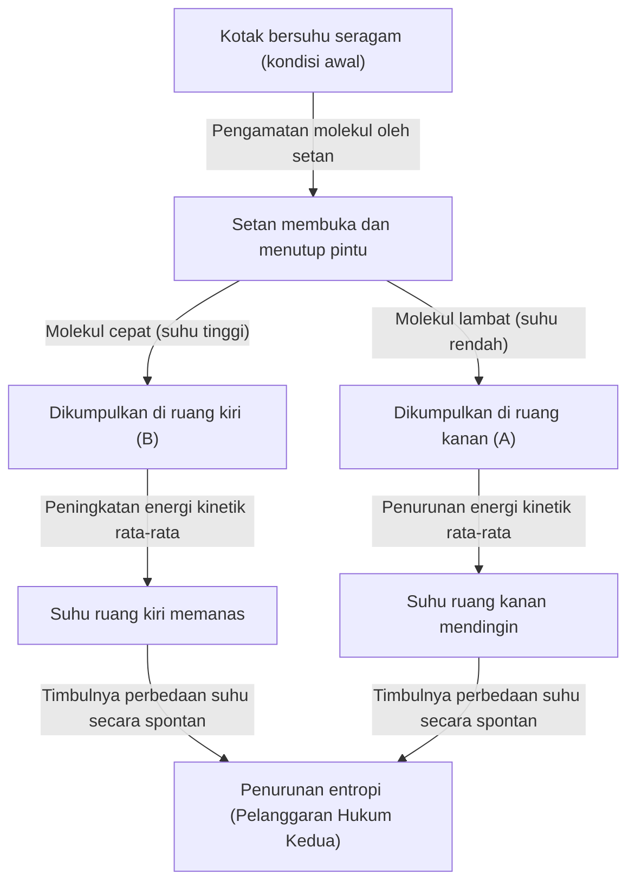
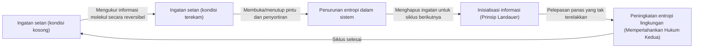

# Pendahuluan: Aturan yang Seharusnya Tidak Pernah Dilanggar

Di alam semesta tempat kita hidup ini, terdapat beberapa aturan mutlak yang tidak akan pernah bisa dilawan. Di antara aturan-aturan tersebut, yang paling terkenal dan berakar paling dalam pada kehidupan kita sehari-hari adalah "Hukum Kedua Termodinamika". Sering disebut juga sebagai "hukum peningkatan entropi", hukum ini secara singkat menggambarkan pepatah "nasi telah menjadi bubur", yaitu mewakili kebenaran mutlak yang menyedihkan dari alam semesta bahwa "segala sesuatu yang teratur akan bergerak menuju ketidakteraturan seiring berjalannya waktu".

Jika Anda meletakkan secangkir kopi panas di dalam ruangan, pada akhirnya kopi tersebut akan mendingin hingga mencapai suhu ruangan. Sebaliknya, kopi dingin tidak akan pernah tiba-tiba mendidih dengan sendirinya dan membuat udara ruangan menjadi dingin karenanya. Jika Anda membuka botol parfum, aromanya akan menyebar ke seluruh ruangan, tetapi aroma yang telah menyebar itu tidak akan pernah kembali berkumpul ke dalam botol dengan sendirinya.

"Sifat ireversibel" inilah yang menjadi identitas sebenarnya dari "panah waktu" yang kita rasakan, dan menjadi alasan mengapa Hukum Kedua Termodinamika menempati posisi khusus dalam fisika. Bahkan Albert Einstein memiliki rasa hormat yang mendalam terhadap termodinamika, menganggapnya sebagai teori pamungkas yang tidak akan pernah tergulingkan.

Namun, fisikawan besar abad ke-19, James Clerk Maxwell, melemparkan sebuah "tantangan" terhadap hukum mutlak ini. Tantangan itu adalah "Setan Maxwell (Maxwell's demon)", eksperimen pemikiran yang paling terkenal dalam sejarah fisika dan yang paling banyak membuat pusing para ilmuwan.

Dalam artikel ini, kita akan menggali sedalam dan sedetail mungkin mengenai paradoks macam apa yang dihadirkan oleh Setan Maxwell ini, bagaimana para fisikawan bertarung melawannya selama lebih dari satu abad, dan kesimpulan akhir seperti apa (penggabungan informasi dan termodinamika) yang berhasil dicapai.

---

# Bab 1: Dasar Termodinamika dan Kelahiran Setan Maxwell

Sebelum mengungkap identitas sang setan, mari kita ulas sedikit tentang "termodinamika" yang menjadi latar panggungnya.

## Hukum Pertama dan Kedua Termodinamika

Ada dua pilar raksasa yang mengatur termodinamika.

1. **Hukum Pertama Termodinamika (Hukum Kekekalan Energi)**
   Hukum ini menyatakan bahwa energi dapat berubah bentuk, tetapi tidak pernah diciptakan atau dimusnahkan. Panas juga merupakan bentuk energi, dan jumlah total antara usaha mekanik dan energi panas akan selalu konstan.
   
2. **Hukum Kedua Termodinamika (Hukum Peningkatan Entropi)**
   Hukum ini menyatakan bahwa dalam sebuah sistem terisolasi (ruang yang tidak memiliki pertukaran energi atau materi dengan luar), entropi (tingkat ketidakteraturan atau keacakan) akan selalu meningkat, atau paling tidak, tetap konstan. Entropi tidak akan pernah berkurang. Panas selalu berpindah dari benda bersuhu tinggi ke benda bersuhu rendah, dan kebalikannya tidak akan pernah terjadi kecuali diberikan usaha (energi) dari luar.

Hukum pertama mengatakan bahwa "anggaran (energi) alam semesta adalah tetap", sedangkan hukum kedua mengatakan bahwa "penggunaan anggaran tersebut selalu mengarah pada peningkatan pemborosan (entropi)".

## Eksperimen Pemikiran Maxwell

Pada tahun 1867, dalam suratnya kepada temannya Peter Tait, Maxwell mengusulkan sebuah eksperimen pemikiran yang dengan cerdik menghindari hukum kedua ini. (Sebagai catatan, sebutan "setan (demon)" bukan diberikan oleh Maxwell sendiri, melainkan kemudian oleh William Thomson (Lord Kelvin). Maxwell sendiri menyebutnya "makhluk berhingga (finite being)").

Eksperimen pemikirannya adalah sebagai berikut:

Bayangkan sebuah kotak yang terisolasi secara termal dan tidak ada sedikit pun energi yang masuk atau keluar darinya. Kotak ini dibagi menjadi dua oleh sebuah dinding di tengah: "ruang kanan (A)" dan "ruang kiri (B)". Terdapat gas di dalam kotak tersebut, dan pada kondisi awal, suhu dan tekanan di kedua ruang benar-benar sama (kondisi kesetimbangan termal). Suhu yang sama berarti bahwa "nilai rata-rata" energi kinetik dari molekul gas tersebut sama. Namun, dari sudut pandang mikroskopis, setiap molekul gas beterbangan secara acak; ada molekul yang bergerak sangat cepat (energi kinetik besar = suhu tinggi) dan ada pula yang bergerak lambat (energi kinetik kecil = suhu rendah) yang saling bercampur.

Sekarang, sebuah "pintu yang sangat kecil" dipasang pada dinding di tengah. Kemudian, ditempatkanlah suatu makhluk cerdas yang dapat mengendalikan buka-tutupnya pintu tersebut, yang kita sebut sebagai **"Setan"**.

Setan membuka dan menutup pintu dengan aturan berikut:
- Jika ia melihat **"molekul cepat"** bergerak dari ruang kanan (A) menuju ruang kiri (B), ia akan membuka pintu dan membiarkannya masuk ke B.
- Jika ia melihat **"molekul lambat"** bergerak dari ruang kanan (A) menuju ruang kiri (B), ia akan menutup pintu dan menahannya di A.
- Jika ia melihat **"molekul lambat"** bergerak dari ruang kiri (B) menuju ruang kanan (A), ia akan membuka pintu dan membiarkannya masuk ke A.
- Jika ia melihat **"molekul cepat"** bergerak dari ruang kiri (B) menuju ruang kanan (A), ia akan menutup pintu dan menahannya di B.

Mari kita ilustrasikan hal ini:

Apa yang terjadi jika setan terus melakukan pekerjaan ini?
Seiring berjalannya waktu, hanya "molekul cepat" yang akan berkumpul di ruang kiri (B), dan hanya "molekul lambat" yang berkumpul di ruang kanan (A). Dengan kata lain, meskipun pada awalnya suhunya sama, tanpa adanya usaha (energi) tambahan dari luar, satu ruang menjadi lebih panas dan ruang lainnya menjadi lebih dingin.

Jika perbedaan suhu ini digunakan untuk memutar mesin kalor (mesin), maka usaha dapat diekstraksi ke luar. Lalu, ketika suhu kembali seragam, setan hanya perlu menyortir molekul lagi. Ini tidak lain berarti selesainya penciptaan "mesin gerak abadi jenis kedua", di mana energi dapat terus-menerus ditarik dari panas secara tak terbatas.

Meskipun tidak ada usaha yang dilakukan dari luar (dengan asumsi pintu terbuka dan tertutup tanpa gesekan dan massanya nol), entropi keseluruhan sistem justru menurun. Apakah Hukum Kedua Termodinamika telah dilanggar? Inilah paradoks "Setan Maxwell".

---

# Bab 2: Pertarungan Melawan Paradoks ~ Sejarah Pengusiran Setan

Paradoks yang ditimbulkan oleh eksperimen pemikiran ini memicu perdebatan hebat di kalangan fisikawan. Pasti ada sesuatu yang "terlewatkan" dalam tindakan setan tersebut demi memenuhi Hukum Kedua Termodinamika. Para fisikawan berpikir, "Pasti ada peningkatan entropi di suatu bagian saat setan mengamati dan menyortir molekul".

## Marian Smoluchowski dan Leo Szilard (1912 ~ 1929)

Pada tahun 1912, fisikawan Polandia Marian Smoluchowski meneliti apakah penyortiran molekul ini dapat dilakukan bukan oleh "setan" cerdas, melainkan dengan perangkat murni fisik "pintu berpegas mekanis otomatis". Namun, ia membuktikan bahwa karena pintu itu sendiri akan mengalami gerak termal (Gerak Brown) akibat tabrakan dengan molekul, pada akhirnya mekanisme pegas tersebut akan membuka dan menutup secara acak, sehingga fungsi penyortirannya akan gagal.

Kemudian pada tahun 1929, fisikawan Hungaria Leo Szilard membawa terobosan paling penting dalam sejarah Setan Maxwell. Ia merancang model yang disederhanakan dengan hanya satu molekul tunggal, yang dikenal sebagai "Mesin Szilard", dan menganalisis proses setan tersebut secara mendetail.

Pencapaian terbesar Szilard adalah **menghubungkan "pengambilan informasi (pengukuran)" dengan "entropi"**.
Szilard berfokus pada proses di mana setan mengukur (mengamati) kecepatan molekul dan mendapatkan informasi tersebut. Bahkan untuk iblis yang cerdas, mengetahui kecepatan molekul memerlukan beberapa jenis interaksi (misalnya, menyorotkan cahaya ke molekul), dan ia berpendapat bahwa peningkatan entropi yang dihasilkan selama proses pengukuran ini pasti melebihi (atau setidaknya membatalkan) penurunan entropi keseluruhan sistem. Ini adalah gagasan revolusioner yang pada dasarnya membawa konsep unit informasi "bit" ke dalam termodinamika untuk pertama kalinya.

## Model Hamburan Cahaya Léon Brillouin (1950-an)

Léon Brillouin menyempurnakan gagasan Szilard. Ia berpikir bahwa agar setan dapat "melihat" molekul, ia perlu menyorotkan cahaya (foton) dari lingkungan ke arah molekul sehingga pantulan cahayanya dapat diterima oleh setan.

Untuk melihat molekul di dalam kotak yang gelap, foton dengan energi lebih tinggi daripada radiasi benda hitam (radiasi termal) latar belakang harus digunakan. Perhitungan menunjukkan bahwa jika konsumsi energi untuk "pencahayaan" ini dan penciptaan entropi dari hamburan foton dihitung, maka peningkatan entropi yang dihasilkan akibat penggunaan cahaya akan selalu lebih besar daripada informasi yang diperoleh setan (pengurangan entropi akibat penyortiran molekul).

Dengan ini, Setan Maxwell tampaknya telah benar-benar dikuburkan. Penjelasan bahwa "karena kita menyinari cahaya untuk melihat molekul, di sanalah entropi meningkat" sangat intuitif, mudah dipahami, dan dicatat dalam banyak buku teks.

Namun, pertarungan belum berakhir.

## Prinsip Landauer: Kunci Sebenarnya adalah "Penghapusan" Informasi (1961)

Terdapat celah dalam solusi Brillouin. Asumsi bahwa "setan pasti mengonsumsi energi setiap kali mengukur molekul, dan hal tersebut akan meningkatkan entropi" ternyata tidak tepat.

Pada tahun 1961, peneliti IBM Rolf Landauer dan, tak lama kemudian, Charles Bennett dkk. menunjukkan bahwa pengukuran yang reversibel secara fisika (pengukuran yang memperoleh informasi tanpa mengonsumsi energi sama sekali) secara teoritis mungkin dilakukan. Dengan kata lain, ada model teoritis yang memungkinkan "hanya merekam (mengukur) informasi" tanpa meningkatkan entropi.

Jika ini benar, maka hukum kedua dilanggar lagi. Namun, Landauer menemukan akar dari penciptaan entropi di tempat yang sama sekali berbeda. Yaitu pada **"penghapusan informasi"**.

Menurut Prinsip Landauer (Landauer's principle), operasi reversibel yang "merekam" atau "menyalin" informasi tidak memerlukan energi. Namun, pada operasi ireversibel yang **"menghapus (menginisialisasi)"** informasi, panas harus dilepaskan ke lingkungan sekitar, yang secara niscaya akan meningkatkan entropi. Ditunjukkan bahwa jumlah energi minimum yang diperlukan untuk menghapus 1 bit informasi adalah $k_B T \ln 2$ ($k_B$ adalah konstanta Boltzmann, dan $T$ adalah suhu absolut).

---

# Bab 3: Jawaban Akhir Bennett dan Fajar Termodinamika Informasi

Pada tahun 1982, Charles Bennett menggunakan Prinsip Landauer untuk memberikan pukulan penghabisan bagi Setan Maxwell.

Argumen Bennett adalah sebagai berikut:
Agar setan dapat menyortir molekul, ia harus "mengingat" informasi kecepatan molekul di dalam otaknya (atau memorinya). Seperti yang telah disebutkan, langkah pengukuran dan pengingatan ini dapat (secara ideal) dilakukan tanpa meningkatkan entropi. Lalu dengan membuka-tutup pintu untuk menyortir molekul, perbedaan suhu tercipta di dalam kotak, sehingga mengurangi entropi kotak tersebut.

Namun, otak (kapasitas memori) setan bersifat terbatas. Untuk menjadikannya bekerja sebagai mesin gerak abadi, setan harus mengulang siklus ini selamanya. Untuk mengingat informasi molekul yang baru, ia harus **"menghapus (melupakan)"** informasi lama agar memorinya kosong kembali.

Dan saat-saat "menghapus informasi" inilah penghakiman termodinamika diturunkan. Berdasarkan Prinsip Landauer, saat menghapus informasi, setan melepaskan panas ke lingkungan sekitar, yang mengakibatkan peningkatan entropi. Peningkatan entropi yang menyertai penghapusan informasi ini akan **sepenuhnya mengimbangi, atau bahkan lebih besar, daripada** penurunan entropi di dalam kotak yang terjadi saat setan menyortir molekul.

Solusi Bennett adalah momen di mana fisika dan teori informasi benar-benar bergabung.
**"Informasi adalah entitas fisik (Information is physical)"**
Terbukti bahwa informasi bukanlah sekadar konsep abstrak belaka, tetapi harus diperlakukan setara dengan energi dan entropi dalam sistem fisika.

Setan yang dilepaskan Maxwell pada abad ke-19, setelah berlalu lebih dari satu abad, akhirnya berhasil dikalahkan menggunakan konsep-konsep ilmu komputer yakni "pengukuran", "ingatan", dan "kelupaan".

---

# Bab 4: Para Setan di Era Modern (Realisasi Eksperimental dan Aplikasi)

Setan Maxwell bukan lagi sekadar "eksperimen pemikiran". Memasuki abad ke-21, kemajuan pesat dalam nanoteknologi dan teknologi informasi kuantum memungkinkan para ilmuwan untuk benar-benar menciptakan "Setan Maxwell buatan" di laboratorium dan memverifikasi Prinsip Landauer serta hukum-hukum termodinamika informasi.

## Setan di Laboratorium

Pada tahun 2010, Dr. Takahiro Sagawa dari Universitas Chuo (saat ini Profesor di Universitas Tokyo) dan Dr. Masahito Ueda menurunkan persamaan umum "termodinamika informasi" (Persamaan Sagawa-Ueda) dan merumuskan hubungan antara informasi dan entropi secara ketat. Mengikuti hal ini, laboratorium di seluruh dunia melakukan eksperimen yang mensimulasikan Mesin Szilard dan Setan Maxwell menggunakan partikel berskala nano dan elektron tunggal.

Melalui eksperimen-eksperimen tersebut, terbukti secara eksperimental bahwa "energi panas dapat diubah menjadi usaha menggunakan informasi". Tentu saja, Hukum Kedua Termodinamika tidak dilanggar jika perhitungan generasi entropi total untuk pemrosesan/penghapusan informasi dimasukkan, namun hal ini membuktikan bahwa dalam sistem mikroskopis, adalah mungkin untuk menggunakan "informasi" bagaikan sebuah "bahan bakar" untuk mendapatkan daya.

## Setan di Dalam Makhluk Hidup

Menariknya, di dalam sistem biologis, banyak terdapat mekanisme yang sangat mirip dengan "Setan Maxwell".
Sebagai contoh, protein motorik seperti "kinesin" dan "dinein" yang mengangkut material di dalam sel. Meskipun ruang di dalam sel dilanda badai akibat gerak termal (Gerak Brown) molekul, protein-protein motorik ini, sambil memanfaatkan hidrolisis ATP sebagai sumber energi, secara cerdik menggunakan fluktuasi termal sekitarnya (gerakan acak) untuk menghasilkan gerakan teratur searah.

Mekanisme ini dikenal sebagai *Brownian ratchet*, yang merupakan perangkat tingkat molekuler yang serupa dengan Setan Maxwell. Kehidupan telah mempertahankan "keteraturan" yang seolah menentang hukum peningkatan entropi dengan memproses informasi mikroskopis secara cerdik sambil sepenuhnya menerima batasan termodinamika yang dihadapi oleh Setan Maxwell. Pernyataan Schrödinger dalam bukunya *What is Life?* bahwa kehidupan "bertahan hidup dengan memakan entropi negatif" sejatinya mengisyaratkan hubungan antara informasi dan termodinamika.

---

# Kesimpulan: Apa yang Diajarkan Sang Setan Kepada Kita

Setan Maxwell tidak dapat menghancurkan Hukum Kedua Termodinamika. Namun, berkat keberadaan iblis inilah, fisika menerima manfaat yang tak terhitung jumlahnya.

1. **Pembentukan Mekanika Statistik**: Pandangan intuitif Maxwell dan Boltzmann bahwa "hukum makroskopis (termodinamika) berasal dari perilaku statistik partikel-partikel mikroskopis" menjadi mapan.
2. **Fisikalisasi Informasi**: Melalui Szilard, Landauer, Bennett, dan kawan-kawan, "informasi" dimasukkan ke dalam hukum-hukum fisika. Hal ini mengungkap batasan fisik dari konsumsi energi komputer.
3. **Kelahiran Termodinamika Informasi**: Penyatuan mekanika statistik non-kesetimbangan dan teori informasi membuka bidang baru yang menjadi fondasi nanoteknologi modern, komputer kuantum, dan biofisika.

Seandainya Maxwell tidak memiliki gagasan tentang setan ini, mungkin akan butuh waktu jauh lebih lama agar fisika dan ilmu informasi bisa saling terkait sebegitu eratnya.
Setan ini menampar kita dengan fakta alam semesta yang dingin bahwa "informasi itu tidak gratis (Information is not free)". Namun pada saat yang sama, ia juga mengajarkan kepada kita bahwa "dengan memahami informasi secara fisika, pintu baru yang benar-benar berbeda menuju dunia mikroskopis akan terbuka".

Hukum Kedua Termodinamika hingga kini masih menguasai alam semesta tanpa tergoyahkan. Namun, signifikansi dari hukum tersebut telah berhasil diperbarui dengan begitu brilian, berkat panduan sang setan, dari era mesin uap di abad ke-19 menuju era teknologi informasi kuantum di abad ke-21.

Selama alam semesta terus berlanjut, entropi akan terus meningkat. Akan tetapi, perjalanan eksplorasi tentang bagaimana kita mengelola informasi di dalam proses tersebut, barulah saja dimulai.

---

**Referensi dan Buku Rekomendasi:**
- Leo Szilard "On the Decrease of Entropy in a Thermodynamic System by the Intervention of Intelligent Beings" (1929)
- Rolf Landauer "Irreversibility and Heat Generation in the Computing Process" (1961)
- Charles Bennett "The Thermodynamics of Computation—a Review" (1982)
- Marc Mézard, Andrea Montanari "Information, Physics, and Computation"
- Takahiro Sagawa "Non-Equilibrium Statistical Mechanics"
