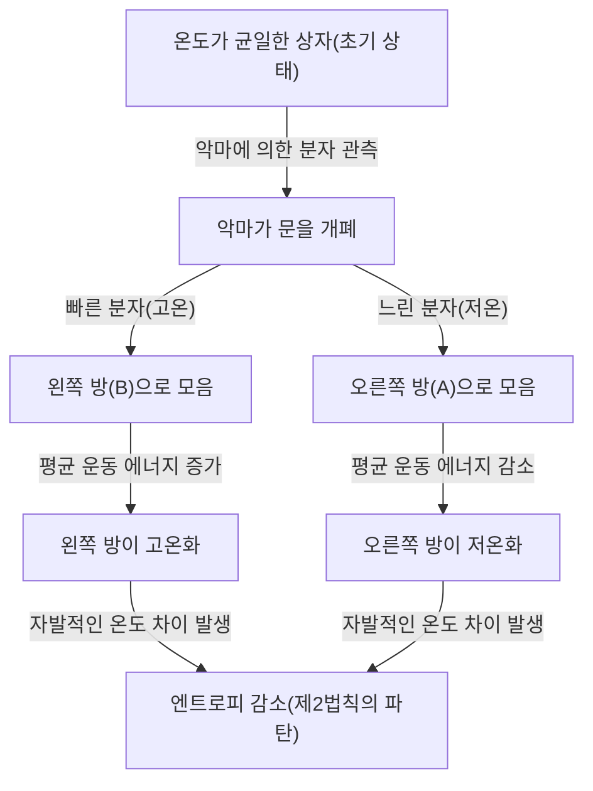
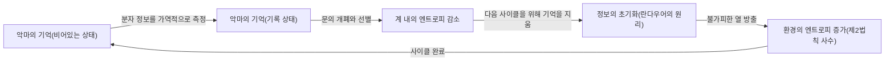

# 서론: 절대 깨지지 않을 규칙

우리가 사는 이 우주에는 결코 거스를 수 없는 절대적인 규칙이 몇 가지 존재합니다. 그 중에서도 가장 유명하고 우리의 일상에 가장 깊이 뿌리내린 것이 바로 "열역학 제2법칙"입니다. 일명 "엔트로피 증가의 법칙"이라고도 불리는 이 법칙은 한마디로 "엎질러진 물은 다시 담을 수 없다", 즉 "질서 있는 것은 시간이 지남에 따라 무질서로 향한다"는 우주의 슬픈(하지만 절대적인) 진리를 나타냅니다.

뜨거운 커피를 방에 두면 이내 실온과 같은 온도로 식게 됩니다. 반대로 아무것도 하지 않았는데 차가운 커피가 갑자기 끓어오르고, 그만큼 방 안의 공기가 차가워지는 일은 절대 없습니다. 향수병을 열면 향기가 방 안 가득 퍼지지만, 방 안에 퍼진 향기가 자발적으로 병 속으로 되돌아가는 일도 결코 일어나지 않습니다.

이러한 "비가역성"이야말로 우리가 느끼는 "시간의 화살"의 정체이며, 열역학 제2법칙이 물리학에서 특별한 지위를 차지하는 이유입니다. 알베르트 아인슈타인조차 열역학만큼은 결코 뒤집히지 않을 궁극의 이론이라며 깊은 경의를 표했습니다.

하지만 19세기의 위대한 물리학자 제임스 클러크 맥스웰은 이 절대적인 법칙에 하나의 "도전장"을 던졌습니다. 그것이 물리학 역사상 가장 유명하고 가장 많은 학자들을 괴롭힌 사고 실험, "맥스웰의 악마(Maxwell's demon)"입니다.

본 기사에서는 이 맥스웰의 악마가 어떤 역설을 가져왔으며, 물리학자들이 1세기가 넘도록 이 악마와 어떻게 싸웠고, 최종적으로 어떤 결론(정보와 열역학의 융합)에 이르렀는지 가능한 한 깊고 상세하게 파헤쳐 보겠습니다.

---

# 제1장: 열역학의 기초와 맥스웰의 악마의 탄생

악마의 정체를 밝히기 전에, 먼저 무대가 되는 "열역학"에 대해 간단히 복습해 보겠습니다.

## 열역학 제1법칙과 제2법칙

열역학을 지배하는 두 개의 거대한 기둥이 존재합니다.

1. **열역학 제1법칙 (에너지 보존의 법칙)**
   에너지는 형태가 변할 수는 있어도 새로 생성되거나 소멸되지는 않는다는 법칙입니다. 열도 에너지의 한 형태이며, 역학적인 일과 열에너지의 총합은 항상 일정하게 유지됩니다.
   
2. **열역학 제2법칙 (엔트로피 증가의 법칙)**
   고립계(외부와 에너지나 물질의 교환이 없는 공간)에서 엔트로피(무질서의 정도 또는 혼란스러움)는 항상 증가하거나 기껏해야 일정하게 유지된다는 법칙입니다. 결코 감소하는 일은 없습니다. 열은 항상 고온의 물체에서 저온의 물체로 이동하며, 그 반대는 외부에서 일(에너지)을 가하지 않는 한 일어날 수 없습니다.

제1법칙은 "우주의 예산(에너지)은 일정하다"고 말하고 있으며, 제2법칙은 "그 예산의 씀씀이는 항상 낭비(엔트로피)가 늘어나는 방향으로 향한다"고 말하고 있습니다.

## 맥스웰의 사고 실험

1867년, 맥스웰은 친구 피터 테이트에게 보낸 편지에서 이 제2법칙을 교묘하게 회피하는 어떤 사고 실험을 제안했습니다. (참고로 "악마(demon)"라는 호칭은 맥스웰 자신이 아니라 훗날 윌리엄 톰슨(켈빈 경)이 붙인 것입니다. 맥스웰 자신은 "유한한 존재(finite being)"라고 불렀습니다).

그의 사고 실험은 다음과 같습니다.

완전히 단열되어 외부로부터 일절 에너지 출입이 없는 상자를 상상해 보세요. 이 상자는 중앙의 벽을 통해 "오른쪽 방(A)"과 "왼쪽 방(B)" 두 개로 나뉘어 있습니다. 상자 안에는 기체가 들어 있으며, 초기 상태에서는 두 방의 온도와 압력이 완전히 같습니다(열평형 상태). 온도가 같다는 것은 기체 분자 운동 에너지의 "평균값"이 같다는 것을 의미합니다. 하지만 미시적인 관점에서 보면, 기체 분자 하나하나는 무작위로 날아다니고 있어 아주 빠르게 움직이는(운동 에너지가 큰 = 고온의) 분자도 있고, 느리게 움직이는(운동 에너지가 작은 = 저온의) 분자도 섞여 있습니다.

자, 여기서 중앙 벽에 "아주 작은 문"을 설치합니다. 그리고 그 문의 개폐를 제어할 수 있는 지적 생명체, 즉 **"악마"**를 배치합니다.

악마는 다음과 같은 규칙으로 문을 열고 닫습니다:
- 오른쪽 방(A)에서 왼쪽 방(B)으로 향하는 **"빠른 분자"**를 발견하면, 문을 열어 B로 통과시킨다.
- 오른쪽 방(A)에서 왼쪽 방(B)으로 향하는 **"느린 분자"**를 발견하면, 문을 닫아 A에 머물게 한다.
- 왼쪽 방(B)에서 오른쪽 방(A)으로 향하는 **"느린 분자"**를 발견하면, 문을 열어 A로 통과시킨다.
- 왼쪽 방(B)에서 오른쪽 방(A)으로 향하는 **"빠른 분자"**를 발견하면, 문을 닫아 B에 머물게 한다.

이것을 도식화해 보겠습니다.

악마가 이 작업을 계속하면 어떻게 될까요?
시간이 지남에 따라 왼쪽 방(B)에는 "빠른 분자"만 모이고, 오른쪽 방(A)에는 "느린 분자"만 모이게 됩니다. 즉, 처음에는 같은 온도였는데 외부에서 에너지(일)를 가하지 않고도 한쪽 방은 뜨거워지고 다른 한쪽 방은 차가워지게 된 것입니다.

이 온도 차이를 이용하여 열기관(엔진)을 돌리면 외부로 일을 끌어낼 수 있습니다. 그리고 온도가 균일해지면 다시 악마에게 분자를 선별하게 하면 됩니다. 이것은 그야말로 열에서 무한히 에너지를 계속해서 뽑아낼 수 있는 "제2종 영구 기관"의 완성을 의미합니다.

외부에서 일을 하지 않았음에도(문은 마찰 없이 열고 닫히며 질량이 0이라고 가정함) 불구하고, 계 전체의 엔트로피가 감소해 버렸습니다. 열역학 제2법칙은 깨진 것일까요? 이것이 바로 "맥스웰의 악마"의 역설입니다.

---

# 제2장: 역설과의 투쟁 ~ 악마 퇴치의 역사

이 사고 실험이 던진 역설은 물리학계에 큰 논쟁을 불러일으켰습니다. 악마의 행위 어딘가에 열역학 제2법칙을 만족시키기 위한 "간과한 점"이 있을 것입니다. 물리학자들은 "악마가 분자를 관측하고 선별하는 과정 어딘가에서 반드시 엔트로피가 증가하고 있을 것이다"라고 생각했습니다.

## 마리안 스몰루호프스키와 레오 실라르드 (1912년~1929년)

1912년, 폴란드의 물리학자 마리안 스몰루호프스키는 지적 생명체로서의 "악마"가 아니라 순수하게 물리적인 "자동 장치된 스프링 문"을 통해 이 분자 선별을 할 수 없는지 고찰했습니다. 하지만 문 자신도 분자와의 충돌로 인해 열운동(브라운 운동)을 일으키기 때문에, 최종적으로는 스프링 장치가 무작위로 열리고 닫혀 선별이 기능하지 않게 됨을 증명했습니다.

그리고 1929년, 헝가리의 물리학자 레오 실라르드는 맥스웰의 악마 역사상 가장 중요한 돌파구를 마련했습니다. 그는 "실라르드의 엔진"이라 불리는, 분자가 단 1개밖에 없는 단순화된 모델을 고안하여 악마의 과정을 상세하게 분석했습니다.

실라르드의 가장 큰 공적은 **"정보의 획득(측정)"과 "엔트로피"를 연결지은 것**입니다.
실라르드는 악마가 분자의 속도를 "측정(관측)"하여 그 정보를 얻는 과정에 주목했습니다. 지적인 악마라 하더라도 분자의 속도를 알기 위해서는 어떤 상호작용(예를 들어 빛을 비추는 등)이 필요하며, 그 측정 과정에서 발생하는 엔트로피의 증가가 계 전체의 엔트로피 감소를 웃돌거나(혹은 상쇄) 할 것이라고 주장했습니다. 정보의 단위 "비트"의 개념을 사실상 처음으로 열역학에 도입한 획기적인 아이디어였습니다.

## 레옹 브릴루앙의 빛 산란 모델 (1950년대)

실라르드의 아이디어를 더욱 구체화한 것이 레옹 브릴루앙입니다. 그는 악마가 분자를 "보기" 위해서는 외부 환경에서 빛(광자)을 분자에 쪼여 그 반사광을 악마가 받아들여야 한다고 생각했습니다.

어두운 상자 안에서 분자를 보기 위해서는 배경의 흑체 복사(열복사)보다 더 높은 에너지를 가진 광자를 사용해야만 합니다. 이 "조명"을 위한 에너지 소비와 광자가 산란함으로써 생기는 엔트로피 생성을 계산하면, 악마가 얻을 수 있는 정보(분자 선별에 의한 엔트로피 감소)보다 빛을 사용함으로써 발생하는 엔트로피 증가가 반드시 더 크다는 사실이 증명되었습니다.

이로써 맥스웰의 악마는 완전히 매장된 것처럼 보였습니다. "분자를 보기 위해 빛을 비추기 때문에 그곳에서 엔트로피가 증가하는 것이다"라는 설명은 직관적이고 이해하기 쉬워 많은 교과서에 실렸습니다.

하지만 싸움은 아직 끝나지 않았습니다.

## 란다우어의 원리: 정보의 "지우기"야말로 열쇠 (1961년)

브릴루앙의 해결책에는 허점이 있었습니다. "악마가 분자를 측정할 때 반드시 에너지를 소비하고 엔트로피가 증가한다"는 전제가 사실은 옳지 않았던 것입니다.

1961년, IBM의 연구원 롤프 란다우어와 그 후 찰스 베넷 등에 의해 물리학적으로 가역적인 측정(에너지를 전혀 소비하지 않고 정보를 얻는 측정)이 이론상 가능함이 밝혀졌습니다. 즉, "정보를 기록(측정)하기만" 한다면, 엔트로피를 증가시키지 않고 실행할 수 있는 이론적인 모델이 존재했던 것입니다.

이렇게 되면 다시 제2법칙이 깨지게 됩니다. 그러나 란다우어는 전혀 다른 곳에서 엔트로피 생성의 근원을 찾아냈습니다. 그것이 바로 **"정보의 지우기"**입니다.

란다우어의 원리(Landauer's principle)에 따르면, 정보를 "기록"하거나 "복사"하는 가역적인 조작에서는 에너지가 필요 없지만, 정보를 **"지우기(초기화)"**하는 비가역적인 조작에서는 환경에 열을 방출해야만 하며, 필연적으로 엔트로피가 증가합니다. 1비트의 정보를 지울 때 필요한 최소한의 에너지 양은 $k_B T \ln 2$ ($k_B$는 볼츠만 상수, $T$는 절대온도)임이 증명되었습니다.

---

# 제3장: 베넷의 최종 해답과 정보 열역학의 새벽

1982년, 찰스 베넷은 란다우어의 원리를 이용하여 맥스웰의 악마에게 최종적인 사망 선고를 내렸습니다.

베넷의 주장은 이렇습니다.
악마가 분자를 선별하기 위해서는 분자의 속도 정보를 자신의 뇌(혹은 메모리)에 "기억"해야만 합니다. 앞서 말했듯이 이 측정과 기억의 단계는 (이상적으로는) 엔트로피를 증가시키지 않고 수행될 수 있습니다. 그리고 문을 열고 닫아 분자를 선별하여 상자 안의 온도 차이를 만들어냄으로써 상자의 엔트로피를 감소시킵니다.

그러나 악마의 뇌(메모리 용량)는 유한합니다. 영구 기관으로 동작시키기 위해서는 악마는 영원히 이 사이클을 반복해야만 합니다. 새로운 분자의 정보를 기억하기 위해서는 오래된 정보를 **"지우기(망각)"**하여 메모리를 비워야 합니다.

그리고 이 "정보를 지우는" 순간이야말로 열역학의 심판이 내려지는 때입니다. 란다우어의 원리에 의해, 정보를 지울 때 악마는 환경에 대해 열을 방출하고 엔트로피를 증가시킵니다. 이 정보 소거에 수반되는 엔트로피의 증가는 악마가 분자를 선별하여 감소시킨 상자 안의 엔트로피와 **완전히 균형을 이루거나 그 이상이 됩니다.**

베넷의 해결책은 물리학과 정보 이론을 완전히 융합시킨 순간이었습니다.
**"정보란 물리적인 실체이다(Information is physical)"**
정보는 단순한 추상적인 개념이 아니라 물리계에서 에너지나 엔트로피와 등가인 것으로 다루어져야 함을 보여준 것입니다.

맥스웰이 19세기에 풀어놓은 악마는 1세기가 넘는 시간이 지나, "측정", "기억", 그리고 "망각"이라는 컴퓨터 과학적인 개념을 사용함으로써 비로소 퇴치되었습니다.

---

# 제4장: 현대의 악마들 (실험적 실현과 응용)

맥스웰의 악마는 더 이상 "사고 실험"에만 머물지 않습니다. 21세기에 들어서면서 나노 기술이나 양자 정보 기술이 비약적인 진보를 이루었고, 과학자들은 실험실에서 "인공적인 맥스웰의 악마"를 실제로 만들어내어 란다우어의 원리나 정보 열역학의 법칙을 검증할 수 있게 되었습니다.

## 실험실에서의 악마

2010년, 주오대학의 사가와 다카히로 박사(현 도쿄대학 교수)와 우에다 마사히토 박사는 "정보 열역학"의 일반화된 방정식(사가와-우에다 방정식)을 도출해내어 정보와 엔트로피의 관계를 엄밀하게 정식화했습니다. 이에 뒤이어 전 세계의 연구실에서 나노 규모의 입자나 단일 전자를 이용하여 실라르드의 엔진이나 맥스웰의 악마를 모방한 실험이 진행되었습니다.

이러한 실험을 통해 "정보를 이용하여 열에너지를 일로 변환할 수 있음"이 실험적으로 증명되었습니다. 물론 정보의 처리 및 소거에 드는 전체적인 엔트로피 생성을 계산에 넣으면 열역학 제2법칙은 깨지지 않았지만, 미시적인 계에서는 "정보"를 일종의 "연료"처럼 이용하여 동력을 얻는 것이 가능함을 실증한 것입니다.

## 생물 속의 악마

흥미롭게도 생명 시스템 안에는 "맥스웰의 악마"와 매우 흡사한 메커니즘이 수없이 존재하고 있습니다.
예를 들어, 세포 내에서 물질을 수송하는 "키네신"이나 "디네인"과 같은 모터 단백질입니다. 세포 내부는 분자의 열운동(브라운 운동)으로 인한 폭풍이 몰아치고 있지만, 이들 모터 단백질은 ATP의 가수분해를 에너지원으로 삼으면서 주위의 열 요동(무작위한 움직임)을 교묘하게 이용하여 한 방향으로의 질서 있는 운동을 만들어내고 있습니다.

이는 브라운 래칫 기구라고 불리며, 맥스웰의 악마와 유사한 분자 수준의 장치입니다. 생명은 맥스웰의 악마가 직면하는 열역학적인 제약을 완전히 받아들이면서도, 미시적인 정보를 솜씨 좋게 처리함으로써 엔트로피 증가의 법칙에 대항하는 듯한 "질서"를 유지하고 있는 것입니다. 슈뢰딩거가 저서 '생명이란 무엇인가'에서 말한 "음의 엔트로피를 먹고 산다"는 말은 바로 정보와 열역학의 결합을 암시하고 있었습니다.

---

# 결론: 악마가 가르쳐 준 것

맥스웰의 악마는 열역학 제2법칙을 깨뜨릴 수 없었습니다. 하지만 이 악마가 존재했던 덕분에 물리학은 헤아릴 수 없는 혜택을 받았습니다.

1. **통계역학의 확립**: 맥스웰이나 볼츠만이 직관한 "거시적인 법칙(열역학)은 미시적인 입자의 통계적인 행동에서 생겨난다"는 관점이 확립되었습니다.
2. **정보의 물리화**: 실라르드, 란다우어, 베넷 등에 의해 "정보"가 물리 법칙에 편입되었습니다. 이를 통해 컴퓨터의 에너지 소비에 대한 물리적 한계가 명확해졌습니다.
3. **정보 열역학의 탄생**: 비평형 통계역학과 정보 이론이 융합하여 현대 나노 기술이나 양자 컴퓨터, 생물 물리학의 기초가 되는 새로운 분야가 개척되었습니다.

만약 맥스웰이 이 악마를 떠올리지 않았더라면, 물리학과 정보 과학이 이렇게 깊이 맺어지기까지는 더 많은 시간이 필요했을지도 모릅니다.
악마는 우리에게 "정보는 공짜가 아니다(Information is not free)"라는 우주의 엄연한 사실을 들이밀었습니다. 그러나 동시에 "정보를 물리적으로 이해함으로써 미시적 세계의 전혀 새로운 문이 열린다"는 것도 가르쳐 주었습니다.

열역학 제2법칙은 지금도 흔들림 없이 우주를 지배하고 있습니다. 하지만 그 법칙이 갖는 의미는 19세기의 증기 기관 시대에서 21세기의 양자 정보 기술 시대로, 악마의 인도를 받아 훌륭하게 업데이트된 것입니다.

우주가 지속되는 한 엔트로피는 계속해서 증가하겠지만, 그 과정에서 우리가 정보를 어떻게 다룰 것인가, 그 탐구의 여정은 이제 막 시작되었을 뿐입니다.

---

**참고 문헌 및 추천 도서:**
- 레오 실라르드 "On the Decrease of Entropy in a Thermodynamic System by the Intervention of Intelligent Beings" (1929)
- 롤프 란다우어 "Irreversibility and Heat Generation in the Computing Process" (1961)
- 찰스 베넷 "The Thermodynamics of Computation—a Review" (1982)
- 마르크 메자르, 안드레아 몬타나리 『정보・물리・학습』
- 사가와 다카히로 『비평형 통계역학』
