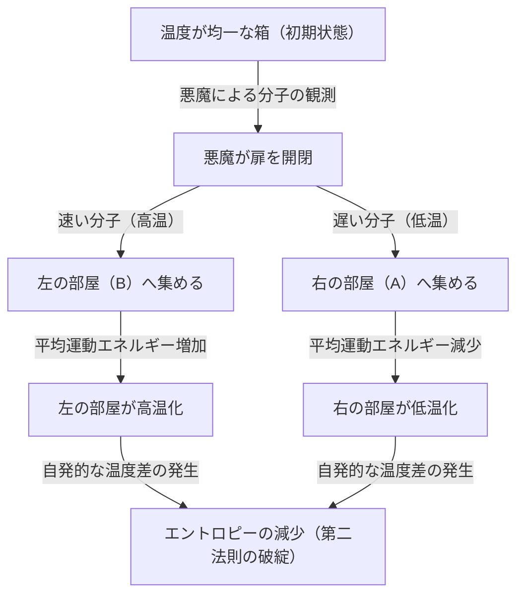
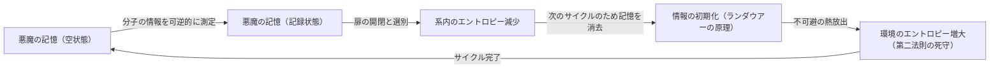

# 序論：絶対に破られないはずのルール

私たちの生きるこの宇宙には、決して逆らうことのできない絶対的なルールがいくつか存在します。その中でも最も有名で、そして私たちの日常に最も深く根付いているのが「熱力学第二法則」です。別名「エントロピー増大の法則」とも呼ばれるこの法則は、一言で言えば「覆水盆に返らず」、つまり「秩序あるものは時間とともに無秩序へと向かう」という宇宙の悲しい（しかし絶対的な）真理を表しています。

熱いコーヒーを部屋に置いておけば、やがて室温と同じ冷たさになります。逆に、何もしないのに冷たいコーヒーが突然沸騰し、その分部屋の空気が冷たくなることは絶対にありません。香水の瓶を開ければ、香りは部屋中に広がっていきますが、部屋中に広がった香りが自発的に瓶の中へと戻ることも決してありません。

この「不可逆性」こそが、私たちが感じる「時間の矢」の正体であり、熱力学第二法則が物理学において特別な地位を占める理由です。アルベルト・アインシュタインでさえ、熱力学だけは決して覆ることのない究極の理論であると深い敬意を払っていました。

しかし、19世紀の偉大な物理学者ジェームズ・クラーク・マクスウェルは、この絶対的な法則にある一つの「挑戦状」を叩きつけました。それが、物理学の歴史において最も有名で、最も多くの学者たちを悩ませた思考実験「マクスウェルの悪魔（Maxwell's demon）」です。

本記事では、このマクスウェルの悪魔がどのようなパラドックスをもたらし、そして物理学者たちが1世紀以上にわたってこの悪魔とどのように戦い、最終的にどのような結論（情報と熱力学の融合）に至ったのかを、可能な限り深く詳細に掘り下げていきます。

---

# 第1章：熱力学の基礎とマクスウェルの悪魔の誕生

悪魔の正体を解き明かす前に、まずは舞台となる「熱力学」について簡単におさらいしておきましょう。

## 熱力学第一法則と第二法則

熱力学を支配する二つの巨大な柱が存在します。

1. **熱力学第一法則（エネルギー保存の法則）**
   エネルギーは形を変えることはあっても、新たに生み出されたり消滅したりすることはない、という法則です。熱もエネルギーの一形態であり、力学的な仕事と熱エネルギーの総和は常に一定に保たれます。
   
2. **熱力学第二法則（エントロピー増大の法則）**
   孤立系（外部とエネルギーや物質のやり取りがない空間）において、エントロピー（無秩序の度合い、または乱雑さ）は常に増大するか、よくて一定に保たれる、という法則です。決して減少することはありません。熱は常に高温の物体から低温の物体へと移動し、その逆は外部から仕事（エネルギー）を加えない限り起こり得ません。

第一法則は「宇宙の予算（エネルギー）は一定である」と言っており、第二法則は「その予算の使い道は常に無駄（エントロピー）が増える方向に向かう」と言っています。

## マクスウェルの思考実験

1867年、マクスウェルは友人ピーター・テイトへの手紙の中で、この第二法則を巧妙に回避するある思考実験を提案しました。（なお、「悪魔（demon）」という呼称はマクスウェル自身ではなく、後にウィリアム・トムソン（ケルヴィン卿）が名付けたものです。マクスウェル自身は「有限の存在（finite being）」と呼んでいました）。

彼の思考実験は次のようなものです。

完全に断熱され、外部から一切のエネルギーの出入りがない箱を想像してください。この箱は中央の壁で「右の部屋（A）」と「左の部屋（B）」の二つに仕切られています。箱の中には気体が入っており、初期状態では両方の部屋の温度と圧力は完全に同じ（熱平衡状態）です。温度が同じということは、気体分子の運動エネルギーの「平均値」が同じであることを意味します。しかし、ミクロの視点で見れば、気体分子一つ一つはランダムに飛び回っており、非常に速く動く（運動エネルギーが大きい＝高温の）分子もあれば、ゆっくり動く（運動エネルギーが小さい＝低温の）分子も混ざっています。

さて、ここで中央の壁に「極めて小さな扉」を設置します。そして、その扉の開閉を制御できる知的生命体、すなわち**「悪魔」**を配置します。

悪魔は次のようなルールで扉を開閉します：
- 右の部屋（A）から左の部屋（B）へ向かってくる**「速い分子」**を見つけると、扉を開けてBへ通す。
- 右の部屋（A）から左の部屋（B）へ向かってくる**「遅い分子」**を見つけると、扉を閉めてAに留める。
- 左の部屋（B）から右の部屋（A）へ向かってくる**「遅い分子」**を見つけると、扉を開けてAへ通す。
- 左の部屋（B）から右の部屋（A）へ向かってくる**「速い分子」**を見つけると、扉を閉めてBに留める。

これを図解してみましょう。

悪魔がこの作業を続けるとどうなるでしょうか？
時間が経つにつれて、左の部屋（B）には「速い分子」ばかりが集まり、右の部屋（A）には「遅い分子」ばかりが集まります。つまり、最初は同じ温度だったのに、外部からエネルギー（仕事）を加えることなく、一方の部屋が熱くなり、もう一方の部屋が冷たくなってしまったのです。

この温度差を利用して熱機関（エンジン）を回せば、外部へ仕事を取り出すことができます。そして温度が均一になったら、また悪魔に分子を選別させればよいのです。これはまさに、熱から無限にエネルギーを取り出し続けることができる「第二種永久機関」の完成を意味します。

外部から仕事をしていない（扉は摩擦なく開閉し、質量がゼロだと仮定する）にもかかわらず、系全体のエントロピーが減少してしまった。熱力学第二法則は破綻したのか？ これが「マクスウェルの悪魔」のパラドックスです。

---

# 第2章：パラドックスとの闘い 〜 悪魔祓いの歴史

この思考実験が突きつけたパラドックスは、物理学界に大論争を巻き起こしました。悪魔の行為のどこかに、熱力学第二法則を満たすための「見落とし」があるはずです。物理学者たちは、「悪魔が分子を観測・選別する過程のどこかで、必ずエントロピーが増大しているはずだ」と考えました。

## マリアン・スモルコフスキーとレオ・シラード（1912年〜1929年）

1912年、ポーランドの物理学者マリアン・スモルコフスキーは、知的生命体としての「悪魔」ではなく、純粋に物理的な「自動仕掛けのバネ付きの扉」によってこの分子選別ができないかを考察しました。しかし、扉自身も分子との衝突によって熱運動（ブラウン運動）を起こすため、最終的にはバネの仕掛けがランダムに開閉してしまい、選別が機能しなくなることを証明しました。

そして1929年、ハンガリーの物理学者レオ・シラードは、マクスウェルの悪魔の歴史において最も重要なブレイクスルーをもたらしました。彼は「シラードのエンジン」と呼ばれる、分子がたった1個しかない単純化されたモデルを考案し、悪魔のプロセスを詳細に分析しました。

シラードの最大の功績は、**「情報の取得（測定）」と「エントロピー」を結びつけたこと**です。
シラードは、悪魔が分子の速度を「測定（観測）」してその情報を得る過程に注目しました。知的な悪魔であっても、分子の速度を知るためには何らかの相互作用（例えば光を当てるなど）が必要であり、その測定の過程で生じるエントロピーの増大が、系全体のエントロピー減少を上回る（あるいは相殺する）はずだと主張しました。情報の単位「ビット」の概念を事実上初めて熱力学に持ち込んだ画期的なアイデアでした。

## レオン・ブリルアンの光散乱モデル（1950年代）

シラードのアイデアをさらに具体化したのがレオン・ブリルアンです。彼は、悪魔が分子を「見る」ためには、外界から光（光子）を分子に当てて、その反射光を悪魔が受け取る必要があると考えました。

暗闇の箱の中で分子を見るためには、背景の黒体輻射（熱放射）よりも高いエネルギーを持つ光子を使わなければなりません。この「照明」のためのエネルギー消費と、光子が散乱することによるエントロピーの生成を計算すると、悪魔が得られる情報（分子の選別によるエントロピー減少）よりも、光を使うことによって生じるエントロピー増大の方が必ず大きくなることが証明されました。

これでマクスウェルの悪魔は完全に葬り去られたかに見えました。「分子を見るために光を当てるから、そこでエントロピーが増えるのだ」という説明は直感的でわかりやすく、多くの教科書に記載されました。

しかし、戦いはまだ終わっていませんでした。

## ランダウアーの原理：情報の「消去」こそが鍵（1961年）

ブリルアンの解決策には抜け穴がありました。「悪魔が分子を測定する際に必ずエネルギーを消費し、エントロピーが増大する」という前提が実は正しくなかったのです。

1961年、IBMの研究者ロルフ・ランダウアーと、その後のチャールズ・ベネットらによって、物理学的に可逆な測定（エネルギーを全く消費せずに情報を得る測定）が理論上可能であることが示されました。つまり、「情報を記録（測定）するだけ」なら、エントロピーを増大させずに実行できる理論的なモデルが存在したのです。

これでは再び第二法則が破られてしまいます。しかしランダウアーは、全く別の場所にエントロピー生成の根源を見出しました。それが**「情報の消去」**です。

ランダウアーの原理（Landauer's principle）によれば、情報を「記録」したり「コピー」したりする可逆な操作ではエネルギーは不要ですが、情報を**「消去（初期化）」**する非可逆な操作においては、環境に熱を放出しなければならず、必然的にエントロピーが増大するのです。1ビットの情報を消去する際に必要な最小のエネルギー量は $k_B T \ln 2$ （$k_B$はボルツマン定数、$T$は絶対温度）であることが示されました。

---

# 第3章：ベネットの最終解答と情報熱力学の夜明け

1982年、チャールズ・ベネットはランダウアーの原理を用いて、マクスウェルの悪魔に最終的な引導を渡しました。

ベネットの主張はこうです。
悪魔が分子を選別するためには、分子の速度情報を自身の脳（あるいはメモリー）に「記憶」しなければなりません。先述の通り、この測定と記憶のステップは（理想的には）エントロピーを増加させずに行うことができます。そして扉を開閉して分子を選別し、箱の中の温度差を作り出すことで、箱のエントロピーを減少させます。

しかし、悪魔の脳（メモリー容量）は有限です。永久機関として動作させるためには、悪魔は永遠にこのサイクルを繰り返さなければなりません。新しい分子の情報を記憶するためには、古い情報を**「消去（忘却）」**してメモリーを空にする必要があります。

そして、この「情報を消去する」瞬間こそが、熱力学の審判が下る時です。ランダウアーの原理により、情報を消去する際に悪魔は環境に対して熱を放出し、エントロピーを増大させます。この情報消去に伴うエントロピーの増大は、悪魔が分子を選別して減少させた箱の中のエントロピーと**完全に釣り合うか、それ以上になります。**

ベネットの解決は、物理学と情報理論を完全に融合させた瞬間でした。
**「情報とは物理的な実体である（Information is physical）」**
情報は単なる抽象的な概念ではなく、物理系においてエネルギーやエントロピーと等価なものとして扱わなければならないことが示されたのです。

マクスウェルが19世紀に放った悪魔は、1世紀以上の時を経て、「測定」「記憶」そして「忘却」というコンピュータ科学的な概念を用いることでようやく退治されました。

---

# 第4章：現代における悪魔たち（実験的実現と応用）

マクスウェルの悪魔はもはや「思考実験」に留まりません。21世紀に入り、ナノテクノロジーや量子情報技術が飛躍的な進歩を遂げたことで、科学者たちは実験室で「人工的なマクスウェルの悪魔」を実際に作り出し、ランダウアーの原理や情報熱力学の法則を検証することができるようになりました。

## 実験室での悪魔

2010年、中央大学の沙川貴大博士（現・東京大学教授）と上田正仁博士は、「情報熱力学」の一般化された方程式（サガワ・ウエダ方程式）を導き出し、情報とエントロピーの関係を厳密に定式化しました。これに続き、世界中の研究室でナノスケールの粒子や単一電子を用いて、シラードのエンジンやマクスウェルの悪魔を模倣した実験が行われました。

これらの実験により、「情報を用いて熱エネルギーを仕事に変換できる」ことが実験的に証明されました。もちろん、情報の処理・消去にかかるトータルのエントロピー生成を計算に入れれば熱力学第二法則は破られていませんが、ミクロな系においては「情報」を一種の「燃料」のように用いて動力を得ることが可能であることが実証されたのです。

## 生物の中の悪魔

興味深いことに、生命システムの中には「マクスウェルの悪魔」によく似たメカニズムが数多く存在しています。
例えば、細胞内で物質を輸送する「キネシン」や「ダイニン」といったモータータンパク質です。細胞内は分子の熱運動（ブラウン運動）による嵐が吹き荒れていますが、これらのモータータンパク質はATPの加水分解をエネルギー源としつつ、周囲の熱揺らぎ（ランダムな動き）を巧妙に利用して、一方向への秩序だった運動を生み出しています。

これはブラウン・ラチェット機構と呼ばれ、マクスウェルの悪魔に類似した分子レベルの仕掛けです。生命は、マクスウェルの悪魔が直面する熱力学的な制約を完全に受け入れながら、ミクロな情報を巧みに処理することで、エントロピー増大の法則に抗うような「秩序」を維持しているのです。シュレーディンガーが著書『生命とは何か』で語った「負のエントロピーを食べて生きる」という言葉は、まさに情報と熱力学の結びつきを示唆していました。

---

# 結論：悪魔が教えてくれたこと

マクスウェルの悪魔は、熱力学第二法則を打ち破ることはできませんでした。しかし、この悪魔が存在したおかげで、物理学は計り知れない恩恵を受けました。

1. **統計力学の確立**: マクスウェルやボルツマンが直感した「マクロな法則（熱力学）は、ミクロな粒子の統計的な振る舞いから生じる」という視点が確立しました。
2. **情報の物理化**: シラード、ランダウアー、ベネットらにより、「情報」が物理法則に組み込まれました。これにより、コンピュータのエネルギー消費の物理的限界が明らかになりました。
3. **情報熱力学の誕生**: 非平衡統計力学と情報理論が融合し、現代のナノテクノロジーや量子コンピュータ、生物物理学の基礎となる新しい分野が切り拓かれました。

もしマクスウェルがこの悪魔を思いついていなかったら、物理学と情報科学がこれほど深く結びつくには、もっと多くの時間が必要だったかもしれません。
悪魔は私たちに「情報はタダではない（Information is not free）」という宇宙の冷厳な事実を突きつけました。しかし同時に、「情報を物理的に理解することで、ミクロな世界の全く新しい扉が開かれる」ことも教えてくれたのです。

熱力学第二法則は今も揺るぎなく宇宙を支配しています。しかし、その法則の意味合いは、19世紀の蒸気機関の時代から、21世紀の量子情報技術の時代へと、悪魔の導きによって見事にアップデートされたのです。

宇宙が続く限りエントロピーは増大し続けますが、その過程で私たちが情報をいかに扱うか、その探求の旅はまだ始まったばかりです。

---

**参考文献および推奨書籍:**
- レオ・シラード "On the Decrease of Entropy in a Thermodynamic System by the Intervention of Intelligent Beings" (1929)
- ロルフ・ランダウアー "Irreversibility and Heat Generation in the Computing Process" (1961)
- チャールズ・ベネット "The Thermodynamics of Computation—a Review" (1982)
- マルク・メザール、アンドレア・モンタナリ『情報・物理・学習』
- 沙川貴大『非平衡統計力学』
