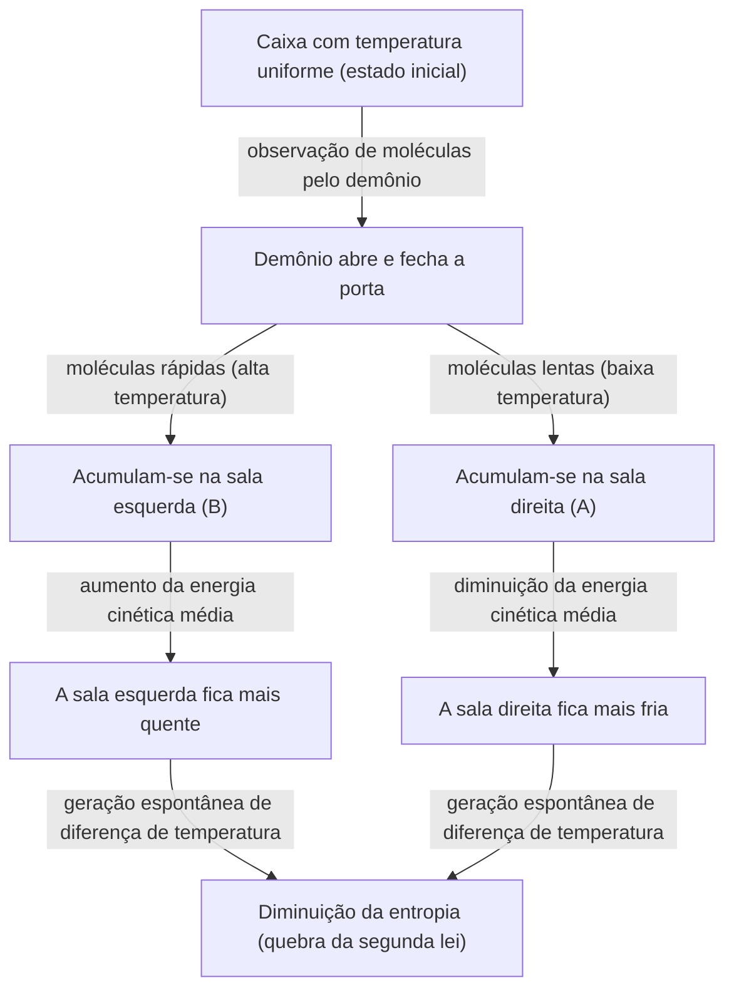
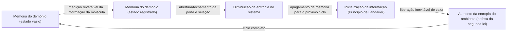

# Introdução: As regras que nunca deveriam ser quebradas

No universo em que vivemos, existem algumas regras absolutas que nunca podem ser contrariadas. Entre elas, a mais famosa e a mais profundamente enraizada em nosso cotidiano é a "Segunda Lei da Termodinâmica". Também conhecida como a "Lei do Aumento da Entropia", esta lei, em poucas palavras, diz que "não se chora pelo leite derramado", ou seja, representa a triste (porém absoluta) verdade cósmica de que "tudo o que tem ordem caminha para a desordem com o tempo".

Se você deixar uma xícara de café quente em uma sala, ela eventualmente esfriará até atingir a temperatura ambiente. Por outro lado, é absolutamente impossível que o café frio, sem que nada seja feito, comece a ferver de repente, deixando o ar da sala mais frio em compensação. Se você abrir um frasco de perfume, o aroma se espalhará por toda a sala, mas o aroma espalhado jamais retornará espontaneamente para dentro do frasco.

Essa "irreversibilidade" é a verdadeira natureza da "seta do tempo" que sentimos, e é a razão pela qual a Segunda Lei da Termodinâmica ocupa um lugar especial na física. Até mesmo Albert Einstein prestava profunda reverência à termodinâmica, considerando-a a teoria definitiva que jamais seria derrubada.

No entanto, no século XIX, o grande físico James Clerk Maxwell lançou um "desafio" a essa lei absoluta. Esse foi o experimento mental mais famoso da história da física, que atormentou um sem número de estudiosos: o "Demônio de Maxwell" (Maxwell's demon).

Neste artigo, exploraremos com o máximo de profundidade e detalhes possíveis que tipo de paradoxo o Demônio de Maxwell trouxe, como os físicos lutaram contra ele por mais de um século, e a qual conclusão final (a fusão da informação com a termodinâmica) eles chegaram.

---

# Capítulo 1: Os Fundamentos da Termodinâmica e o Nascimento do Demônio de Maxwell

Antes de desvendar a verdadeira identidade do demônio, vamos revisar rapidamente a "termodinâmica", que serve como palco para esta história.

## A Primeira e a Segunda Leis da Termodinâmica

Existem dois pilares gigantescos que governam a termodinâmica.

1. **Primeira Lei da Termodinâmica (Lei da Conservação de Energia)**
   Esta lei afirma que a energia pode mudar de forma, mas nunca é criada do nada ou destruída. O calor também é uma forma de energia, e a soma total do trabalho mecânico e da energia térmica permanece sempre constante.
   
2. **Segunda Lei da Termodinâmica (Lei do Aumento da Entropia)**
   Esta lei afirma que, em um sistema isolado (um espaço sem troca de energia ou matéria com o exterior), a entropia (o grau de desordem ou aleatoriedade) sempre aumenta, ou, no melhor dos casos, permanece constante. Ela nunca diminui. O calor sempre se move de um corpo de alta temperatura para um corpo de baixa temperatura, e o inverso nunca pode ocorrer a menos que trabalho (energia) seja aplicado externamente.

A primeira lei diz que o "orçamento (energia) do universo é constante", enquanto a segunda lei diz que "a maneira como esse orçamento é gasto sempre tende a aumentar o desperdício (entropia)".

## O Experimento Mental de Maxwell

Em 1867, em uma carta a seu amigo Peter Tait, Maxwell propôs um experimento mental que contornava engenhosamente essa segunda lei. (Vale ressaltar que o termo "demônio" não foi dado pelo próprio Maxwell, mas posteriormente por William Thomson (Lord Kelvin). O próprio Maxwell o chamava de "um ser finito" (finite being)).

O experimento mental dele é o seguinte:

Imagine uma caixa completamente isolada termicamente, sem qualquer entrada ou saída de energia. Esta caixa é dividida ao meio por uma parede central em duas salas: a "sala direita (A)" e a "sala esquerda (B)". A caixa contém um gás e, no estado inicial, a temperatura e a pressão em ambas as salas são exatamente as mesmas (estado de equilíbrio térmico). O fato de a temperatura ser a mesma significa que o "valor médio" da energia cinética das moléculas de gás é o mesmo. No entanto, de uma perspectiva micro, cada molécula de gás voa aleatoriamente; existem moléculas que se movem muito rápido (grande energia cinética = alta temperatura) misturadas com moléculas que se movem lentamente (pequena energia cinética = baixa temperatura).

Agora, instale uma "porta extremamente pequena" na parede central. E coloque ali um ser inteligente capaz de controlar a abertura e o fechamento dessa porta, ou seja, um **"demônio"**.

O demônio abre e fecha a porta de acordo com as seguintes regras:
- Quando vê uma **"molécula rápida"** vindo da sala direita (A) para a sala esquerda (B), ele abre a porta e a deixa passar para B.
- Quando vê uma **"molécula lenta"** vindo da sala direita (A) para a sala esquerda (B), ele fecha a porta e a mantém em A.
- Quando vê uma **"molécula lenta"** vindo da sala esquerda (B) para a sala direita (A), ele abre a porta e a deixa passar para A.
- Quando vê uma **"molécula rápida"** vindo da sala esquerda (B) para a sala direita (A), ele fecha a porta e a mantém em B.

Vamos ilustrar isso em um diagrama.

O que aconteceria se o demônio continuasse esse trabalho?
Com o passar do tempo, apenas as "moléculas rápidas" se reuniriam na sala esquerda (B), e apenas as "moléculas lentas" se reuniriam na sala direita (A). Em outras palavras, embora tivessem a mesma temperatura no início, sem adicionar nenhuma energia (trabalho) do exterior, uma sala ficou quente e a outra ficou fria.

Se usarmos essa diferença de temperatura para operar uma máquina térmica (motor), podemos extrair trabalho para o exterior. E quando as temperaturas se igualarem novamente, bastaria deixar o demônio classificar as moléculas mais uma vez. Isso significa exatamente a conclusão de um "moto-contínuo de segunda espécie", capaz de extrair energia infinitamente do calor.

Apesar de nenhum trabalho externo ter sido realizado (assumindo que a porta abre e fecha sem atrito e tem massa zero), a entropia de todo o sistema diminuiu. A Segunda Lei da Termodinâmica teria falhado? Esse é o paradoxo do "Demônio de Maxwell".

---

# Capítulo 2: A Batalha contra o Paradoxo 〜 A História do Exorcismo

O paradoxo apresentado por esse experimento mental causou uma grande controvérsia na comunidade da física. Deveria haver uma "falha" em algum lugar nas ações do demônio para satisfazer a Segunda Lei da Termodinâmica. Os físicos pensaram: "A entropia deve, de alguma forma, aumentar durante o processo em que o demônio observa e seleciona as moléculas."

## Marian Smoluchowski e Leo Szilard (1912-1929)

Em 1912, o físico polonês Marian Smoluchowski considerou se essa seleção de moléculas poderia ser feita puramente por uma "porta com mola automatizada" mecânica, em vez de um "demônio" inteligente. No entanto, ele provou que, como a própria porta também passaria por movimento térmico (movimento browniano) devido às colisões com as moléculas, o mecanismo da mola acabaria abrindo e fechando aleatoriamente, e a seleção não funcionaria.

Então, em 1929, o físico húngaro Leo Szilard trouxe o avanço mais importante na história do Demônio de Maxwell. Ele idealizou um modelo simplificado com apenas uma única molécula, chamado de "Motor de Szilard", e analisou o processo do demônio em detalhes.

A maior conquista de Szilard foi **conectar a "aquisição de informação (medição)" com a "entropia"**.
Szilard focou no processo em que o demônio "mede (observa)" a velocidade das moléculas e obtém essa informação. Ele argumentou que mesmo para um demônio inteligente, alguma interação (como incidir luz) seria necessária para conhecer a velocidade das moléculas, e que o aumento da entropia gerado durante esse processo de medição deveria superar (ou compensar) a diminuição da entropia em todo o sistema. Foi uma ideia revolucionária que, para todos os efeitos práticos, introduziu o conceito da unidade de informação, o "bit", na termodinâmica pela primeira vez.

## O Modelo de Espalhamento de Luz de Léon Brillouin (Década de 1950)

Foi Léon Brillouin quem concretizou ainda mais as ideias de Szilard. Ele argumentou que, para o demônio "ver" a molécula, ele precisaria incidir luz (fótons) do ambiente externo na molécula e receber a luz refletida.

Para ver uma molécula dentro de uma caixa escura, devem-se usar fótons com uma energia superior à da radiação de corpo negro (radiação térmica) de fundo. Calculando o consumo de energia para essa "iluminação" e a geração de entropia devido ao espalhamento dos fótons, provou-se que o aumento da entropia causado pelo uso da luz seria sempre maior do que a informação obtida pelo demônio (a diminuição da entropia através da seleção de moléculas).

Isso parecia ter enterrado completamente o Demônio de Maxwell. A explicação de que "a entropia aumenta porque a luz é incidida para ver as moléculas" era intuitiva e fácil de entender, sendo documentada em muitos livros didáticos.

No entanto, a batalha ainda não havia terminado.

## O Princípio de Landauer: A "Supressão" da Informação é a Chave (1961)

Havia uma brecha na solução de Brillouin. A premissa de que "o demônio invariavelmente consome energia e aumenta a entropia ao medir uma molécula" não estava, na verdade, correta.

Em 1961, pesquisadores da IBM, Rolf Landauer e, posteriormente, Charles Bennett, demonstraram que medições fisicamente reversíveis (medições que obtêm informações sem consumir nenhuma energia) eram teoricamente possíveis. Ou seja, se fosse apenas para "registrar (medir) informações", existia um modelo teórico capaz de realizar isso sem aumentar a entropia.

Isso significava que a segunda lei seria quebrada novamente. No entanto, Landauer encontrou a origem da geração de entropia em um lugar completamente diferente. Era o **"apagamento da informação"**.

De acordo com o Princípio de Landauer (Landauer's principle), as operações reversíveis de "gravar" ou "copiar" informações não requerem energia, mas, na operação irreversível de **"apagar (inicializar)"** a informação, o calor deve ser liberado para o ambiente, aumentando inevitavelmente a entropia. Foi demonstrado que a quantidade mínima de energia necessária para apagar 1 bit de informação é $k_B T \ln 2$ (onde $k_B$ é a constante de Boltzmann e $T$ é a temperatura absoluta).

---

# Capítulo 3: A Resposta Final de Bennett e o Alvorecer da Termodinâmica da Informação

Em 1982, Charles Bennett usou o Princípio de Landauer para dar o veredicto final ao Demônio de Maxwell.

O argumento de Bennett era o seguinte:
Para o demônio classificar as moléculas, ele deve "lembrar" as informações sobre as velocidades das moléculas em seu próprio cérebro (ou memória). Como mencionado antes, essa etapa de medição e memorização (idealmente) pode ser feita sem aumentar a entropia. Em seguida, ele diminui a entropia da caixa abrindo e fechando a porta para classificar as moléculas e criar uma diferença de temperatura no interior.

No entanto, o cérebro (capacidade de memória) do demônio é finito. Para operar como um motor perpétuo, o demônio precisaria repetir esse ciclo para sempre. A fim de memorizar as informações de uma nova molécula, ele deve **"apagar (esquecer)"** as informações antigas e liberar a memória.

E é nesse momento de "apagar a informação" que ocorre o julgamento termodinâmico. De acordo com o Princípio de Landauer, quando a informação é apagada, o demônio libera calor para o ambiente e aumenta a entropia. O aumento da entropia associado a esse apagamento de informações **compensa completamente, ou até excede**, a entropia da caixa que o demônio diminuiu ao classificar as moléculas.

A solução de Bennett foi o momento em que a física e a teoria da informação se fundiram completamente.
**"A informação é uma entidade física" (Information is physical)**
Ficou demonstrado que a informação não é apenas um conceito abstrato, mas deve ser tratada como algo equivalente à energia e à entropia em sistemas físicos.

O demônio liberado por Maxwell no século XIX foi finalmente derrotado, mais de um século depois, através do uso de conceitos da ciência da computação como "medição", "memória" e "esquecimento".

---

# Capítulo 4: Demônios na Era Moderna (Realização Experimental e Aplicações)

O Demônio de Maxwell não é mais um mero "experimento mental". Com a entrada no século XXI e o avanço dramático da nanotecnologia e da tecnologia da informação quântica, os cientistas puderam finalmente criar um "Demônio de Maxwell artificial" real no laboratório para testar o Princípio de Landauer e as leis da termodinâmica da informação.

## Demônios em Laboratório

Em 2010, o Dr. Takahiro Sagawa, da Universidade de Chuo (agora professor na Universidade de Tóquio), e o Dr. Masahito Ueda derivaram uma equação generalizada de "termodinâmica da informação" (a equação de Sagawa-Ueda) e formularam rigorosamente a relação entre informação e entropia. Em seguida, laboratórios ao redor do mundo conduziram experimentos que simulavam o motor de Szilard ou o demônio de Maxwell usando partículas em nanoescala ou elétrons individuais.

Através desses experimentos, provou-se experimentalmente que "a informação pode ser usada para converter energia térmica em trabalho". Obviamente, a Segunda Lei da Termodinâmica não é quebrada se incluirmos a geração total de entropia envolvida no processamento e no apagamento da informação, mas foi demonstrado que em sistemas microscópicos, é possível usar a "informação" como uma espécie de "combustível" para obter potência.

## Demônios na Biologia

Curiosamente, existem muitos mecanismos nos sistemas biológicos que se assemelham fortemente ao "Demônio de Maxwell".
Por exemplo, as proteínas motoras, como "cinesina" e "dineína", que transportam substâncias dentro das células. Uma tempestade de movimento térmico molecular (movimento browniano) ocorre no interior das células, mas essas proteínas motoras utilizam a hidrólise do ATP como fonte de energia, ao mesmo tempo em que utilizam engenhosamente as flutuações térmicas ao redor (movimentos aleatórios) para gerar um movimento ordenado e unidirecional.

Isso é chamado de mecanismo de catraca browniana, um dispositivo em nível molecular semelhante ao demônio de Maxwell. A vida, ao aceitar totalmente as restrições termodinâmicas enfrentadas pelo demônio de Maxwell, processa de maneira engenhosa informações microscópicas, mantendo assim uma "ordem" que parece desafiar a lei do aumento da entropia. As palavras "alimentar-se de entropia negativa", expressas por Schrödinger em seu livro "O que é a vida?", apontavam exatamente para a conexão entre informação e termodinâmica.

---

# Conclusão: O Que o Demônio nos Ensinou

O Demônio de Maxwell não conseguiu quebrar a Segunda Lei da Termodinâmica. No entanto, a física colheu benefícios imensuráveis graças à existência desse demônio.

1. **Estabelecimento da Mecânica Estatística**: A perspectiva intuída por Maxwell e Boltzmann de que "as leis macroscópicas (termodinâmica) surgem do comportamento estatístico de partículas microscópicas" foi consolidada.
2. **Materialização da Informação**: Através de Szilard, Landauer, Bennett e outros, a "informação" foi incorporada às leis da física. Isso revelou os limites físicos do consumo de energia por parte dos computadores.
3. **Nascimento da Termodinâmica da Informação**: A mecânica estatística de não-equilíbrio e a teoria da informação se fundiram, abrindo um novo campo que serve de base para a nanotecnologia moderna, computadores quânticos e biofísica.

Se Maxwell não tivesse concebido esse demônio, a física e a ciência da informação talvez tivessem levado muito mais tempo para se entrelaçarem de forma tão profunda.
O demônio nos confrontou com a fria e dura realidade cósmica de que "a informação não é de graça" (Information is not free). Mas, ao mesmo tempo, ele também nos ensinou que "entender a informação fisicamente abre portas completamente novas para o mundo microscópico".

A Segunda Lei da Termodinâmica continua reinando de forma incontestável no universo hoje. No entanto, o significado dessa lei foi brilhantemente atualizado, saindo da era das máquinas a vapor do século XIX para a era da tecnologia da informação quântica do século XXI, tudo sob a orientação de um demônio.

Enquanto o universo existir, a entropia continuará a aumentar, mas nossa jornada para descobrir como lidamos com as informações no meio desse processo, na verdade, está apenas começando.

---

**Referências e Livros Recomendados:**
- Leo Szilard, "On the Decrease of Entropy in a Thermodynamic System by the Intervention of Intelligent Beings" (1929)
- Rolf Landauer, "Irreversibility and Heat Generation in the Computing Process" (1961)
- Charles Bennett, "The Thermodynamics of Computation—a Review" (1982)
- Marc Mézard e Andrea Montanari, "Information, Physics, and Computation" (Informação, Física e Computação)
- Takahiro Sagawa, "Non-equilibrium Statistical Mechanics" (Mecânica Estatística de Não-Equilíbrio)
