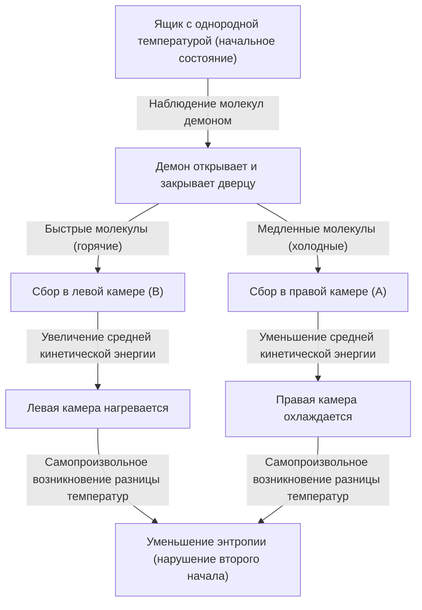
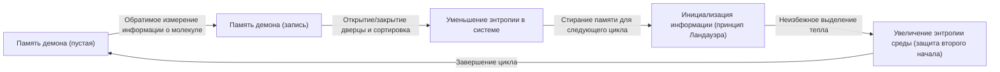

# Введение: Правило, которое невозможно нарушить

В нашей Вселенной существуют абсолютные правила, которым невозможно противостоять. Одним из самых известных и глубоко укоренившихся в нашей повседневной жизни является «второе начало термодинамики». Этот закон, также известный как «закон возрастания энтропии», выражает печальную (но абсолютную) истину Вселенной: «что сделано, то сделано» — то есть «всё упорядоченное со временем стремится к беспорядку».

Оставьте горячий кофе в комнате, и со временем он остынет до комнатной температуры. И наоборот, никогда не бывает так, чтобы холодный кофе вдруг сам по себе закипел, а воздух в комнате охладился. Если открыть флакон духов, аромат распространится по всей комнате, но этот аромат никогда самопроизвольно не вернётся обратно во флакон.

Эта «необратимость» и есть истинная природа ощущаемой нами «стрелы времени», и именно поэтому второе начало термодинамики занимает особое место в физике. Даже Альберт Эйнштейн глубоко уважал термодинамику, считая её абсолютной теорией, которая никогда не будет опровергнута.

Однако в 19 веке великий физик Джеймс Клерк Максвелл бросил вызов этому абсолютному закону. Это был самый известный мысленный эксперимент в истории физики, который долгое время не давал покоя многим учёным — «Демон Максвелла» (Maxwell's demon).

В этой статье мы подробно и глубоко рассмотрим, какой парадокс принёс с собой демон Максвелла, как физики боролись с ним более века, и к какому окончательному выводу (слиянию информации и термодинамики) они в итоге пришли.

---

# Глава 1: Основы термодинамики и рождение демона Максвелла

Прежде чем разгадать истинную природу демона, давайте кратко вспомним «термодинамику», которая служит здесь ареной действий.

## Первое и второе начала термодинамики

Термодинамика опирается на два фундаментальных столпа:

1. **Первое начало термодинамики (закон сохранения энергии)**
   Энергия может менять свою форму, но она никогда не создаётся из ничего и не исчезает. Тепло также является формой энергии, и общая сумма механической работы и тепловой энергии всегда остаётся постоянной.
   
2. **Второе начало термодинамики (закон возрастания энтропии)**
   В изолированной системе (пространстве, не обменивающемся энергией или веществом с внешней средой) энтропия (степень беспорядка или хаотичности) всегда возрастает или, в лучшем случае, остаётся неизменной. Она никогда не уменьшается. Тепло всегда передаётся от более нагретого тела к менее нагретому, и обратное невозможно без совершения работы (приложения энергии) извне.

Первое начало гласит, что «бюджет (энергия) Вселенной постоянен», а второе начало говорит, что «расходование этого бюджета всегда направлено в сторону увеличения потерь (энтропии)».

## Мысленный эксперимент Максвелла

В 1867 году Максвелл в письме своему другу Питеру Тэйту предложил мысленный эксперимент, который изящно обходил это второе начало. (Кстати, название «демон» (demon) дал не сам Максвелл, а позже Уильям Томсон (лорд Кельвин). Сам Максвелл называл его «конечным существом» (finite being)).

Его мысленный эксперимент заключался в следующем:

Представьте себе полностью изолированный ящик, в который не поступает и из которого не выходит никакая энергия. Этот ящик разделён центральной перегородкой на две части: «правую камеру (A)» и «левую камеру (B)». Внутри ящика находится газ, и в начальном состоянии температура и давление в обеих камерах абсолютно одинаковы (состояние теплового равновесия). Одинаковая температура означает, что «среднее значение» кинетической энергии молекул газа одинаково. Однако с микроскопической точки зрения каждая отдельная молекула движется хаотично: есть как очень быстрые (с высокой кинетической энергией = горячие) молекулы, так и медленные (с низкой кинетической энергией = холодные).

Теперь мы установим в центральной перегородке «чрезвычайно маленькую дверцу». И поместим туда разумное существо, способное управлять открытием и закрытием этой дверцы — то есть **«демона»**.

Демон открывает и закрывает дверцу по следующим правилам:
- Если он видит **«быструю молекулу»**, летящую из правой камеры (A) в левую камеру (B), он открывает дверцу и пропускает её в B.
- Если он видит **«медленную молекулу»**, летящую из правой камеры (A) в левую камеру (B), он закрывает дверцу и оставляет её в A.
- Если он видит **«медленную молекулу»**, летящую из левой камеры (B) в правую камеру (A), он открывает дверцу и пропускает её в A.
- Если он видит **«быструю молекулу»**, летящую из левой камеры (B) в правую камеру (A), он закрывает дверцу и оставляет её в B.

Давайте проиллюстрируем это.

Что произойдёт, если демон продолжит эту работу?
Со временем в левой камере (B) соберутся только «быстрые молекулы», а в правой (A) — только «медленные». То есть, несмотря на то, что изначально температура была одинаковой, без приложения энергии (работы) извне одна камера стала горячей, а другая холодной.

Если использовать эту разницу температур для работы теплового двигателя, можно извлекать энергию наружу. А когда температура снова выровняется, можно позволить демону опять сортировать молекулы. Это означает создание «вечного двигателя второго рода», способного бесконечно извлекать энергию из тепла.

Несмотря на отсутствие работы извне (предполагается, что дверца открывается без трения и имеет нулевую массу), энтропия всей системы уменьшилась. Неужели второе начало термодинамики нарушено? Это и есть парадокс «Демона Максвелла».

---

# Глава 2: Борьба с парадоксом 〜 История изгнания демона

Парадокс, поставленный этим мысленным экспериментом, вызвал бурные споры в физическом сообществе. В действиях демона где-то должно быть упущение, необходимое для выполнения второго начала термодинамики. Физики полагали, что «где-то в процессе наблюдения и сортировки молекул демоном энтропия обязательно должна возрастать».

## Мариан Смолуховский и Лео Силард (1912 - 1929 гг.)

В 1912 году польский физик Мариан Смолуховский рассмотрел возможность такой сортировки молекул с помощью чисто физической «автоматической дверцы на пружине» вместо «демона» как разумного существа. Однако он доказал, что поскольку сама дверца также будет испытывать тепловое (броуновское) движение из-за столкновений с молекулами, в конечном итоге пружинный механизм начнёт открываться и закрываться случайным образом, и сортировка перестанет работать.

В 1929 году венгерский физик Лео Силард совершил самый важный прорыв в истории демона Максвелла. Он предложил упрощённую модель с одной-единственной молекулой, названную «двигателем Силарда», и подробно проанализировал процесс работы демона.

Главным достижением Силарда было **связывание «получения информации (измерения)» и «энтропии»**.
Силард обратил внимание на процесс, в котором демон «измеряет (наблюдает)» скорость молекулы и получает эту информацию. Чтобы даже разумный демон мог узнать скорость молекулы, необходимо какое-то взаимодействие (например, освещение её светом), и он утверждал, что увеличение энтропии, возникающее в процессе этого измерения, должно превышать (или компенсировать) уменьшение энтропии всей системы. Это была революционная идея, фактически впервые внедрившая концепцию «бита» информации в термодинамику.

## Модель рассеяния света Леона Бриллюэна (1950-е гг.)

Леон Бриллюэн в дальнейшем конкретизировал идеи Силарда. Он предположил, что для того, чтобы демон мог «увидеть» молекулу, необходимо направить на неё свет (фотоны) извне, а отражённый свет должен быть принят демоном.

Чтобы увидеть молекулу в тёмном ящике, нужно использовать фотоны с большей энергией, чем фоновое тепловое излучение (излучение абсолютно чёрного тела). Расчёты показали, что затраты энергии на это «освещение» и генерация энтропии в результате рассеяния фотонов всегда приводят к большему увеличению энтропии, чем уменьшение энтропии, достигаемое демоном благодаря информации (сортировке молекул).

Казалось, демон Максвелла окончательно повержен. Объяснение, что «для того, чтобы увидеть молекулу, нужен свет, и именно это приводит к увеличению энтропии», было интуитивно понятным и вошло во многие учебники.

Но битва ещё не была окончена.

## Принцип Ландауэра: Ключ в «стирании» информации (1961 г.)

В решении Бриллюэна была лазейка. Предположение о том, что «демон обязательно потребляет энергию и увеличивает энтропию при измерении молекулы», на самом деле оказалось неверным.

В 1961 году исследователь из IBM Рольф Ландауэр, а позже и Чарльз Беннетт показали, что теоретически возможны физически обратимые измерения (измерения, позволяющие получать информацию без каких-либо затрат энергии). Иными словами, существовала теоретическая модель, при которой «простая запись (измерение) информации» могла выполняться без увеличения энтропии.

Казалось бы, второе начало термодинамики снова нарушается. Но Ландауэр нашёл источник генерации энтропии в совершенно другом месте. Этим источником оказалось **«стирание информации»**.

Согласно принципу Ландауэра (Landauer's principle), обратимые операции, такие как «запись» или «копирование» информации, не требуют энергии, но при необратимой операции **«стирания (инициализации)»** информации необходимо выделять тепло в окружающую среду, что неизбежно ведёт к росту энтропии. Было показано, что минимальное количество энергии, необходимое для стирания 1 бита информации, равно $k_B T \ln 2$ (где $k_B$ — постоянная Больцмана, $T$ — абсолютная температура).

---

# Глава 3: Окончательное решение Беннетта и рассвет информационной термодинамики

В 1982 году Чарльз Беннетт, опираясь на принцип Ландауэра, нанёс демону Максвелла окончательный удар.

Аргумент Беннетта был таков:
Чтобы демон мог сортировать молекулы, он должен «запоминать» информацию об их скорости в своём мозгу (или памяти). Как уже упоминалось, этот этап измерения и запоминания (в идеале) может быть выполнен без увеличения энтропии. Открывая и закрывая дверцу, сортируя молекулы и создавая разницу температур в ящике, демон уменьшает энтропию ящика.

Однако мозг (объём памяти) демона конечен. Чтобы устройство работало как вечный двигатель, демон должен повторять этот цикл бесконечно. Для запоминания информации о новых молекулах ему необходимо освобождать память, **«стирая (забывая)»** старую информацию.

И именно в этот момент «стирания информации» наступает термодинамический судный день. Согласно принципу Ландауэра, при стирании информации демон выделяет тепло в окружающую среду, увеличивая энтропию. Увеличение энтропии, сопровождающее это стирание информации, **полностью компенсирует или даже превышает** уменьшение энтропии в ящике, достигнутое демоном при сортировке молекул.

Решение Беннетта стало моментом полного слияния физики и теории информации.
**«Информация физична (Information is physical)»**
Было показано, что информация — это не просто абстрактная концепция, её следует рассматривать как нечто эквивалентное энергии и энтропии в физических системах.

Демон, выпущенный Максвеллом в 19 веке, спустя более века был наконец побеждён с использованием таких концепций информатики, как «измерение», «запоминание» и «забывание».

---

# Глава 4: Демоны в современности (экспериментальная реализация и применение)

Демон Максвелла больше не ограничивается мысленными экспериментами. С наступлением 21 века и стремительным развитием нанотехнологий и квантовых информационных технологий учёные смогли создать «искусственных демонов Максвелла» в лабораториях и проверить принцип Ландауэра и законы информационной термодинамики.

## Демоны в лаборатории

В 2010 году исследователи Такахиро Сагава (ныне профессор Токийского университета) и Масахито Уэда вывели обобщённое уравнение «информационной термодинамики» (уравнение Сагавы-Уэды), строго сформулировав связь между информацией и энтропией. Вслед за этим в лабораториях по всему миру были проведены эксперименты, имитирующие двигатель Силарда и демона Максвелла с использованием наночастиц и одиночных электронов.

Эти эксперименты экспериментально доказали, что «информацию можно использовать для преобразования тепловой энергии в работу». Разумеется, если учесть общую генерацию энтропии при обработке и стирании информации, второе начало термодинамики не нарушается, но было доказано, что в микроскопических системах информацию можно использовать как своего рода «топливо» для получения энергии.

## Демоны в живой природе

Интересно, что в биологических системах существует множество механизмов, очень похожих на демона Максвелла.
Например, моторные белки, такие как кинезин и динеин, транспортирующие вещества внутри клеток. Внутри клетки бушует шторм теплового (броуновского) движения молекул, но эти моторные белки, используя гидролиз АТФ в качестве источника энергии, ловко используют окружающие тепловые флуктуации (случайные движения) для создания упорядоченного движения в одном направлении.

Этот механизм известен как броуновский храповик, и на молекулярном уровне он сродни демону Максвелла. Жизнь, полностью подчиняясь термодинамическим ограничениям, с которыми сталкивается демон Максвелла, умело обрабатывает микроскопическую информацию и поддерживает «порядок», словно бросая вызов закону возрастания энтропии. Слова Шрёдингера из его книги «Что такое жизнь?» о том, что организм «питается отрицательной энтропией», прямо указывают на связь информации и термодинамики.

---

# Заключение: Чему нас научил демон

Демон Максвелла не смог нарушить второе начало термодинамики. Однако благодаря существованию этого демона физика получила огромную пользу.

1. **Становление статистической механики**: Утвердился взгляд, интуитивно понятый Максвеллом и Больцманом, что макроскопические законы (термодинамика) возникают из статистического поведения микроскопических частиц.
2. **Физикализация информации**: Трудами Силарда, Ландауэра и Беннетта информация была включена в законы физики. Благодаря этому стали ясны физические пределы энергопотребления компьютеров.
3. **Рождение информационной термодинамики**: Слияние неравновесной статистической механики и теории информации открыло новую область, ставшую фундаментом современных нанотехнологий, квантовых вычислений и биофизики.

Если бы Максвелл не придумал этого демона, возможно, потребовалось бы гораздо больше времени для столь глубокого объединения физики и информатики.
Демон показал нам суровую истину Вселенной: «Информация не бесплатна (Information is not free)». Но в то же время он научил нас тому, что физическое понимание информации открывает совершенно новые двери в микромир.

Второе начало термодинамики до сих пор непоколебимо правит Вселенной. Однако смысл этого закона, благодаря демону, был блестяще обновлён: от эпохи паровых машин 19 века к эпохе квантовых информационных технологий 21 века.

Пока существует Вселенная, энтропия будет возрастать, но наше путешествие по исследованию того, как мы используем информацию в этом процессе, только начинается.

---

**Источники и рекомендуемая литература:**
- Лео Силард, "On the Decrease of Entropy in a Thermodynamic System by the Intervention of Intelligent Beings" (1929)
- Рольф Ландауэр, "Irreversibility and Heat Generation in the Computing Process" (1961)
- Чарльз Беннетт, "The Thermodynamics of Computation—a Review" (1982)
- Марк Мезар, Андреа Монтанари, «Информация, физика, вычисления»
- Такахиро Сагава, «Неравновесная статистическая механика»
