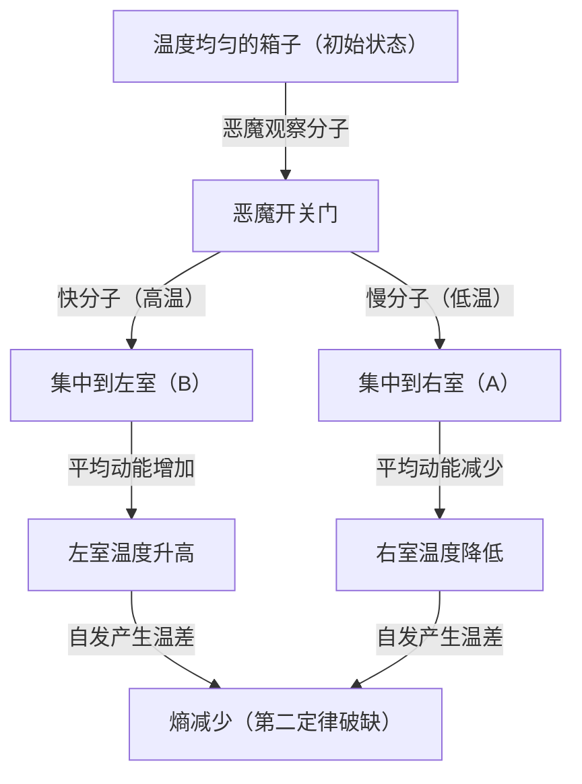
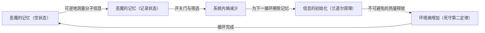

# 引言：本应坚不可摧的绝对法则

在我们生存的这个宇宙中，存在着一些绝对无法违背的法则。其中最著名、也是最深植于我们日常生活的，便是“热力学第二定律”。这个定律也被称为“熵增定律”，用一句话来概括就是“覆水难收”，也就是表达了“有序的事物会随着时间走向无序”这一宇宙悲凉（但绝对）的真理。

如果把一杯热咖啡放在房间里，它最终会冷却到与室温相同的温度。相反，在没有任何干预的情况下，一杯冷咖啡绝对不可能突然沸腾，并导致房间内的空气变冷。如果打开香水瓶，香气会弥漫整个房间，但弥漫在房间里的香气绝对不会自发地回到瓶子里。

这种“不可逆性”正是我们所感受到的“时间之箭”的真面目，也是热力学第二定律在物理学中占据特殊地位的原因。甚至连阿尔伯特·爱因斯坦都对热力学抱有深深的敬意，认为这是唯一永远不会被推翻的终极理论。

然而，19世纪的伟大物理学家詹姆斯·克拉克·麦克斯韦，却向这个绝对的定律发出了一份“挑战书”。这就是物理学史上最著名、令无数历代学者绞尽脑汁的思想实验——“麦克斯韦妖（Maxwell's demon）”。

在本文中，我们将尽可能深入详细地探讨麦克斯韦妖带来了怎样的悖论，物理学家们在长达一个多世纪的时间里是如何与这个恶魔搏斗的，以及最终得出了怎样的结论（信息与热力学的融合）。

---

# 第一章：热力学基础与麦克斯韦妖的诞生

在揭开恶魔的真面目之前，让我们先简单复习一下作为舞台背景的“热力学”。

## 热力学第一定律与第二定律

支配热力学有两大支柱。

1. **热力学第一定律（能量守恒定律）**
   能量可以改变形式，但绝不会凭空产生或消失。热量也是一种能量形式，机械功和热能的总和始终保持恒定。
   
2. **热力学第二定律（熵增定律）**
   在孤立系统（与外界没有能量或物质交换的空间）中，熵（无序的程度或混乱度）总是增加，或者最好情况是保持不变。它绝不会减少。热量总是从高温物体流向低温物体，除非外界做功（输入能量），否则相反的过程是不可能发生的。

第一定律是说“宇宙的预算（能量）是恒定的”，而第二定律是说“这笔预算的用途总是朝着浪费（熵）增加的方向发展”。

## 麦克斯韦的思想实验

1867年，麦克斯韦在给朋友彼得·泰特（Peter Tait）的一封信中，提出了一个巧妙规避第二定律的思想实验。（顺便说一下，“恶魔（demon）”这个称呼并非麦克斯韦本人所取，而是后来由威廉·汤姆孙（开尔文勋爵）命名的。麦克斯韦本人称其为“有限的存在（finite being）”）。

他的思想实验是这样的：

想象一个完全绝热的箱子，与外界没有任何能量交换。这个箱子被中间的隔板分成了“右室（A）”和“左室（B）”两部分。箱子里装有气体，初始状态下两边房间的温度和压力完全相同（热平衡状态）。温度相同意味着气体分子动能的“平均值”是相同的。然而，从微观角度来看，每一个气体分子都在随机飞舞，其中既有运动速度极快（动能大=高温）的分子，也混杂着运动速度较慢（动能小=低温）的分子。

现在，我们在中间的隔板上设置一扇“极小的门”。并安排一个可以控制这扇门开闭的智能生命体，即**“恶魔”**。

恶魔根据以下规则来开关门：
- 发现从右室（A）飞向左室（B）的**“快分子”**时，打开门让其进入B。
- 发现从右室（A）飞向左室（B）的**“慢分子”**时，关上门将其留在A。
- 发现从左室（B）飞向右室（A）的**“慢分子”**时，打开门让其进入A。
- 发现从左室（B）飞向右室（A）的**“快分子”**时，关上门将其留在B。

让我们用图解来说明。

如果恶魔继续这项工作会发生什么呢？
随着时间的推移，左室（B）里全都是“快分子”，而右室（A）里全都是“慢分子”。也就是说，在没有从外界输入能量（做功）的情况下，原本温度相同的两个房间，一个变热了，另一个变冷了。

如果利用这个温差来驱动热机（引擎），就可以向外界输出功。当温度再次变得均匀时，只需让恶魔重新筛选分子即可。这正意味着完成了一种能够源源不断地从热量中提取能量的“第二类永动机”。

尽管没有从外界做功（假设门无摩擦地开闭且质量为零），整个系统的熵却减少了。热力学第二定律被打破了吗？这就是“麦克斯韦妖”的悖论。

---

# 第二章：与悖论的斗争 〜 驱魔的历史

这个思想实验带来的悖论在物理学界引起了巨大的争议。恶魔的行为中，一定有某个地方存在满足热力学第二定律的“被忽略之处”。物理学家们认为，“在恶魔观察和筛选分子的过程中，必定有某个环节导致了熵的增加”。

## 玛丽安·斯莫卢霍夫斯基与莱奥·西拉德（1912年〜1929年）

1912年，波兰物理学家玛丽安·斯莫卢霍夫斯基（Marian Smoluchowski）探讨了不使用作为智能生命体的“恶魔”，而是纯粹通过物理的“自动弹簧门”来进行这种分子筛选的可能性。然而，他证明了这扇门本身也会因为与分子的碰撞而产生热运动（布朗运动），最终导致弹簧装置随机开闭，使得筛选功能失效。

接着在1929年，匈牙利物理学家莱奥·西拉德（Leo Szilard）带来了麦克斯韦妖历史中最重要的突破。他构想了一个只有一个分子的简化模型，被称为“西拉德引擎”，并详细分析了恶魔的工作过程。

西拉德最大的贡献在于，**将“信息的获取（测量）”与“熵”联系了起来**。
西拉德关注恶魔“测量（观察）”分子速度并获取该信息的过程。即使是聪明的恶魔，要了解分子的速度也需要某种相互作用（例如照射光线），他主张在这一测量过程中产生的熵增，必然会超过（或抵消）整个系统熵的减少。这是实质上首次将信息单位“比特”的概念引入热力学的划时代构想。

## 莱昂·布里渊的光散射模型（1950年代）

莱昂·布里渊（Léon Brillouin）进一步将西拉德的构想具体化。他认为，为了让恶魔“看到”分子，必须从外界用光（光子）照射分子，恶魔接收其反射光。

为了在黑暗的箱子中看到分子，必须使用能量高于背景黑体辐射（热辐射）的光子。计算用于这种“照明”的能量消耗和因光子散射而产生的熵增，证明了由于使用光而引起的熵增，必然大于恶魔所获得的信息（通过筛选分子带来的熵减）。

至此，麦克斯韦妖似乎被彻底埋葬了。“因为为了看清分子而照射了光，所以那里增加了熵”——这种解释直观易懂，被写进了许多教科书中。

然而，战斗还没有结束。

## 兰道尔原理：信息的“擦除”才是关键（1961年）

布里渊的解决方案存在漏洞。其前提——“恶魔在测量分子时必然会消耗能量并导致熵增”——实际上是不正确的。

1961年，IBM的研究员罗尔夫·兰道尔（Rolf Landauer），以及后来的查尔斯·本内特（Charles Bennett）等人证明了，物理上可逆的测量（完全不消耗能量获取信息的测量）在理论上是可能的。也就是说，“仅仅记录（测量）信息”是可以通过不增加熵的理论模型来实现的。

这样一来，第二定律岂不是再次被打破了？但是兰道尔在完全不同的地方找到了熵产生的原因。那就是**“信息的擦除”**。

根据兰道尔原理（Landauer's principle），在“记录”或“复制”信息等可逆操作中是不需要能量的，但在“擦除（初始化）”信息的不可逆操作中，必须向环境释放热量，必然导致熵的增加。擦除1比特信息所需的最小能量被证明是 $k_B T \ln 2$ （其中 $k_B$ 是玻尔兹曼常数，$T$ 是绝对温度）。

---

# 第三章：本内特的最终解答与信息热力学的黎明

1982年，查尔斯·本内特运用兰道尔原理，给麦克斯韦妖画上了最终的句号。

本内特的观点是这样的：
恶魔为了筛选分子，必须将分子的速度信息“记忆”在自己的大脑（或内存）中。如前所述，这个测量和记忆的步骤（在理想情况下）可以在不增加熵的情况下进行。然后通过开关门来筛选分子，制造箱子内部的温差，从而减少箱子里的熵。

然而，[恶魔的大脑](/zh-cn/p/biography-john-von-neumann/)（内存容量）是有限的。为了作为永动机持续运转，恶魔必须永远重复这个循环。为了记忆新分子的信息，就必须“擦除（遗忘）”旧信息来腾出内存空间。

而这个“擦除信息”的瞬间，正是热力学进行审判的时刻。根据兰道尔原理，恶魔在擦除信息时会向环境释放热量，从而增加熵。伴随着这种信息擦除的熵增，**将完全抵消甚至超过**恶魔通过筛选分子而减少的箱内熵。

本内特的解答是物理学与信息理论完美融合的瞬间。
**“信息是物理实体（Information is physical）”**
这表明，信息不再仅仅是一个抽象概念，而是必须在物理系统中作为与能量和熵等同的事物来对待。

麦克斯韦在19世纪释放的这只恶魔，在经过了一个多世纪后，终于借助“测量”、“记忆”以及“遗忘”等计算机科学概念被彻底消灭。

---

# 第四章：现代的恶魔们（实验实现与应用）

麦克斯韦妖已经不再局限于“思想实验”。进入21世纪，随着纳米技术和量子信息技术的飞速发展，科学家们已经能够在实验室中真正制造出“人造麦克斯韦妖”，从而验证兰道尔原理和信息热力学定律。

## 实验室里的恶魔

2010年，中央大学的沙川贵大博士（现任东京大学教授）和上田正仁博士推导出了“信息热力学”的广义方程（沙川-上田方程），严格公式化了信息与熵之间的关系。紧随其后，世界各地的实验室利用纳米级粒子或单电子，进行了模拟西拉德引擎和麦克斯韦妖的实验。

通过这些实验，“能够利用信息将热能转化为功”得到了实验验证。当然，如果把处理和擦除信息的总熵产生计算在内，热力学第二定律并没有被打破，但它证明了在微观系统中，确实可以将“信息”当作一种“燃料”来获取动力。

## 生物中的恶魔

有趣的是，在生命系统中存在着许多类似于“麦克斯韦妖”的机制。
例如，在细胞内运输物质的“驱动蛋白（Kinesin）”和“动力蛋白（Dynein）”等马达蛋白。细胞内部由于分子的热运动（布朗运动）而掀起阵阵风暴，但这些马达蛋白以ATP的水解作为能量来源，同时巧妙地利用周围的热涨落（随机运动），产生出向单一方向的有序运动。

这被称为布朗棘轮（Brownian ratchet）机制，是类似于麦克斯韦妖的分子级装置。生命在完全接受麦克斯韦妖所面临的热力学限制的同时，通过巧妙地处理微观信息，维持着一种仿佛在对抗熵增定律的“秩序”。薛定谔在其著作《生命是什么》中所说的“以负熵为食”，正是暗示了信息与热力学之间的联系。

---

# 结论：恶魔带给我们的启示

麦克斯韦妖并没有能够打破热力学第二定律。然而，正是因为这个恶魔的存在，物理学才获得了不可估量的恩惠。

1. **统计力学的确立**: 确立了麦克斯韦和玻尔兹曼所直觉到的观点：“宏观法则（热力学）源于微观粒子的统计行为”。
2. **信息的物理化**: 借助西拉德、兰道尔、本内特等人的努力，“信息”被纳入了物理定律。这揭示了计算机能量消耗的物理极限。
3. **信息热力学的诞生**: 非平衡态统计力学与信息理论的融合，开辟了作为现代纳米技术、量子计算机和生物物理学基础的新领域。

如果麦克斯韦没有想出这个恶魔，物理学和信息科学要如此深度地结合，也许还需要更多的时间。
恶魔向我们展示了宇宙冷酷的事实：“信息不是免费的（Information is not free）”。但同时，它也告诉我们，“通过对信息进行物理上的理解，将会开启通向微观世界的全新大门”。

热力学第二定律至今仍不可动摇地统治着宇宙。然而，它的含义已经在恶魔的引导下，从19世纪的蒸汽机时代，完美地升级到了21世纪的量子信息技术时代。

只要宇宙存在，熵就会继续增加，但在这一过程中，我们如何处理信息，这段探索之旅才刚刚开始。

---

**参考文献及推荐阅读:**
- 莱奥·西拉德 "On the Decrease of Entropy in a Thermodynamic System by the Intervention of Intelligent Beings" (1929)
- 罗尔夫·兰道尔 "Irreversibility and Heat Generation in the Computing Process" (1961)
- 查尔斯·本内特 "The Thermodynamics of Computation—a Review" (1982)
- 马克·梅扎尔（Marc Mézard）、安德烈亚·蒙塔纳里（Andrea Montanari）《信息、物理与计算》（Information, Physics, and Computation）
- 沙川贵大《非平衡统计力学》
