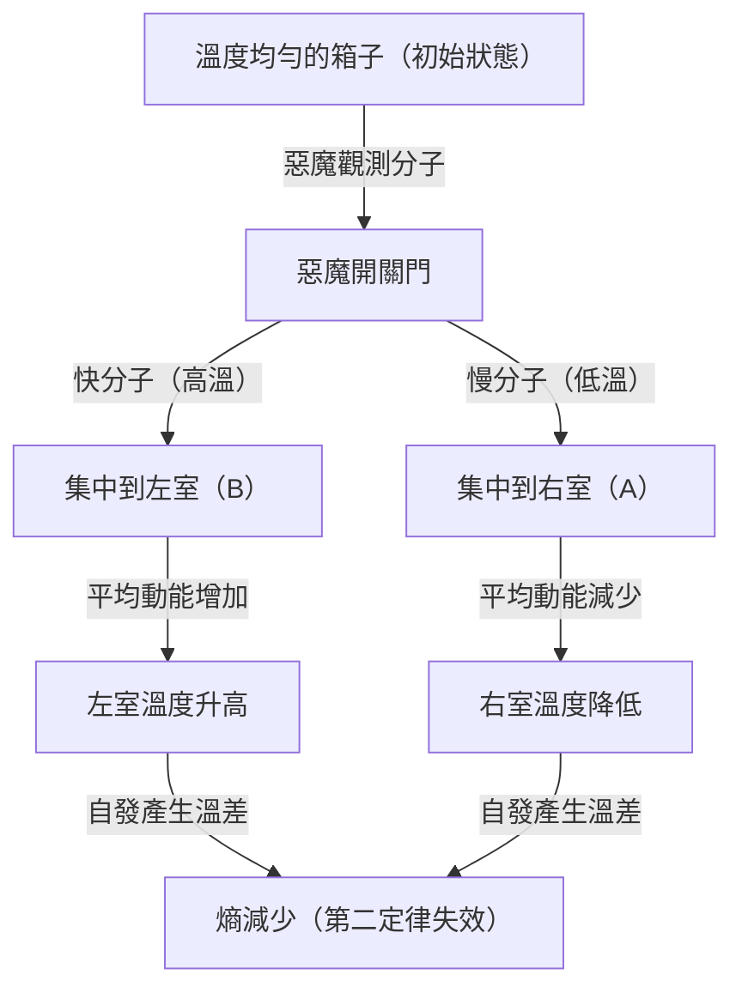
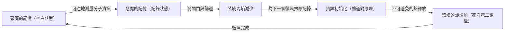

# 緒論：本應堅不可摧的絕對規則

在我們生活的這個宇宙中，存在著一些絕對無法違背的規則。其中最著名、也最深深紮根於我們日常生活中的，便是「熱力學第二定律」。這個定律又被稱為「熵增定律」，簡而言之就是「覆水難收」，代表了「有秩序的事物會隨著時間推移走向無序」這個宇宙悲哀（但絕對）的真理。

如果把熱咖啡放在房間裡，它最終會冷卻到與室溫相同。相反地，在沒有任何外力的情況下，冷咖啡絕對不可能突然沸騰，並使房間的空氣因此變冷。打開香水瓶，香氣會擴散到整個房間，但擴散到房間各處的香氣，也絕對不可能自發地回到瓶子裡。

這種「不可逆性」正是我們所感受到的「時間之箭」的真面目，也是熱力學第二定律在物理學中佔有特殊地位的原因。就連阿爾伯特·愛因斯坦也對此抱有深深的敬意，認為只有熱力學是絕對不會被推翻的終極理論。

然而，19世紀的偉大物理學家詹姆斯·克拉克·馬克士威（James Clerk Maxwell），卻對這條絕對的定律下了一封「挑戰書」。這就是在物理學史上最著名、也讓最多學者感到困擾的思想實驗「馬克士威妖（Maxwell's demon）」。

本文將盡可能深入且詳細地探討，這隻馬克士威妖帶來了什麼樣的悖論，物理學家們又是如何在一個多世紀裡與這隻惡魔抗爭，並最終得出了什麼樣的結論（資訊與熱力學的融合）。

---

# 第1章：熱力學基礎與馬克士威妖的誕生

在揭開惡魔的真面目之前，讓我們先簡單複習一下作為舞台的「熱力學」。

## 熱力學第一定律與第二定律

支配熱力學的兩大支柱如下：

1. **熱力學第一定律（能量守恆定律）**
   這條定律指出，能量雖然會改變形式，但絕不會憑空產生或消失。熱也是能量的一種形式，力學作功與熱能的總和始終保持不變。
   
2. **熱力學第二定律（熵增定律）**
   在孤立系統（不與外界交換能量或物質的空間）中，熵（無序的程度，或混亂度）總是增加，最多也只能保持不變。它絕對不會減少。熱量總是從高溫物體流向低溫物體，除非外界施加功（能量），否則相反的過程不可能發生。

第一定律告訴我們「宇宙的預算（能量）是固定的」，而第二定律則說「這些預算的用途總是朝著增加浪費（熵）的方向發展」。

## 馬克士威的思想實驗

1867年，馬克士威在寫給朋友彼得·泰特（Peter Tait）的信中，提出了一個巧妙迴避第二定律的思想實驗。（順帶一提，「惡魔（demon）」這個稱呼並不是馬克士威自己起的，而是後來威廉·湯姆森（克耳文男爵）所命名的。馬克士威自己稱之為「有限的存在（finite being）」）。

他的思想實驗如下：

請想像一個完全絕熱、且與外界沒有任何能量交換的箱子。這個箱子被中間的隔板分成了「右室（A）」和「左室（B）」兩部分。箱子裡裝有氣體，在初始狀態下，兩室的溫度和壓力完全相同（熱平衡狀態）。溫度相同意味著氣體分子動能的「平均值」是相同的。然而，從微觀的角度來看，每一個氣體分子都在隨機飛竄，其中既有移動非常快（動能大＝高溫）的分子，也有移動緩慢（動能小＝低溫）的分子混合在其中。

現在，我們在中間的隔板上設置一扇「極小的門」。然後，配置一個可以控制這扇門開關的智慧生命體，也就是<strong>「惡魔」</strong>。

惡魔會根據以下規則來開關門：
- 看到從右室（A）飛向左室（B）的<strong>「快分子」</strong>時，打開門讓它進入B。
- 看到從右室（A）飛向左室（B）的<strong>「慢分子」</strong>時，關上門把它留在A。
- 看到從左室（B）飛向右室（A）的<strong>「慢分子」</strong>時，打開門讓它進入A。
- 看到從左室（B）飛向右室（A）的<strong>「快分子」</strong>時，關上門把它留在B。

讓我們用圖解來說明這一點。

如果惡魔繼續這項工作會發生什麼事呢？
隨著時間推移，左室（B）將只聚集「快分子」，而右室（A）將只聚集「慢分子」。也就是說，原本溫度相同的兩室，在沒有外界施加能量（功）的情況下，變成了一間變熱，另一間變冷。

如果利用這個溫差來推動熱機（引擎），就可以向外界輸出功。當溫度再次變得均勻時，只要讓惡魔重新篩選分子即可。這意味著「第二類永動機」的完成，能夠無限地從熱中提取能量。

儘管外界沒有作功（假設門的開關沒有摩擦力，且質量為零），整個系統的熵卻減少了。熱力學第二定律失效了嗎？這就是「馬克士威妖」的悖論。

---

# 第2章：與悖論的抗爭 〜 驅魔的歷史

這個思想實驗所帶來的悖論，在物理學界引發了巨大的爭論。惡魔的行為中，一定存在著某種為了滿足熱力學第二定律的「疏漏」。物理學家們認為，「在惡魔觀測和篩選分子的過程中，某個環節必然會導致熵的增加」。

## 馬里安·斯莫盧霍夫斯基與萊奧·西拉德（1912年〜1929年）

1912年，波蘭物理學家馬里安·斯莫盧霍夫斯基（Marian Smoluchowski）探討了是否可以不依賴作為智慧生命體的「惡魔」，而是純粹透過物理上的「自動彈簧門」來實現分子的篩選。然而他證明，門本身也會因為與分子的碰撞而產生熱運動（布朗運動），最終導致彈簧裝置隨機開關，從而失去篩選的功能。

到了1929年，匈牙利物理學家萊奧·西拉德（Leo Szilard）帶來了馬克士威妖歷史上最重要的突破。他構想出了一個被稱為「西拉德引擎」的簡化模型（只有一個分子），並對惡魔的過程進行了詳細的分析。

西拉德最大的貢獻在於，**將「獲取資訊（測量）」與「熵」聯繫了起來**。
西拉德注意到惡魔為了得知分子速度而進行「測量（觀測）」並獲取資訊的過程。他主張，即使是充滿智慧的惡魔，要得知分子的速度，也需要某種相互作用（例如照射光線），而在這個測量過程中產生的熵增，必然會超過（或抵消）整個系統的熵減。這項將資訊單位「位元」實質上首次引入熱力學的創新想法具有劃時代的意義。

## 萊昂·布里淵的光散射模型（1950年代）

將西拉德的想法進一步具體化的是萊昂·布里淵（Léon Brillouin）。他認為，為了讓惡魔「看見」分子，必須從外界將光（光子）照射到分子上，並讓惡魔接收其反射光。

要在黑暗的箱子裡看到分子，必須使用能量高於背景黑體輻射（熱輻射）的光子。計算這種「照明」所需的能量消耗以及光子散射所產生的熵增後，證明了使用光所產生的熵增，必然會大於惡魔獲得資訊（透過篩選分子而減少的熵）。

至此，馬克士威妖似乎已被徹底消滅。「為了看見分子而照射光線，這就是熵增加的原因」這種解釋既直觀又易懂，並被寫入了許多教科書中。

然而，戰鬥還沒有結束。

## 蘭道爾原理：「抹除」資訊才是關鍵（1961年）

布里淵的解決方案存在漏洞。「惡魔在測量分子時必然會消耗能量並增加熵」這個前提其實並不正確。

1961年，IBM的研究員羅夫·蘭道爾（Rolf Landauer），以及後來的查爾斯·本內特（Charles Bennett）等人證明，物理上可逆的測量（完全不消耗能量就能獲取資訊的測量）在理論上是可能的。換句話說，如果只是「記錄（測量）資訊」，理論上存在不增加熵就能執行的模型。

這樣一來，第二定律又再次被打破了。不過，蘭道爾在完全不同的地方找到了產生熵的根源，那就是<strong>「資訊的抹除」</strong>。

根據蘭道爾原理（Landauer's principle），在「記錄」或「複製」資訊等可逆操作中不需要能量，但在<strong>「抹除（初始化）」</strong>資訊這種不可逆操作中，必須向環境釋放熱量，從而必然導致熵的增加。抹除1位元資訊所需的最小能量被證明為 $k_B T \ln 2$ （$k_B$為波茲曼常數，$T$為絕對溫度）。

---

# 第3章：本內特的最終解答與資訊熱力學的黎明

1982年，查爾斯·本內特運用蘭道爾原理，給予了馬克士威妖最後的致命一擊。

本內特的觀點如下：
為了篩選分子，惡魔必須將分子速度的資訊「記憶」在自己的大腦（或記憶體）中。如前所述，這個測量和記憶的步驟（在理想狀態下）可以在不增加熵的情況下進行。接著，透過開關門來篩選分子，在箱內製造出溫差，從而減少了箱內的熵。

然而，[惡魔的大腦](/zh-tw/p/biography-john-von-neumann/)（記憶體容量）是有限的。為了讓系統作為永動機運作，惡魔必須永遠重複這個循環。為了記憶新分子的資訊，惡魔必須<strong>「抹除（遺忘）」</strong>舊資訊，以騰出記憶體空間。

而這個「抹除資訊」的瞬間，正是熱力學進行審判的時刻。根據蘭道爾原理，在抹除資訊時，惡魔必須向環境釋放熱量，導致熵增加。伴隨這項資訊抹除而增加的熵，將會**完全抵消，甚至超過**惡魔因篩選分子而減少的箱內熵。

本內特的解答，是物理學與資訊理論完美融合的瞬間。
**「資訊具有物理實體（Information is physical）」**
這顯示了資訊不僅僅是一個抽象的概念，在物理系統中，它必須被視為與能量和熵等價的事物。

馬克士威在19世紀放出的這隻惡魔，在經歷了一個多世紀後，終於藉由引入「測量」、「記憶」以及「遺忘」這些計算機科學的概念而被消滅。

---

# 第4章：現代的惡魔（實驗實現與應用）

馬克士威妖如今不再僅限於「思想實驗」。進入21世紀後，隨著奈米科技和量子資訊技術的飛躍性進展，科學家們已經能夠在實驗室中實際創造出「人造的馬克士威妖」，並驗證蘭道爾原理和資訊熱力學的定律。

## 實驗室裡的惡魔

2010年，中央大學的沙川貴大博士（現任東京大學教授）與上田正仁博士，推導出了「資訊熱力學」的廣義方程式（沙川-上田方程式），嚴格地公式化了資訊與熵之間的關係。隨後，世界各地的實驗室利用奈米尺度的粒子或單電子，進行了模擬西拉德引擎和馬克士威妖的實驗。

這些實驗在實驗上證明了「可以利用資訊將熱能轉化為功」。當然，如果把處理和抹除資訊所產生的總熵增計算在內，熱力學第二定律依然沒有被打破，但在微觀系統中，已經證實了可以將「資訊」作為一種「燃料」來獲取動力。

## 生物體內的惡魔

有趣的是，在生命系統中，存在著許多與「馬克士威妖」非常相似的機制。
例如，在細胞內運輸物質的「驅動蛋白（Kinesin）」和「動力蛋白（Dynein）」等馬達蛋白。儘管細胞內充滿了分子熱運動（布朗運動）所帶來的混亂風暴，但這些馬達蛋白卻能以ATP的水解作為能量來源，同時巧妙地利用周圍的熱漲落（隨機運動），產生朝向單一方向的有序運動。

這被稱為布朗棘輪（Brownian ratchet）機制，是類似於馬克士威妖的分子層級裝置。生命在完全接受馬克士威妖所面臨的熱力學限制的同時，透過巧妙地處理微觀資訊，維持了某種抵抗熵增定律的「秩序」。薛丁格在其著作《生命是什麼》中所說的「以負熵為食而生」，正是暗示了資訊與熱力學之間的連結。

---

# 結論：惡魔告訴我們的事

馬克士威妖最終無法打破熱力學第二定律。然而，正因為這隻惡魔的存在，物理學獲得了無可估量的恩惠。

1. **統計力學的確立**：確立了馬克士威和波茲曼所直覺認識到的觀點，即「巨觀的定律（熱力學）源自於微觀粒子的統計行為」。
2. **資訊的物理化**：透過西拉德、蘭道爾、本內特等人，將「資訊」納入了物理定律中。這揭示了計算機能量消耗的物理極限。
3. **資訊熱力學的誕生**：非平衡態統計力學與資訊理論相融合，開闢了成為現代奈米科技、量子電腦和生物物理學基礎的新領域。

如果馬克士威沒有想出這隻惡魔，物理學和資訊科學要如此深度地結合，可能還需要花費更多的時間。
這隻惡魔向我們揭示了「資訊不是免費的（Information is not free）」這個宇宙冷酷的事實。但同時，它也告訴我們，「透過從物理上理解資訊，將能開啟通往微觀世界的嶄新大門」。

熱力學第二定律至今依然堅定不移地支配著宇宙。但在惡魔的引導下，這個定律的內涵已經從19世紀的蒸汽機時代，出色地升級到了21世紀的量子資訊技術時代。

只要宇宙存在，熵就會繼續增加，但在這個過程中，我們應當如何處理資訊？這趟探索之旅才剛剛開始。

---

**參考文獻及推薦書籍：**
- 萊奧·西拉德 "On the Decrease of Entropy in a Thermodynamic System by the Intervention of Intelligent Beings" (1929)
- 羅夫·蘭道爾 "Irreversibility and Heat Generation in the Computing Process" (1961)
- 查爾斯·本內特 "The Thermodynamics of Computation—a Review" (1982)
- 馬克·梅薩爾、安德烈亞·蒙塔納里《資訊、物理與學習》
- 沙川貴大《非平衡統計力學》
