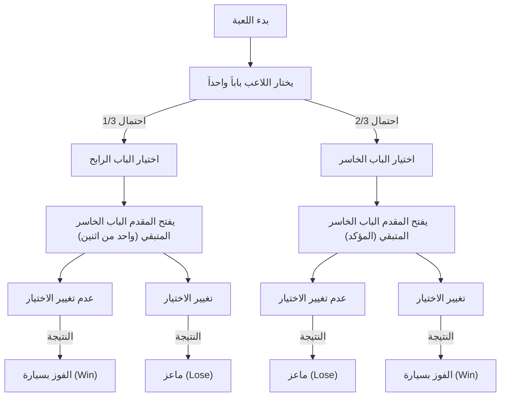
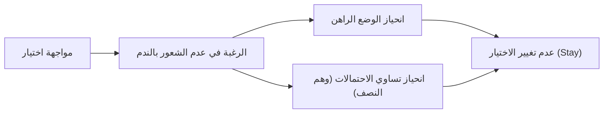

# مقدمة: فخ الحدس البشري وعالم الاحتمالات

في حياتنا اليومية، يعمل "الحدس" كأداة قوية جداً لاتخاذ القرارات. إن القدرة على الحكم الفوري على المواقف واختيار الإجراءات بناءً على القواعد التجريبية والاستدلال هي هبة تطورية اكتسبتها البشرية للبقاء في البيئات الطبيعية القاسية. ومع ذلك، فإن هذا النظام الحدسي الممتاز لديه نقطة ضعف تتمثل في التسبب في أخطاء فادحة في ظل ظروف معينة. والمثال الأبرز على ذلك هو عندما نواجه مشاكل تتعلق بـ "الاحتمالات".

نظرية الاحتمالات هي إطار رياضي للتقييم الكمي للأحداث غير المؤكدة، لكن استنتاجاتها غالباً ما تتعارض بشدة مع حدسنا. تمت دراسة هذه الظاهرة لفترة طويلة في مجالات علم النفس، والاقتصاد السلوكي، وتعليم الرياضيات باعتبارها "انحيازاً معرفياً" أو "انفصالاً بين الحدس والمنطق".

في هذا المقال، سنتناول المفارقة الأكثر شهرة التي ترمز إلى هذا التباعد بين الحدس والاحتمال، وهي "مفارقة مونتي هول" (Monty Hall problem). أثارت هذه المشكلة، على الرغم من بساطتها الظاهرية، جدلاً واسعاً شارك فيه علماء رياضيات وعلماء مشهورون حول العالم. من خلال السؤال "لماذا نقع في فخ احتمالي بسيط كهذا؟"، سنستكشف بعمق وبشكل شامل حدود البنية المعرفية البشرية وأهمية التفكير المنطقي.

## الفصل الأول: ما هي مفارقة مونتي هول؟

مفارقة مونتي هول هي مفارقة احتمالية سميت على اسم مونتي هول (Monty Hall)، مقدم البرنامج التلفزيوني الأمريكي الطويل "Let's Make a Deal". أصبحت هذه المشكلة معروفة على نطاق واسع في عام 1990 عندما تم تناولها في عمود "اسأل مارلين" (Ask Marilyn) في مجلة الأخبار "Parade".

### إعداد المشكلة

تخيل أنك متسابق في برنامج ألعاب تلفزيوني. أمامك ثلاثة أبواب مغلقة (الباب أ، الباب ب، الباب ج).

1. خلف أحد الأبواب توجد "سيارة جديدة (جائزة)".
2. خلف البابين الآخرين يوجد "ماعز (خسارة)".
3. إذا خمنت الباب الذي توجد خلفه السيارة الجديدة، يمكنك الحصول عليها.

قواعد وسير اللعبة هي كما يلي:

1. أولاً، تختار واحداً من الأبواب الثلاثة (على سبيل المثال، لنفترض أنك اخترت **الباب أ**).
2. مونتي، مقدم البرنامج، يعرف خلف أي باب توجد السيارة الجديدة.
3. يفتح مونتي **دائماً باباً واحداً يوجد خلفه ماعز** من بين البابين اللذين لم تخترهما (الباب ب والباب ج). (على سبيل المثال، إذا كان هناك ماعز خلف الباب ب، فإنه يفتح الباب ب).
4. ثم يسألك مونتي:
   **"يمكنك التبديل إلى الباب ج. هل تريد تغيير اختيارك؟"**

الآن، إليك السؤال.
**هل يجب عليك تغيير اختيارك؟ أم يجب عليك الاحتفاظ باختيارك الأول (الباب أ)؟ أيهما لديه احتمال أعلى للفوز بالسيارة الجديدة؟**

### الإجابة البديهية

عندما يُطرح هذا السؤال على العديد من الأشخاص، فإنهم يستنتجون ما يلي:

"هناك 3 أبواب، وتم فتح واحد (باب الماعز). لم يتبق سوى الباب الذي اخترته (الباب أ) والباب الآخر المغلق (الباب ج). يجب أن تكون السيارة الجديدة خلف أحدهما، لذا يجب أن يكون الاحتمال 50% (1/2) لكل منهما. لذلك، سواء غيرت اختيارك أم لا، فإن فرصة الفوز هي نفسها، ولا داعي لتغييره."

هذه الإجابة البديهية مقنعة للغاية، والأغلبية الساحقة من الناس (حوالي 85% أو أكثر وفقاً لبعض الاستطلاعات) يجيبون بأن "الاحتمال لا يتغير حتى لو قمت بتغيير اختيارك (1/2)".

ومع ذلك، **الإجابة الرياضية الصحيحة هي "يجب عليك تغيير اختيارك"**. إذا قمت بتغيير اختيارك، فإن احتمال الفوز بالسيارة الجديدة يقفز إلى **2/3 (حوالي 66.7%)**، وهو ضعف احتمال **1/3 (حوالي 33.3%)** إذا احتفظت باختيارك الأول.

عندما تم تقديم هذه الإجابة من قبل مارلين فوس سافانت (امرأة كانت مسجلة في موسوعة غينيس للأرقام القياسية في ذلك الوقت كصاحبة أعلى معدل ذكاء في العالم)، غمرتها حوالي 10,000 رسالة اعتراض من جميع أنحاء الولايات المتحدة. تضمنت حوالي 1,000 رسالة من علماء رياضيات وعلماء يحملون درجات الدكتوراه، ووجهت إليها انتقادات لاذعة مثل "أنت لا تفهمين الرياضيات على الإطلاق" و "هذا وهم غير منطقي لامرأة".

لماذا أخطأ كل هؤلاء المثقفين؟ في الفصل التالي، سنكشف عن الإثبات الرياضي.

## الفصل الثاني: حقيقة الاحتمالات والإثبات الرياضي

لماذا يصبح الاحتمال الذي يبدو "1/2" حدسياً، "2/3 إذا قمت بتغيير اختيارك"؟ لفهم هذا، نحتاج إلى إعادة النظر في المشكلة من عدة زوايا مختلفة.

### نهج الإثبات 1: سرد جميع الأنماط (تفكير المخطط الشجري)

الطريقة الأكثر تأكيداً ووضوحاً هي سرد جميع الأنماط المحتملة وحساب الاحتمالات.
نظراً لأن الباب الذي توجد خلفه السيارة الجديدة يتم تحديده عشوائياً، فإن الحالات الثلاث التالية تحدث باحتمال 1/3 لكل منها.

- الحالة 1: السيارة الجديدة خلف "الباب أ"
- الحالة 2: السيارة الجديدة خلف "الباب ب"
- الحالة 3: السيارة الجديدة خلف "الباب ج"

بافتراض أنك اخترت **الباب أ** أولاً، دعنا نلقي نظرة على نتائج "إذا احتفظت باختيارك" و "إذا قمت بتغيير اختيارك" في كل حالة.

| الحالة | موقع السيارة | اختيارك | الباب الذي يفتحه المقدم | إذا احتفظت باختيارك | إذا قمت بتغيير اختيارك |
|---|---|---|---|---|---|
| 1 (1/3) | الباب أ | الباب أ | ب أو ج (ماعز) | **الفوز بسيارة** (Win) | ماعز (Lose) |
| 2 (1/3) | الباب ب | الباب أ | الباب ج (ماعز) | ماعز (Lose) | **الفوز بسيارة** (Win) |
| 3 (1/3) | الباب ج | الباب أ | الباب ب (ماعز) | ماعز (Lose) | **الفوز بسيارة** (Win) |

كما هو واضح من هذا الجدول، الحالة 1 فقط (احتمال 1/3) يمكنك الفوز بالسيارة الجديدة "إذا احتفظت باختيارك". من ناحية أخرى، يمكنك الفوز بالسيارة الجديدة في الحالتين 2 و 3 "إذا قمت بتغيير اختيارك"، ويكون الاحتمال الإجمالي 2/3.
بمعنى آخر، إنها ليست سوى مقارنة بين **"احتمال اختيار الإجابة الصحيحة من البداية (1/3)"** و **"احتمال اختيار الخسارة في البداية (2/3)"**. نظراً لأن المقدم يزيل إحدى الخسارات، فإن البنية تجعل سوء الحظ المتمثل في "اختيار الخسارة في البداية" ينعكس إلى حسن حظ "يتحول دائماً إلى فوز" عن طريق تغيير اختيارك.

### نهج الإثبات 2: نظرية المعلومات والنموذج المتطرف

عندما يعترض الحدس في حالة الأبواب الثلاثة، يصبح من الأسهل الفهم إذا قمنا بزيادة عدد الأبواب بشكل متطرف.

تخيل أن "هناك مليون باب".
1. تختار باباً واحداً (الباب رقم 1). في هذه المرحلة، فرصة الفوز هي 1/1,000,000.
2. مونتي، المقدم، يعرف الإجابة. من بين الـ 999,999 باباً المتبقية، يفتح جميع الأبواب الـ 999,998 التي خلفها ماعز.
3. الأبواب المغلقة الوحيدة هي "الباب 1" الذي اخترته و "الباب 777,777" الذي تركه مونتي مغلقاً.

في هذه الحالة، ماذا تعتقد؟
من الواضح أيهما أعلى: "احتمال أن يكون الباب 1 الذي اخترته أولاً هو الإجابة الصحيحة بالصدفة (1/1,000,000)" أو "احتمال أنك أخطأت، وتجنب مونتي عن قصد الباب 777,777 الذي هو الإجابة الصحيحة وفتح الباقي (999,999/1,000,000)".
بالطبع، ستقوم بالتغيير إلى الباب 777,777. حتى في حالة الأبواب الثلاثة، فإن البنية الرياضية الأساسية هي نفسها تماماً.

### نهج الإثبات 3: مخطط انتقال الحالة باستخدام Mermaid

لتعميق فهمنا بصرياً، دعنا نمثل تقدم اللعبة في مخطط انسيابي.

من هذا المخطط، يمكننا أن نرى أنه **إذا اتخذت إجراء "تغيير اختيارك" من حالة "اختيار الباب الخاسر أولاً (احتمال 2/3)"، فستصل إلى "الفوز بسيارة" باحتمال 100%**. على العكس من ذلك، إذا قمت بتغيير اختيارك من حالة اختيار الباب الرابح أولاً (احتمال 1/3)، فسوف تسحب ماعزاً بالتأكيد.
لذلك، فإن نسبة الفوز المتوقعة لاستراتيجية تغيير اختيارك هي 2/3 × 100% = 2/3.

## الفصل الثالث: الحل الدقيق وفقاً لمبرهنة بايز

يمكن حل مفارقة مونتي هول بدقة رياضية أكبر باستخدام "مبرهنة بايز" (Bayes' theorem) لحساب الاحتمال الشرطي. الاستدلال البايزي هو أداة قوية توضح كيف ينبغي تحديث الاحتمال المسبق (prior probability) عندما تتوفر معلومات (أدلة) جديدة (posterior probability).

دعونا نحدد الأحداث على النحو التالي:
- $C_i$ : حدث وجود السيارة الجديدة خلف الباب $i$ (حيث $i \in \{A, B, C\}$)
- $M_j$ : حدث فتح مونتي للباب $j$ (حيث $j \in \{A, B, C\}$)

نفترض أن اللاعب اختار "الباب أ" أولاً.
الاحتمالات المسبقة متساوية حيث لا توجد معلومات حول أي باب توجد خلفه السيارة:
$P(C_A) = 1/3$
$P(C_B) = 1/3$
$P(C_C) = 1/3$

الآن، افترض أن مونتي فتح "الباب ب". بعد الحصول على هذه المعلومة، سنحسب احتمال وجود السيارة الجديدة خلف الباب أ (الاحتمال البعدي $P(C_A|M_B)$) واحتمال وجودها خلف الباب ج (الاحتمال البعدي $P(C_C|M_B)$).

قواعد سلوك مونتي (الاحتمال الشرطي $P(M_B|C_i)$) هي كما يلي:
1. إذا كانت السيارة الجديدة خلف الباب أ ($C_A$)، فإن مونتي سيفتح إما ب أو ج بشكل عشوائي، لذا $P(M_B|C_A) = 1/2$
2. إذا كانت السيارة الجديدة خلف الباب ب ($C_B$)، فلا يمكن لمونتي فتح ب أبداً، لذا $P(M_B|C_B) = 0$
3. إذا كانت السيارة الجديدة خلف الباب ج ($C_C$)، فلا يمكن لمونتي فتح ج، ولا يمكنه فتح أ لأن اللاعب اختاره. لذلك، يُجبر على فتح ب، مما يجعل $P(M_B|C_C) = 1$

صيغة مبرهنة بايز هي كالتالي:
$P(C_i|M_B) = \frac{P(M_B|C_i) P(C_i)}{P(M_B)}$

سنقوم بحساب المقام $P(M_B)$ (الاحتمال الكلي لفتح مونتي للباب ب) (قانون الاحتمال الكلي).
$P(M_B) = P(M_B|C_A)P(C_A) + P(M_B|C_B)P(C_B) + P(M_B|C_C)P(C_C)$
$P(M_B) = (1/2 \times 1/3) + (0 \times 1/3) + (1 \times 1/3) = 1/6 + 0 + 1/3 = 1/2$

الآن، دعنا نحسب الاحتمالات البعدية.

**احتمال وجود السيارة الجديدة خلف الباب أ (الاحتفاظ بالاختيار):**
$P(C_A|M_B) = \frac{P(M_B|C_A) P(C_A)}{P(M_B)} = \frac{(1/2) \times (1/3)}{1/2} = 1/3$

**احتمال وجود السيارة الجديدة خلف الباب ج (تغيير الاختيار):**
$P(C_C|M_B) = \frac{P(M_B|C_C) P(C_C)}{P(M_B)} = \frac{1 \times (1/3)}{1/2} = 2/3$

بهذه الطريقة، باستخدام مبرهنة بايز، يتم إثبات رياضياً وبشكل مثالي أن الاحتمال يتم تحديثه بالمعلومات الجديدة (أن مونتي فتح الباب ب)، ويقفز احتمال الباب ج إلى 2/3.

## الفصل الرابع: لماذا يخطئ الحدس البشري؟ (العوامل النفسية والمعرفية)

بغض النظر عن عدد المرات التي يُعرض فيها الإثبات الرياضي، يشعر الكثير من الناس بـ "ما زلت غير مقتنع" أو "أشعر وكأنني خُدعت". لماذا الدماغ البشري ضعيف جداً أمام هذه المشكلة؟ كشفت الأبحاث في علم النفس والاقتصاد السلوكي أن العديد من التحيزات المعرفية العميقة متورطة.

### 1. انحياز تساوي الاحتمالات (Equiprobability Bias)

يميل البشر بشدة وبشكل لا شعوري إلى افتراض أنه "في الأحداث العشوائية أو المواقف غير المؤكدة، إذا كانت هناك خيارات متاحة متبقية، فيجب أن تكون احتمالاتها جميعاً متساوية".
في مفارقة مونتي هول، يتبقى في النهاية خياران: "الباب أ" و "الباب ج". في اللحظة التي يتم فيها إدخال هذه المعلومات البصرية والظرفية حول "خيارين" إلى الدماغ، يتم تنشيط قاعدة استدلال قوية تفيد بأن "نظراً لوجود خيارين، يجب أن يكون الاحتمال 1/2 لكل منهما".
أدمغتنا تفصل وتتجاهل "المعلومات غير المتماثلة" عن السياق التاريخي الماضي (حقيقة أنه كان هناك 3 أبواب في البداية وأن مونتي فتح خياراً خاسراً عن قصد) عن "الوضع الحالي".

### 2. سوء فهم العلاقة السببية و "النية"

نحن نحاول فهم السبب والنتيجة للأشياء بشكل خطي.
وهذا يشبه "مغالطة المقامر" (Gambler's fallacy)، حيث يفكر المرء "بما أن اللون الأحمر ظهر 5 مرات متتالية في لعبة الروليت، يجب أن يظهر الأسود قريباً"، ولكن في مفارقة مونتي هول، نحن نقلل من أهمية "تحديث المعلومات".

النقطة المهمة هي أن **"مونتي، المقدم، لا يفتح الأبواب بشكل عشوائي"**.
إذا فتح المقدم باباً عشوائياً دون معرفة أي شيء، وصادف أنه "كان ماعزاً"، فإن احتمال الأبواب المتبقية سيكون في الواقع 1/2 (وهذا ما يسمى "مشكلة المقدم الجاهل").
ومع ذلك، لدى مونتي قيد (نية) قوية بأنه "يجب أن يفتح باب ماعز". الحدس البشري لا يمكنه معالجة "عدم تماثل المعلومات بسبب هذا الاختيار المتعمد" بشكل صحيح، ويركز فقط على الحقيقة المادية المتمثلة في "نقصان باب واحد فقط".

### 3. انحياز الوضع الراهن (Status Quo Bias) وتجنب الندم

من منظور الاقتصاد السلوكي، فإن "انحياز الوضع الراهن" له تأثير كبير.
البشر مخلوقات تشعر بأن الضرر النفسي الناجم عن الندم عند اتخاذ إجراء والفشل (خطأ الارتكاب) أكبر من الندم عند الفشل دون اتخاذ إجراء (خطأ الإغفال).

تخيل "ماذا لو غيرت اختيارك وكان الباب الأول هو الإجابة الصحيحة". ستعاني من ندم شديد، "ليتني لم أغيره!". من ناحية أخرى، في حالة "إذا لم أغير اختياري وخسرت"، يكون من الأسهل الاستسلام لفكرة "حسناً، لا بأس، لقد كان حظي سيئاً".
بهذه الطريقة، تعمل آلية الدفاع العاطفي المتمثلة في "الرغبة في تقليل الندم"، مما يخلق تشويهاً معرفياً بأن "الأمر سيان سواء قمت بالتغيير أم لا (أو هكذا أود أن أعتقد)"، وفي النهاية يجعلنا نختار "الحفاظ على الوضع الراهن (Stay)".

## الفصل الخامس: دروس المفارقة في الحياة اليومية

مفارقة مونتي هول لا تقتصر على كونها مجرد لغز رياضي أو اختبار. الدروس التي تعلمنا إياها هذه المفارقة لها قيمة عالمية يمكن تطبيقها في مجالات مختلفة مثل حياتنا اليومية، والأعمال التجارية، والطب، وتطوير الذكاء الاصطناعي.

### الصراع بين البيانات والحدس (مشكلة الإيجابيات الكاذبة في الطب)

إن تفسير "دقة الاختبار" في المجال الطبي هو أيضاً مثال نموذجي على التباعد بين الحدس واحتمال بايز.
على سبيل المثال، لنفترض أن هناك "مرضاً مستعصياً يصيب 1 من كل 10,000 شخص"، وأن دقة الاختبار الخاص به هي "99% (يحدد الإيجابيين بشكل صحيح كإيجابيين بنسبة 99%، ويحدد السلبيين بشكل صحيح كسلبيين بنسبة 99%)".
إذا أجريت هذا الاختبار وكانت النتيجة "إيجابية"، فما هو احتمال أنك مصاب فعلاً بهذا المرض المستعصي؟

حدسياً، قد تشعر باليأس مفكراً، "بما أن الدقة 99%، فإن احتمال أن أكون مريضاً هو 99% أيضاً".
ومع ذلك، إذا قمنا بالحساب باستخدام مبرهنة بايز، فإن الاحتمال الفعلي للإصابة هو **أقل بقليل من 1% (حوالي 0.98%)**. وذلك لأن 1% (حوالي 100 شخص) من الأغلبية الساحقة لـ "الأشخاص الأصحاء (9,999 شخصاً)" ستكون نتائجهم "إيجابية كاذبة"، لذلك من بين مجموعة الأشخاص الذين ثبتت إصابتهم، يكون المرضى الحقيقيون (شخص واحد تقريباً) أقلية صغيرة جداً.

وبهذه الطريقة، فإن التباعد الهائل بين التقييم الاحتمالي البديهي (99%) والحقيقة الرياضية (1%) يحمل خطر التسبب في ذعر غير ضروري وقرارات طبية خاطئة. فهم مفارقة مونتي هول هو الخطوة الأولى في اكتساب الثقافة لتقييم "عدم تماثل المعلومات والاحتمالات المسبقة" بشكل صحيح.

### قيمة المعلومات في استراتيجية الأعمال

في مجال الأعمال التجارية، فإن تحركات المنافسين وردود فعل السوق تتوافق تماماً مع "الباب الذي فتحه مونتي".
لنفترض أن شركتك اختارت استراتيجية معينة (الباب أ). بعد ذلك، تأتي معلومات جديدة حول تغييرات في بيئة السوق أو فشل المنافسين (انفتاح الباب الخاسر).
في هذه المرحلة، هل يجب عليك "التمسك بالاستراتيجية الأصلية بعناد (انحياز الوضع الراهن)"، أم "تقييم المعلومات الجديدة وفقاً لمبرهنة بايز وتحويل استراتيجيتك (تغيير الاختيار)"؟ يمكن تفسير هذا كدرس بأن الشركات التي يمكنها تغيير استراتيجياتها بمرونة لديها فرصة أكبر للنجاح (2/3) على المدى الطويل. من المهم دائماً اتخاذ القرارات بناءً على "الاحتمال البعدي" دون التقيد بالتكاليف الغارقة (sunk costs).

## الخاتمة: الذكاء هو الشجاعة لـ "الشك في الحدس"

السبب في أن مفارقة مونتي هول رائعة ومخيفة في نفس الوقت هو أنها تسلط الضوء ببراعة على "حدود الذكاء البشري". حتى الخبراء الحاصلون على درجة الدكتوراه انخدعوا بحدسهم الأول وتمردوا عاطفياً ضد الدليل الصحيح.

نحن نعيش بالاعتماد على السلاح القوي "الحدس" الذي اكتسبناه في عملية التطور. ومع ذلك، في المجتمع الحديث المعقد والمليء بالبيانات، يجب أن ندرك أن حدسنا يمكن أن يوقعنا في الفخ أحياناً.

تنقل لنا مفارقة مونتي هول رسالة واحدة مهمة.
وهي **"أهمية عدم الإيمان الأعمى بحدسك، والتوقف وإعادة التفكير باستخدام أدوات المنطق والرياضيات"**. لكي نتقبل حقيقة تتعارض مع الحدس للوهلة الأولى، نحتاج إلى تواضع فكري وشجاعة لتحديث افتراضاتنا.

في المرة القادمة التي تواجه فيها خياراً مهماً في حياتك وتحصل على معلومات جديدة (باب مفتوح)، يرجى تذكر مفارقة مونتي هول هذه. هل تغير الاحتمال بناءً على تلك المعلومات؟ هل أنت أسير لانحياز الوضع الراهن؟
إن القرار المستمد منطقياً بـ "تغيير الاختيار" قد يجلب لك سيارة جديدة أمام عينيك.
