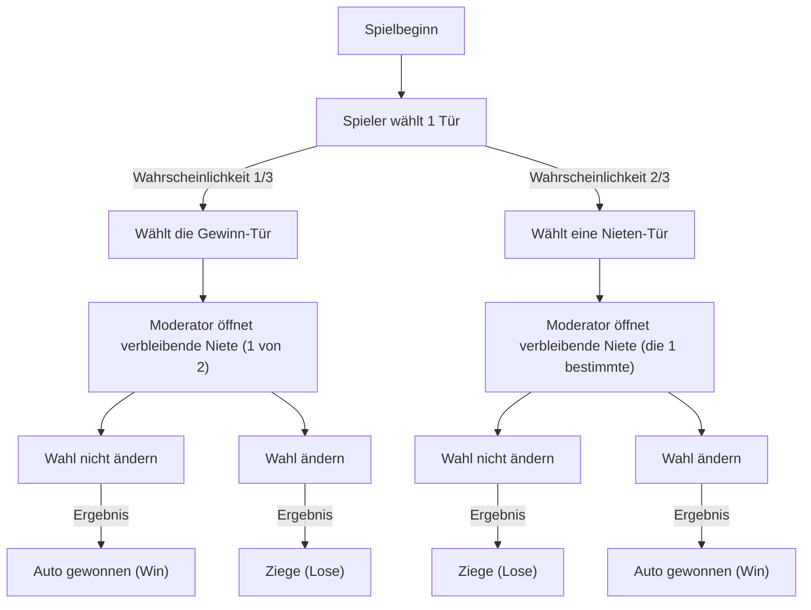
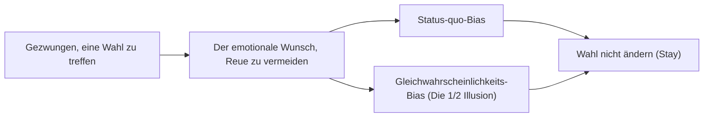

# Einführung: Die Falle der menschlichen Intuition und die Welt der Wahrscheinlichkeit

In unserem täglichen Leben fungiert die "Intuition" als ein sehr mächtiges Werkzeug zur Entscheidungsfindung. Die Fähigkeit, Situationen sofort zu beurteilen und basierend auf Faustregeln (Heuristiken) Handlungen auszuwählen, ist ein Geschenk der Evolution, das die Menschheit erlangte, um in rauen natürlichen Umgebungen zu überleben. Dieses hervorragende intuitive System hat jedoch eine Schwäche, die unter bestimmten Bedingungen zu fatalen Fehlern führt. Das prominenteste Beispiel dafür ist die Konfrontation mit Problemen im Zusammenhang mit der "Wahrscheinlichkeit".

Die Wahrscheinlichkeitstheorie ist ein mathematischer Rahmen zur quantitativen Bewertung unsicherer Ereignisse, aber ihre Schlussfolgerungen kollidieren oft heftig mit unserer Intuition. Dieses Phänomen wird seit langem in den Bereichen Psychologie, Verhaltensökonomie und Mathematikunterricht als "kognitive Verzerrung" (Cognitive Bias) oder "Diskrepanz zwischen Intuition und Logik" untersucht.

In diesem Artikel behandeln wir das berühmteste Paradoxon, das diese Diskrepanz zwischen Intuition und Wahrscheinlichkeit symbolisiert: das "Monty-Hall-Problem" (Ziegenproblem). Trotz seiner scheinbaren Einfachheit löste dieses Problem eine massive Kontroverse aus, an der namhafte Mathematiker und Wissenschaftler weltweit beteiligt waren. Durch die Frage "Warum tappen wir in eine so einfache Wahrscheinlichkeitsfalle?" werden wir die Grenzen der menschlichen kognitiven Struktur und die Bedeutung des logischen Denkens tief und gründlich erforschen.

## Kapitel 1: Was ist das Monty-Hall-Problem?

Das Monty-Hall-Problem ist ein Wahrscheinlichkeitsparadoxon, das nach Monty Hall, dem Moderator der langjährigen amerikanischen Fernseh-Spielshow "Let's Make a Deal", benannt wurde. Dieses Problem wurde der breiten Öffentlichkeit im Jahr 1990 bekannt, als es in der Kolumne "Ask Marilyn" der Nachrichtenzeitschrift "Parade" vorgestellt wurde.

### Problemstellung

Stellen Sie sich vor, Sie sind Kandidat in einer Fernseh-Spielshow. Vor Ihnen befinden sich drei geschlossene Türen (Tür A, Tür B, Tür C).

1. Hinter einer der Türen befindet sich ein "neues Auto (Gewinn)".
2. Hinter den anderen beiden Türen stehen "Ziegen (Niete)".
3. Wenn Sie das neue Auto erraten, können Sie es behalten.

Die Regeln und der Ablauf des Spiels sind wie folgt:

1. Zuerst wählen Sie eine der drei Türen (Nehmen wir als Beispiel an, Sie wählen **Tür A**).
2. Monty, der Moderator der Show, weiß, hinter welcher Tür sich das neue Auto befindet.
3. Von den verbleibenden zwei Türen (Tür B und Tür C), die Sie nicht ausgewählt haben, **öffnet Monty immer eine Tür, hinter der sich definitiv eine Ziege befindet**, um sie Ihnen zu zeigen. (Wenn sich beispielsweise hinter Tür B eine Ziege befindet, öffnet er Tür B).
4. Dann fragt Monty Sie:
   **"Sie können zu Tür C wechseln. Möchten Sie Ihre Wahl ändern?"**

Hier ist die Frage:
**Sollten Sie Ihre Wahl ändern? Oder sollten Sie bei Ihrer ersten Wahl (Tür A) bleiben? Welche Option hat eine höhere Wahrscheinlichkeit, das neue Auto zu gewinnen?**

### Intuitive Antwort

Wenn den meisten Menschen dieses Problem präsentiert wird, argumentieren sie wie folgt:

"Es gibt drei Türen, und eine (die Ziegentür) wurde geöffnet. Übrig bleiben nur zwei Türen: die von mir gewählte Tür (Tür A) und die andere geschlossene Tür (Tür C). Da sich das neue Auto hinter einer der beiden befinden muss, sollte die Wahrscheinlichkeit jeweils 50 % (1/2) betragen. Daher ist die Gewinnchance unabhängig davon, ob ich die Wahl ändere oder nicht, gleich, und es besteht keine Notwendigkeit, sie absichtlich zu ändern."

Diese intuitive Antwort ist sehr überzeugend, und eine überwältigende Mehrheit der Menschen (je nach Umfrage etwa 85 % oder mehr) antwortet, dass "die Wahrscheinlichkeit sich nicht ändert, auch wenn man die Wahl ändert (1/2)".

Die **mathematisch korrekte Antwort ist jedoch, dass Sie "die Wahl ändern sollten"**. Wenn Sie die Wahl ändern, springt die Wahrscheinlichkeit, das neue Auto zu gewinnen, auf **2/3 (ca. 66,7 %)**, was doppelt so hoch ist wie die Wahrscheinlichkeit von **1/3 (ca. 33,3 %)**, wenn Sie Ihre ursprüngliche Wahl beibehalten.

Als diese Lösung von Marilyn vos Savant (einer Frau, die damals vom Guinness-Buch der Rekorde als Person mit dem höchsten IQ der Welt anerkannt wurde) präsentiert wurde, gingen rund 10.000 Protestbriefe aus den gesamten Vereinigten Staaten ein. Darunter befanden sich etwa 1.000 Briefe von Mathematikern und Wissenschaftlern mit Doktortitel, in denen sie scharf kritisiert wurde mit Aussagen wie "Sie verstehen absolut nichts von Mathematik" oder "Das sind unlogische weibliche Wahnvorstellungen".

Warum lagen so viele Intellektuelle falsch? Im nächsten Kapitel werden wir den mathematischen Beweis aufdecken.

## Kapitel 2: Die Wahrheit der Wahrscheinlichkeit und der mathematische Beweis

Warum wird eine Wahrscheinlichkeit, die intuitiv "1/2" zu sein scheint, zu "2/3, wenn Sie die Wahl ändern"? Um dies zu verstehen, müssen wir das Problem aus verschiedenen Ansätzen neu betrachten.

### Beweisansatz 1: Auflistung aller Muster (Baumdiagramm-Denken)

Die sicherste und am leichtesten verständliche Methode besteht darin, alle möglichen Muster aufzulisten und die Wahrscheinlichkeiten zu berechnen.
Da zufällig bestimmt wird, hinter welcher Tür sich das neue Auto befindet, treten die folgenden drei Fälle mit einer Wahrscheinlichkeit von jeweils 1/3 auf:

- Fall 1: Das neue Auto ist hinter "Tür A"
- Fall 2: Das neue Auto ist hinter "Tür B"
- Fall 3: Das neue Auto ist hinter "Tür C"

Angenommen, Sie haben ursprünglich **Tür A** gewählt. Schauen wir uns die Ergebnisse für "Wenn Sie die Wahl beibehalten" und "Wenn Sie die Wahl ändern" in jedem Fall an.

| Fall | Position des Autos | Ihre Wahl | Tür, die der Moderator öffnet | Wenn Sie die Wahl beibehalten | Wenn Sie die Wahl ändern |
|---|---|---|---|---|---|
| 1 (1/3) | Tür A | Tür A | B oder C (Ziege) | **Auto gewonnen** (Win) | Ziege (Lose) |
| 2 (1/3) | Tür B | Tür A | Tür C (Ziege) | Ziege (Lose) | **Auto gewonnen** (Win) |
| 3 (1/3) | Tür C | Tür A | Tür B (Ziege) | Ziege (Lose) | **Auto gewonnen** (Win) |

Wie aus dieser Tabelle hervorgeht, können Sie das neue Auto nur in Fall 1 (Wahrscheinlichkeit 1/3) gewinnen, wenn Sie "die Wahl beibehalten". Andererseits gibt es zwei Muster, Fall 2 und Fall 3, bei denen Sie das neue Auto gewinnen können, wenn Sie "die Wahl ändern", und die Gesamtwahrscheinlichkeit dafür beträgt 2/3.
Mit anderen Worten: Es ist nichts anderes als ein Vergleich zwischen **"der Wahrscheinlichkeit, von Anfang an die richtige Antwort gewählt zu haben (1/3)"** und **"der Wahrscheinlichkeit, anfangs die falsche Antwort gewählt zu haben (2/3)"**. Da der Moderator eine Niete für Sie beseitigt, kehrt sich das Pech, "anfangs die Niete gewählt zu haben", in das Glück um, dass sie sich durch eine Änderung der Wahl "immer in einen Treffer verwandelt".

### Beweisansatz 2: Informationstheorie und ein extremes Modell

Wenn die Intuition bei drei Türen stört, wird es leichter zu verstehen, wenn man die Anzahl der Türen extrem erhöht.

Stellen Sie sich vor, es gäbe "1 Million Türen".
1. Sie wählen eine Tür (Tür Nummer 1). Zu diesem Zeitpunkt beträgt die Wahrscheinlichkeit für einen Treffer 1/1.000.000.
2. Der Moderator, Monty, kennt die Antwort. Von den verbleibenden 999.999 Türen öffnet er alle 999.998 Türen, hinter denen sich Ziegen befinden.
3. Die einzigen geschlossenen Türen sind die von Ihnen gewählte "Tür 1" und die "Tür 777.777", die Monty absichtlich geschlossen gelassen hat.

Was denken Sie in diesem Moment?
Es ist offensichtlich, welche Wahrscheinlichkeit höher ist: "Die Wahrscheinlichkeit, dass die von Ihnen zuerst gewählte Tür 1 zufällig die richtige Antwort war (1/1.000.000)" oder "Die Wahrscheinlichkeit, dass Sie falsch lagen und Monty absichtlich die richtige Tür 777.777 gemieden und alle anderen geöffnet hat (999.999/1.000.000)".
Natürlich würden Sie zu Tür 777.777 wechseln. Selbst bei drei Türen ist die wesentliche mathematische Struktur genau dieselbe.

### Beweisansatz 3: Zustandsübergangsdiagramm mit Mermaid

Um das Verständnis visuell zu vertiefen, stellen wir den Spielablauf als Flussdiagramm dar.

Aus diesem Diagramm können wir ersehen, dass **wenn man von dem Zustand "zuerst die Nieten-Tür wählen (Wahrscheinlichkeit 2/3)" die Aktion "Wahl ändern" ergreift, man mit 100%iger Wahrscheinlichkeit "Auto gewonnen" erreicht**. Wenn man umgekehrt von dem Zustand "zuerst die Gewinn-Tür wählen (Wahrscheinlichkeit 1/3)" die Wahl ändert, zieht man garantiert eine Ziege.
Daher beträgt die erwartete Gewinnrate für die Strategie des Wechselns der Wahl 2/3 × 100 % = 2/3.

## Kapitel 3: Strenge Lösung mit dem Satz von Bayes

Das Monty-Hall-Problem kann durch die Verwendung des "Satzes von Bayes" (Bayes'sches Theorem) zur Berechnung der bedingten Wahrscheinlichkeit mathematisch strenger gelöst werden. Die Bayes'sche Inferenz ist ein mächtiges Werkzeug, das zeigt, wie vorherige Wahrscheinlichkeiten (A-priori-Wahrscheinlichkeiten) aktualisiert werden sollten (A-posteriori-Wahrscheinlichkeiten), wenn neue Informationen (Beweise) gewonnen werden.

Wir definieren die Ereignisse wie folgt:
- $C_i$: Das Ereignis, dass das neue Auto hinter Tür $i$ ist ($i \in \{A, B, C\}$)
- $M_j$: Das Ereignis, dass Monty Tür $j$ öffnet ($j \in \{A, B, C\}$)

Nehmen wir an, der Spieler wählt zuerst "Tür A".
Die A-priori-Wahrscheinlichkeiten sind gleichwahrscheinlich, da wir keine Informationen darüber haben, hinter welcher Tür sich das Auto befindet:
$P(C_A) = 1/3$
$P(C_B) = 1/3$
$P(C_C) = 1/3$

Angenommen, Monty öffnet "Tür B". Nach Erhalt dieser Information berechnen wir die Wahrscheinlichkeit, dass das Auto hinter Tür A ist (A-posteriori-Wahrscheinlichkeit $P(C_A|M_B)$) und die Wahrscheinlichkeit, dass das Auto hinter Tür C ist (A-posteriori-Wahrscheinlichkeit $P(C_C|M_B)$).

Montys Verhaltensregeln (bedingte Wahrscheinlichkeiten $P(M_B|C_i)$) sind wie folgt:
1. Wenn das neue Auto hinter Tür A ist ($C_A$), öffnet Monty zufällig B oder C, also $P(M_B|C_A) = 1/2$
2. Wenn das neue Auto hinter Tür B ist ($C_B$), kann Monty B absolut nicht öffnen, also $P(M_B|C_B) = 0$
3. Wenn das neue Auto hinter Tür C ist ($C_C$), kann Monty C nicht öffnen, und A kann nicht geöffnet werden, weil der Spieler es gewählt hat. Daher ist er gezwungen, B zu öffnen, also $P(M_B|C_C) = 1$

Die Formel für den Satz von Bayes lautet:
$P(C_i|M_B) = \frac{P(M_B|C_i) P(C_i)}{P(M_B)}$

Wir berechnen den Nenner $P(M_B)$ (die totale Wahrscheinlichkeit, dass Monty Tür B öffnet) mit dem Gesetz der totalen Wahrscheinlichkeit:
$P(M_B) = P(M_B|C_A)P(C_A) + P(M_B|C_B)P(C_B) + P(M_B|C_C)P(C_C)$
$P(M_B) = (1/2 \times 1/3) + (0 \times 1/3) + (1 \times 1/3) = 1/6 + 0 + 1/3 = 1/2$

Berechnen wir nun die A-posteriori-Wahrscheinlichkeiten.

**Wahrscheinlichkeit, dass sich das Auto hinter Tür A befindet (Wahl beibehalten):**
$P(C_A|M_B) = \frac{P(M_B|C_A) P(C_A)}{P(M_B)} = \frac{(1/2) \times (1/3)}{1/2} = 1/3$

**Wahrscheinlichkeit, dass sich das Auto hinter Tür C befindet (Wahl ändern):**
$P(C_C|M_B) = \frac{P(M_B|C_C) P(C_C)}{P(M_B)} = \frac{1 \times (1/3)}{1/2} = 2/3$

Auf diese Weise liefert die Verwendung des Satzes von Bayes den mathematisch perfekten Beweis dafür, dass die Wahrscheinlichkeit durch neue Informationen (Monty öffnet Tür B) aktualisiert wird und die Wahrscheinlichkeit für Tür C auf 2/3 springt.

## Kapitel 4: Warum irrt sich die menschliche Intuition? (Psychologische und kognitive Faktoren)

Egal wie oft ihnen der mathematische Beweis gezeigt wird, viele Menschen fühlen immer noch: "Ich bin immer noch nicht überzeugt" oder "Ich fühle mich hinters Licht geführt". Warum ist das menschliche Gehirn so anfällig für dieses Problem? Forschungen in der Psychologie und Verhaltensökonomie haben gezeigt, dass mehrere tiefgreifende kognitive Verzerrungen involviert sind.

### 1. Gleichwahrscheinlichkeits-Bias (Equiprobability Bias)

Menschen haben eine starke unbewusste Tendenz, in zufälligen Ereignissen oder unsicheren Situationen anzunehmen, dass "wenn Optionen übrig bleiben, ihre Wahrscheinlichkeiten alle gleich sein müssen".
Beim Monty-Hall-Problem bleiben am Ende zwei Optionen, "Tür A" und "Tür C", übrig. In dem Moment, in dem das Gehirn diese visuelle und situative Information der "zwei Optionen" verarbeitet, wird eine starke Heuristik ausgelöst: "Da es zwei sind, beträgt die Wahrscheinlichkeit jeweils 1/2".
Unser Gehirn trennt den historischen Kontext (die Tatsache, dass es ursprünglich drei waren und dass Monty absichtlich eine Niete geöffnet hat) - diese "asymmetrische Information" - von der "aktuellen Situation" und ignoriert ihn einfach.

### 2. Kausalität und das Missverständnis von "Absicht"

Wir versuchen, Kausalzusammenhänge auf lineare Weise zu verstehen.
Es ähnelt dem "Spielerfehlschluss" (Gambler's Fallacy), bei dem man, nachdem beim Roulette fünfmal hintereinander Rot gefallen ist, denkt: "Als nächstes muss Schwarz kommen", aber beim Monty-Hall-Problem unterschätzen wir stattdessen das "Aktualisieren von Informationen".

Der wichtige Punkt ist, dass **"der Moderator Monty die Tür nicht zufällig öffnet"**.
Wenn der Moderator nichts wüsste und zufällig eine Tür öffnete und diese "zufällig eine Ziege" wäre, läge die Wahrscheinlichkeit für die verblebeiten zwei Türen tatsächlich bei 1/2 (dies wird als das "Unwissender-Moderator-Problem" bezeichnet).
Monty hat jedoch die starke Einschränkung (Absicht), dass er "immer eine Ziege aufdecken muss". Die menschliche Intuition kann diese "Informationsasymmetrie durch bewusste Auswahl" nicht richtig verarbeiten und konzentriert sich nur auf die physische Tatsache, dass "es einfach eine Tür weniger gibt".

### 3. Status-quo-Bias (Status Quo Bias) und die Vermeidung von Reue

Aus Sicht der Verhaltensökonomie hat der "Status-quo-Bias" einen großen Einfluss.
Menschen sind Kreaturen, die den psychologischen Schaden durch Reue, wenn sie handeln und scheitern (Commission Error), als größer empfinden als die Reue, wenn sie nicht handeln und scheitern (Omission Error).

Stellen Sie sich vor, was passiert, "wenn Sie Ihre Wahl ändern und die erste Tür die richtige Antwort gewesen wäre". Sie würden von heftiger Reue geplagt werden: "Ich hätte sie nicht absichtlich ändern sollen!". Andererseits ist es leichter zu akzeptieren, "wenn Sie Ihre Wahl nicht ändern und verlieren": "Nun, es konnte nicht geholfen werden, ich hatte Pech".
Auf diese Weise arbeitet der emotionale Abwehrmechanismus "Reue minimieren zu wollen" und erzeugt die kognitive Verzerrung "Es ist dasselbe, ob ich ändere oder nicht (wie ich glauben möchte)", was uns letztendlich veranlasst, "die Situation beizubehalten (Stay)" zu wählen.

## Kapitel 5: Lektionen des Paradoxons im täglichen Leben

Das Monty-Hall-Problem ist nicht nur ein einfaches Quiz oder ein mathematisches Rätsel. Die Lektionen, die dieses Paradoxon uns lehrt, haben universellen Wert, der in verschiedenen Bereichen wie unserem täglichen Leben, in der Wirtschaft, in der Medizin und bei der KI-Entwicklung angewendet werden kann.

### Der Konflikt zwischen Daten und Intuition (Das Problem der Falsch-Positiven in der Medizin)

Die Interpretation der "Genauigkeit von Tests" im medizinischen Bereich ist ebenfalls ein klassisches Beispiel dafür, wie Intuition und Bayes'sche Wahrscheinlichkeit auseinanderklaffen.
Nehmen wir zum Beispiel an, es gibt eine "seltene Krankheit, die 1 von 10.000 Menschen betrifft", und die Genauigkeit des Tests dafür beträgt "99 % (99 % der positiven Personen werden korrekterweise als positiv diagnostiziert, und 99 % der negativen Personen werden korrekterweise als negativ diagnostiziert)".
Wenn Sie diesen Test machen und als "positiv" beurteilt werden, wie hoch ist die Wahrscheinlichkeit, dass Sie tatsächlich an dieser seltenen Krankheit leiden?

Intuitiv könnten Sie verzweifeln und denken: "Da die Genauigkeit 99 % beträgt, liegt die Wahrscheinlichkeit, dass ich krank bin, ebenfalls bei 99 %."
Wenn Sie es jedoch mit dem Satz von Bayes berechnen, beträgt die Wahrscheinlichkeit, dass Sie tatsächlich erkrankt sind, **nur knapp 1 % (ca. 0,98 %)**. Da 1 % (etwa 100 Personen) der überwältigenden Mehrheit der "gesunden Personen (9.999 Personen)" "falsch positiv" sein werden, machen echte Patienten (fast nur 1 Person) in der Gruppe der Personen, die positiv getestet wurden, eine sehr kleine Minderheit aus.

Auf diese Weise besteht bei einer solch massiven Diskrepanz zwischen der intuitiven Wahrscheinlichkeitsschätzung (99 %) und der mathematischen Wahrheit (1 %) die Gefahr, dass sie zu unnötiger Panik oder falschen medizinischen Entscheidungen bei den Menschen führt. Das Verständnis des Monty-Hall-Problems ist der erste Schritt zum Erwerb der Kompetenz, solche "Informationsasymmetrie und A-priori-Wahrscheinlichkeit" richtig zu bewerten.

### Der Wert von Informationen in der Geschäftsstrategie

In der Geschäftswelt entsprechen die Bewegungen der Wettbewerber und die Marktreaktionen genau "der Tür, die Monty geöffnet hat".
Angenommen, Ihr Unternehmen wählt eine bestimmte Strategie (Tür A). Später erhalten Sie neue Informationen, dass sich das Marktumfeld verändert hat oder ein Wettbewerber gescheitert ist (eine Nieten-Tür öffnet sich).
Werden Sie in diesem Moment "hartnäckig an Ihrer ursprünglichen Strategie festhalten (Status-quo-Bias)" oder werden Sie "die neuen Informationen Bayes'sch bewerten und Ihre Strategie anpassen (die Wahl ändern)"? Man kann es als Lektion verstehen, dass Unternehmen, die ihre Strategien flexibel ändern können, langfristig eher eine höhere Erfolgswahrscheinlichkeit (2/3) erreichen können. Es ist wichtig, bei der Entscheidungsfindung nicht von versunkenen Kosten (Sunk Costs) gefangen zu sein, sondern Entscheidungen immer auf Basis von "A-posteriori-Wahrscheinlichkeiten" zu treffen.

## Fazit: Intelligenz ist der Mut, "an der Intuition zu zweifeln"

Das Monty-Hall-Problem ist so faszinierend und gleichzeitig so beängstigend, weil es die "Grenzen der menschlichen Intelligenz" wunderbar aufzeigt. Selbst Experten mit Doktortiteln wurden von ihrer ersten Intuition getäuscht und reagierten emotional gegen den richtigen Beweis.

Wir leben in der Abhängigkeit von der mächtigen Waffe der "Intuition", die wir uns im Laufe der Evolution angeeignet haben. In der heutigen komplexen und datengesteuerten Gesellschaft müssen wir uns jedoch bewusst sein, dass diese Intuition uns manchmal in die Falle locken kann.

Das Monty-Hall-Problem vermittelt uns eine wichtige Botschaft.
Es ist **"die Bedeutung, sich nicht blind auf die eigene Intuition zu verlassen, sondern innezuhalten und das Problem mit den Werkzeugen von Logik und Mathematik zu überdenken"**. Es erfordert intellektuelle Bescheidenheit und den Mut, unsere Vorurteile zu aktualisieren, um eine Wahrheit zu akzeptieren, die auf den ersten Blick kontraintuitiv erscheint.

Wenn Sie das nächste Mal in Ihrem Leben eine wichtige Entscheidung treffen müssen und neue Informationen erhalten (eine geöffnete Tür), denken Sie bitte an das Monty-Hall-Problem. Hat sich die Wahrscheinlichkeit aufgrund dieser Information nicht geändert? Sind Sie nicht im Status-quo-Bias gefangen?
Die logisch abgeleitete Entscheidung, "die Wahl zu ändern", könnte Ihnen direkt das neue Auto vor die Nase setzen.
