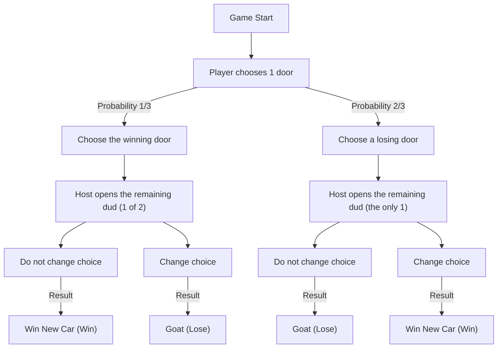
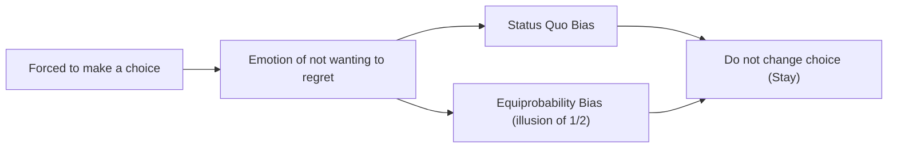

# Introduction: The Trap Human Intuition Falls Into and the World of Probability

In our daily lives, "intuition" functions as a very powerful decision-making tool. Based on rules of thumb and heuristics, the ability to instantly judge a situation and choose an action is a gift of evolution that humanity acquired to survive harsh natural environments. However, this excellent intuitive system has a weakness: it causes fatal errors under certain conditions. The most prominent example of this is when faced with problems concerning "probability".

Probability theory is a mathematical framework for quantitatively evaluating uncertain events, but its conclusions often violently clash with our intuition. This phenomenon has long been studied in the fields of psychology, behavioral economics, and mathematics education as "cognitive bias" and "the divergence of intuition and logic".

In this article, we will take up the most famous paradox that symbolizes this divergence between intuition and probability: the "Monty Hall problem". Despite its apparent simplicity, this problem caused a massive controversy involving renowned mathematicians and scientists around the world. Through the question, "Why do we fall into such a simple probability trap?", we will deeply and thoroughly explore the limits of human cognitive structure and the importance of logical thinking.

## Chapter 1: What is the Monty Hall Problem?

The Monty Hall problem is a probability paradox named after Monty Hall, the host of the long-running American television game show "Let's Make a Deal". This problem became widely known to the public after it was featured in the "Ask Marilyn" column of the news magazine *Parade* in 1990.

### Problem Setting

Imagine you are a contestant on a television game show. In front of you are three closed doors (Door A, Door B, and Door C).

1. Behind one door is a "new car (win)".
2. Behind the remaining two doors are "goats (lose)".
3. If you guess the new car, you get to keep it.

The rules and progression of the game are as follows:

1. First, you choose one of the three doors (for example, let's say you chose **Door A**).
2. Monty, the host of the show, knows what is behind which door.
3. Of the remaining two doors you did not choose (Door B and Door C), Monty **always opens one door that has a goat behind it**. (For example, if Door B had a goat, he opens Door B).
4. Then, Monty asks you:
   **"You may switch to Door C. Do you want to change your choice?"**

Now, here is the question:
**Should you change your choice? Or should you keep your initial choice (Door A)? Which has a higher probability of winning the new car?**

### Intuitive Answer

When presented with this problem, many people reason as follows:

"There were three doors, and one (the goat door) was opened. The only ones left are the door I chose (Door A) and the other closed door (Door C). The new car must be behind one of them, so the probability should be 50% (1/2) for each. Therefore, the win rate is the same whether I change my choice or not, and there is no need to bother changing."

This intuitive answer is very persuasive, and the overwhelming majority of people (about 85% or more depending on the survey) answer, "The probability does not change even if you change your choice (1/2)".

However, **the mathematically correct answer is "you should change your choice"**. If you change your choice, the probability of winning the new car jumps to **2/3 (about 66.7%)**, which is twice the probability of **1/3 (about 33.3%)** if you keep your initial choice.

When this answer was presented by Marilyn vos Savant (a woman who was certified by the Guinness Book of Records at the time as having the highest IQ in the world), about 10,000 letters of rebuttal poured in from all over the United States. Among them were about 1,000 letters from mathematicians and scientists with PhDs, throwing fierce criticism such as "You do not understand mathematics at all" and "This is the illogical delusion of a woman."

Why did so many intellectuals get it wrong? In the next chapter, we will unravel the mathematical proof.

## Chapter 2: The Truth of Probability and Mathematical Proof

Why does a probability that intuitively seems like "1/2" become "2/3 if you change your choice"? To understand this, it is necessary to re-examine the problem from several different approaches.

### Proof Approach 1: Enumeration of All Patterns (Tree Diagram Thinking)

The most reliable and easy-to-understand method is to list all possible patterns and calculate the probabilities.
Since which door the new car is behind is determined randomly, the following three cases occur with a probability of 1/3 each.

- Case 1: The new car is behind "Door A"
- Case 2: The new car is behind "Door B"
- Case 3: The new car is behind "Door C"

Assuming you initially chose **Door A**, let's look at the results of "keeping your choice" and "changing your choice" in each case.

| Case | Position of New Car | Your Choice | Door the Host Opens | If You Keep Choice | If You Change Choice |
|---|---|---|---|---|---|
| 1 (1/3) | Door A | Door A | B or C (Goat) | **Win New Car** (Win) | Goat (Lose) |
| 2 (1/3) | Door B | Door A | Door C (Goat) | Goat (Lose) | **Win New Car** (Win) |
| 3 (1/3) | Door C | Door A | Door B (Goat) | Goat (Lose) | **Win New Car** (Win) |

As is clear from this table, the only time you can win the new car "if you keep your choice" is Case 1 (probability 1/3). On the other hand, there are two patterns where you can win the new car "if you change your choice": Case 2 and Case 3, and their total probability is 2/3.
In short, it is nothing more than a comparison between **"the probability of choosing the correct answer from the start (1/3)"** and **"the probability of choosing a dud initially (2/3)"**. Because the host eliminates one dud for you, the structure is such that the misfortune of "choosing a dud initially" is flipped into the good fortune of "definitely turning into a win" by changing your choice.

### Proof Approach 2: Information Theory and Extreme Models

When intuition gets in the way with three doors, it becomes easier to understand if we extremely increase the number of doors.

Imagine "there are 1,000,000 doors".
1. You choose one door (Door Number 1). At this point, the probability of winning is 1/1,000,000.
2. Monty, the host, knows the answer. Out of the remaining 999,999 doors, he opens all 999,998 doors that have goats.
3. The only two closed doors are "Door 1", which you chose, and "Door 777,777", which Monty left closed.

At this time, what do you think?
It should be obvious which is higher: "the probability that Door 1, which you initially chose, was coincidentally the correct answer (1/1,000,000)" or "the probability that you were wrong, and Monty intentionally avoided Door 777,777, which is the correct answer, and opened all the rest (999,999/1,000,000)".
Naturally, you would switch to Door 777,777. Even in the case of three doors, the essential mathematical structure is exactly the same.

### Proof Approach 3: State Transition Diagram with Mermaid

To deepen our visual understanding, let's represent the progress of the game in a flowchart.

From this diagram, we can see that **if you take the action to "change choice" from the state of "initially choosing a dud door (probability 2/3)", you will reach "Win New Car" with a 100% probability**. Conversely, if you change your choice from the state of initially choosing the winning door (probability 1/3), you will definitely draw a goat.
Therefore, the expected win rate of the strategy to change choices is 2/3 × 100% = 2/3.

## Chapter 3: Strict Solution Using Bayes' Theorem

The Monty Hall problem can be solved more mathematically and strictly by using "Bayes' theorem" to calculate conditional probabilities. Bayesian inference is a powerful tool that shows how a prior probability should be updated (posterior probability) when new information (evidence) is obtained.

Let the events be defined as follows:
- $C_i$ : The event that the new car is behind door $i$ ($i \in \{A, B, C\}$)
- $M_j$ : The event that Monty opens door $j$ ($j \in \{A, B, C\}$)

Assume the player initially chose "Door A".
The prior probabilities are equiprobable because there is absolutely no information about which door has the new car:
$P(C_A) = 1/3$
$P(C_B) = 1/3$
$P(C_C) = 1/3$

Now, suppose Monty opened "Door B". After obtaining this information, we calculate the probability that the new car is behind Door A (posterior probability $P(C_A|M_B)$) and the probability that the new car is behind Door C (posterior probability $P(C_C|M_B)$).

Monty's rules of action (conditional probabilities $P(M_B|C_i)$) are as follows:
1. If the new car is behind Door A ($C_A$), Monty randomly opens B or C, so $P(M_B|C_A) = 1/2$
2. If the new car is behind Door B ($C_B$), Monty can never open B, so $P(M_B|C_B) = 0$
3. If the new car is behind Door C ($C_C$), Monty cannot open C, and he cannot open A because the player chose it. Therefore, he is forced to open B, so $P(M_B|C_C) = 1$

The formula for Bayes' theorem is as follows:
$P(C_i|M_B) = \frac{P(M_B|C_i) P(C_i)}{P(M_B)}$

We calculate the denominator $P(M_B)$ (the total probability that Monty opens Door B) (Law of Total Probability).
$P(M_B) = P(M_B|C_A)P(C_A) + P(M_B|C_B)P(C_B) + P(M_B|C_C)P(C_C)$
$P(M_B) = (1/2 \times 1/3) + (0 \times 1/3) + (1 \times 1/3) = 1/6 + 0 + 1/3 = 1/2$

Now, let's calculate the posterior probabilities.

**Probability that the new car is behind Door A (keeping choice):**
$P(C_A|M_B) = \frac{P(M_B|C_A) P(C_A)}{P(M_B)} = \frac{(1/2) \times (1/3)}{1/2} = 1/3$

**Probability that the new car is behind Door C (changing choice):**
$P(C_C|M_B) = \frac{P(M_B|C_C) P(C_C)}{P(M_B)} = \frac{1 \times (1/3)}{1/2} = 2/3$

In this way, using Bayes' theorem mathematically perfectly proves that the probability is updated by the new information (Monty opening Door B), and the probability of Door C jumps to 2/3.

## Chapter 4: Why Does Human Intuition Get It Wrong? (Psychological and Cognitive Factors)

No matter how many times they are shown the mathematical proof, many people still feel "I still just can't accept it" or "It feels like I'm being bewitched." Why is the human brain so vulnerable to this problem? Research in psychology and behavioral economics has revealed that several severe cognitive biases are involved.

### 1. Equiprobability Bias

In random events or uncertain situations, humans have a strong tendency to unconsciously assume that "if there are available options remaining, their probabilities must all be equal".
In the Monty Hall problem, two choices ultimately remain: "Door A" and "Door C". The moment this visual and situational information of "two choices" is input into the brain, a powerful heuristic fires: "Since there are two, the probability is 1/2 for each."
Our brains separate and ignore the "asymmetric information" of past historical context (that there were three initially, and Monty intentionally opened a dud) from the "current situation".

### 2. Misinterpretation of Causality and "Intent"

We try to understand the causality of things linearly.
It is similar to the "Gambler's fallacy", where after red comes up 5 times in a row in roulette, we think "black should be coming up soon", but in the Monty Hall problem, we conversely underestimate the "updating of information".

The important point is that **"Monty the host is not opening a door randomly"**.
If the host knew nothing and opened a door randomly, and it "happened to be a goat", then the probability for the remaining two doors would truly be 1/2 (this is called the "Ignorant Monty problem").
However, Monty has a strong constraint (intent) to "always open a goat". Human intuition cannot correctly process this "information asymmetry caused by intentional choice", and we only look at the physical fact that "the number of doors just decreased by one."

### 3. Status Quo Bias and Regret Avoidance

From the perspective of behavioral economics, "status quo bias" has a major impact.
Humans are creatures that feel greater psychological damage from the regret of taking action and failing (commission error) than from the regret of not taking action and failing (omission error).

Imagine "if you changed your choice and the first door was the correct answer". You would be tormented by intense regret: "I shouldn't have bothered changing it!" On the other hand, "if you don't change your choice and lose", it is easier to give up and say, "Well, it can't be helped, I was just unlucky."
In this way, the emotional defense mechanism of "wanting to minimize regret" works, creating a cognitive distortion that "it's the same whether I change it or not (or rather, I want to believe so)", ultimately leading us to choose to "maintain the status quo (Stay)".

## Chapter 5: Lessons of the Paradox in Daily Life

The Monty Hall problem is not just a quiz or a math puzzle. The lessons this paradox teaches us have universal value that can be applied to various fields such as our daily lives, business, medicine, and AI development.

### Conflict Between Data and Intuition (The Problem of False Positives in Medicine)

The interpretation of "test accuracy" in medical settings is also a typical example where intuition and Bayesian probability diverge.
For example, suppose there is an "intractable disease that affects 1 in 10,000 people", and the accuracy of the test drug for it is "99% (it correctly identifies 99% of positive people as positive, and 99% of negative people as negative)".
If you take this test and are judged "positive", what is the probability that you actually have that intractable disease?

Intuitively, you might despair, thinking, "Since the accuracy is 99%, the probability that I am sick must also be 99%."
However, calculating with Bayes' theorem, the probability that you are actually afflicted is **only just under 1% (about 0.98%)**. This is because 1% (about 100 people) of the overwhelming majority of "healthy people (9,999 people)" will be "false positives", so within the group of people who tested positive, the genuine patients (almost 1 person) become a tiny minority.

In this way, the overwhelming divergence between intuitive probability evaluation (99%) and mathematical truth (1%) risks bringing unnecessary panic or wrong medical decisions to people. Understanding the Monty Hall problem is the first step to acquiring the literacy to correctly evaluate such "information asymmetry and prior probability".

### The Value of Information in Business Strategy

In business, the trends of competitors and market reactions correspond exactly to "the door Monty opened".
Suppose your company chooses a certain strategy (Door A). After that, new information comes in, such as changes in the market environment or the failure of a competitor (a dud door opening).
At this time, do you "stubbornly stick to the original strategy (status quo bias)", or do you "evaluate the new information from a Bayesian perspective and pivot the strategy (change choice)"? This can be interpreted as a lesson that companies that can flexibly change their strategies are able to grasp a higher probability of success (2/3) in the long run. It is important to always make decisions based on "posterior probability" without being bound by sunk costs.

## Conclusion: Intelligence is the Courage to "Doubt Intuition"

The reason the Monty Hall problem is so fascinating, and so terrifying, is that it brilliantly highlights the "limits of human intelligence". Even experts with PhDs were deceived by their initial intuition and reacted emotionally against the correct proof.

We live by relying on the powerful weapon of "intuition" that we acquired in the process of evolution. However, in modern society, which is becoming increasingly complex and overflowing with data, we must realize that this intuition sometimes leads us into a trap.

The Monty Hall problem conveys one important message to us.
That is **"the importance of not blindly believing your own intuition, but stopping and rethinking things using the tools of logic and mathematics"**. To accept a truth that seems contrary to intuition at first glance requires intellectual humility and the courage to update one's own assumptions.

The next time you are forced to make a major choice in life and acquire new information (an opened door), please remember this Monty Hall problem. Has the probability changed due to that information? Are you trapped in status quo bias?
The logically derived decision to "change your choice" might just bring a new car right before your eyes.
